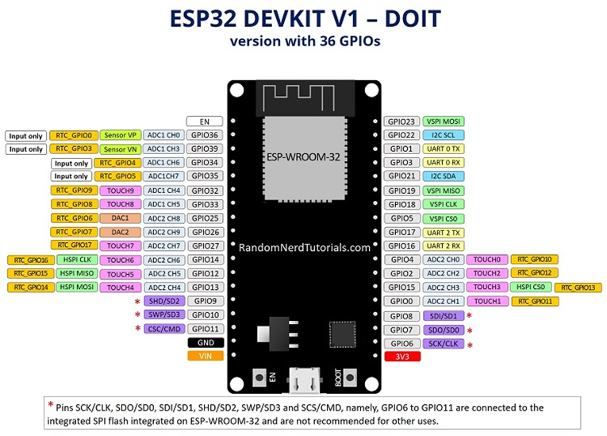

# PROYECTO: SISTEMA DE FILTRADO Y CONTROL NIVEL DE AGUA

<!-- TOC -->
- [PROYECTO: SISTEMA DE FILTRADO Y CONTROL NIVEL DE AGUA](#proyecto-sistema-de-filtrado-y-control-nivel-de-agua)
  - [1. DESCRIPCION GENERAL](#1-descripcion-general)
  - [2. INSTALACION FISICA](#2-instalacion-fisica)
  - [3. MICROCONTROLADOR: ESP 32](#3-microcontrolador-esp-32)
  - [4. SENSORES](#4-sensores)
    - [4. Caudalimetro FS401](#4-caudalimetro-fs401)
  - [3. ESQUEMA DE CONEXIONES](#3-esquema-de-conexiones)
  - [4. CONFIGURACION - ESP32 (yaml)](#4-configuracion---esp32-yaml)
  - [5. BITACORA DE MANTENIMIENTO](#5-bitacora-de-mantenimiento)
  - [6. PROBLEMAS CONOCIDOS / PENDIENTES](#6-problemas-conocidos--pendientes)

## 1. DESCRIPCION GENERAL
Este proyecto trata de la instalación de un sistema de filtrado y correción de sarro (dos filtros) en la entrada del tanque de agua de la casa.  Luego le sigue un medidor de presión (para saber que presión esta entrando enla casa), luego un caudalimetro para finalmnete llegar a la entrada del tanque de agua donde hay un flotante nuevo. Este ssimeta ademas consta de un medidor ultrasonico para tener el nivel del tanque y luego un medidor de temperatrura de agua, otro de temperatura ambiente y ademas hay un snsor de liquidos que marca cuando rebalsa el tanque de agua porque el florante no corto. 

## 2. INSTALACION FISICA

Toda la instalación se realizo con elementos de termofusión en cañerías de 3/4" de pulgada y accesorios correspondientes

| Componente | Modelo / Especificación | Pin (ESP32) |
| :--- | :--- | :--- |
| Llave de paso | ||
| Unión doble |||
| Filtro de Agua | 5 micrones ||
| Filtro de Sarro |||
| Codo 90°
| Union T
| Medidor de presión 
| Unión Roscada para caudalim
| Codo 90 °
| Llave de paso
| Codo 90°| Acceso al tanque de agua

## 3. MICROCONTROLADOR: ESP 32

Se utilizo la tarjeta ESP 32 con xx pines, y una base de expansión para dicha tarjeta. La base es alimentada por un transfomrador de 12VDC conectada a un enchufe de 220 V.

A continuación se muestra el PINOUT de la tarjeta utilizada


*Figura 1: Pinout del ESP 32*


## 4. SENSORES
| Componente | Modelo / Especificación | Pin (ESP32) | Address |
| :--- | :--- | :--- | :--- |
| Caudalimetro | FS401 - | GPIO 27 |
| Sensor Ultrasonico | JSN-SR04T | Triger: GPIO 13 - Echo: GPIO 12
| Sensor Temperatura Agua | DSB180 | GPIO 18 | 0xb30000007ce01928
| Sensor Temperatura Ambiente | DSB180 | GPIO 18 | 0x8d00000077d61f28
| Nivel Líquidos | adsfa | VCC Out: GPIO 25 - Signal In: GPIO33

### 4. Caudalimetro FS401

Este modelo de caudalimetro tiene rosca de 3/4" y esta seteado para medir aprox 5 pulsos por litro

| Variable | Dato |
| :---| :---|
|Presión máxima de agua | 1,2 MPa (12 bar)
|Diámetro de la rosca | 19,05 mm
|Caudal mínimo de agua | 1 l/min
| Caudal máximo de agua | 60 l/min 
|Temperatura mínima de trabajo | 0 °C
| Temperatura máxima de trabajo | 80°C


*Figura 2: Caudalimetro FS401*

## 3. ESQUEMA DE CONEXIONES

Hay algunas consdieraciónes para la conexion de los sensores, que vamos a comentar a continuación: 

* Caudalimetro: el caudalimetro tiene tres salida, VCC, GND y SEÑAL. Es conveniente que la señal la 
* Sensor Ultrasónico JSN-SR047: este se conecta mediante un modulo a cuatro
* 

## 4. CONFIGURACION - ESP32 (yaml)
A continuación pego el codigo utilizado en este dispositivo para entender la logica de programación

```yaml -->
esphome:
  name: esp32sm
  friendly_name: ESP32SM

esp32:
  board: esp32dev
  framework:
    type: arduino

# Enable logging
logger:

# Enable Home Assistant API
api:
  encryption:
    key: "eF1yLEEgyB5IAZCBWHU0NF1L2j1378LnRh4MxZ9Z71I="
  reboot_timeout:
      minutes: 10

ota:
  - platform: esphome
    password: "69684feb59625c5a41e8847abb2c76fc"

wifi:
  ssid: !secret wifi_ssid
  password: !secret wifi_password
  reboot_timeout: 
    minutes: 5
    
  # Enable fallback hotspot (captive portal) in case wifi connection fails
  ap:
    ssid: "Esp32Sm Fallback Hotspot"
    password: "1448470214"
  
time:
  - platform: sntp
    id: sntp_time
    timezone: "America/Argentina/Buenos_Aires" # Ajusta a tu zona horaria

output:
  - platform: gpio
    pin: 25
    id: pinv_vcc_sensor    

captive_portal:

web_server:
  port: 8080

# Bus para el termómetro
one_wire:
  - platform: gpio
    pin: 18

number:
  - platform: template
    name: "Constante Calibracion (pulsos/lt)"
    id: constante_caudal
    optimistic: true
    min_value: 1.0
    max_value: 500.0
    step: 0.01
    initial_value: 4.94  # Valor base para el FS-300A (1309 pulsos / 265 lt agua)
    restore_value: true # Guarda el valor si se corta la luz
    mode: box           # "box" para escribir el número, "slider" para deslizar

sensor:
  # 1.A Sensor de temperatura de Agua
  - platform: dallas_temp
    address: 0xb30000007ce01928
    id: termometro_agua
    name: "Temperatura Agua Tanque"
    update_interval: never

  # 1.B Sensor de temperatura Ambiente SM
  - platform: dallas_temp
    address: 0x8d00000077d61f28
    id: termometro_ambiente_SM
    name: "Temperatura Ambiente SM"
    update_interval: never

  # 1.C Sensor Ultrasónico Distancia Bruta
  - platform: ultrasonic
    trigger_pin: 13    
    echo_pin: 12
    name: "Distancia SU Bruta"
    id: distancia_bruta
    unit_of_measurement: "m"
    accuracy_decimals: 2
    update_interval: never
    filters: 
      - filter_out: nan # Ignora lecturas fallidas
      - median:         # Toma las ultimas 5 lecturas y elige la central
          window_size: 5
          send_every: 1
      - sliding_window_moving_average: 
          window_size: 5
          send_every: 1          

  # 1.D Sensor de Porcentaje
  - platform: template
    name: "Nivel de Agua Porcentaje"
    id: nivel_agua_porcentaje
    unit_of_measurement: "%"
    icon: "mdi:water-percent"
    lambda: |-
      float porcentaje = (1.70f - id(distancia_bruta).state) / (1.70f - 0.20f) * 100.0f;
      if (porcentaje < 0.0f) return 0.0f;
      if (porcentaje > 100.0f) return 100.0f;
      return porcentaje;

  # 1.E Sensor Volumen de Agua en Tanque
  - platform: template
    name: "Volumen de Agua"
    id: volumen_agua_tanque
    unit_of_measurement: "l"
    icon: "mdi:barrel"
    accuracy_decimals: 1
    lambda: |-
      float altura_agua = 1.70f - id(distancia_bruta).state;
      if (altura_agua < 0.0f) {
        return 0.0f;
      } else if (altura_agua > 1.70f) {
        return 700.0f;
      } else {
        return (altura_agua * 411.74f);
      }
       
  # 1.F Caudalímetro (Flujo de Agua)
  - platform: pulse_meter
    pin: 
      number: 27
      mode: INPUT
      # El filtro va dentro del pin
    internal_filter: 15ms
    name: "Caudal Instantaneo"
    id: pulsos_caudal
    timeout: 5s
  
  # Esta es la forma correcta de sacar los pulsos totales en pulse_meter
    total: 
      name: "Pulsos Totales de la Prueba"
      id: pulsos_totales_prueba
      unit_of_measurement: "pulsos"
      accuracy_decimals: 0

  # Sensor de Flujo en L/min
  - platform: template
    name: "Flujo de Agua l/min"
    id: flujo_l_min
    unit_of_measurement: "l/min"
    state_class: "measurement"
    lambda: |-
      // .state en pulse_meter devuelve pulsos/minuto automáticamente
      if (id(constante_caudal).state > 1.0) {
        float valor = id(pulsos_caudal).state / id(constante_caudal).state;
        if (valor > 100.0) return 0; // Filtro de seguridad por si vuelve el ruido
        return valor;
      } else {
        return 0;
      }
    update_interval: 2s

  # Sensor de Volumen Total Calculado (directo de los pulsos)
  - platform: template
    name: "Total Litros Consistentes"
    id: total_litros
    unit_of_measurement: "L"
    accuracy_decimals: 1
    icon: "mdi:water"
    # Esta formula asegura que is hay 0 pulsos, hay 0 litros
    lambda: |-
      if (id(constante_caudal).state > 0) {
        return id(pulsos_totales_prueba).state / id(constante_caudal).state;
      } else {
        return 0.0f;
      }
    update_interval: 10s
    
  - platform: template
    name: "Consumo Total Agua Energía"
    id: consumo_agua_energia
    unit_of_measurement: "L" # El Panel de Energía prefiere "L" (litros) o "m³"
    state_class: total_increasing
    device_class: water
    accuracy_decimals: 1
    icon: "mdi:water"
    # Usamos la misma lógica: pulsos / constante
    lambda: |-
      // Verificamos que los pulsos y la constante sean válidos
      if (std::isnan(id(pulsos_totales_prueba).state) || id(constante_caudal).state <= 0) {
        return {}; // Devuelve "desconocido" en lugar de 0 para no romper la estadística
      }
      return id(pulsos_totales_prueba).state / id(constante_caudal).state;
    update_interval: 10s # No hace falta que sea tan rápido para el panel de energía

  # Sensor de Detector de Fuga de Agua
  - platform: adc
    pin: GPIO33 
    id: nivel_analogico_fuga
    name: "Voltage Sensor Fuga"
    update_interval: never  # Lo manejamos desdde el interval
    attenuation: 11db  # Permite medir de 0 a 3.9V (ideal para 3.3V)}
    unit_of_measurement: "V"
    accuracy_decimals: 2

    # Agregamos esto para limpiar el ruido
    filters: 
      - sliding_window_moving_average: 
          window_size: 5   # Promedia las ultimas 5 lecturas
          send_every: 1    # Envia el promedio en cada lectura
      - or:
          - throttle: 30s  # No satura el log si no hay cambios
          - delta: 0.05    # Solo envia si el voltage varia mas de 0.05V

binary_sensor:
  - platform: template
    name: "Detección Fuga de Agua"
    id: estado_agua
    device_class: moisture

# 2.0 Intervalo de Medición Coordinado
interval:
  - interval: 30s
    then:
      # 1. Temperaturas primero (son más rápidas y estables)
      - component.update: termometro_agua
      - component.update: termometro_ambiente_SM
      - logger.log: "Lectura de temperaturas solicitada"
      
      # Esperamos a que el bus OneWire termine de leer (crucial para Dallas)
      - delay: 1s        
      
      # 2. Medir Fuga de Agua (mientras del Dallas procesa)
      - output.turn_on: pinv_vcc_sensor
      - delay: 500ms  # Le damos un poquito mas de tiempo para que el sensor se estabilice
      - component.update: nivel_analogico_fuga
      - delay: 100ms 
      - if:
          condition:
            # Si el voltage supera los 0,40 V (ajustable), hay agua
            # Algunos sensores analógicos bajan el voltage al tocar agua
            lambda: 'return id(nivel_analogico_fuga).state > 0.40;'
          then:
            - binary_sensor.template.publish:
                id: estado_agua
                state: ON
            - logger.log: "¡ALERTA! Agua detectada (voltage alto)"
          else:
            - binary_sensor.template.publish:
                id: estado_agua
                state: OFF
            - logger.log: "Estado: seco (sin agua)"
      - output.turn_off: pinv_vcc_sensor
      - logger.log: "Chequeo de fuga en GIP033 realizado" 

      # 3. Medir Distancia (Ultrasónico) con ráfaga
      - repeat: 
          count: 5
          then:
            - component.update: distancia_bruta
            - delay: 200ms

      # 4. Actualizar Cálculos finales
      - component.update: volumen_agua_tanque
      - component.update: nivel_agua_porcentaje
      
button:
  - platform: restart
    name: "Reiniciar ESP32sm"

  - platform: template
    name: "Resetear Contador de Agua"
    id: reset_water_counter
    icon: "mdi:refresh"
    on_press:
      then:
        # Al resetear el pulse_meter, el sensor "Total Litros Consistentes"
        # se pondra en cero automaticamente en 2 segundos
        - pulse_meter.set_total_pulses:
            id: pulsos_caudal
            value: 0
```


## 5. BITACORA DE MANTENIMIENTO

A continuación se detallan el cronogrma de eventos de este

- **[2O26-05-01]**: Instalación de los filtros tanto de sedimentos (10 micrones) como el filtro con bolas de polic para intercambion ionico para disminuir el efecto del sarro.
- **[2026-06-02]**: Creación de la documentación inicial del sistema.

## 6. PROBLEMAS CONOCIDOS / PENDIENTES

- **[2026-05-31]**: No funciona el termometro del agua, no se si se mojo o hay que probar el dispositivo. Ademas tiene cable corto, no llega al fondo del tanque.