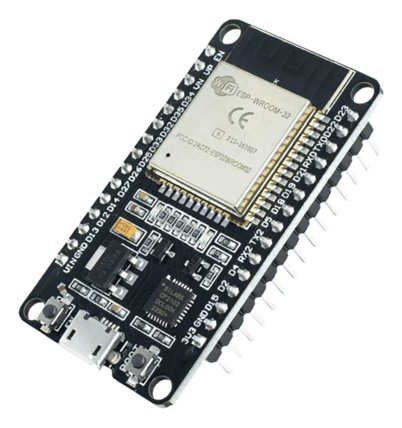
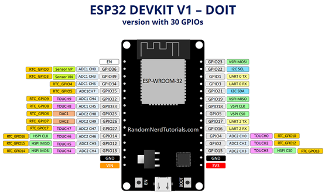
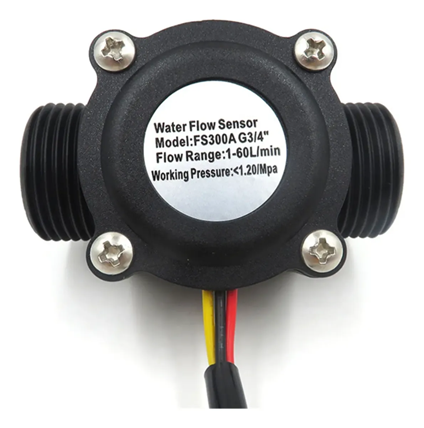
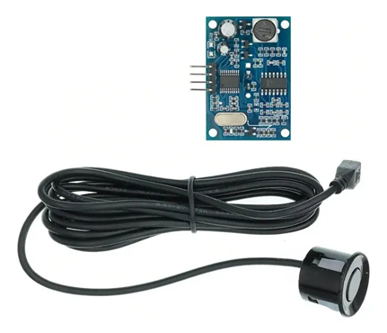
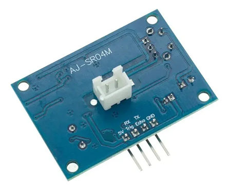
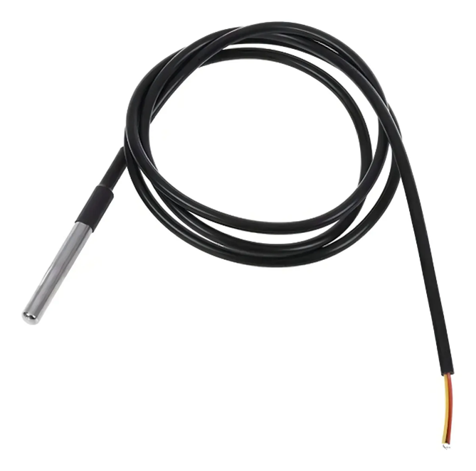
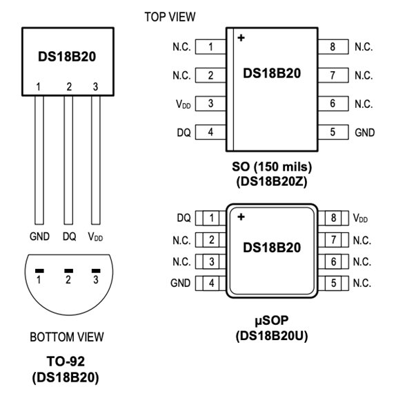

# PROYECTO: TANQUE DE AGUA

<!-- TOC -->
- [PROYECTO: TANQUE DE AGUA](#proyecto-tanque-de-agua)
  - [1. DESCRIPCION GENERAL](#1-descripcion-general)
  - [2. INSTALACION FISICA](#2-instalacion-fisica)
  - [3. MICROCONTROLADOR: ESP 32](#3-microcontrolador-esp-32)
    - [2.3	CARACTERISTICAS TECNICAS](#23caracteristicas-tecnicas)
    - [2.4 PERIFERICOS](#24-perifericos)
    - [2.5 ESQUEMA DE CONEXION](#25-esquema-de-conexion)
  - [4. SENSORES](#4-sensores)
    - [4.1 Caudalimetro FS401](#41-caudalimetro-fs401)
    - [4.2 Sensor Ultrasonido JSN-401](#42-sensor-ultrasonido-jsn-401)
      - [4.2.1 Especificaciones Tecnicas](#421-especificaciones-tecnicas)
      - [4.2.2 Esquema de Conexion](#422-esquema-de-conexion)
    - [4.3 Sensor Temperatura DS18B20](#43-sensor-temperatura-ds18b20)
      - [4.3.1 Especificaciones](#431-especificaciones)
      - [4.3.2 Esquema de Conexión](#432-esquema-de-conexión)
  - [3. ESQUEMA DE CONEXIONES](#3-esquema-de-conexiones)
  - [4. BITACORA DE MANTENIMIENTO](#4-bitacora-de-mantenimiento)
  - [5. PROBLEMAS CONOCIDOS / PENDIENTES](#5-problemas-conocidos--pendientes)
  - [6. CONFIGURACION - ESP32 (yaml)](#6-configuracion---esp32-yaml)

## 1. DESCRIPCION GENERAL

Este proyecto consiste en la instalación de sistemas de medición de nivel de tanque y caudal para poder monitorear el nivel del tanque y el consumo de agua. 

La instalación de un sistema de filtrado y correción de sarro (dos filtros) en la entrada del tanque de agua de la casa.  Luego le sigue un medidor de presión (para saber que presión esta entrando enla casa), luego un caudalimetro para finalmnete llegar a la entrada del tanque de agua donde hay un flotante nuevo. Este ssimeta ademas consta de un medidor ultrasonico para tener el nivel del tanque y luego un medidor de temperatrura de agua, otro de temperatura ambiente y ademas hay un snsor de liquidos que marca cuando rebalsa el tanque de agua porque el florante no corto.

Hemos dejado para el final de este documento todo lo relacionado con los codigos de la programación, tanto del microcontrolador, como la configuración del archivo yaml del ESPHOME. 

## 2. INSTALACION FISICA

Se aprovecho este proyecto para reamar toda la instalación fisica desde la entrada de agua al altillo hasta la conexión con el tanque, dado que esas conexiónes perdian agua y no tenian ningun filtro. 

Se realizo con elementos de termofusión en cañerías de 3/4" de pulgada y accesorios correspondientes

| COMPONENTE | MODELO / ESPECIFICACION |
| :--- | :--- |
| Llave de paso | 
| Unión doble |
| Filtro de Agua | 5 micrones |
| Filtro de Sarro |
| Codo 90°
| Union T
| Medidor de presión 
| Unión Roscada 3/4"
| Codo 90 °
| Llave de paso
| Codo 90°| Acceso al tanque de agua
| TANQUE DE AGUA| HESCHER - 700 litros

## 3. MICROCONTROLADOR: ESP 32

Placa de desarrollo ESP32 WIFI Bluetooth redes componentes inteligentes ESP-WROOM-32 ESP-32. El ESP32 se puede programar en diferentes entornos de programación. Puedes utilizarlo: en  Arduino IDE, Espressif IDF (Marco de Desarrollo IoT), Micropitón, SIM, LUA




*Figura 1: ESP 32-30 pines*


### 2.3	CARACTERISTICAS TECNICAS

- El ESP32 es de doble núcleo, lo que significa que tiene 2 procesadores.
- Tiene Wi-Fi integrado y compatible con bluetooth.
- Ejecuta programas de 32 bits.
- La frecuencia del reloj puede llegar hasta 240MHz y tiene una RAM de 512 kB.
- Esta placa en particular tiene 30 pines, 15 en cada fila.
- También tiene una amplia variedad de periféricos disponibles, como: tactil capacitivo, ADCs, DACs, UART, SPI, I2C y mucho mas.
- Viene con sensor de efecto hall integrado y sensor de temperatura incorporado. 

### 2.4 PERIFERICOS

- 18 canales de convertidor analógico a Digital (ADC) 
- 3 interfaces SPI
- 3 interfaces UART
- 2 interfaces I2C
- 16 canales de salida PWM
- 2 convertidores digitales a analógicos (DAC)
- 2 interfaces I2S
- 10 GPIOs de detección capacitiva

### 2.5 ESQUEMA DE CONEXION



*Figura 1: Pinout del ESP 32- 30 pines*

## 4. SENSORES

| COMPONENTE | MODELO / ESPECIFICACION | PIN (ESP32) | ADDRESS |
| :--- | :--- | :--- | :--- |
| Caudalimetro | FS401 - | GPIO 27 |
| Sensor Ultrasonico | JSN-SR04T | Triger: GPIO 13 - Echo: GPIO 12
| Sensor Temperatura Agua | DSB180 | GPIO 18 | 0xb30000007ce01928
| Sensor Temperatura Ambiente | DSB180 | GPIO 18 | 0x8d00000077d61f28
| Nivel Líquidos | adsfa | VCC Out: GPIO 25 - Signal In: GPIO33

### 4.1 Caudalimetro FS401

Este modelo de caudalimetro tiene rosca de 3/4" y esta seteado para medir aprox 5 pulsos por litro

| CARACTERISTICA | VALOR |
| :---| :---|
|Presión máxima de agua | 1,2 MPa (12 bar)
|Diámetro de la rosca | 19,05 mm
|Caudal mínimo de agua | 1 l/min
|Caudal máximo de agua | 60 l/min 
|Temperatura mínima de trabajo | 0 °C
|Temperatura máxima de trabajo | 80°C



*Figura 2: Caudalimetro FS300a*

|PIN | CONEXION| CABLE|
|:---|:---|:---|
|VCC | +5V DC| Rojo
|SEÑAL| Señal de pulso | Amarillo 
|GND | 0V | Negro


### 4.2 Sensor Ultrasonido JSN-401

El sensor SR04 es un sensor de distancia que utiliza ultrasonido (sonar) para determinar la distancia de un objeto en un rango de 25 a 600 cm. Destaca por su pequeño tamaño, bajo consumo energético, buena precisión y especialmente por su resistencia al Agua.

El sensor trabaja con ultrasonido y contiene toda la electrónica encargada de hacer la medición. El funcionamiento del sensor es el siguiente: se emite un pulso de sonido (TRIG), se mide la anchura del pulso de retorno (ECHO), se calcula la distancia a partir de las diferencias de tiempos entre el Trig y Echo. El funcionamiento no se ve afectado por la luz solar o material negro (aunque los materiales blandos acusticamente como tela o lana pueden ser difícil de detectar).

Perfecto para aplicaciones donde el sensor estará expuesto a la intemperie, utilizado en automóviles para medir distancia de colisión/parqueo.



*Figura 3: Ultrasonido_JSN-SR04T*

#### 4.2.1 Especificaciones Tecnicas

- Modelo: JSN-SR04/ AJ-SR04M
- Voltaje de Operación: 5V DC
- Corriente de trabajo: 30mA
- Rango de detección: 25cm- 4.5Mts
- Precisión: puede variar entre los 3mm o 0.3cm
- Frecuencia de emisión acústica: 40KHz
- Duración mínima del pulso de disparo (nivel TTL): 10 µS.
- Tiempo mínimo de espera entre una medida y el inicio de otra: 20 mS.|
- Ángulo de detección: menor a 50º
- A prueba de agua (parte delantera)
- Diámetro: 22mm
- Longitud:  17mm
- Temperatura de trabajo: -10ºC hasta 70ºC

#### 4.2.2 Esquema de Conexion

|PIN | CONEXION|
|:---|:---|
|VCC | +5V DC
|TRIG |Disparo del ultrasonido
|ECHO |Recepción del ultrasonido
|GND | 0V


*Figura 4: Pin Out JSN-SR04T*

### 4.3 Sensor Temperatura DS18B20

Sensor Digital Temperatura DS18B20 con Cable Sumergible de 50 cm de largo (IP67)
Sensor de temperatura DS18B20 impermeable. Ideal para control ambiental de HVAC, sensor de temperatura interior, equipamiento o maquinas. Ideal también para medición en sitios lejanos o en condiciones húmedas.
Cada sensor tiene un número de serie de 64 bits único que le permite conectar múltiples sensores en paralelo usando solo un cable como bus de datos.



*Figura 3: Sensor Temperatura DS18B20*

#### 4.3.1 Especificaciones
- Interfaz 1-Wire (Requiere un solo pin digital para comunicarse)
- Numero de Serie unico de 64 bits grabado en el chip (Multiples sensores pueden compartir misma conexion)
- Sistema de alarma por limite de temperatura
- Exactitud de entre -10°C a +85°C (±0.5°C)
- Rango de temperatura: -55°C a 125°C (-67°F a +257°F)
- Voltaje de Operacion: 3 a 5 VCC
- Resolución: seleccionable de 9 a 12 bits
- Tiempo de consulta menor a 750ms
- Conexionado con 3 cables: VCC (Rojo), GND (Negro), Datos (Amarillo)
- Diámetro: 6 mm
- Largo del Cable: 50 cm
- Sensor de Acero Inoxidable de 35 mm de largo
- Cable tipo taller de 4 mm

#### 4.3.2 Esquema de Conexión

|PIN | CONEXION|
|:---|:---|
|VCC | +5V DC
|SEÑAL |Señal
|GND | 0V



*Figura 5: PIN OUT DS18B20*


## 3. ESQUEMA DE CONEXIONES

Hay algunas consdieraciónes para la conexion de los sensores, que vamos a comentar a continuación: 

- Caudalimetro FS401: el caudalimetro tiene tres salidaS, VCC, GND y SEÑAL. Es conveniente que la señal la 
- Sensor Ultrasónico JSN-SR047: este se conecta mediante un modulo a cuatro

## 4. BITACORA DE MANTENIMIENTO

A continuación se detallan el cronograma de eventos de este proyecto

- **[2O26-05-01]**: Instalación de los filtros tanto de sedimentos (10 micrones) como el filtro con bolas de polic para intercambion ionico para disminuir el efecto del sarro.
- **[2026-06-02]**: Creación de la documentación inicial del sistema.

## 5. PROBLEMAS CONOCIDOS / PENDIENTES

- **[2026-05-31]**: No funciona el termometro del agua, no se si se mojo o hay que probar el dispositivo. Ademas tiene cable corto, no llega al fondo del tanque.

## 6. CONFIGURACION - ESP32 (yaml)

A continuación pego el codigo utilizado en este dispositivo para entender la logica de programación

```yaml -->
esphome:
  name: esp32sm
  friendly_name: ESP32SM

esp32:
  board: esp32dev
  framework:
    type: arduino

# Enable logging
logger:

# Enable Home Assistant API
api:
  encryption:
    key: "eF1yLEEgyB5IAZCBWHU0NF1L2j1378LnRh4MxZ9Z71I="
  reboot_timeout:
      minutes: 10

ota:
  - platform: esphome
    password: "69684feb59625c5a41e8847abb2c76fc"

wifi:
  ssid: !secret wifi_ssid
  password: !secret wifi_password
  reboot_timeout: 
    minutes: 5
    
  # Enable fallback hotspot (captive portal) in case wifi connection fails
  ap:
    ssid: "Esp32Sm Fallback Hotspot"
    password: "1448470214"
  
time:
  - platform: sntp
    id: sntp_time
    timezone: "America/Argentina/Buenos_Aires" # Ajusta a tu zona horaria

output:
  - platform: gpio
    pin: 25
    id: pinv_vcc_sensor    

captive_portal:

web_server:
  port: 8080

# Bus para el termómetro
one_wire:
  - platform: gpio
    pin: 18

number:
  - platform: template
    name: "Constante Calibracion (pulsos/lt)"
    id: constante_caudal
    optimistic: true
    min_value: 1.0
    max_value: 500.0
    step: 0.01
    initial_value: 4.94  # Valor base para el FS-300A (1309 pulsos / 265 lt agua)
    restore_value: true # Guarda el valor si se corta la luz
    mode: box           # "box" para escribir el número, "slider" para deslizar

sensor:
  # 1.A Sensor de temperatura de Agua
  - platform: dallas_temp
    address: 0xb30000007ce01928
    id: termometro_agua
    name: "Temperatura Agua Tanque"
    update_interval: never

  # 1.B Sensor de temperatura Ambiente SM
  - platform: dallas_temp
    address: 0x8d00000077d61f28
    id: termometro_ambiente_SM
    name: "Temperatura Ambiente SM"
    update_interval: never

  # 1.C Sensor Ultrasónico Distancia Bruta
  - platform: ultrasonic
    trigger_pin: 13    
    echo_pin: 12
    name: "Distancia SU Bruta"
    id: distancia_bruta
    unit_of_measurement: "m"
    accuracy_decimals: 2
    update_interval: never
    filters: 
      - filter_out: nan # Ignora lecturas fallidas
      - median:         # Toma las ultimas 5 lecturas y elige la central
          window_size: 5
          send_every: 1
      - sliding_window_moving_average: 
          window_size: 5
          send_every: 1          

  # 1.D Sensor de Porcentaje
  - platform: template
    name: "Nivel de Agua Porcentaje"
    id: nivel_agua_porcentaje
    unit_of_measurement: "%"
    icon: "mdi:water-percent"
    lambda: |-
      float porcentaje = (1.70f - id(distancia_bruta).state) / (1.70f - 0.20f) * 100.0f;
      if (porcentaje < 0.0f) return 0.0f;
      if (porcentaje > 100.0f) return 100.0f;
      return porcentaje;

  # 1.E Sensor Volumen de Agua en Tanque
  - platform: template
    name: "Volumen de Agua"
    id: volumen_agua_tanque
    unit_of_measurement: "l"
    icon: "mdi:barrel"
    accuracy_decimals: 1
    lambda: |-
      float altura_agua = 1.70f - id(distancia_bruta).state;
      if (altura_agua < 0.0f) {
        return 0.0f;
      } else if (altura_agua > 1.70f) {
        return 700.0f;
      } else {
        return (altura_agua * 411.74f);
      }
       
  # 1.F Caudalímetro (Flujo de Agua)
  - platform: pulse_meter
    pin: 
      number: 27
      mode: INPUT
      # El filtro va dentro del pin
    internal_filter: 15ms
    name: "Caudal Instantaneo"
    id: pulsos_caudal
    timeout: 5s
  
  # Esta es la forma correcta de sacar los pulsos totales en pulse_meter
    total: 
      name: "Pulsos Totales de la Prueba"
      id: pulsos_totales_prueba
      unit_of_measurement: "pulsos"
      accuracy_decimals: 0

  # Sensor de Flujo en L/min
  - platform: template
    name: "Flujo de Agua l/min"
    id: flujo_l_min
    unit_of_measurement: "l/min"
    state_class: "measurement"
    lambda: |-
      // .state en pulse_meter devuelve pulsos/minuto automáticamente
      if (id(constante_caudal).state > 1.0) {
        float valor = id(pulsos_caudal).state / id(constante_caudal).state;
        if (valor > 100.0) return 0; // Filtro de seguridad por si vuelve el ruido
        return valor;
      } else {
        return 0;
      }
    update_interval: 2s

  # Sensor de Volumen Total Calculado (directo de los pulsos)
  - platform: template
    name: "Total Litros Consistentes"
    id: total_litros
    unit_of_measurement: "L"
    accuracy_decimals: 1
    icon: "mdi:water"
    # Esta formula asegura que is hay 0 pulsos, hay 0 litros
    lambda: |-
      if (id(constante_caudal).state > 0) {
        return id(pulsos_totales_prueba).state / id(constante_caudal).state;
      } else {
        return 0.0f;
      }
    update_interval: 10s
    
  - platform: template
    name: "Consumo Total Agua Energía"
    id: consumo_agua_energia
    unit_of_measurement: "L" # El Panel de Energía prefiere "L" (litros) o "m³"
    state_class: total_increasing
    device_class: water
    accuracy_decimals: 1
    icon: "mdi:water"
    # Usamos la misma lógica: pulsos / constante
    lambda: |-
      // Verificamos que los pulsos y la constante sean válidos
      if (std::isnan(id(pulsos_totales_prueba).state) || id(constante_caudal).state <= 0) {
        return {}; // Devuelve "desconocido" en lugar de 0 para no romper la estadística
      }
      return id(pulsos_totales_prueba).state / id(constante_caudal).state;
    update_interval: 10s # No hace falta que sea tan rápido para el panel de energía

  # Sensor de Detector de Fuga de Agua
  - platform: adc
    pin: GPIO33 
    id: nivel_analogico_fuga
    name: "Voltage Sensor Fuga"
    update_interval: never  # Lo manejamos desdde el interval
    attenuation: 11db  # Permite medir de 0 a 3.9V (ideal para 3.3V)}
    unit_of_measurement: "V"
    accuracy_decimals: 2

    # Agregamos esto para limpiar el ruido
    filters: 
      - sliding_window_moving_average: 
          window_size: 5   # Promedia las ultimas 5 lecturas
          send_every: 1    # Envia el promedio en cada lectura
      - or:
          - throttle: 30s  # No satura el log si no hay cambios
          - delta: 0.05    # Solo envia si el voltage varia mas de 0.05V

binary_sensor:
  - platform: template
    name: "Detección Fuga de Agua"
    id: estado_agua
    device_class: moisture

# 2.0 Intervalo de Medición Coordinado
interval:
  - interval: 30s
    then:
      # 1. Temperaturas primero (son más rápidas y estables)
      - component.update: termometro_agua
      - component.update: termometro_ambiente_SM
      - logger.log: "Lectura de temperaturas solicitada"
      
      # Esperamos a que el bus OneWire termine de leer (crucial para Dallas)
      - delay: 1s        
      
      # 2. Medir Fuga de Agua (mientras del Dallas procesa)
      - output.turn_on: pinv_vcc_sensor
      - delay: 500ms  # Le damos un poquito mas de tiempo para que el sensor se estabilice
      - component.update: nivel_analogico_fuga
      - delay: 100ms 
      - if:
          condition:
            # Si el voltage supera los 0,40 V (ajustable), hay agua
            # Algunos sensores analógicos bajan el voltage al tocar agua
            lambda: 'return id(nivel_analogico_fuga).state > 0.40;'
          then:
            - binary_sensor.template.publish:
                id: estado_agua
                state: ON
            - logger.log: "¡ALERTA! Agua detectada (voltage alto)"
          else:
            - binary_sensor.template.publish:
                id: estado_agua
                state: OFF
            - logger.log: "Estado: seco (sin agua)"
      - output.turn_off: pinv_vcc_sensor
      - logger.log: "Chequeo de fuga en GIP033 realizado" 

      # 3. Medir Distancia (Ultrasónico) con ráfaga
      - repeat: 
          count: 5
          then:
            - component.update: distancia_bruta
            - delay: 200ms

      # 4. Actualizar Cálculos finales
      - component.update: volumen_agua_tanque
      - component.update: nivel_agua_porcentaje
      
button:
  - platform: restart
    name: "Reiniciar ESP32sm"

  - platform: template
    name: "Resetear Contador de Agua"
    id: reset_water_counter
    icon: "mdi:refresh"
    on_press:
      then:
        # Al resetear el pulse_meter, el sensor "Total Litros Consistentes"
        # se pondra en cero automaticamente en 2 segundos
        - pulse_meter.set_total_pulses:
            id: pulsos_caudal
            value: 0
```
