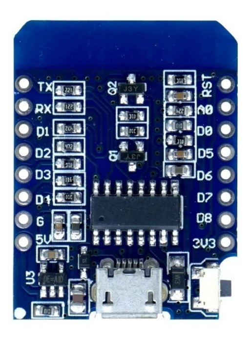
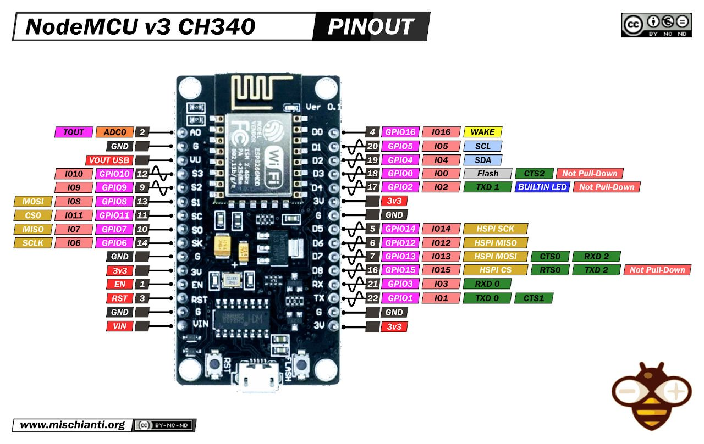

# TABLA DE CONTENIDO

# RESUMEN EJECUTIVO

# COMPARACION DE MICROCONTROLADORES

En esta sección destallamos los principales microcontroladores.

Hay dos familias, los basados en chips ESP8266 y ESP32

A continuación la diferencia entre los dos tipos de familia de procesadores:

- ESP-01: Aunque comparte el chip interno con sus hermanos mayores, físicamente te limita muchísimo por tener solo 2 pines GPIO cómodos (GPIO0 y GPIO2). Se suele usar más como módulo Wi-Fi esclavo para Arduino o para relés muy simples.
- Wemos D1 (Mini): Es el rey de las placas compactas basadas en ESP8266. Tené en cuenta que comparte las mismas limitaciones de memoria y Wi-Fi que el NodeMCU, pero en un formato súper amigable para prototipos chicos.
- ESP32 C3 Supermini: Esta placa es un golazo reciente. Cambia la arquitectura tradicional de Tensilica por RISC-V. Es una opción excelente si buscás el tamaño diminuto de un Wemos D1 pero con la potencia, la seguridad y el Bluetooth Low Energy (BLE) de la generación ESP32.

## PRECIOS DE MICROCONTROLADORES

En la siguiente tabla mencionamos los principales procesadores y sus precios estimados como referencia:

| **MICROCONTROLADOR**                     | **PRECIO**  **(AR\$)** | **PRECIO (u\$d)** |
| ---------------------------------------- | ---------------------------- | ----------------- |
| ESP8266 - ESP01                          | 5.718                        | 4,00              |
| ESP8266 - WEMOS D1 (NodeMCUMini)         | 6.500                        | 4,50              |
| ESP8266 - NODEMCU v3 (ESP12) CH 340      | 5.690                        | 4,00              |
| ESP32 - DEVKIT V1 - DOIT (30 o 38 pines) | 16.500                       | 11,50             |
| ESP32 - C3 Supermini                     | 5.999                        | 4,20              |

Análisis de Prestaciones / Precio

En términos de costo, la brecha se ha cerrado muchísimo. En 2026, un ESP8266 puede costar alrededor de 3 - 5 u\$d/unidad, mientras que un ESP32 estándar ronda los 6 - 9 u\$d/unidad.

1\. ¿Por qué el ESP32 suele ser la mejor inversión?

- Multitarea Real: Al tener dos núcleos, puedes dedicar uno exclusivamente a mantener la conexión Wi-Fi estable y el otro a leer sensores o controlar luces. En el ESP8266, si tu código es muy pesado, el Wi-Fi puede desconectarse.
- Bluetooth Low Energy (BLE): Es vital para configurar tus dispositivos desde el celular sin necesidad de conectarte primero a su red Wi-Fi (modo Access Point), lo que mejora mucho la experiencia de usuario.
- Más Pines: En domótica, pronto te quedas sin pines en un ESP8266 si quieres conectar una pantalla OLED, un sensor de temperatura y un par de relés. El ESP32 te sobra en este aspecto.

2\. ¿Cuándo elegir el ESP8266?

- Costo Extremo: Si vas a fabricar 50 sensores de temperatura simples (solo lectura y envío), ahorrar esos \$3 dólares por unidad hace la diferencia.
- Consumo de Batería: Para proyectos extremadamente simples que duermen la mayor parte del tiempo (Deep Sleep), el ESP8266 sigue siendo muy eficiente, aunque los nuevos modelos ESP32-C3 ya compiten directamente en esto.

Veredicto para tu casa: ¿Cuál conviene?

- Para proyectos de IoT en el hogar, el ESP32 es el claro ganador.

La facilidad de tener Bluetooth para la configuración inicial y la potencia extra para manejar protocolos modernos como Matter o librerías pesadas (como las de Home Assistant / ESPHome) harán que tu proyecto sea mucho más estable y "a prueba de futuro".

# MICROCONTROLADORES

## ESP8266 - ESP01

El Modulo WiFi ESP01 basado en el chip ESP8266 que permite conectar tus proyectos a Internet mediante una red Wifi de forma fácil y económica.

Pude servir en 2 modos: como WiFi Station o como Access Point. Al trabajar WiFi Station se conecta a una red, mientras que en en modo Access Point se usa para "crear" una red wifi propia y acceder a ella para controlar un motor, luces o incluso obtener lectura de sensores digitales.

### Especificaciones

- Tensión Nominal: 3.3V DC
- Tensión Maxima: 3.7V DC
- Integrado: ESP8266EX
- Comunicación de tipo: Serial, UART
- CPU: 32 Bits
- RAM: 32KB
- Data RAM: 96KB
- Memoria Flash: 1MB
- Soporte 3 modos: AP, STA, AP + STA
- Protocolos: 802.11 b/g/n - TCP/IP
- Red Wif de tipo: 2.4Ghz
- Dimensiones: 24 mm x 14 mm
- Peso: 3g

### Esquema de conexiones (PIN OUT)

## ESP8266 - WEMOS D1 (NodeMCUMini - ESP8266)

El NodeMCUMINI es una placa de desarrollo que está basada en el popular chip ESP8266. Con este sencillo modulo se puede realizar el prototipo de cualquier sistema para el loT.

### Especificaciones

- Utiliza el conversor USB a UART CH340G
- Open-source
- Procesador principal ESP8266 ESO-12E o ESO-12F con 4Mbytes
- Stack TCP/IP integrado
- Potencia de salida +25dBm en modo 802.11b
- Corriente en reposo: <10uA
- USB-TTL incluido, plug & play
- 1 ADC con maximo de 3.3V
- 9 GPIO, cada GPIO puede ser PWM 12C 1-Wire
- LDO onboard
- Hilera de pines de 2x 8 pines de 2.56 mm compatible con protoboard
- Boton de reset
- Conector micro USB
- Antena PCB

### Esquema de conexiones (PIN OUT)

## ESP8266 - NODEMCU V3 CH340

El NodeMcu es una placa de desarrollo de código abierto basada en el chip ESP8266 (ESP-12E), que utiliza el lenguaje de programación Lua para crear un ambiente de desarrollo propicio para aplicaciones que requieran conectividad Wifi de manera rápida.

El ESP8266 es un chip altamente integrado diseñado para las necesidades de un nuevo mundo conectado. Ofrece una solución completa y autónoma de redes Wi-Fi, lo que le permite alojar la aplicación o servir como puente entre Internet y un microcontrolador.

El ESP8266 tiene potentes capacidades a bordo de procesamiento y almacenamiento que le permiten integrarse con sensores y dispositivos específicos de aplicación a través de sus GPIOs con un desarrollo mínimo y carga mínima durante el tiempo de ejecución. Su alto grado de integración en el chip permite una circuitería externa mínima, y la totalidad de la solución, incluyendo el módulo, está diseñado para ocupar el área mínima en un PCB.

Esta versión incluye un pin de salida (VU) de 5V proveniente directamente de la conexión USB, utiliza como conversor FTDI el chip CH340G (requiere driver, link de descarga en la documentación) y sus pines permiten que se monte fácilmente en un protoboard.

Se puede alimentar un NodeMCU ESP8266 con 5V, pero es fundamental conectarlo al pin correcto para no dañar el módulo. Aunque el chip ESP8266 funciona internamente a 3.3V, la placa NodeMCU incluye un regulador de voltaje (generalmente el AMS1117) que se encarga de reducir los 5V a los 3.3V necesarios.

Opciones para alimentar con 5V:

- Por el puerto Micro-USB: Es la forma más segura y común. Puedes usar un cargador de celular, un power bank o el puerto USB de una computadora. El regulador interno gestionará la conversión de energía.
- Por el pin VIN (o 5V): Si tienes una fuente de alimentación externa de 5V (como una fuente conmutada o un regulador externo), debes conectar el polo positivo al pin marcado como VIN (en algunas versiones figura como 5V) y el negativo al pin GND.

No usar el pin 3V3: Nunca conectes 5V directamente al pin marcado como 3.3V o 3V3. Este pin se salta el regulador y va directo al chip; si le aplicas 5V, quemarás el ESP8266 instantáneamente.

Lógica de los Pines (I/O): Aunque alimentes la placa con 5V, los pines de entrada/salida (GPIO) siguen funcionando a 3.3V. No conectes sensores o señales de 5V directamente a los pines digitales sin un divisor de tensión o un conversor de niveles lógicos.

Corriente: Asegúrate de que tu fuente pueda entregar al menos 500mA. El ESP8266 tiene picos de consumo altos cuando utiliza la conexión Wi-Fi.

La NodeMcu Lua WIFI v3.0 es una board de desarrollo de hardware libre que incorpora el chip de WIFI ESP8266 y el chip CH340G, lo que permite hacer la conexión USB directamente al computador y de esta manera permitir la programación con el IDE de ARDUINO. Para esta tarjeta se ha desarrollado su propio API o entorno de programación que permite programar de una manera sencilla y rápida, ahorrando el uso de una tarjeta adicional como Arduino UNO o cualquier otro modelo.

Para alguien con conocimiento básico en Arduino, entre conectar el NodeMCU al computador y tener su primer programa que prenda un LED mediante un botón en una página web alojada en el mismo NodeMCU son unas 3 horas.

Una diferencia importante es que Arduino se programa en C++ y NodeMCU en LUA, un lenguaje script que permite cargar scripts al NodeMCU para que corran en el inicio y mandarle comandos directamente para ejecutar funciones mediante una consola o Telnet.

NodeMCU es una pequeña placa Wifi compatible con Arduino lista para usar en cualquier proyecto IoT. Está montada alrededor del ESP8266 y expone todos sus pines en los laterales. Además, ofrece más ventajas como la incorporación de un regulador de tensión integrado, así como un puerto USB de programación. Se puede programar con LUA o mediante el IDE de Arduino. Dispone de una extensa comunidad y documentación que permiten conectar el proyecto al mundo exterior mediante conexión Wifi.

Debido a que utiliza un conversor USB CH340, normalmente el sistema operativo lo instala automáticamente, aunque en algunos casos puede ser necesario instalar el driver específico.

### Especificaciones

- Procesador: ESP8266 @ 80MHz (3.3V) (ESP-12E)
- 4MB de memoria FLASH (32 MBit)
- Wifi 802.11 b/g/n
- Alimentación: 5V por usbc o por pin VIN
- Regulador 3.3V integrado (500mA)
- Conversor USB-Serial CH340G / CH340G
- Función Auto-reset
- 9 pines GPIO con I2C y SPI
- 1 entrada analógica (1.0V Max)
- 4 agujeros de montaje (3mm)
- Pulsador de RESET
- Dimensiones: 57 x 31 mm
- Peso: 11 g

### Esquema de conexiones (PIN OUT)

## ESP32 - DEVKIT V1 - DOIT

Placa de desarrollo ESP32 WIFI Bluetooth redes componentes inteligentes ESP-WROOM-32 ESP-32. El ESP32 se puede programar en diferentes entornos de programación. Puedes utilizarlo: en Arduino IDE, Espressif IDF (Marco de Desarrollo IoT), Micropitón, SIM, LUA

### Características Técnicas

- El ESP32 es de doble núcleo, lo que significa que tiene 2 procesadores.
- Tiene Wi-Fi integrado y compatible con bluetooth.
- Ejecuta programas de 32 bits.
- La frecuencia del reloj puede llegar hasta 240MHz y tiene una RAM de 512 kB.
- Esta placa en particular tiene 30 pines, 15 en cada fila.
- También tiene una amplia variedad de periféricos disponibles, como: tactil capacitivo, ADCs, DACs, UART, SPI, I2C y mucho mas.
- Viene con sensor de efecto hall integrado y sensor de temperatura incorporado.

### Periféricos

- 18 canales de convertidor analógico a Digital (ADC)
- 3 interfaces SPI
- 3 interfaces UART
- 2 interfaces I2C
- 16 canales de salida PWM
- 2 convertidores digitales a analógicos (DAC)
- 2 interfaces I2S
- 10 GPIOs de detección capacitiva

### Esquema de Conexiones 30 GPIOs (PIN OUT)

### Esquema de conexiones 36 GPIOs (PIN OUT)

## ESP32 - C3 Supermini

Este NodeMCU ESP32-C3 SuperMini de 16 pines es una solución compacta, potente y eficiente para proyectos de electrónica e IoT. Equipado con conectividad WiFi 2.4GHz y Bluetooth 5.0 LE, este módulo permite desarrollar dispositivos inalámbricos sin complicaciones, manteniendo un diseño ultra compacto y fácil de integrar.

### Características

- WiFi 2.4GHz y Bluetooth 5.0 LE para una conectividad inalámbrica avanzada.
- Microcontrolador ESP32-C3 con arquitectura RISC-V de 32 bits, ideal para tareas de alto rendimiento.
- Conectividad inalámbrica avanzada: WiFi 802.11 b/g/n y Bluetooth 5.0 LE.
- Conector USB Tipo-C integrado para programación directa.
- Utiliza chip CH340 como conversor USB-Serial
- Seguridad por hardware: soporta cifrado AES, SHA, RSA y ECC.
- Compatible con Arduino, Micro Python, ESP-IDF, y otras plataformas populares
- Pines GPIO multifunción: PWM, I2C, SPI, UART, ADC y más.

### Especificaciones

- Microcontrolador:ESP32-C3 SuperMini
- Frecuencia del reloj: 160 MHz
- Memoria Flash: 4 MB
- SRAM: 400 KB
- Voltaje de funcionamiento: 3.3V
- Voltaje de entrada recomendado: 5V (Por USB C)
- Voltaje de entrada máximo: 5.5V
- Entradas analógicas (ADC): Hasta 5 Canales
- Conectividad: Bluetooth, WiFi
- Cantidad de Pines Físicos: 16
- Dimensiones Físicas: 22.5 mm x 18 mm
- Grosor de la PCB: 1.2 mm (sin contar los componentes soldados)
- Espaciado de pines (Pitch): 2.54 mm (estándar para protoboard

### Esquema de conexiones (PIN OUT)

### Montaje en Protoboard (Prototipado)

- Es la forma más sencilla. Debido a que tiene un espaciado estándar de 2.54 mm, puedes soldar los pines (headers) hacia abajo y pincharla en la protoboard.
- Ventaja: La placa queda firme y te permite conectar sensores rápidamente.
- Tip: Al ser tan corta (solo 8 pines por lado), deja mucho espacio libre en la protoboard para otros componentes.

### Uso de Zócalos o "Headers" Hembra

- Si vas a montar la placa sobre otra PCB o una placa perforada, lo ideal es usar headers hembra.
- Soldas dos tiras de 8 pines hembra en tu base y simplemente "enchufas" el SuperMini.
- Esto te permite retirar la placa fácilmente si se quema o si necesitas reprogramarla fuera del circuito.

### Fijación Mecánica (Gabinete 3D)

- Como el SuperMini no tiene orificios de montaje para tornillos (debido a su tamaño), se suele sujetar mediante presión o guías:
- Pestañas de presión: Diseñar un gabinete con pequeñas pestañas que "abracen" los bordes de la PCB.
- Rieles laterales: Crear ranuras de 1.3 mm de ancho donde la placa se deslice.
- Soporte por conectores: A veces se fija simplemente dejando que el conector USB-C asome por un hueco ajustado, lo que le da un punto de anclaje.

### Soldadura Directa (Surface Mount)

- Si necesitas que el perfil sea lo más bajo posible (por ejemplo, para un sensor de bolsillo), puedes soldar la placa como si fuera un componente SMD.
- El SuperMini suele tener pads almenados (huecos en los bordes de los contactos). Esto permite apoyarlo plano sobre otra superficie y soldar los bordes directamente.

# SENSORES

## CAUDAL - FS300A G3/4"

Sensor Medidor De Caudal (caudalímetro) de ¾" para agua y líquidos por efecto hall.

- Tensión de alimentación: +5V a +24V (DC)
- Rango de Medición de caudal: 1-60 l/minuto
- Tipo de medición: 5 pulsos por litro
- Temperatura de operación: hasta 80°C.
- Carga de salida máxima: 10 mA a 5V

### Especificaciones

- Roscas externas: 3/4 pulgadas
- temperatura: -20 80 °C
- Presión permitida: 1,75 Mpa
- Rango de humedad operativa: 35-90% de humedad relativa (sin escarcha)
- Capacidad de carga: 10 mA (5 V CC)
- Rango de voltaje de trabajo: 5 -18 V DC
- Corriente máxima de funcionamiento: 15 mA (5 V DC)
- El voltaje de trabajo nominal más bajo: 4,5 V CC (5 V DC)
- Rangos de flujo: 3/4 pulgadas 1 a 60 l/min
- Solenoide de potencia estándar o no estándar, presión de solenoide, baja presión, material de estructura de plástico medidor de flujo, medidor de flujo, medidor de flujo de agua, medidor de flujo digital, sensor de flujo de agua, medidor de flujo rv

### Esquema de conexiones (PIN OUT)

- VCC: rojo
- Señal: amarillo
- GND: negro

## CAUDAL - Dn25 FS400A G1"

### Especificaciones

- Frecuencia: HZ = (6 x Q-2) x Q = (L/min)
- Voltaje de salida de primera calidad: 3,5-24 VDC un litro de agua después de la salida de pulsos 358
- Rango: 2-60 L/min
- Diámetro interior/diámetro exterior: 20 mm/32,7 mm
- Longitud del tornillo: 13 mm
- Se puede utilizar para: aplicar a alimentos, máquinas de tarjetas de crédito, máquinas expendedoras de agua y otros dispositivos de medición
- Voltaje de funcionamiento nominal más bajo: DC4.5
- La corriente de funcionamiento máxima: 15 mA (5 V)
- Rango de voltaje de funcionamiento: 5 24 V
- Capacidad de carga: inferior o igual a 10 mA (5 V)
- Rango de temperatura de funcionamiento: inferior o igual a 80
- Humedad de funcionamiento: entre el 35 y el 90% de humedad relativa (sin condensación)
- Permita una presión inferior: 1,75 Mpa
- Temperatura de almacenamiento: -25 + 80
- Humedad de almacenamiento: entre el 25 y el 95% de humedad relativa.
- Color: negro. Material: ABS. Contenido del paquete: 4 sensores de agua DN25.

### Esquema de conexiones (PIN OUT)

- VCC: rojo
- Señal: amarillo
- GND: negro

## CAUDAL - YF-S403

Sensor de Flujo de Agua 3/4 Rosca Externa 1-60L / min Control de Agua Caudalímetro

El sensor de flujo de agua consta principalmente de un cuerpo de válvula de plástico, un conjunto de rotor y un sensor de corriente Hall. Está instalado en el extremo de entrada de agua caliente para detectar el flujo de agua. Cuando el agua atraviesa el conjunto del rotor de flujo, el rotor magnético girará y la velocidad cambiará a medida que cambie el flujo. El sensor de corriente Hall emite la señal de pulso correspondiente y la retroalimentación al controlador, luego el controlador controlará el flujo.

Puede usarse para calentadores de agua, máquinas de tarjetas de crédito, máquinas expendedoras de agua, dispositivos de medición de flujo.

### Características

- Peso ligero, tamaño pequeño, fácil de instalar.
- Con incrustaciones de eje impulsor de acero inoxidable, resistente al desgaste.
- El sello con la estructura de fuerza e inferior nunca tiene fugas.
- Precauciones:
- Choque no violento y erosión química.
- No lanzar ni golpear.
- Montado verticalmente, no debe exceder los 5 grados de inclinación.
- La temperatura del medio no debe exceder los 120 C
- Conexión del cable:
- Rojo: positivo (+)
- Amarillo: salida de señal.
- Negro: negativo (-)

### Especificaciones

- El voltaje de trabajo nominal más bajo: DC4.5 5V-24V.
- Corriente máxima de funcionamiento: 15 mA (DC 5V).
- Rango de voltaje de trabajo: DC 5 18 v.
- Capacidad de carga: <= 10 mA (DC 5V).
- Temperatura de trabajo: <= 80 C
- Rango de humedad de trabajo: 35% 90% RH (sin escarcha)
- Permitiendo presión: presión 1.75Mpa
- Temperatura de almacenamiento: -25 + 80 C
- Ahorre humedad: 25% 95% RH
- Rango de flujo: 1-60L / min
- Hilos externos: 3/4
- Tamaño (largo x ancho x alto): aprox. 6.2 x 3.6 x 3.5 cm / 2.44 x 1.38 x 1.38 pulgadas
- Diámetro de la interfaz de salida: Aprox. exterior 26 mm, interior 12 mm, 14 mm
- El paquete incluye:
- 1 x Sensor de flujo de agua 1-60L / min

### Esquema de conexiones (PIN OUT)

- VCC: rojo
- Señal: amarillo
- GND: negro

## CAUDAL - CAUDALIMETRO COBRE G3/4"

Medidor De Caudalímetro De Interruptor De Sensor De Flujo De Agua Líquida De Efecto Hall De Cobre G3/4

Hecho de material de cobre de alta calidad.

Su presión máxima de agua es de 1.75MPa, el rango de caudal es de 2L/min a 45L/min.

Ligero y de tamaño compacto, rendimiento estable, arranque con baja presión de agua, muy fácil de instalar y seguro de usar

Se puede usar perfectamente para calentadores de agua, dispensadores de agua, purificadores de agua, máquinas expendedoras de agua, cafeteras, dispositivos de medición de flujo, máquinas de control de agua, etc.

Conexión de tres cables: rojo para polo positivo, negro para polo negativo, amarillo para señal de pulso.

### Especificaciones

- Tipo: G3/4(Diámetro de rosca externo)
- Tamaño: DN20
- Material: Cobre
- Requisito de calidad del agua: <= 60 C
- Rango de flujo de inicio: 1,5 l/min.
- Rango de flujo: 2-45L/min
- Presión máxima de agua: 1.75MPa
- Longitud del tubo: aprox. 45 mm/ 1,77 pulgadas
- Diámetro de rosca externa: G3/4
- Color: como muestran las imágenes

### Esquema de conexiones (PIN OUT)

- VCC: rojo
- Señal: amarillo
- GND: negro

## CORRIENTE - SCT 013

El SCT-013 es un transformador de corriente (CT) de núcleo partido, muy popular en proyectos de monitoreo energético DIY. Su función es medir corriente alterna (AC) de forma no invasiva, lo que significa que no necesitas cortar cables ni interrumpir el circuito para instalarlo.

¿Cómo funciona?

Funciona bajo el principio de inducción electromagnética. Al "abrazar" un cable por el que circula corriente alterna, el sensor genera una corriente proporcional (o voltaje, dependiendo del modelo) en su salida.

### Características

- No invasivo: Tiene una pinza que se abre y se cierra sobre el cable conductor.
- Solo para AC: Al ser un transformador, no funciona con corriente continua (DC).
- Seguridad: Permite medir altos voltajes (110V o 220V) manteniendo el microcontrolador aislado eléctricamente.

### Conexión a un Esp32

Para usarlo con un ESP32 o similares, te encontrarás con dos desafíos técnicos que mencionabas antes:

- 1\. La Resistencia de Carga (Burden)
  - Si el sensor es de salida de corriente, necesitas elegir la resistencia adecuada. Si el ADC lee hasta 3.3V, debes calcular una resistencia que, a la corriente máxima, genere un voltaje cercano a ese límite para no perder resolución (pero dejando margen para picos).
- 2\. El Circuito de Offset
  - La señal que sale del SCT-013 es una onda senoidal que oscila entre valores positivos y negativos. Sin embargo, los ADC de la mayoría de los microcontroladores solo pueden leer voltajes positivos (de 0V a 3.3V).
  - Solución: Se crea un "divisor de tensión" con dos resistencias y un capacitor para "subir" la señal.
  - Esto le da un offset de 1.65V (la mitad de 3.3V), permitiendo que la onda oscile por encima y por debajo de ese punto central sin entrar en valores negativos.

## DISTANCIA - ULTRASONICO HC-SR04

El sensor ultrasónico HC-SR04 proporciona mediciones de distancia desde 2cm hasta 500cm con una precisión cercana a los 3mm. Este módulo se diferencia al contar con pines separados para la señal de entrada y salida.

### Especificaciones

- Voltaje de alimentación: 5V DC
- Corriente en reposo: <2mA
- Ángulo de cobertura: <15°
- Rango de distancia: 2cm - 500 cm
- Resolución: 0.3 cm
- Frecuencia ultrasónica: 40k Hz

### Esquema de conexiones (PIN OUT)

- VCC: +5V DC)
- TRIG: Disparo del ultrasonido
- ECHO: Recepción del ultrasonido
- GND: 0V

## DISTANCIA - ULTRASONICO JSN-SR04T

MODELO: Ultrasóncio Jsn-04t 2.0 Waterproof 5V

Sensor por ultrasonido de distancia, resistente al agua AJ-SR04M

El sensor SR04 es un sensor de distancia que utiliza ultrasonido (sonar) para determinar la distancia de un objeto en un rango de 25 a 600 cm. Destaca por su pequeño tamaño, bajo consumo energético, buena precisión y especialmente por su resistencia al Agua.

El sensor trabaja con ultrasonido y contiene toda la electrónica encargada de hacer la medición. El funcionamiento del sensor es el siguiente: se emite un pulso de sonido (TRIG), se mide la anchura del pulso de retorno (ECHO), se calcula la distancia a partir de las diferencias de tiempos entre el Trig y Echo. El funcionamiento no se ve afectado por la luz solar o material negro (aunque los materiales blandos acusticamente como tela o lana pueden ser difícil de detectar).

Perfecto para aplicaciones donde el sensor estará expuesto a la intemperie, utilizado en automóviles para medir distancia de colisión/parqueo.

### Especificaciones

- Modelo: JSN-SR04/ AJ-SR04M
- Voltaje de Operación: 5V DC
- Corriente de trabajo: 30mA
- Rango de detección: 25cm- 4.5Mts
- Precisión: puede variar entre los 3mm o 0.3cm
- Frecuencia de emisión acústica: 40KHz
- Duración mínima del pulso de disparo (nivel TTL): 10 µS.
- Tiempo mínimo de espera entre una medida y el inicio de otra 20 mS.
- Ángulo de detección: menor a 50º
- A prueba de agua (parte delantera)
- Diámetro: 22mm - Longitud: 17mm
- Temperatura de trabajo: -10ºC hasta 70ºC

### Esquema de conexiones (PIN OUT)

- VCC: +5V DC)
- TRIG: Disparo del ultrasonido
- ECHO: Recepción del ultrasonido
- GND: 0V

## LUZ - MODULO SENSOR DE LUZ

Se trata de un módulo sensor de luz basado en un LDR que entrega una salida digital de nivel bajo cuando la luz supera el valor prefijado con el preset. Cuenta con una salida analógica proporcional a la intensidad lumínica detectada.

Este módulo está conformado por LDR o fotorresistor, el cual es sensible a la exposición de intensidad lumínica ambiental, para así determinar el brillo e intensidad lumínica del medio, este módulo a través de una salida digital, puedes programar un rango de luminosidad, proporcionando un nivel de tensión alto o bajo, dependiendo de la configuración preestablecida.

Adicionalmente, la salida analógica permite medir de manera continua la variación de la luz, proporcionando una lectura más precisa y adaptable para aplicaciones como medición de luz ambiental o sistemas de control automático.

Posee 2 leds, uno de los cuales indica que el módulo está alimentado y el otro enciende cuando la luz supera el nivel prefijado (muy útil para realizar el ajuste).

### Especificaciones

- Detectar intensidad de luz del entorno
- Sensibilidad ajustable mediante potenciómetro
- Utiliza el comparador LM393 para mayor estabilidad
- Orificio de instalación para facilitar su uso
- Indicador de alimentación (PWR LED)
- Indicador de salida digital (DO-LED)
- Salida analógica proporcional a la intensidad de luz.
- Conexion de 3 hilos
- Dimensiones 30 x 14mm

### Esquema de conexiones (PIN OUT)

- VCC: +5V DC
- GND: 0 VDC (tierra)
- DO: Señal analógica (conectar a un pin analógico)
- AO: Señal digital (conectar a un pin digital)

## MAGNETICO - REED SWITCH

¿Cuáles son las ventajas de usar los Interruptores Reed?

Están herméticamente sellados en un ambiente de vidrio, libres de contaminación y son seguros para su uso en entornos industriales y explosivos difíciles. Los Interruptores Reed son inmunes a las descargas electrostáticas (ESD) y no requieren ningún circuito externo de protección contra ESD. La resistencia de aislamiento entre los contactos es tan alta como 10^15 ohmios, y la resistencia de contacto es tan baja como 50 mili-ohmios. Los interruptores Reed pueden cambiar directamente cargas de tan pocos microvatios sin necesidad de circuitos de amplificación externos.

### Especificaciones

- Contacto Normalmente Abierto
- 10 W/VA Máximo.
- 100 Vac/dc Máximo
- 0.5 A Máximo
- Medidas: 14 x 2 mm
- Modelo: GC 2325

## MOVIMIENTO - Sensor Infrarrojo PIR Hc Sr501

Los Sensores PIR pueden detectar movimientos hasta a 7 metros de Distancia gracias a su lente Fresnel. En su interior contiene un sensor Infrarrojo. Ideal para proyectos de sistemas de Alarmas, detección de movimiento o inclusive iluminación activada por proximidad.

### Especificaciones

- Voltaje de operación: 4.5V - 20V
- Consumo en reposo: <50uA
- Voltaje de salida: 3.3V (alto) / 0V (bajo)
- Rango de detección: 3 a 7 metros (ajustable)
- Angulo de detección: <100º
- Retardo: 5-200 s (Ajustable) por defecto 5S +-3%
- Tiempo de bloqueo: 2.5s (por defecto)
- Temperatura de trabajo: -20ºC hasta 80ºC
- Dimensiónes: 32mm x 24mm x 18mm
- Redisparo configurable mediante jumper (soldado)

### Esquema de conexiones (PIN OUT)

- VCC: 5 VDC
- OUT: señal analógica
- GND: 0 VDC (tierra)

## PESO - MODULO HX711 PARA CELDA DE CARGA

Módulo HX711 Transmisor de celda de carga

El HX711 es un transmisor para celdas de carga, permite obtener lectura confiables y con buena precisión.

Este módulo es una interface entre las celdas de carga y el microcontrolador, permitiendo poder leer el peso de manera sencilla.

Internamente se encarga de la lectura del puente wheatstone formado por la celda de carga, convirtiendo la lectura analógica a digital con su conversor A/A interno de 24 bits.

Se comunica con el microcontrolador mediante 2 pines (Clock y Data) de forma serial.

Utilizado en procesos industriales, sistemas de medición automatizada, industria médica.

### Especificaciones

- Voltaje de Operación: 5 V DC
- Consumo de corriente: menor a 10 mA
- Voltaje de entrada diferencial: ±40mV
- Resolución conversion A/D: 24 bit
- Frecuencia de refresco: 80 Hz
- Dimensiones: 38mm21mm10mm

### Esquema de conexiones (PIN OUT)

Cada celda de carga sale con cuatro cables de estos colores: rojo, negro verde y blanco.

![](data:image/x-emf;base64,AQAAAGwAAAAAAAAAAAAAAKUCAAC9AAAAAAAAAAAAAACgKgAA9QsAACBFTUYAAAEAqEIAAHQCAAAIAAAAAAAAAAAAAAAAAAAAgAcAADgEAAA1AQAArgAAAAAAAAAAAAAAAAAAAAi3BACwpwIARgAAACwAAAAgAAAARU1GKwFAAQAcAAAAEAAAAAIQwNsBAAAAkAAAAJAAAABGAAAAXAAAAFAAAABFTUYrIkAEAAwAAAAAAAAAHkAJAAwAAAAAAAAAJEABAAwAAAAAAAAAMEACABAAAAAEAAAAAACAPyFABwAMAAAAAAAAAARAAAAMAAAAAAAAACEAAAAIAAAAIgAAAAwAAAD/////IQAAAAgAAAAiAAAADAAAAP////8KAAAAEAAAAAAAAAAAAAAAIQAAAAgAAAAlAAAADAAAAA0AAIAYAAAADAAAAAAAAAAZAAAADAAAAP///wASAAAADAAAAAIAAAAWAAAADAAAAAAAAAAUAAAADAAAAA0AAAAlAAAADAAAAAcAAIAlAAAADAAAAAAAAIBLAAAAEAAAAAAAAAAFAAAAIgAAAAwAAAD/////IQAAAAgAAAAZAAAADAAAAP///wAYAAAADAAAAAAAAAAeAAAAGAAAAAAAAAAAAAAApgIAAL4AAABLAAAAEAAAAAAAAAAFAAAAIgAAAAwAAAD/////IQAAAAgAAAAZAAAADAAAAP///wAYAAAADAAAAAAAAAAeAAAAGAAAAAAAAAAAAAAApgIAAL4AAAAiAAAADAAAAP////8hAAAACAAAABkAAAAMAAAA////ABgAAAAMAAAAAAAAAB4AAAAYAAAAAQAAAAEAAACmAgAAvgAAACIAAAAMAAAA/////yEAAAAIAAAAGQAAAAwAAAD///8AGAAAAAwAAAAAAAAAHgAAABgAAAABAAAAAQAAAKYCAAC+AAAAIgAAAAwAAAD/////IQAAAAgAAAAZAAAADAAAAP///wAYAAAADAAAAAAAAAAeAAAAGAAAAAEAAAABAAAApgIAAL4AAAAnAAAAGAAAAAEAAAAAAAAApsnsAAAAAAAlAAAADAAAAAEAAAAYAAAADAAAAKbJ7AAZAAAADAAAAAAAAABMAAAAZAAAAAEAAAABAAAAYgEAADMAAAAAAAAAAAAAAGMBAAA0AAAAIQDwAAAAAAAAAAAAAACAPwAAAAAAAAAAAACAPwAAAAAAAAAAAAAAAAAAAAAAAAAAAAAAAAAAAAAAAAAATAAAAGQAAAB9AQAAAQAAAKUCAAAzAAAAfQEAAAAAAADuAQAANAAAACEA8AAAAAAAAAAAAAAAgD8AAAAAAAAAAAAAgD8AAAAAAAAAAAAAAAAAAAAAAAAAAAAAAAAAAAAAAAAAAFIAAABwAQAAAgAAAO7///8AAAAAAAAAAAAAAAC8AgAAAAAAAAAAACBBAHIAaQBhAGwAAAAAAAAAAAAAAAAAAAAAAAAAAAAAAAAAAAAAAAAAAAAAAAAAAAAAAAAAAAAAAAAAAAAAAAAAAAAAAAAAAAAAAAAAAAAAAAAAAAAAAAAAAAAAAAAAAAAAAAAAAAAAAAAAAAAAAAAAAAAAAAAAAAAAAAAAAAAAAAAAAAAAAAAAAAAAAAAAAAAAAAAAAAAAAAAAAAAAAAAAAAAAAAAAAAAAAAAAAAAAAAAAAAAAAAAAAAAAAAAAAAAAAAAAAAAAAAAAAAAAAAAAAAAAAAAAAAAAAAAAAAAAAAAAAAAAAAAAAAAAAAAAAAAAAAAAAAAAAAAAAAAAAAAAAAAAAAAAAAAAAAAAAAAAAAAAAAAAAAAAAAAAAAAAAAAAAAAAAAAAAAAAAAAAAAAAAAAAAAAAAAAAAAAAAAAAAGR2AAgAAAAAJQAAAAwAAAACAAAAJQAAAAwAAAACAAAAJQAAAAwAAAACAAAAJQAAAAwAAAACAAAAJQAAAAwAAAACAAAASwAAABAAAAAAAAAABQAAACcAAAAYAAAAAwAAAAAAAAD///8AAAAAACUAAAAMAAAAAwAAACUAAAAMAAAADQAAgCIAAAAMAAAA/////yEAAAAIAAAAJQAAAAwAAAACAAAAJQAAAAwAAAABAAAAGQAAAAwAAAAAAAAAGAAAAAwAAACmyewAHgAAABgAAAABAAAAAQAAAIEAAAAzAAAAGAAAAAwAAAAAAAAAGQAAAAwAAAD///8AEgAAAAwAAAABAAAAVAAAAHAAAAAgAAAABAAAAGUAAAAYAAAAAgAAAAAAAAAAAAAAIAAAAAQAAAAGAAAATAAAAAAAAAAAAAAAAAAAAP//////////WAAAAEMATwBMAE8AUgAgAA0AAAAOAAAACwAAAA4AAAANAAAABQAAAFQAAABsAAAAIgAAABsAAABfAAAALwAAAAIAAAAAAAAAAAAAACIAAAAbAAAABQAAAEwAAAAAAAAAAAAAAAAAAAD//////////1gAAABDAEEAQgBMAEUAAAANAAAADQAAAA0AAAALAAAADAAAACUAAAAMAAAADQAAgCUAAAAMAAAAAgAAAEsAAAAQAAAAAAAAAAUAAAAlAAAADAAAAAMAAAAlAAAADAAAAA0AAIAiAAAADAAAAP////8hAAAACAAAACUAAAAMAAAAAgAAACUAAAAMAAAAAQAAABkAAAAMAAAA////ABgAAAAMAAAAAAAAAB4AAAAYAAAAggAAAAEAAADPAAAAMwAAABIAAAAMAAAAAQAAAFQAAABwAAAAjQAAAAQAAADIAAAAGAAAAAIAAAAAAAAAAAAAAI0AAAAEAAAABgAAAEwAAAAAAAAAAAAAAAAAAAD//////////1gAAABIAFgANwAxADEAIAANAAAADAAAAAoAAAAKAAAACgAAAAUAAABUAAAAYAAAAJoAAAAbAAAAtwAAAC8AAAACAAAAAAAAAAAAAACaAAAAGwAAAAMAAABMAAAAAAAAAAAAAAAAAAAA//////////9UAAAAUABJAE4AAAAMAAAABQAAAA0AAAAlAAAADAAAAA0AAIAlAAAADAAAAAIAAABLAAAAEAAAAAAAAAAFAAAAJQAAAAwAAAADAAAAJQAAAAwAAAANAACAIgAAAAwAAAD/////IQAAAAgAAAAlAAAADAAAAAIAAAAlAAAADAAAAAEAAAAZAAAADAAAAP///wAYAAAADAAAAAAAAAAeAAAAGAAAAAEAAAABAAAApgIAADMAAAASAAAADAAAAAEAAABUAAAAeAAAAPAAAAAQAAAAQQEAACQAAAACAAAAAAAAAAAAAADwAAAAEAAAAAcAAABMAAAAAAAAAAAAAAAAAAAA//////////9cAAAARgBVAE4AQwBJAE8ATgAAAAsAAAANAAAADQAAAA0AAAAFAAAADgAAAA0AAAAlAAAADAAAAA0AAIAlAAAADAAAAAIAAABUAAAAhAAAAI4BAAAQAAAA5wEAACQAAAACAAAAAAAAAAAAAACOAQAAEAAAAAkAAABMAAAAAAAAAAAAAAAAAAAA//////////9gAAAASABYADcAMQAxACAAUABJAE4AAAANAAAADAAAAAoAAAAKAAAACgAAAAUAAAAMAAAABQAAAA0AAAAlAAAADAAAAA0AAIAlAAAADAAAAAIAAABUAAAAbAAAADECAAAQAAAAbAIAACQAAAACAAAAAAAAAAAAAAAxAgAAEAAAAAUAAABMAAAAAAAAAAAAAAAAAAAA//////////9YAAAATQBJAEMAUgBPAAAADwAAAAUAAAANAAAADQAAAA4AAAAlAAAADAAAAA0AAIAlAAAADAAAAAIAAABLAAAAEAAAAAAAAAAFAAAAJQAAAAwAAAADAAAAJQAAAAwAAAANAACAIgAAAAwAAAD/////IQAAAAgAAAAlAAAADAAAAAIAAAAlAAAADAAAAAEAAAAZAAAADAAAAP///wAYAAAADAAAAAAAAAAeAAAAGAAAAAEAAAABAAAApgIAAL4AAABSAAAAcAEAAAQAAADu////AAAAAAAAAAAAAAAAkAEAAAAAAAAAAAAgQQByAGkAYQBsAAAAAAAAAAAAAAAAAAAAAAAAAAAAAAAAAAAAAAAAAAAAAAAAAAAAAAAAAAAAAAAAAAAAAAAAAAAAAAAAAAAAAAAAAAAAAAAAAAAAAAAAAAAAAAAAAAAAAAAAAAAAAAAAAAAAAAAAAAAAAAAAAAAAAAAAAAAAAAAAAAAAAAAAAAAAAAAAAAAAAAAAAAAAAAAAAAAAAAAAAAAAAAAAAAAAAAAAAAAAAAAAAAAAAAAAAAAAAAAAAAAAAAAAAAAAAAAAAAAAAAAAAAAAAAAAAAAAAAAAAAAAAAAAAAAAAAAAAAAAAAAAAAAAAAAAAAAAAAAAAAAAAAAAAAAAAAAAAAAAAAAAAAAAAAAAAAAAAAAAAAAAAAAAAAAAAAAAAAAAAAAAAAAAAAAAAAAAAAAAAAAAAAAAAAAAAABkdgAIAAAAACUAAAAMAAAABAAAACUAAAAMAAAABAAAACUAAAAMAAAABAAAACUAAAAMAAAABAAAACUAAAAMAAAABAAAAEsAAAAQAAAAAAAAAAUAAAAlAAAADAAAAAMAAAAlAAAADAAAAA0AAIAiAAAADAAAAP////8hAAAACAAAACUAAAAMAAAABAAAACUAAAAMAAAAAQAAABkAAAAMAAAA////ABgAAAAMAAAAAAAAAB4AAAAYAAAAAQAAADQAAACmAgAASgAAABIAAAAMAAAAAQAAAFQAAABkAAAALwAAADUAAABTAAAASQAAAAIAAAAAAAAAAAAAAC8AAAA1AAAABAAAAEwAAAAAAAAAAAAAAAAAAAD//////////1QAAABSAG8AagBvAA0AAAAKAAAABAAAAAoAAABUAAAAWAAAAJ0AAAA1AAAAswAAAEkAAAACAAAAAAAAAAAAAACdAAAANQAAAAIAAABMAAAAAAAAAAAAAAAAAAAA//////////9QAAAARQArAAwAAAALAAAAVAAAALQAAADVAAAANQAAAF0BAABJAAAAAgAAAAAAAAAAAAAA1QAAADUAAAARAAAATAAAAAAAAAAAAAAAAAAAAP//////////cAAAAEUAeABjAGkAdABhAGMAaQDzAG4AIAArACAAKABFACsAKQAAAAwAAAAIAAAACQAAAAQAAAAFAAAACgAAAAkAAAAEAAAACgAAAAoAAAAFAAAACwAAAAUAAAAGAAAADAAAAAsAAAAGAAAAVAAAAGAAAACoAQAANQAAAM8BAABJAAAAAgAAAAAAAAAAAAAAqAEAADUAAAADAAAATAAAAAAAAAAAAAAAAAAAAP//////////VAAAAEcATgBEAAAADgAAAA0AAAANAAAAVAAAAJwAAAAbAgAANQAAAIMCAABJAAAAAgAAAAAAAAAAAAAAGwIAADUAAAANAAAATAAAAAAAAAAAAAAAAAAAAP//////////aAAAADAAVgBEAEMAIAAoAHQAaQBlAHIAcgBhACkAAAAKAAAACwAAAA0AAAANAAAABQAAAAYAAAAFAAAABAAAAAoAAAAGAAAABgAAAAoAAAAGAAAAJQAAAAwAAAANAACAJQAAAAwAAAAEAAAASwAAABAAAAAAAAAABQAAACUAAAAMAAAAAwAAACUAAAAMAAAADQAAgCIAAAAMAAAA/////yEAAAAIAAAAJQAAAAwAAAAEAAAAJQAAAAwAAAABAAAAGQAAAAwAAAD///8AGAAAAAwAAAAAAAAAHgAAABgAAAABAAAAAQAAAKYCAAC+AAAASwAAABAAAAAAAAAABQAAACUAAAAMAAAAAwAAACUAAAAMAAAADQAAgCIAAAAMAAAA/////yEAAAAIAAAAJQAAAAwAAAAEAAAAJQAAAAwAAAABAAAAGQAAAAwAAAD///8AGAAAAAwAAAAAAAAAHgAAABgAAAABAAAASwAAAKYCAABhAAAAEgAAAAwAAAABAAAAVAAAAGwAAAApAAAATAAAAFkAAABgAAAAAgAAAAAAAAAAAAAAKQAAAEwAAAAFAAAATAAAAAAAAAAAAAAAAAAAAP//////////WAAAAE4AZQBnAHIAbwAAAA0AAAAKAAAACgAAAAYAAAAKAAAAVAAAAFgAAACgAAAATAAAALEAAABgAAAAAgAAAAAAAAAAAAAAoAAAAEwAAAACAAAATAAAAAAAAAAAAAAAAAAAAP//////////UAAAAEUALQAMAAAABgAAAFQAAAC0AAAA2gAAAEwAAABYAQAAYAAAAAIAAAAAAAAAAAAAANoAAABMAAAAEQAAAEwAAAAAAAAAAAAAAAAAAAD//////////3AAAABFAHgAYwBpAHQAYQBjAGkA8wBuACAALQAgACgARQAtACkAAAAMAAAACAAAAAkAAAAEAAAABQAAAAoAAAAJAAAABAAAAAoAAAAKAAAABQAAAAYAAAAFAAAABgAAAAwAAAAGAAAABgAAAFQAAACEAAAAlQEAAEwAAADhAQAAYAAAAAIAAAAAAAAAAAAAAJUBAABMAAAACQAAAEwAAAAAAAAAAAAAAAAAAAD//////////2AAAABEAFQAIAAoAGQAYQB0AGEAKQAgAA0AAAAMAAAABQAAAAYAAAAKAAAACgAAAAUAAAAKAAAABgAAAFQAAADMAAAAAAIAAEwAAACdAgAAYAAAAAIAAAAAAAAAAAAAAAACAABMAAAAFQAAAEwAAAAAAAAAAAAAAAAAAAD//////////3gAAABDAHUAYQBsAHEAdQBpAGUAcgAgAHAAaQBuACAAZABpAGcAaQB0AGEAbAAAAA0AAAAKAAAACgAAAAQAAAAKAAAACgAAAAQAAAAKAAAABgAAAAUAAAAKAAAABAAAAAoAAAAFAAAACgAAAAQAAAAKAAAABAAAAAUAAAAKAAAABAAAACUAAAAMAAAADQAAgCUAAAAMAAAABAAAAEsAAAAQAAAAAAAAAAUAAAAlAAAADAAAAAMAAAAlAAAADAAAAA0AAIAiAAAADAAAAP////8hAAAACAAAACUAAAAMAAAABAAAACUAAAAMAAAAAQAAABkAAAAMAAAA////ABgAAAAMAAAAAAAAAB4AAAAYAAAAAQAAAAEAAACmAgAAvgAAAEsAAAAQAAAAAAAAAAUAAAAlAAAADAAAAAMAAAAlAAAADAAAAA0AAIAiAAAADAAAAP////8hAAAACAAAACUAAAAMAAAABAAAACUAAAAMAAAAAQAAABkAAAAMAAAA////ABgAAAAMAAAAAAAAAB4AAAAYAAAAAQAAAGIAAACmAgAAeAAAABIAAAAMAAAAAQAAAFQAAABwAAAAJgAAAGMAAABcAAAAdwAAAAIAAAAAAAAAAAAAACYAAABjAAAABgAAAEwAAAAAAAAAAAAAAAAAAAD//////////1gAAABCAGwAYQBuAGMAbwAMAAAABAAAAAoAAAAKAAAACQAAAAoAAABUAAAAWAAAAKAAAABjAAAAsAAAAHcAAAACAAAAAAAAAAAAAACgAAAAYwAAAAIAAABMAAAAAAAAAAAAAAAAAAAA//////////9QAAAAQQAtAAsAAAAGAAAAVAAAAJQAAADsAAAAYwAAAEYBAAB3AAAAAgAAAAAAAAAAAAAA7AAAAGMAAAAMAAAATAAAAAAAAAAAAAAAAAAAAP//////////ZAAAAFMAZQDxAGEAbAAgAC0AIAAoAEEALQApAAwAAAAKAAAACgAAAAoAAAAEAAAABQAAAAYAAAAFAAAABgAAAAsAAAAGAAAABgAAAFQAAACQAAAAjAEAAGMAAADqAQAAdwAAAAIAAAAAAAAAAAAAAIwBAABjAAAACwAAAEwAAAAAAAAAAAAAAAAAAAD//////////2QAAABTAEMASwAgACgAYwBsAG8AYwBrACkAdQAMAAAADQAAAAwAAAAFAAAABgAAAAkAAAAEAAAACgAAAAkAAAAJAAAABgAAAFQAAADMAAAAAAIAAGMAAACdAgAAdwAAAAIAAAAAAAAAAAAAAAACAABjAAAAFQAAAEwAAAAAAAAAAAAAAAAAAAD//////////3gAAABDAHUAYQBsAHEAdQBpAGUAcgAgAHAAaQBuACAAZABpAGcAaQB0AGEAbAAAAA0AAAAKAAAACgAAAAQAAAAKAAAACgAAAAQAAAAKAAAABgAAAAUAAAAKAAAABAAAAAoAAAAFAAAACgAAAAQAAAAKAAAABAAAAAUAAAAKAAAABAAAACUAAAAMAAAADQAAgCUAAAAMAAAABAAAAEsAAAAQAAAAAAAAAAUAAAAlAAAADAAAAAMAAAAlAAAADAAAAA0AAIAiAAAADAAAAP////8hAAAACAAAACUAAAAMAAAABAAAACUAAAAMAAAAAQAAABkAAAAMAAAA////ABgAAAAMAAAAAAAAAB4AAAAYAAAAAQAAAAEAAACmAgAAvgAAAEsAAAAQAAAAAAAAAAUAAAAlAAAADAAAAAMAAAAlAAAADAAAAA0AAIAiAAAADAAAAP////8hAAAACAAAACUAAAAMAAAABAAAACUAAAAMAAAAAQAAABkAAAAMAAAA////ABgAAAAMAAAAAAAAAB4AAAAYAAAAAQAAAHkAAACmAgAAjwAAABIAAAAMAAAAAQAAAFQAAABsAAAAKgAAAHoAAABYAAAAjgAAAAIAAAAAAAAAAAAAACoAAAB6AAAABQAAAEwAAAAAAAAAAAAAAAAAAAD//////////1gAAABWAGUAcgBkAGUAAAALAAAACgAAAAYAAAAKAAAACgAAAFQAAABYAAAAngAAAHoAAACzAAAAjgAAAAIAAAAAAAAAAAAAAJ4AAAB6AAAAAgAAAEwAAAAAAAAAAAAAAAAAAAD//////////1AAAABBACsACwAAAAsAAABUAAAAlAAAAOcAAAB6AAAASwEAAI4AAAACAAAAAAAAAAAAAADnAAAAegAAAAwAAABMAAAAAAAAAAAAAAAAAAAA//////////9kAAAAUwBlAPEAYQBsACAAKwAgACgAQQArACkADAAAAAoAAAAKAAAACgAAAAQAAAAFAAAACwAAAAUAAAAGAAAACwAAAAsAAAAGAAAAVAAAAGAAAACpAQAAegAAAM0BAACOAAAAAgAAAAAAAAAAAAAAqQEAAHoAAAADAAAATAAAAAAAAAAAAAAAAAAAAP//////////VAAAAFYAQwBDAAAACwAAAA0AAAANAAAAVAAAAJAAAAAhAgAAegAAAH0CAACOAAAAAgAAAAAAAAAAAAAAIQIAAHoAAAALAAAATAAAAAAAAAAAAAAAAAAAAP//////////ZAAAADMALgAzACAALQAgADUAIABWAEQAQwAAAAoAAAAFAAAACgAAAAUAAAAGAAAABQAAAAoAAAAFAAAACwAAAA0AAAANAAAAJQAAAAwAAAANAACAJQAAAAwAAAAEAAAASwAAABAAAAAAAAAABQAAACUAAAAMAAAAAwAAACUAAAAMAAAADQAAgCIAAAAMAAAA/////yEAAAAIAAAAJQAAAAwAAAAEAAAAJQAAAAwAAAABAAAAGQAAAAwAAAD///8AGAAAAAwAAAAAAAAAHgAAABgAAAABAAAAAQAAAKYCAAC+AAAASwAAABAAAAAAAAAABQAAACUAAAAMAAAAAwAAACUAAAAMAAAADQAAgCIAAAAMAAAA/////yEAAAAIAAAAJQAAAAwAAAAEAAAAJQAAAAwAAAABAAAAGQAAAAwAAAD///8AGAAAAAwAAAAAAAAAHgAAABgAAAABAAAAkAAAAKYCAACmAAAAEgAAAAwAAAABAAAAVAAAAFgAAACdAAAAkQAAALMAAAClAAAAAgAAAAAAAAAAAAAAnQAAAJEAAAACAAAATAAAAAAAAAAAAAAAAAAAAP//////////UAAAAEIAKwAMAAAACwAAAEsAAAAQAAAAAAAAAAUAAAAlAAAADAAAAAMAAAAlAAAADAAAAA0AAIAiAAAADAAAAP////8hAAAACAAAACUAAAAMAAAABAAAACUAAAAMAAAAAQAAABkAAAAMAAAA////ABgAAAAMAAAAAAAAAB4AAAAYAAAAAQAAAAEAAACmAgAAvgAAAEsAAAAQAAAAAAAAAAUAAAAlAAAADAAAAAMAAAAlAAAADAAAAA0AAIAiAAAADAAAAP////8hAAAACAAAACUAAAAMAAAABAAAACUAAAAMAAAAAQAAABkAAAAMAAAA////ABgAAAAMAAAAAAAAAB4AAAAYAAAAAQAAAKcAAACmAgAAvQAAABIAAAAMAAAAAQAAAFQAAABYAAAAoAAAAKgAAACxAAAAvAAAAAIAAAAAAAAAAAAAAKAAAACoAAAAAgAAAEwAAAAAAAAAAAAAAAAAAAD//////////1AAAABCAC0ADAAAAAYAAABLAAAAEAAAAAAAAAAFAAAAJQAAAAwAAAADAAAAJQAAAAwAAAANAACAIgAAAAwAAAD/////IQAAAAgAAAAlAAAADAAAAAQAAAAlAAAADAAAAAEAAAAZAAAADAAAAP///wAYAAAADAAAAAAAAAAeAAAAGAAAAAEAAAABAAAApgIAAL4AAAAlAAAADAAAAAMAAAAlAAAADAAAAA0AAIAiAAAADAAAAP////8hAAAACAAAACUAAAAMAAAABAAAACUAAAAMAAAAAQAAABkAAAAMAAAA////ABgAAAAMAAAAAAAAAB4AAAAYAAAAAAAAAAAAAACmAgAAvgAAACcAAAAYAAAABQAAAAAAAADg4OAAAAAAACUAAAAMAAAABQAAACgAAAAMAAAAAQAAABgAAAAMAAAA4ODgABkAAAAMAAAA4ODgACYAAAAcAAAAAQAAAAAAAAAAAAAAAAAAAODg4AAlAAAADAAAAAEAAAAmAAAAHAAAAAYAAAAAAAAAAQAAAAAAAAAAAAAAJQAAAAwAAAAGAAAATAAAAGQAAAAAAAAAAAAAAP//////////AAAAAAAAAAABAAAAAAAAACEA8AAAAAAAAAAAAAAAgD8AAAAAAAAAAAAAgD8AAAAAAAAAAAAAAAAAAAAAAAAAAAAAAAAAAAAAAAAAACUAAAAMAAAAAQAAACUAAAAMAAAABgAAAEwAAABkAAAAAAAAAAAAAAD//////////4EAAAAAAAAAAQAAAAAAAAAhAPAAAAAAAAAAAAAAAIA/AAAAAAAAAAAAAIA/AAAAAAAAAAAAAAAAAAAAAAAAAAAAAAAAAAAAAAAAAAAlAAAADAAAAAEAAAAlAAAADAAAAAYAAABMAAAAZAAAAAAAAAAAAAAA///////////PAAAAAAAAAAEAAAAAAAAAIQDwAAAAAAAAAAAAAACAPwAAAAAAAAAAAACAPwAAAAAAAAAAAAAAAAAAAAAAAAAAAAAAAAAAAAAAAAAAJwAAABgAAAAHAAAAAAAAAAAAAAAAAAAAJQAAAAwAAAAHAAAAGAAAAAwAAAAAAAAAGQAAAAwAAAD///8AKAAAAAwAAAABAAAAJgAAABwAAAABAAAAAAAAAAAAAAAAAAAAAAAAACUAAAAMAAAAAQAAABsAAAAQAAAAAQAAAAAAAAA2AAAAEAAAAGMBAAAAAAAAJQAAAAwAAAAGAAAATAAAAGQAAAABAAAAAAAAAGIBAAAAAAAAAQAAAAAAAABiAQAAAQAAACEA8AAAAAAAAAAAAAAAgD8AAAAAAAAAAAAAgD8AAAAAAAAAAAAAAAAAAAAAAAAAAAAAAAAAAAAAAAAAACUAAAAMAAAABQAAACgAAAAMAAAABwAAABgAAAAMAAAA4ODgABkAAAAMAAAA4ODgACgAAAAMAAAAAQAAACYAAAAcAAAAAQAAAAAAAAAAAAAAAAAAAODg4AAlAAAADAAAAAEAAAAlAAAADAAAAAYAAABMAAAAZAAAAAAAAAAAAAAA//////////9iAQAAAAAAAAEAAAAAAAAAIQDwAAAAAAAAAAAAAACAPwAAAAAAAAAAAACAPwAAAAAAAAAAAAAAAAAAAAAAAAAAAAAAAAAAAAAAAAAAJQAAAAwAAAABAAAAGwAAABAAAABjAQAAAAAAADYAAAAQAAAAfQEAAAAAAAAlAAAADAAAAAYAAABMAAAAZAAAAGMBAAAAAAAAfAEAAAAAAABjAQAAAAAAABoAAAABAAAAIQDwAAAAAAAAAAAAAACAPwAAAAAAAAAAAACAPwAAAAAAAAAAAAAAAAAAAAAAAAAAAAAAAAAAAAAAAAAAJQAAAAwAAAABAAAAJQAAAAwAAAAGAAAATAAAAGQAAAAAAAAAAAAAAP//////////fQEAAAAAAAABAAAAAAAAACEA8AAAAAAAAAAAAAAAgD8AAAAAAAAAAAAAgD8AAAAAAAAAAAAAAAAAAAAAAAAAAAAAAAAAAAAAAAAAACUAAAAMAAAAAQAAACUAAAAMAAAABgAAAEwAAABkAAAAAAAAAAAAAAD///////////kBAAAAAAAAAQAAAAAAAAAhAPAAAAAAAAAAAAAAAIA/AAAAAAAAAAAAAIA/AAAAAAAAAAAAAAAAAAAAAAAAAAAAAAAAAAAAAAAAAAAnAAAAGAAAAAcAAAAAAAAAAAAAAAAAAAAlAAAADAAAAAcAAAAYAAAADAAAAAAAAAAZAAAADAAAAP///wAoAAAADAAAAAEAAAAmAAAAHAAAAAEAAAAAAAAAAAAAAAAAAAAAAAAAJQAAAAwAAAABAAAAGwAAABAAAAB+AQAAAAAAADYAAAAQAAAApgIAAAAAAAAlAAAADAAAAAYAAABMAAAAZAAAAH4BAAAAAAAApQIAAAAAAAB+AQAAAAAAACgBAAABAAAAIQDwAAAAAAAAAAAAAACAPwAAAAAAAAAAAACAPwAAAAAAAAAAAAAAAAAAAAAAAAAAAAAAAAAAAAAAAAAAJQAAAAwAAAAFAAAAKAAAAAwAAAAHAAAAGAAAAAwAAADg4OAAGQAAAAwAAADg4OAAKAAAAAwAAAABAAAAJgAAABwAAAABAAAAAAAAAAAAAAAAAAAA4ODgACUAAAAMAAAAAQAAACUAAAAMAAAABgAAAEwAAABkAAAAAAAAAAAAAAD//////////6UCAAAAAAAAAQAAAAAAAAAhAPAAAAAAAAAAAAAAAIA/AAAAAAAAAAAAAIA/AAAAAAAAAAAAAAAAAAAAAAAAAAAAAAAAAAAAAAAAAAAnAAAAGAAAAAcAAAAAAAAAAAAAAAAAAAAlAAAADAAAAAcAAAAYAAAADAAAAAAAAAAZAAAADAAAAP///wAoAAAADAAAAAEAAAAmAAAAHAAAAAEAAAAAAAAAAAAAAAAAAAAAAAAAJQAAAAwAAAABAAAAGwAAABAAAAABAAAAMwAAADYAAAAQAAAAYwEAADMAAAAlAAAADAAAAAYAAABMAAAAZAAAAAEAAAAzAAAAYgEAADMAAAABAAAAMwAAAGIBAAABAAAAIQDwAAAAAAAAAAAAAACAPwAAAAAAAAAAAACAPwAAAAAAAAAAAAAAAAAAAAAAAAAAAAAAAAAAAAAAAAAAJQAAAAwAAAAFAAAAKAAAAAwAAAAHAAAAGAAAAAwAAADg4OAAGQAAAAwAAADg4OAAKAAAAAwAAAABAAAAJgAAABwAAAABAAAAAAAAAAAAAAAAAAAA4ODgACUAAAAMAAAAAQAAABsAAAAQAAAAYwEAADMAAAA2AAAAEAAAAH0BAAAzAAAAJQAAAAwAAAAGAAAATAAAAGQAAABjAQAAMwAAAHwBAAAzAAAAYwEAADMAAAAaAAAAAQAAACEA8AAAAAAAAAAAAAAAgD8AAAAAAAAAAAAAgD8AAAAAAAAAAAAAAAAAAAAAAAAAAAAAAAAAAAAAAAAAACcAAAAYAAAABwAAAAAAAAAAAAAAAAAAACUAAAAMAAAABwAAABgAAAAMAAAAAAAAABkAAAAMAAAA////ACgAAAAMAAAAAQAAACYAAAAcAAAAAQAAAAAAAAAAAAAAAAAAAAAAAAAlAAAADAAAAAEAAAAbAAAAEAAAAH4BAAAzAAAANgAAABAAAACmAgAAMwAAACUAAAAMAAAABgAAAEwAAABkAAAAfgEAADMAAAClAgAAMwAAAH4BAAAzAAAAKAEAAAEAAAAhAPAAAAAAAAAAAAAAAIA/AAAAAAAAAAAAAIA/AAAAAAAAAAAAAAAAAAAAAAAAAAAAAAAAAAAAAAAAAAAlAAAADAAAAAEAAAAbAAAAEAAAAAEAAABKAAAANgAAABAAAABjAQAASgAAACUAAAAMAAAABgAAAEwAAABkAAAAAQAAAEoAAABiAQAASgAAAAEAAABKAAAAYgEAAAEAAAAhAPAAAAAAAAAAAAAAAIA/AAAAAAAAAAAAAIA/AAAAAAAAAAAAAAAAAAAAAAAAAAAAAAAAAAAAAAAAAAAlAAAADAAAAAUAAAAoAAAADAAAAAcAAAAYAAAADAAAAODg4AAZAAAADAAAAODg4AAoAAAADAAAAAEAAAAmAAAAHAAAAAEAAAAAAAAAAAAAAAAAAADg4OAAJQAAAAwAAAABAAAAGwAAABAAAABjAQAASgAAADYAAAAQAAAAfQEAAEoAAAAlAAAADAAAAAYAAABMAAAAZAAAAGMBAABKAAAAfAEAAEoAAABjAQAASgAAABoAAAABAAAAIQDwAAAAAAAAAAAAAACAPwAAAAAAAAAAAACAPwAAAAAAAAAAAAAAAAAAAAAAAAAAAAAAAAAAAAAAAAAAJwAAABgAAAAHAAAAAAAAAAAAAAAAAAAAJQAAAAwAAAAHAAAAGAAAAAwAAAAAAAAAGQAAAAwAAAD///8AKAAAAAwAAAABAAAAJgAAABwAAAABAAAAAAAAAAAAAAAAAAAAAAAAACUAAAAMAAAAAQAAABsAAAAQAAAAfgEAAEoAAAA2AAAAEAAAAKYCAABKAAAAJQAAAAwAAAAGAAAATAAAAGQAAAB+AQAASgAAAKUCAABKAAAAfgEAAEoAAAAoAQAAAQAAACEA8AAAAAAAAAAAAAAAgD8AAAAAAAAAAAAAgD8AAAAAAAAAAAAAAAAAAAAAAAAAAAAAAAAAAAAAAAAAACUAAAAMAAAAAQAAABsAAAAQAAAAAQAAAGEAAAA2AAAAEAAAAGMBAABhAAAAJQAAAAwAAAAGAAAATAAAAGQAAAABAAAAYQAAAGIBAABhAAAAAQAAAGEAAABiAQAAAQAAACEA8AAAAAAAAAAAAAAAgD8AAAAAAAAAAAAAgD8AAAAAAAAAAAAAAAAAAAAAAAAAAAAAAAAAAAAAAAAAACUAAAAMAAAABQAAACgAAAAMAAAABwAAABgAAAAMAAAA4ODgABkAAAAMAAAA4ODgACgAAAAMAAAAAQAAACYAAAAcAAAAAQAAAAAAAAAAAAAAAAAAAODg4AAlAAAADAAAAAEAAAAbAAAAEAAAAGMBAABhAAAANgAAABAAAAB9AQAAYQAAACUAAAAMAAAABgAAAEwAAABkAAAAYwEAAGEAAAB8AQAAYQAAAGMBAABhAAAAGgAAAAEAAAAhAPAAAAAAAAAAAAAAAIA/AAAAAAAAAAAAAIA/AAAAAAAAAAAAAAAAAAAAAAAAAAAAAAAAAAAAAAAAAAAnAAAAGAAAAAcAAAAAAAAAAAAAAAAAAAAlAAAADAAAAAcAAAAYAAAADAAAAAAAAAAZAAAADAAAAP///wAoAAAADAAAAAEAAAAmAAAAHAAAAAEAAAAAAAAAAAAAAAAAAAAAAAAAJQAAAAwAAAABAAAAGwAAABAAAAB+AQAAYQAAADYAAAAQAAAApgIAAGEAAAAlAAAADAAAAAYAAABMAAAAZAAAAH4BAABhAAAApQIAAGEAAAB+AQAAYQAAACgBAAABAAAAIQDwAAAAAAAAAAAAAACAPwAAAAAAAAAAAACAPwAAAAAAAAAAAAAAAAAAAAAAAAAAAAAAAAAAAAAAAAAAJQAAAAwAAAABAAAAGwAAABAAAAABAAAAeAAAADYAAAAQAAAAYwEAAHgAAAAlAAAADAAAAAYAAABMAAAAZAAAAAEAAAB4AAAAYgEAAHgAAAABAAAAeAAAAGIBAAABAAAAIQDwAAAAAAAAAAAAAACAPwAAAAAAAAAAAACAPwAAAAAAAAAAAAAAAAAAAAAAAAAAAAAAAAAAAAAAAAAAJQAAAAwAAAAFAAAAKAAAAAwAAAAHAAAAGAAAAAwAAADg4OAAGQAAAAwAAADg4OAAKAAAAAwAAAABAAAAJgAAABwAAAABAAAAAAAAAAAAAAAAAAAA4ODgACUAAAAMAAAAAQAAABsAAAAQAAAAYwEAAHgAAAA2AAAAEAAAAH0BAAB4AAAAJQAAAAwAAAAGAAAATAAAAGQAAABjAQAAeAAAAHwBAAB4AAAAYwEAAHgAAAAaAAAAAQAAACEA8AAAAAAAAAAAAAAAgD8AAAAAAAAAAAAAgD8AAAAAAAAAAAAAAAAAAAAAAAAAAAAAAAAAAAAAAAAAACcAAAAYAAAABwAAAAAAAAAAAAAAAAAAACUAAAAMAAAABwAAABgAAAAMAAAAAAAAABkAAAAMAAAA////ACgAAAAMAAAAAQAAACYAAAAcAAAAAQAAAAAAAAAAAAAAAAAAAAAAAAAlAAAADAAAAAEAAAAbAAAAEAAAAH4BAAB4AAAANgAAABAAAACmAgAAeAAAACUAAAAMAAAABgAAAEwAAABkAAAAfgEAAHgAAAClAgAAeAAAAH4BAAB4AAAAKAEAAAEAAAAhAPAAAAAAAAAAAAAAAIA/AAAAAAAAAAAAAIA/AAAAAAAAAAAAAAAAAAAAAAAAAAAAAAAAAAAAAAAAAAAlAAAADAAAAAEAAAAbAAAAEAAAAAEAAACPAAAANgAAABAAAABjAQAAjwAAACUAAAAMAAAABgAAAEwAAABkAAAAAQAAAI8AAABiAQAAjwAAAAEAAACPAAAAYgEAAAEAAAAhAPAAAAAAAAAAAAAAAIA/AAAAAAAAAAAAAIA/AAAAAAAAAAAAAAAAAAAAAAAAAAAAAAAAAAAAAAAAAAAlAAAADAAAAAUAAAAoAAAADAAAAAcAAAAYAAAADAAAAODg4AAZAAAADAAAAODg4AAoAAAADAAAAAEAAAAmAAAAHAAAAAEAAAAAAAAAAAAAAAAAAADg4OAAJQAAAAwAAAABAAAAGwAAABAAAABjAQAAjwAAADYAAAAQAAAAfQEAAI8AAAAlAAAADAAAAAYAAABMAAAAZAAAAGMBAACPAAAAfAEAAI8AAABjAQAAjwAAABoAAAABAAAAIQDwAAAAAAAAAAAAAACAPwAAAAAAAAAAAACAPwAAAAAAAAAAAAAAAAAAAAAAAAAAAAAAAAAAAAAAAAAAJwAAABgAAAAHAAAAAAAAAAAAAAAAAAAAJQAAAAwAAAAHAAAAGAAAAAwAAAAAAAAAGQAAAAwAAAD///8AKAAAAAwAAAABAAAAJgAAABwAAAABAAAAAAAAAAAAAAAAAAAAAAAAACUAAAAMAAAAAQAAABsAAAAQAAAAfQEAAAAAAAA2AAAAEAAAAH0BAACQAAAAJQAAAAwAAAAGAAAATAAAAGQAAAB9AQAAAAAAAH0BAACPAAAAfQEAAAAAAAABAAAAkAAAACEA8AAAAAAAAAAAAAAAgD8AAAAAAAAAAAAAgD8AAAAAAAAAAAAAAAAAAAAAAAAAAAAAAAAAAAAAAAAAACUAAAAMAAAAAQAAABsAAAAQAAAA+QEAAAEAAAA2AAAAEAAAAPkBAACQAAAAJQAAAAwAAAAGAAAATAAAAGQAAAD5AQAAAQAAAPkBAACPAAAA+QEAAAEAAAABAAAAjwAAACEA8AAAAAAAAAAAAAAAgD8AAAAAAAAAAAAAgD8AAAAAAAAAAAAAAAAAAAAAAAAAAAAAAAAAAAAAAAAAACUAAAAMAAAAAQAAABsAAAAQAAAAfgEAAI8AAAA2AAAAEAAAAKYCAACPAAAAJQAAAAwAAAAGAAAATAAAAGQAAAB+AQAAjwAAAKUCAACPAAAAfgEAAI8AAAAoAQAAAQAAACEA8AAAAAAAAAAAAAAAgD8AAAAAAAAAAAAAgD8AAAAAAAAAAAAAAAAAAAAAAAAAAAAAAAAAAAAAAAAAACUAAAAMAAAAAQAAABsAAAAQAAAApQIAAAEAAAA2AAAAEAAAAKUCAACQAAAAJQAAAAwAAAAGAAAATAAAAGQAAAClAgAAAQAAAKUCAACPAAAApQIAAAEAAAABAAAAjwAAACEA8AAAAAAAAAAAAAAAgD8AAAAAAAAAAAAAgD8AAAAAAAAAAAAAAAAAAAAAAAAAAAAAAAAAAAAAAAAAACUAAAAMAAAAAQAAABsAAAAQAAAAAQAAAKYAAAA2AAAAEAAAAGMBAACmAAAAJQAAAAwAAAAGAAAATAAAAGQAAAABAAAApgAAAGIBAACmAAAAAQAAAKYAAABiAQAAAQAAACEA8AAAAAAAAAAAAAAAgD8AAAAAAAAAAAAAgD8AAAAAAAAAAAAAAAAAAAAAAAAAAAAAAAAAAAAAAAAAACUAAAAMAAAAAQAAABsAAAAQAAAAAAAAAAAAAAA2AAAAEAAAAAAAAAC+AAAAJQAAAAwAAAAGAAAATAAAAGQAAAAAAAAAAAAAAAAAAAC9AAAAAAAAAAAAAAABAAAAvgAAACEA8AAAAAAAAAAAAAAAgD8AAAAAAAAAAAAAgD8AAAAAAAAAAAAAAAAAAAAAAAAAAAAAAAAAAAAAAAAAACUAAAAMAAAAAQAAABsAAAAQAAAAgQAAAAEAAAA2AAAAEAAAAIEAAAC+AAAAJQAAAAwAAAAGAAAATAAAAGQAAACBAAAAAQAAAIEAAAC9AAAAgQAAAAEAAAABAAAAvQAAACEA8AAAAAAAAAAAAAAAgD8AAAAAAAAAAAAAgD8AAAAAAAAAAAAAAAAAAAAAAAAAAAAAAAAAAAAAAAAAACUAAAAMAAAAAQAAABsAAAAQAAAAzwAAAAEAAAA2AAAAEAAAAM8AAAC+AAAAJQAAAAwAAAAGAAAATAAAAGQAAADPAAAAAQAAAM8AAAC9AAAAzwAAAAEAAAABAAAAvQAAACEA8AAAAAAAAAAAAAAAgD8AAAAAAAAAAAAAgD8AAAAAAAAAAAAAAAAAAAAAAAAAAAAAAAAAAAAAAAAAACUAAAAMAAAAAQAAABsAAAAQAAAAAQAAAL0AAAA2AAAAEAAAAGMBAAC9AAAAJQAAAAwAAAAGAAAATAAAAGQAAAABAAAAvQAAAGIBAAC9AAAAAQAAAL0AAABiAQAAAQAAACEA8AAAAAAAAAAAAAAAgD8AAAAAAAAAAAAAgD8AAAAAAAAAAAAAAAAAAAAAAAAAAAAAAAAAAAAAAAAAACUAAAAMAAAAAQAAABsAAAAQAAAAYgEAAAEAAAA2AAAAEAAAAGIBAAC+AAAAJQAAAAwAAAAGAAAATAAAAGQAAABiAQAAAQAAAGIBAAC9AAAAYgEAAAEAAAABAAAAvQAAACEA8AAAAAAAAAAAAAAAgD8AAAAAAAAAAAAAgD8AAAAAAAAAAAAAAAAAAAAAAAAAAAAAAAAAAAAAAAAAACUAAAAMAAAABQAAACgAAAAMAAAABwAAABgAAAAMAAAA4ODgABkAAAAMAAAA4ODgACgAAAAMAAAAAQAAACYAAAAcAAAAAQAAAAAAAAAAAAAAAAAAAODg4AAlAAAADAAAAAEAAAAbAAAAEAAAAAAAAAC+AAAANgAAABAAAAAAAAAAvwAAACUAAAAMAAAABgAAAEwAAABkAAAAAAAAAAAAAAD//////////wAAAAC+AAAAAQAAAAEAAAAhAPAAAAAAAAAAAAAAAIA/AAAAAAAAAAAAAIA/AAAAAAAAAAAAAAAAAAAAAAAAAAAAAAAAAAAAAAAAAAAlAAAADAAAAAEAAAAbAAAAEAAAAIEAAAC+AAAANgAAABAAAACBAAAAvwAAACUAAAAMAAAABgAAAEwAAABkAAAAAAAAAAAAAAD//////////4EAAAC+AAAAAQAAAAEAAAAhAPAAAAAAAAAAAAAAAIA/AAAAAAAAAAAAAIA/AAAAAAAAAAAAAAAAAAAAAAAAAAAAAAAAAAAAAAAAAAAlAAAADAAAAAEAAAAbAAAAEAAAAM8AAAC+AAAANgAAABAAAADPAAAAvwAAACUAAAAMAAAABgAAAEwAAABkAAAAAAAAAAAAAAD//////////88AAAC+AAAAAQAAAAEAAAAhAPAAAAAAAAAAAAAAAIA/AAAAAAAAAAAAAIA/AAAAAAAAAAAAAAAAAAAAAAAAAAAAAAAAAAAAAAAAAAAlAAAADAAAAAEAAAAbAAAAEAAAAGIBAAC+AAAANgAAABAAAABiAQAAvwAAACUAAAAMAAAABgAAAEwAAABkAAAAAAAAAAAAAAD//////////2IBAAC+AAAAAQAAAAEAAAAhAPAAAAAAAAAAAAAAAIA/AAAAAAAAAAAAAIA/AAAAAAAAAAAAAAAAAAAAAAAAAAAAAAAAAAAAAAAAAAAlAAAADAAAAAEAAAAbAAAAEAAAAH0BAACQAAAANgAAABAAAAB9AQAAvwAAACUAAAAMAAAABgAAAEwAAABkAAAAfQEAAJAAAAB9AQAAvQAAAH0BAACQAAAAAQAAAC8AAAAhAPAAAAAAAAAAAAAAAIA/AAAAAAAAAAAAAIA/AAAAAAAAAAAAAAAAAAAAAAAAAAAAAAAAAAAAAAAAAAAlAAAADAAAAAEAAAAbAAAAEAAAAPkBAACQAAAANgAAABAAAAD5AQAAvwAAACUAAAAMAAAABgAAAEwAAABkAAAA+QEAAJAAAAD5AQAAvQAAAPkBAACQAAAAAQAAAC8AAAAhAPAAAAAAAAAAAAAAAIA/AAAAAAAAAAAAAIA/AAAAAAAAAAAAAAAAAAAAAAAAAAAAAAAAAAAAAAAAAAAlAAAADAAAAAEAAAAbAAAAEAAAAKUCAACQAAAANgAAABAAAAClAgAAvwAAACUAAAAMAAAABgAAAEwAAABkAAAApQIAAJAAAAClAgAAvQAAAKUCAACQAAAAAQAAAC8AAAAhAPAAAAAAAAAAAAAAAIA/AAAAAAAAAAAAAIA/AAAAAAAAAAAAAAAAAAAAAAAAAAAAAAAAAAAAAAAAAAAlAAAADAAAAAEAAAAbAAAAEAAAAKYCAABKAAAANgAAABAAAACnAgAASgAAACUAAAAMAAAABgAAAEwAAABkAAAAAAAAAAAAAAD//////////6YCAABKAAAAAQAAAAEAAAAhAPAAAAAAAAAAAAAAAIA/AAAAAAAAAAAAAIA/AAAAAAAAAAAAAAAAAAAAAAAAAAAAAAAAAAAAAAAAAAAlAAAADAAAAAEAAAAbAAAAEAAAAKYCAABhAAAANgAAABAAAACnAgAAYQAAACUAAAAMAAAABgAAAEwAAABkAAAAAAAAAAAAAAD//////////6YCAABhAAAAAQAAAAEAAAAhAPAAAAAAAAAAAAAAAIA/AAAAAAAAAAAAAIA/AAAAAAAAAAAAAAAAAAAAAAAAAAAAAAAAAAAAAAAAAAAlAAAADAAAAAEAAAAbAAAAEAAAAKYCAAB4AAAANgAAABAAAACnAgAAeAAAACUAAAAMAAAABgAAAEwAAABkAAAAAAAAAAAAAAD//////////6YCAAB4AAAAAQAAAAEAAAAhAPAAAAAAAAAAAAAAAIA/AAAAAAAAAAAAAIA/AAAAAAAAAAAAAAAAAAAAAAAAAAAAAAAAAAAAAAAAAAAlAAAADAAAAAEAAAAbAAAAEAAAAKYCAACPAAAANgAAABAAAACnAgAAjwAAACUAAAAMAAAABgAAAEwAAABkAAAAAAAAAAAAAAD//////////6YCAACPAAAAAQAAAAEAAAAhAPAAAAAAAAAAAAAAAIA/AAAAAAAAAAAAAIA/AAAAAAAAAAAAAAAAAAAAAAAAAAAAAAAAAAAAAAAAAAAlAAAADAAAAAEAAAAbAAAAEAAAAGMBAACmAAAANgAAABAAAACnAgAApgAAACUAAAAMAAAABgAAAEwAAABkAAAAYwEAAKYAAAClAgAApgAAAGMBAACmAAAARAEAAAEAAAAhAPAAAAAAAAAAAAAAAIA/AAAAAAAAAAAAAIA/AAAAAAAAAAAAAAAAAAAAAAAAAAAAAAAAAAAAAAAAAAAlAAAADAAAAAEAAAAbAAAAEAAAAGMBAAC9AAAANgAAABAAAACnAgAAvQAAACUAAAAMAAAABgAAAEwAAABkAAAAYwEAAL0AAAClAgAAvQAAAGMBAAC9AAAARAEAAAEAAAAhAPAAAAAAAAAAAAAAAIA/AAAAAAAAAAAAAIA/AAAAAAAAAAAAAAAAAAAAAAAAAAAAAAAAAAAAAAAAAAAnAAAAGAAAAAcAAAAAAAAAAAAAAAAAAAAlAAAADAAAAAcAAAAlAAAADAAAAA0AAIAiAAAADAAAAP////8hAAAACAAAACUAAAAMAAAABAAAABkAAAAMAAAA4ODgABgAAAAMAAAA4ODgAB4AAAAYAAAAAQAAAAEAAACmAgAAvgAAAEsAAAAQAAAAAAAAAAUAAAAiAAAADAAAAP////9GAAAANAAAACgAAABFTUYrKkAAACQAAAAYAAAAAACAPwAAAIAAAACAAACAPwAAAIAAAACARgAAABwAAAAQAAAARU1GKwJAAAAMAAAAAAAAAA4AAAAUAAAAAAAAABAAAAAUAAAA)

- Si el valor medido disminuye al aplicar peso: Simplemente invierte los cables de señal (A+ y A-) entre sí.
- Soldadura: Aunque algunos módulos incluyen bornes de tornillo, soldar los cables directamente al HX711 garantiza una conexión más estable y reduce el ruido eléctrico, lo cual es crítico para lecturas precisas de peso.
- Blindaje: Si tu celda tiene un quinto cable (más grueso o sin recubrimiento), ese es el cable de blindaje (shield). Puedes conectarlo a GND en el HX711 para reducir interferencias electromagnéticas.

## PESO - CELDA DE CARGA Yzc-161e Z09 (50 kg)

Al medir, la fuerza correcta se aplica al lado exterior de la parte del haz en forma de E del sensor (es decir, un medidor de tensión pegado al centro, con un haz de brazo de cubierta de plástico blanco) y los bordes exteriores para formar una fuerza de cizallamiento en la dirección opuesta, es decir, En el medio de la flexión de la viga de tensión pueden producirse los cambios necesarios bajo estrés, el haz de tensión lateral por otra fuerza no puede tener una barrera.

El sensor utiliza los siguientes tres métodos:

- Usar un sensor con resistencias externas rango de medición de puente completo de un rango de sensor: 50 kg. Requisitos más altos para resistencias externas
- El uso de solo dos sensores de puente completo es el rango de los dos sensores y: 50kgx2 = 100 kg
- El uso de cuatro sensores de puente completo es el rango de cuatro sensores y: 50kgx4 = 200 kg

Tamaño: 3,40x3,40 cm/1,34 pulgadas \* 1,34 pulgadas

Modelo: Tensión del Sensor de pesaje del Sensor de medio puente

Rango: 50 kg

### Especificaciones

- 1\. Carga clasificada 50 (kilogramos)
- 2\. Salida nominal 1.0±0.15 mV/V
- 3\. Equilibrio cero ±0.3mV/V
- 4\. Resistencia de entrada 1000±10 Ohms
- 5\. Resistencia de salida 1000±10 Ohms
- 6\. Voltaje de la excitación 5~10 VDC
- 7\. Ausencia de linealidad 0.4%F.S
- 8\. Histéresis 0.3%F.S
- 9\. Repetibilidad 0.2%F.S
- 10\. Arrastramiento (30min) 0.1%F.S
- 11\. Temperatura de funcionamiento -10ºC ~ +40ºC
- 12\. Efecto de temperatura sobre cero 0.2%F.S/10ºC
- 13\. Efecto de temperatura sobre palmo 0.2%F.S/10ºC
- 14\. Resistencia de aislamiento 2000 MOhms (50VDC)
- 15\. Sobrecarga segura 150%F.S
- 16\. Última sobrecarga 150%FS
- 17\. Cable 420mm
- 18\. Tamaño 34 x 34mm

### Esquema de conexión (PIN OUT)

Conectar una celda de carga de \*\*tres cables\*\* (como la YZC-161E) al módulo HX711 es un desafío especial porque el HX711 está diseñado internamente para recibir un \*\*puente de Wheatstone completo\*\* (que utiliza 4 cables).

Una celda de 3 cables representa solo una "media parte" de ese puente. Para que funcione, necesitas completar el puente utilizando resistencias externas o una segunda celda de carga.

### Esquema de conexión (PIN OUT): 1 celda y dos resistencias externas

- Usar resistencias externas (La más común para una sola celda). Para completar el puente, debes añadir dos resistencias de precisión (idealmente de 1kΩ) para simular los dos brazos faltantes del circuito.

![](data:image/x-emf;base64,AQAAAGwAAAAAAAAAAAAAABUCAADpAAAAAAAAAAAAAACSIQAAug4AACBFTUYAAAEAZCoAAFQBAAAIAAAAAAAAAAAAAAAAAAAAgAcAADgEAAA1AQAArgAAAAAAAAAAAAAAAAAAAAi3BACwpwIARgAAACwAAAAgAAAARU1GKwFAAQAcAAAAEAAAAAIQwNsBAAAAkAAAAJAAAABGAAAAXAAAAFAAAABFTUYrIkAEAAwAAAAAAAAAHkAJAAwAAAAAAAAAJEABAAwAAAAAAAAAMEACABAAAAAEAAAAAACAPyFABwAMAAAAAAAAAARAAAAMAAAAAAAAACEAAAAIAAAAIgAAAAwAAAD/////IQAAAAgAAAAiAAAADAAAAP////8KAAAAEAAAAAAAAAAAAAAAIQAAAAgAAAAlAAAADAAAAA0AAIAYAAAADAAAAAAAAAAZAAAADAAAAP///wASAAAADAAAAAIAAAAWAAAADAAAAAAAAAAUAAAADAAAAA0AAAAlAAAADAAAAAcAAIAlAAAADAAAAAAAAIBLAAAAEAAAAAAAAAAFAAAAIgAAAAwAAAD/////IQAAAAgAAAAZAAAADAAAAP///wAYAAAADAAAAAAAAAAeAAAAGAAAAAAAAAAAAAAAFgIAAOoAAABLAAAAEAAAAAAAAAAFAAAAIgAAAAwAAAD/////IQAAAAgAAAAZAAAADAAAAP///wAYAAAADAAAAAAAAAAeAAAAGAAAAAAAAAAAAAAAFgIAAOoAAAAiAAAADAAAAP////8hAAAACAAAABkAAAAMAAAA////ABgAAAAMAAAAAAAAAB4AAAAYAAAAAQAAAAEAAAAWAgAA6gAAACIAAAAMAAAA/////yEAAAAIAAAAGQAAAAwAAAD///8AGAAAAAwAAAAAAAAAHgAAABgAAAABAAAAAQAAABYCAADqAAAAIgAAAAwAAAD/////IQAAAAgAAAAZAAAADAAAAP///wAYAAAADAAAAAAAAAAeAAAAGAAAAAEAAAABAAAAFgIAAOoAAAAnAAAAGAAAAAEAAAAAAAAApsnsAAAAAAAlAAAADAAAAAEAAAAYAAAADAAAAKbJ7AAZAAAADAAAAAAAAABMAAAAZAAAAAEAAAABAAAAFQIAAC4AAAAAAAAAAAAAABYCAAAvAAAAIQDwAAAAAAAAAAAAAACAPwAAAAAAAAAAAACAPwAAAAAAAAAAAAAAAAAAAAAAAAAAAAAAAAAAAAAAAAAATAAAAGQAAAABAAAAkgAAABUCAACvAAAAAAAAAJIAAAAWAgAAHgAAACEA8AAAAAAAAAAAAAAAgD8AAAAAAAAAAAAAgD8AAAAAAAAAAAAAAAAAAAAAAAAAAAAAAAAAAAAAAAAAAFIAAABwAQAAAgAAAO7///8AAAAAAAAAAAAAAAC8AgAAAAAAAAAAACBBAHIAaQBhAGwAAAAAAAAAAAAAAAAAAAAAAAAAAAAAAAAAAAAAAAAAAAAAAAAAAAAAAAAAAAAAAAAAAAAAAAAAAAAAAAAAAAAAAAAAAAAAAAAAAAAAAAAAAAAAAAAAAAAAAAAAAAAAAAAAAAAAAAAAAAAAAAAAAAAAAAAAAAAAAAAAAAAAAAAAAAAAAAAAAAAAAAAAAAAAAAAAAAAAAAAAAAAAAAAAAAAAAAAAAAAAAAAAAAAAAAAAAAAAAAAAAAAAAAAAAAAAAAAAAAAAAAAAAAAAAAAAAAAAAAAAAAAAAAAAAAAAAAAAAAAAAAAAAAAAAAAAAAAAAAAAAAAAAAAAAAAAAAAAAAAAAAAAAAAAAAAAAAAAAAAAAAAAAAAAAAAAAAAAAAAAAAAAAAAAAAAAAAAAAAAAAAAAAAAAAAAAAGR2AAgAAAAAJQAAAAwAAAACAAAAJQAAAAwAAAACAAAAJQAAAAwAAAACAAAAJQAAAAwAAAACAAAAJQAAAAwAAAACAAAASwAAABAAAAAAAAAABQAAACcAAAAYAAAAAwAAAAAAAAD///8AAAAAACUAAAAMAAAAAwAAACUAAAAMAAAADQAAgCIAAAAMAAAA/////yEAAAAIAAAAJQAAAAwAAAACAAAAJQAAAAwAAAABAAAAGQAAAAwAAAAAAAAAGAAAAAwAAACmyewAHgAAABgAAAABAAAAAQAAABYCAAAuAAAAGAAAAAwAAAAAAAAAGQAAAAwAAAD///8AEgAAAAwAAAABAAAAVAAAAJAAAAAlAAAADQAAAKgAAAAhAAAAAgAAAAAAAAAAAAAAJQAAAA0AAAALAAAATAAAAAAAAAAAAAAAAAAAAP//////////ZAAAAEMATwBMAE8AUgAgAEMAQQBCAEwARQAAAA0AAAAOAAAACwAAAA4AAAANAAAABQAAAA0AAAANAAAADQAAAAsAAAAMAAAAJQAAAAwAAAANAACAJQAAAAwAAAACAAAAVAAAAIQAAADdAAAADQAAADYBAAAhAAAAAgAAAAAAAAAAAAAA3QAAAA0AAAAJAAAATAAAAAAAAAAAAAAAAAAAAP//////////YAAAAEgAWAA3ADEAMQAgAFAASQBOAAAADQAAAAwAAAAKAAAACgAAAAoAAAAFAAAADAAAAAUAAAANAAAAJQAAAAwAAAANAACAJQAAAAwAAAACAAAAVAAAAHgAAACFAQAADQAAANYBAAAhAAAAAgAAAAAAAAAAAAAAhQEAAA0AAAAHAAAATAAAAAAAAAAAAAAAAAAAAP//////////XAAAAEYAVQBOAEMASQBPAE4AAAALAAAADQAAAA0AAAANAAAABQAAAA4AAAANAAAAJQAAAAwAAAANAACAJQAAAAwAAAACAAAASwAAABAAAAAAAAAABQAAACUAAAAMAAAAAwAAACUAAAAMAAAADQAAgCIAAAAMAAAA/////yEAAAAIAAAAJQAAAAwAAAACAAAAJQAAAAwAAAABAAAAGQAAAAwAAAD///8AGAAAAAwAAAAAAAAAHgAAABgAAAABAAAAAQAAABYCAADqAAAAUgAAAHABAAAEAAAA7v///wAAAAAAAAAAAAAAAJABAAAAAAAAAAAAIEEAcgBpAGEAbAAAAAAAAAAAAAAAAAAAAAAAAAAAAAAAAAAAAAAAAAAAAAAAAAAAAAAAAAAAAAAAAAAAAAAAAAAAAAAAAAAAAAAAAAAAAAAAAAAAAAAAAAAAAAAAAAAAAAAAAAAAAAAAAAAAAAAAAAAAAAAAAAAAAAAAAAAAAAAAAAAAAAAAAAAAAAAAAAAAAAAAAAAAAAAAAAAAAAAAAAAAAAAAAAAAAAAAAAAAAAAAAAAAAAAAAAAAAAAAAAAAAAAAAAAAAAAAAAAAAAAAAAAAAAAAAAAAAAAAAAAAAAAAAAAAAAAAAAAAAAAAAAAAAAAAAAAAAAAAAAAAAAAAAAAAAAAAAAAAAAAAAAAAAAAAAAAAAAAAAAAAAAAAAAAAAAAAAAAAAAAAAAAAAAAAAAAAAAAAAAAAAAAAAAAAAAAAZHYACAAAAAAlAAAADAAAAAQAAAAlAAAADAAAAAQAAAAlAAAADAAAAAQAAAAlAAAADAAAAAQAAAAlAAAADAAAAAQAAAASAAAADAAAAAEAAABUAAAAZAAAAFUAAAAzAAAAeQAAAEcAAAACAAAAAAAAAAAAAABVAAAAMwAAAAQAAABMAAAAAAAAAAAAAAAAAAAA//////////9UAAAAUgBvAGoAbwANAAAACgAAAAQAAAAKAAAAVAAAAFgAAAD/AAAAMwAAABUBAABHAAAAAgAAAAAAAAAAAAAA/wAAADMAAAACAAAATAAAAAAAAAAAAAAAAAAAAP//////////UAAAAEUAKwAMAAAACwAAAFQAAAC0AAAAagEAADMAAADyAQAARwAAAAIAAAAAAAAAAAAAAGoBAAAzAAAAEQAAAEwAAAAAAAAAAAAAAAAAAAD//////////3AAAABFAHgAYwBpAHQAYQBjAGkA8wBuACAAKwAgACgARQArACkA89sMAAAACAAAAAkAAAAEAAAABQAAAAoAAAAJAAAABAAAAAoAAAAKAAAABQAAAAsAAAAFAAAABgAAAAwAAAALAAAABgAAAFQAAABsAAAATwAAAFAAAAB/AAAAZAAAAAIAAAAAAAAAAAAAAE8AAABQAAAABQAAAEwAAAAAAAAAAAAAAAAAAAD//////////1gAAABOAGUAZwByAG8AAAANAAAACgAAAAoAAAAGAAAACgAAAFQAAABYAAAAAgEAAFAAAAATAQAAZAAAAAIAAAAAAAAAAAAAAAIBAABQAAAAAgAAAEwAAAAAAAAAAAAAAAAAAAD//////////1AAAABFAC0ADAAAAAYAAABUAAAA5AAAAEwBAABQAAAAEAIAAGQAAAACAAAAAAAAAAAAAABMAQAAUAAAABkAAABMAAAAAAAAAAAAAAAAAAAA//////////+AAAAARwByAG8AdQBuAGQAIAAvAEUAeABjAGkAdABhAGMAaQDzAG4AIAAtACAAKABFAC0AKQAAAA4AAAAGAAAACgAAAAoAAAAKAAAACgAAAAUAAAAFAAAADAAAAAgAAAAJAAAABAAAAAUAAAAKAAAACQAAAAQAAAAKAAAACgAAAAUAAAAGAAAABQAAAAYAAAAMAAAABgAAAAYAAABUAAAAcAAAAEwAAABtAAAAggAAAIEAAAACAAAAAAAAAAAAAABMAAAAbQAAAAYAAABMAAAAAAAAAAAAAAAAAAAA//////////9YAAAAQgBsAGEAbgBjAG8ADAAAAAQAAAAKAAAACgAAAAkAAAAKAAAAVAAAAFgAAAACAQAAbQAAABIBAACBAAAAAgAAAAAAAAAAAAAAAgEAAG0AAAACAAAATAAAAAAAAAAAAAAAAAAAAP//////////UAAAAEEALQALAAAABgAAAFQAAACUAAAAgQEAAG0AAADbAQAAgQAAAAIAAAAAAAAAAAAAAIEBAABtAAAADAAAAEwAAAAAAAAAAAAAAAAAAAD//////////2QAAABTAGUA8QBhAGwAIAAtACAAKABBAC0AKQAMAAAACgAAAAoAAAAKAAAABAAAAAUAAAAGAAAABQAAAAYAAAALAAAABgAAAAYAAAAlAAAADAAAAAIAAAAlAAAADAAAAAQAAABUAAAA0AAAABAAAAC0AAAAvwAAAMgAAAACAAAAAAAAAAAAAAAQAAAAtAAAABYAAABMAAAAAAAAAAAAAAAAAAAA//////////94AAAAKAAgAEUAKwApACAALQAgAFIAZQBzAGkAcwB0AGUAbgBjAGkAYQAgADEASwAGAAAABQAAAAwAAAALAAAABgAAAAUAAAAGAAAABQAAAA0AAAAKAAAACQAAAAQAAAAJAAAABQAAAAoAAAAKAAAACQAAAAQAAAAKAAAABQAAAAoAAAAMAAAAVAAAAFgAAAAAAQAAtAAAABUBAADIAAAAAgAAAAAAAAAAAAAAAAEAALQAAAACAAAATAAAAAAAAAAAAAAAAAAAAP//////////UAAAAEEAKwALAAAACwAAAFQAAABUAAAAqAEAALQAAAC0AQAAyAAAAAIAAAAAAAAAAAAAAKgBAAC0AAAAAQAAAEwAAAAAAAAAAAAAAAAAAAD//////////1AAAABSAAAADQAAAFQAAADMAAAAFQAAANEAAAC6AAAA5QAAAAIAAAAAAAAAAAAAABUAAADRAAAAFQAAAEwAAAAAAAAAAAAAAAAAAAD//////////3gAAAAoAEUALQApACAALQAgAFIAZQBzAGkAcwB0AGUAbgBjAGkAYQAgADEASwAAAAYAAAAMAAAABgAAAAYAAAAFAAAABgAAAAUAAAANAAAACgAAAAkAAAAEAAAACQAAAAUAAAAKAAAACgAAAAkAAAAEAAAACgAAAAUAAAAKAAAADAAAAFQAAABYAAAAAAEAANEAAAAVAQAA5QAAAAIAAAAAAAAAAAAAAAABAADRAAAAAgAAAEwAAAAAAAAAAAAAAAAAAAD//////////1AAAABBACsACwAAAAsAAABUAAAAVAAAAKgBAADRAAAAtAEAAOUAAAACAAAAAAAAAAAAAACoAQAA0QAAAAEAAABMAAAAAAAAAAAAAAAAAAAA//////////9QAAAAUgAAAA0AAAAlAAAADAAAAAIAAAAlAAAADAAAAAMAAAAlAAAADAAAAA0AAIAiAAAADAAAAP////8hAAAACAAAACUAAAAMAAAAAgAAACUAAAAMAAAAAQAAABkAAAAMAAAA////ABgAAAAMAAAAAAAAAB4AAAAYAAAAAQAAAJMAAAAVAgAArwAAABIAAAAMAAAAAQAAAFQAAADwAAAAaQAAAJYAAACtAQAAqgAAAAIAAAAAAAAAAAAAAGkAAACWAAAAGwAAAEwAAAAAAAAAAAAAAAAAAAD//////////4QAAABDAE8ATQBQAEwARQBUAEEAUgAgAFAAVQBFAE4AVABFACAAVwBIAEUAQQBUAFMAVABPAE4ARQAAAA0AAAAOAAAADwAAAAwAAAALAAAADAAAAAsAAAANAAAADQAAAAUAAAAMAAAADQAAAAwAAAANAAAACwAAAAwAAAAFAAAAEQAAAA0AAAAMAAAADQAAAAsAAAAMAAAACwAAAA4AAAANAAAADAAAACUAAAAMAAAAAwAAACUAAAAMAAAADQAAgCIAAAAMAAAA/////yEAAAAIAAAAJQAAAAwAAAACAAAAJQAAAAwAAAABAAAAGQAAAAwAAAD///8AGAAAAAwAAAAAAAAAHgAAABgAAAABAAAAAQAAABYCAADqAAAAJQAAAAwAAAADAAAAJQAAAAwAAAANAACAIgAAAAwAAAD/////IQAAAAgAAAAlAAAADAAAAAIAAAAlAAAADAAAAAEAAAAZAAAADAAAAP///wAYAAAADAAAAAAAAAAeAAAAGAAAAAAAAAAAAAAAFgIAAOoAAAAnAAAAGAAAAAUAAAAAAAAA4ODgAAAAAAAlAAAADAAAAAUAAAAoAAAADAAAAAEAAAAYAAAADAAAAODg4AAZAAAADAAAAODg4AAmAAAAHAAAAAEAAAAAAAAAAAAAAAAAAADg4OAAJQAAAAwAAAABAAAAJgAAABwAAAAGAAAAAAAAAAEAAAAAAAAAAAAAACUAAAAMAAAABgAAAEwAAABkAAAAAAAAAAAAAAD//////////wAAAAAAAAAAAQAAAAAAAAAhAPAAAAAAAAAAAAAAAIA/AAAAAAAAAAAAAIA/AAAAAAAAAAAAAAAAAAAAAAAAAAAAAAAAAAAAAAAAAAAlAAAADAAAAAEAAAAlAAAADAAAAAYAAABMAAAAZAAAAAAAAAAAAAAA///////////OAAAAAAAAAAEAAAAAAAAAIQDwAAAAAAAAAAAAAACAPwAAAAAAAAAAAACAPwAAAAAAAAAAAAAAAAAAAAAAAAAAAAAAAAAAAAAAAAAAJQAAAAwAAAABAAAAJQAAAAwAAAAGAAAATAAAAGQAAAAAAAAAAAAAAP//////////RgEAAAAAAAABAAAAAAAAACEA8AAAAAAAAAAAAAAAgD8AAAAAAAAAAAAAgD8AAAAAAAAAAAAAAAAAAAAAAAAAAAAAAAAAAAAAAAAAACcAAAAYAAAABwAAAAAAAAAAAAAAAAAAACUAAAAMAAAABwAAABgAAAAMAAAAAAAAABkAAAAMAAAA////ACgAAAAMAAAAAQAAACYAAAAcAAAAAQAAAAAAAAAAAAAAAAAAAAAAAAAlAAAADAAAAAEAAAAbAAAAEAAAAAEAAAAAAAAANgAAABAAAAAWAgAAAAAAACUAAAAMAAAABgAAAEwAAABkAAAAAQAAAAAAAAAVAgAAAAAAAAEAAAAAAAAAFQIAAAEAAAAhAPAAAAAAAAAAAAAAAIA/AAAAAAAAAAAAAIA/AAAAAAAAAAAAAAAAAAAAAAAAAAAAAAAAAAAAAAAAAAAlAAAADAAAAAUAAAAoAAAADAAAAAcAAAAYAAAADAAAAODg4AAZAAAADAAAAODg4AAoAAAADAAAAAEAAAAmAAAAHAAAAAEAAAAAAAAAAAAAAAAAAADg4OAAJQAAAAwAAAABAAAAJQAAAAwAAAAGAAAATAAAAGQAAAAAAAAAAAAAAP//////////FQIAAAAAAAABAAAAAAAAACEA8AAAAAAAAAAAAAAAgD8AAAAAAAAAAAAAgD8AAAAAAAAAAAAAAAAAAAAAAAAAAAAAAAAAAAAAAAAAACcAAAAYAAAABwAAAAAAAAAAAAAAAAAAACUAAAAMAAAABwAAABgAAAAMAAAAAAAAABkAAAAMAAAA////ACgAAAAMAAAAAQAAACYAAAAcAAAAAQAAAAAAAAAAAAAAAAAAAAAAAAAlAAAADAAAAAEAAAAbAAAAEAAAAAEAAAAuAAAANgAAABAAAAAWAgAALgAAACUAAAAMAAAABgAAAEwAAABkAAAAAQAAAC4AAAAVAgAALgAAAAEAAAAuAAAAFQIAAAEAAAAhAPAAAAAAAAAAAAAAAIA/AAAAAAAAAAAAAIA/AAAAAAAAAAAAAAAAAAAAAAAAAAAAAAAAAAAAAAAAAAAlAAAADAAAAAEAAAAbAAAAEAAAAAEAAABLAAAANgAAABAAAAAWAgAASwAAACUAAAAMAAAABgAAAEwAAABkAAAAAQAAAEsAAAAVAgAASwAAAAEAAABLAAAAFQIAAAEAAAAhAPAAAAAAAAAAAAAAAIA/AAAAAAAAAAAAAIA/AAAAAAAAAAAAAAAAAAAAAAAAAAAAAAAAAAAAAAAAAAAlAAAADAAAAAEAAAAbAAAAEAAAAAEAAABoAAAANgAAABAAAAAWAgAAaAAAACUAAAAMAAAABgAAAEwAAABkAAAAAQAAAGgAAAAVAgAAaAAAAAEAAABoAAAAFQIAAAEAAAAhAPAAAAAAAAAAAAAAAIA/AAAAAAAAAAAAAIA/AAAAAAAAAAAAAAAAAAAAAAAAAAAAAAAAAAAAAAAAAAAlAAAADAAAAAEAAAAbAAAAEAAAAAEAAACFAAAANgAAABAAAAAWAgAAhQAAACUAAAAMAAAABgAAAEwAAABkAAAAAQAAAIUAAAAVAgAAhQAAAAEAAACFAAAAFQIAAAEAAAAhAPAAAAAAAAAAAAAAAIA/AAAAAAAAAAAAAIA/AAAAAAAAAAAAAAAAAAAAAAAAAAAAAAAAAAAAAAAAAAAlAAAADAAAAAEAAAAbAAAAEAAAAAEAAACSAAAANgAAABAAAAAWAgAAkgAAACUAAAAMAAAABgAAAEwAAABkAAAAAQAAAJIAAAAVAgAAkgAAAAEAAACSAAAAFQIAAAEAAAAhAPAAAAAAAAAAAAAAAIA/AAAAAAAAAAAAAIA/AAAAAAAAAAAAAAAAAAAAAAAAAAAAAAAAAAAAAAAAAAAlAAAADAAAAAEAAAAbAAAAEAAAAM4AAAABAAAANgAAABAAAADOAAAAkwAAACUAAAAMAAAABgAAAEwAAABkAAAAzgAAAAEAAADOAAAAkgAAAM4AAAABAAAAAQAAAJIAAAAhAPAAAAAAAAAAAAAAAIA/AAAAAAAAAAAAAIA/AAAAAAAAAAAAAAAAAAAAAAAAAAAAAAAAAAAAAAAAAAAlAAAADAAAAAEAAAAbAAAAEAAAAEYBAAABAAAANgAAABAAAABGAQAAkwAAACUAAAAMAAAABgAAAEwAAABkAAAARgEAAAEAAABGAQAAkgAAAEYBAAABAAAAAQAAAJIAAAAhAPAAAAAAAAAAAAAAAIA/AAAAAAAAAAAAAIA/AAAAAAAAAAAAAAAAAAAAAAAAAAAAAAAAAAAAAAAAAAAlAAAADAAAAAEAAAAbAAAAEAAAAAEAAACvAAAANgAAABAAAAAWAgAArwAAACUAAAAMAAAABgAAAEwAAABkAAAAAQAAAK8AAAAVAgAArwAAAAEAAACvAAAAFQIAAAEAAAAhAPAAAAAAAAAAAAAAAIA/AAAAAAAAAAAAAIA/AAAAAAAAAAAAAAAAAAAAAAAAAAAAAAAAAAAAAAAAAAAlAAAADAAAAAEAAAAbAAAAEAAAAAEAAADMAAAANgAAABAAAAAWAgAAzAAAACUAAAAMAAAABgAAAEwAAABkAAAAAQAAAMwAAAAVAgAAzAAAAAEAAADMAAAAFQIAAAEAAAAhAPAAAAAAAAAAAAAAAIA/AAAAAAAAAAAAAIA/AAAAAAAAAAAAAAAAAAAAAAAAAAAAAAAAAAAAAAAAAAAlAAAADAAAAAEAAAAbAAAAEAAAAAAAAAAAAAAANgAAABAAAAAAAAAA6gAAACUAAAAMAAAABgAAAEwAAABkAAAAAAAAAAAAAAAAAAAA6QAAAAAAAAAAAAAAAQAAAOoAAAAhAPAAAAAAAAAAAAAAAIA/AAAAAAAAAAAAAIA/AAAAAAAAAAAAAAAAAAAAAAAAAAAAAAAAAAAAAAAAAAAlAAAADAAAAAEAAAAbAAAAEAAAAM4AAACwAAAANgAAABAAAADOAAAA6gAAACUAAAAMAAAABgAAAEwAAABkAAAAzgAAALAAAADOAAAA6QAAAM4AAACwAAAAAQAAADoAAAAhAPAAAAAAAAAAAAAAAIA/AAAAAAAAAAAAAIA/AAAAAAAAAAAAAAAAAAAAAAAAAAAAAAAAAAAAAAAAAAAlAAAADAAAAAEAAAAbAAAAEAAAAEYBAACwAAAANgAAABAAAABGAQAA6gAAACUAAAAMAAAABgAAAEwAAABkAAAARgEAALAAAABGAQAA6QAAAEYBAACwAAAAAQAAADoAAAAhAPAAAAAAAAAAAAAAAIA/AAAAAAAAAAAAAIA/AAAAAAAAAAAAAAAAAAAAAAAAAAAAAAAAAAAAAAAAAAAlAAAADAAAAAEAAAAbAAAAEAAAAAEAAADpAAAANgAAABAAAAAWAgAA6QAAACUAAAAMAAAABgAAAEwAAABkAAAAAQAAAOkAAAAVAgAA6QAAAAEAAADpAAAAFQIAAAEAAAAhAPAAAAAAAAAAAAAAAIA/AAAAAAAAAAAAAIA/AAAAAAAAAAAAAAAAAAAAAAAAAAAAAAAAAAAAAAAAAAAlAAAADAAAAAEAAAAbAAAAEAAAABUCAAABAAAANgAAABAAAAAVAgAA6gAAACUAAAAMAAAABgAAAEwAAABkAAAAFQIAAAEAAAAVAgAA6QAAABUCAAABAAAAAQAAAOkAAAAhAPAAAAAAAAAAAAAAAIA/AAAAAAAAAAAAAIA/AAAAAAAAAAAAAAAAAAAAAAAAAAAAAAAAAAAAAAAAAAAlAAAADAAAAAUAAAAoAAAADAAAAAcAAAAYAAAADAAAAODg4AAZAAAADAAAAODg4AAoAAAADAAAAAEAAAAmAAAAHAAAAAEAAAAAAAAAAAAAAAAAAADg4OAAJQAAAAwAAAABAAAAGwAAABAAAAAAAAAA6gAAADYAAAAQAAAAAAAAAOsAAAAlAAAADAAAAAYAAABMAAAAZAAAAAAAAAAAAAAA//////////8AAAAA6gAAAAEAAAABAAAAIQDwAAAAAAAAAAAAAACAPwAAAAAAAAAAAACAPwAAAAAAAAAAAAAAAAAAAAAAAAAAAAAAAAAAAAAAAAAAJQAAAAwAAAABAAAAGwAAABAAAADOAAAA6gAAADYAAAAQAAAAzgAAAOsAAAAlAAAADAAAAAYAAABMAAAAZAAAAAAAAAAAAAAA///////////OAAAA6gAAAAEAAAABAAAAIQDwAAAAAAAAAAAAAACAPwAAAAAAAAAAAACAPwAAAAAAAAAAAAAAAAAAAAAAAAAAAAAAAAAAAAAAAAAAJQAAAAwAAAABAAAAGwAAABAAAABGAQAA6gAAADYAAAAQAAAARgEAAOsAAAAlAAAADAAAAAYAAABMAAAAZAAAAAAAAAAAAAAA//////////9GAQAA6gAAAAEAAAABAAAAIQDwAAAAAAAAAAAAAACAPwAAAAAAAAAAAACAPwAAAAAAAAAAAAAAAAAAAAAAAAAAAAAAAAAAAAAAAAAAJQAAAAwAAAABAAAAGwAAABAAAAAVAgAA6gAAADYAAAAQAAAAFQIAAOsAAAAlAAAADAAAAAYAAABMAAAAZAAAAAAAAAAAAAAA//////////8VAgAA6gAAAAEAAAABAAAAIQDwAAAAAAAAAAAAAACAPwAAAAAAAAAAAACAPwAAAAAAAAAAAAAAAAAAAAAAAAAAAAAAAAAAAAAAAAAAJQAAAAwAAAABAAAAGwAAABAAAAAWAgAAAAAAADYAAAAQAAAAFwIAAAAAAAAlAAAADAAAAAYAAABMAAAAZAAAAAAAAAAAAAAA//////////8WAgAAAAAAAAEAAAABAAAAIQDwAAAAAAAAAAAAAACAPwAAAAAAAAAAAACAPwAAAAAAAAAAAAAAAAAAAAAAAAAAAAAAAAAAAAAAAAAAJQAAAAwAAAABAAAAGwAAABAAAAAWAgAALgAAADYAAAAQAAAAFwIAAC4AAAAlAAAADAAAAAYAAABMAAAAZAAAAAAAAAAAAAAA//////////8WAgAALgAAAAEAAAABAAAAIQDwAAAAAAAAAAAAAACAPwAAAAAAAAAAAACAPwAAAAAAAAAAAAAAAAAAAAAAAAAAAAAAAAAAAAAAAAAAJQAAAAwAAAABAAAAGwAAABAAAAAWAgAASwAAADYAAAAQAAAAFwIAAEsAAAAlAAAADAAAAAYAAABMAAAAZAAAAAAAAAAAAAAA//////////8WAgAASwAAAAEAAAABAAAAIQDwAAAAAAAAAAAAAACAPwAAAAAAAAAAAACAPwAAAAAAAAAAAAAAAAAAAAAAAAAAAAAAAAAAAAAAAAAAJQAAAAwAAAABAAAAGwAAABAAAAAWAgAAaAAAADYAAAAQAAAAFwIAAGgAAAAlAAAADAAAAAYAAABMAAAAZAAAAAAAAAAAAAAA//////////8WAgAAaAAAAAEAAAABAAAAIQDwAAAAAAAAAAAAAACAPwAAAAAAAAAAAACAPwAAAAAAAAAAAAAAAAAAAAAAAAAAAAAAAAAAAAAAAAAAJQAAAAwAAAABAAAAGwAAABAAAAAWAgAAhQAAADYAAAAQAAAAFwIAAIUAAAAlAAAADAAAAAYAAABMAAAAZAAAAAAAAAAAAAAA//////////8WAgAAhQAAAAEAAAABAAAAIQDwAAAAAAAAAAAAAACAPwAAAAAAAAAAAACAPwAAAAAAAAAAAAAAAAAAAAAAAAAAAAAAAAAAAAAAAAAAJQAAAAwAAAABAAAAGwAAABAAAAAWAgAAkgAAADYAAAAQAAAAFwIAAJIAAAAlAAAADAAAAAYAAABMAAAAZAAAAAAAAAAAAAAA//////////8WAgAAkgAAAAEAAAABAAAAIQDwAAAAAAAAAAAAAACAPwAAAAAAAAAAAACAPwAAAAAAAAAAAAAAAAAAAAAAAAAAAAAAAAAAAAAAAAAAJQAAAAwAAAABAAAAGwAAABAAAAAWAgAArwAAADYAAAAQAAAAFwIAAK8AAAAlAAAADAAAAAYAAABMAAAAZAAAAAAAAAAAAAAA//////////8WAgAArwAAAAEAAAABAAAAIQDwAAAAAAAAAAAAAACAPwAAAAAAAAAAAACAPwAAAAAAAAAAAAAAAAAAAAAAAAAAAAAAAAAAAAAAAAAAJQAAAAwAAAABAAAAGwAAABAAAAAWAgAAzAAAADYAAAAQAAAAFwIAAMwAAAAlAAAADAAAAAYAAABMAAAAZAAAAAAAAAAAAAAA//////////8WAgAAzAAAAAEAAAABAAAAIQDwAAAAAAAAAAAAAACAPwAAAAAAAAAAAACAPwAAAAAAAAAAAAAAAAAAAAAAAAAAAAAAAAAAAAAAAAAAJQAAAAwAAAABAAAAGwAAABAAAAAWAgAA6QAAADYAAAAQAAAAFwIAAOkAAAAlAAAADAAAAAYAAABMAAAAZAAAAAAAAAAAAAAA//////////8WAgAA6QAAAAEAAAABAAAAIQDwAAAAAAAAAAAAAACAPwAAAAAAAAAAAACAPwAAAAAAAAAAAAAAAAAAAAAAAAAAAAAAAAAAAAAAAAAAJwAAABgAAAAHAAAAAAAAAAAAAAAAAAAAJQAAAAwAAAAHAAAAJQAAAAwAAAANAACAIgAAAAwAAAD/////IQAAAAgAAAAlAAAADAAAAAIAAAAZAAAADAAAAODg4AAYAAAADAAAAODg4AAeAAAAGAAAAAEAAAABAAAAFgIAAOoAAABLAAAAEAAAAAAAAAAFAAAAIgAAAAwAAAD/////RgAAADQAAAAoAAAARU1GKypAAAAkAAAAGAAAAAAAgD8AAACAAAAAgAAAgD8AAACAAAAAgEYAAAAcAAAAEAAAAEVNRisCQAAADAAAAAAAAAAOAAAAFAAAAAAAAAAQAAAAFAAAAA==)

- La precisión dependerá totalmente de qué tan exactas sean las resistencias que uses. Si las resistencias varían mucho, tendrás errores de lectura significativos.

### Esquema de conexión (PIN OUT): 2 celdas de cargas

- Si tienes dos celdas de carga iguales, puedes unirlas para formar un puente completo.
- Conectas las señales de ambas celdas a \*\*A+\*\* y \*\*A-\*\*.

Las alimentaciones se conectan a \*\*E+\*\* y \*\*E-\*\*.

![](data:image/x-emf;base64,AQAAAGwAAAAAAAAAAAAAABUCAACRAAAAAAAAAAAAAACSIQAAMAkAACBFTUYAAAEASCMAAAwBAAAIAAAAAAAAAAAAAAAAAAAAgAcAADgEAAA1AQAArgAAAAAAAAAAAAAAAAAAAAi3BACwpwIARgAAACwAAAAgAAAARU1GKwFAAQAcAAAAEAAAAAIQwNsBAAAAkAAAAJAAAABGAAAAXAAAAFAAAABFTUYrIkAEAAwAAAAAAAAAHkAJAAwAAAAAAAAAJEABAAwAAAAAAAAAMEACABAAAAAEAAAAAACAPyFABwAMAAAAAAAAAARAAAAMAAAAAAAAACEAAAAIAAAAIgAAAAwAAAD/////IQAAAAgAAAAiAAAADAAAAP////8KAAAAEAAAAAAAAAAAAAAAIQAAAAgAAAAlAAAADAAAAA0AAIAYAAAADAAAAAAAAAAZAAAADAAAAP///wASAAAADAAAAAIAAAAWAAAADAAAAAAAAAAUAAAADAAAAA0AAAAlAAAADAAAAAcAAIAlAAAADAAAAAAAAIBLAAAAEAAAAAAAAAAFAAAAIgAAAAwAAAD/////IQAAAAgAAAAZAAAADAAAAP///wAYAAAADAAAAAAAAAAeAAAAGAAAAAAAAAAAAAAAFgIAAJIAAABLAAAAEAAAAAAAAAAFAAAAIgAAAAwAAAD/////IQAAAAgAAAAZAAAADAAAAP///wAYAAAADAAAAAAAAAAeAAAAGAAAAAAAAAAAAAAAFgIAAJIAAAAiAAAADAAAAP////8hAAAACAAAABkAAAAMAAAA////ABgAAAAMAAAAAAAAAB4AAAAYAAAAAQAAAAEAAAAWAgAAkgAAACIAAAAMAAAA/////yEAAAAIAAAAGQAAAAwAAAD///8AGAAAAAwAAAAAAAAAHgAAABgAAAABAAAAAQAAABYCAACSAAAAIgAAAAwAAAD/////IQAAAAgAAAAZAAAADAAAAP///wAYAAAADAAAAAAAAAAeAAAAGAAAAAEAAAABAAAAFgIAAJIAAAAnAAAAGAAAAAEAAAAAAAAApsnsAAAAAAAlAAAADAAAAAEAAAAYAAAADAAAAKbJ7AAZAAAADAAAAAAAAABMAAAAZAAAAAEAAAABAAAAFQIAAB0AAAAAAAAAAAAAABYCAAAeAAAAIQDwAAAAAAAAAAAAAACAPwAAAAAAAAAAAACAPwAAAAAAAAAAAAAAAAAAAAAAAAAAAAAAAAAAAAAAAAAAUgAAAHABAAACAAAA7v///wAAAAAAAAAAAAAAALwCAAAAAAAAAAAAIEEAcgBpAGEAbAAAAAAAAAAAAAAAAAAAAAAAAAAAAAAAAAAAAAAAAAAAAAAAAAAAAAAAAAAAAAAAAAAAAAAAAAAAAAAAAAAAAAAAAAAAAAAAAAAAAAAAAAAAAAAAAAAAAAAAAAAAAAAAAAAAAAAAAAAAAAAAAAAAAAAAAAAAAAAAAAAAAAAAAAAAAAAAAAAAAAAAAAAAAAAAAAAAAAAAAAAAAAAAAAAAAAAAAAAAAAAAAAAAAAAAAAAAAAAAAAAAAAAAAAAAAAAAAAAAAAAAAAAAAAAAAAAAAAAAAAAAAAAAAAAAAAAAAAAAAAAAAAAAAAAAAAAAAAAAAAAAAAAAAAAAAAAAAAAAAAAAAAAAAAAAAAAAAAAAAAAAAAAAAAAAAAAAAAAAAAAAAAAAAAAAAAAAAAAAAAAAAAAAAAAAAAAAZHYACAAAAAAlAAAADAAAAAIAAABLAAAAEAAAAAAAAAAFAAAAJwAAABgAAAADAAAAAAAAAP///wAAAAAAJQAAAAwAAAADAAAAJQAAAAwAAAANAACAIgAAAAwAAAD/////IQAAAAgAAAAlAAAADAAAAAIAAAAlAAAADAAAAAEAAAAZAAAADAAAAAAAAAAYAAAADAAAAKbJ7AAeAAAAGAAAAAEAAAABAAAAFgIAAB0AAAAYAAAADAAAAAAAAAAZAAAADAAAAP///wASAAAADAAAAAEAAABUAAAAkAAAACUAAAAFAAAAqAAAABkAAAACAAAAAAAAAAAAAAAlAAAABQAAAAsAAABMAAAAAAAAAAAAAAAAAAAA//////////9kAAAAQwBPAEwATwBSACAAQwBBAEIATABFAAAADQAAAA4AAAALAAAADgAAAA0AAAAFAAAADQAAAA0AAAANAAAACwAAAAwAAAAlAAAADAAAAA0AAIAlAAAADAAAAAIAAABUAAAAhAAAAN0AAAAFAAAANgEAABkAAAACAAAAAAAAAAAAAADdAAAABQAAAAkAAABMAAAAAAAAAAAAAAAAAAAA//////////9gAAAASABYADcAMQAxACAAUABJAE4AAAANAAAADAAAAAoAAAAKAAAACgAAAAUAAAAMAAAABQAAAA0AAAAlAAAADAAAAA0AAIAlAAAADAAAAAIAAABUAAAAeAAAAIUBAAAFAAAA1gEAABkAAAACAAAAAAAAAAAAAACFAQAABQAAAAcAAABMAAAAAAAAAAAAAAAAAAAA//////////9cAAAARgBVAE4AQwBJAE8ATgAAAAsAAAANAAAADQAAAA0AAAAFAAAADgAAAA0AAAAlAAAADAAAAA0AAIAlAAAADAAAAAIAAABLAAAAEAAAAAAAAAAFAAAAJQAAAAwAAAADAAAAJQAAAAwAAAANAACAIgAAAAwAAAD/////IQAAAAgAAAAlAAAADAAAAAIAAAAlAAAADAAAAAEAAAAZAAAADAAAAP///wAYAAAADAAAAAAAAAAeAAAAGAAAAAEAAAABAAAAFgIAAJIAAABSAAAAcAEAAAQAAADu////AAAAAAAAAAAAAAAAkAEAAAAAAAAAAAAgQQByAGkAYQBsAAAAAAAAAAAAAAAAAAAAAAAAAAAAAAAAAAAAAAAAAAAAAAAAAAAAAAAAAAAAAAAAAAAAAAAAAAAAAAAAAAAAAAAAAAAAAAAAAAAAAAAAAAAAAAAAAAAAAAAAAAAAAAAAAAAAAAAAAAAAAAAAAAAAAAAAAAAAAAAAAAAAAAAAAAAAAAAAAAAAAAAAAAAAAAAAAAAAAAAAAAAAAAAAAAAAAAAAAAAAAAAAAAAAAAAAAAAAAAAAAAAAAAAAAAAAAAAAAAAAAAAAAAAAAAAAAAAAAAAAAAAAAAAAAAAAAAAAAAAAAAAAAAAAAAAAAAAAAAAAAAAAAAAAAAAAAAAAAAAAAAAAAAAAAAAAAAAAAAAAAAAAAAAAAAAAAAAAAAAAAAAAAAAAAAAAAAAAAAAAAAAAAAAAAAAAAABkdgAIAAAAACUAAAAMAAAABAAAABIAAAAMAAAAAQAAAFQAAADAAAAAFgAAACIAAAC5AAAANgAAAAIAAAAAAAAAAAAAABYAAAAiAAAAEwAAAEwAAAAAAAAAAAAAAAAAAAD//////////3QAAABSAG8AagBvACAAKABhAG0AYgBhAHMAIABjAGUAbABkAGEAcwApAAAADQAAAAoAAAAEAAAACgAAAAUAAAAGAAAACgAAAA4AAAAKAAAACgAAAAkAAAAFAAAACQAAAAoAAAAEAAAACgAAAAoAAAAJAAAABgAAAFQAAABYAAAA/wAAACIAAAAVAQAANgAAAAIAAAAAAAAAAAAAAP8AAAAiAAAAAgAAAEwAAAAAAAAAAAAAAAAAAAD//////////1AAAABFACsADAAAAAsAAABUAAAAtAAAAGoBAAAiAAAA8gEAADYAAAACAAAAAAAAAAAAAABqAQAAIgAAABEAAABMAAAAAAAAAAAAAAAAAAAA//////////9wAAAARQB4AGMAaQB0AGEAYwBpAPMAbgAgACsAIAAoAEUAKwApAAAADAAAAAgAAAAJAAAABAAAAAUAAAAKAAAACQAAAAQAAAAKAAAACgAAAAUAAAALAAAABQAAAAYAAAAMAAAACwAAAAYAAABUAAAAxAAAABAAAAA/AAAAvwAAAFMAAAACAAAAAAAAAAAAAAAQAAAAPwAAABQAAABMAAAAAAAAAAAAAAAAAAAA//////////90AAAATgBlAGcAcgBvACAAKABhAG0AYgBhAHMAIABjAGUAbABkAGEAcwApAA0AAAAKAAAACgAAAAYAAAAKAAAABQAAAAYAAAAKAAAADgAAAAoAAAAKAAAACQAAAAUAAAAJAAAACgAAAAQAAAAKAAAACgAAAAkAAAAGAAAAVAAAAFgAAAACAQAAPwAAABMBAABTAAAAAgAAAAAAAAAAAAAAAgEAAD8AAAACAAAATAAAAAAAAAAAAAAAAAAAAP//////////UAAAAEUALQAMAAAABgAAAFQAAADkAAAATAEAAD8AAAAQAgAAUwAAAAIAAAAAAAAAAAAAAEwBAAA/AAAAGQAAAEwAAAAAAAAAAAAAAAAAAAD//////////4AAAABHAHIAbwB1AG4AZAAgAC8ARQB4AGMAaQB0AGEAYwBpAPMAbgAgAC0AIAAoAEUALQApAAAADgAAAAYAAAAKAAAACgAAAAoAAAAKAAAABQAAAAUAAAAMAAAACAAAAAkAAAAEAAAABQAAAAoAAAAJAAAABAAAAAoAAAAKAAAABQAAAAYAAAAFAAAABgAAAAwAAAAGAAAABgAAAFQAAACsAAAAJQAAAFwAAACpAAAAcAAAAAIAAAAAAAAAAAAAACUAAABcAAAAEAAAAEwAAAAAAAAAAAAAAAAAAAD//////////2wAAABCAGwAYQBuAGMAbwAgAC0AIABDAGUAbABkAGEAIAAxAAwAAAAEAAAACgAAAAoAAAAJAAAACgAAAAUAAAAGAAAABQAAAA0AAAAKAAAABAAAAAoAAAAKAAAABQAAAAoAAABUAAAAWAAAAAIBAABcAAAAEgEAAHAAAAACAAAAAAAAAAAAAAACAQAAXAAAAAIAAABMAAAAAAAAAAAAAAAAAAAA//////////9QAAAAQQAtAAsAAAAGAAAAVAAAAJQAAACBAQAAXAAAANsBAABwAAAAAgAAAAAAAAAAAAAAgQEAAFwAAAAMAAAATAAAAAAAAAAAAAAAAAAAAP//////////ZAAAAFMAZQDxAGEAbAAgAC0AIAAoAEEALQApAAwAAAAKAAAACgAAAAoAAAAEAAAABQAAAAYAAAAFAAAABgAAAAsAAAAGAAAABgAAAFQAAACsAAAAJQAAAHkAAACpAAAAjQAAAAIAAAAAAAAAAAAAACUAAAB5AAAAEAAAAEwAAAAAAAAAAAAAAAAAAAD//////////2wAAABCAGwAYQBuAGMAbwAgAC0AIABDAGUAbABkAGEAIAAyAAwAAAAEAAAACgAAAAoAAAAJAAAACgAAAAUAAAAGAAAABQAAAA0AAAAKAAAABAAAAAoAAAAKAAAABQAAAAoAAABUAAAAWAAAAAIBAAB5AAAAEgEAAI0AAAACAAAAAAAAAAAAAAACAQAAeQAAAAIAAABMAAAAAAAAAAAAAAAAAAAA//////////9QAAAAQQAtAAsAAAAGAAAAVAAAAJQAAACBAQAAeQAAANsBAACNAAAAAgAAAAAAAAAAAAAAgQEAAHkAAAAMAAAATAAAAAAAAAAAAAAAAAAAAP//////////ZAAAAFMAZQDxAGEAbAAgAC0AIAAoAEEALQApAAwAAAAKAAAACgAAAAoAAAAEAAAABQAAAAYAAAAFAAAABgAAAAsAAAAGAAAABgAAACUAAAAMAAAAAwAAACUAAAAMAAAADQAAgCIAAAAMAAAA/////yEAAAAIAAAAJQAAAAwAAAAEAAAAJQAAAAwAAAABAAAAGQAAAAwAAAD///8AGAAAAAwAAAAAAAAAHgAAABgAAAAAAAAAAAAAABYCAACSAAAAJwAAABgAAAAFAAAAAAAAAODg4AAAAAAAJQAAAAwAAAAFAAAAKAAAAAwAAAABAAAAGAAAAAwAAADg4OAAGQAAAAwAAADg4OAAJgAAABwAAAABAAAAAAAAAAAAAAAAAAAA4ODgACUAAAAMAAAAAQAAACYAAAAcAAAABgAAAAAAAAABAAAAAAAAAAAAAAAlAAAADAAAAAYAAABMAAAAZAAAAAAAAAAAAAAA//////////8AAAAAAAAAAAEAAAAAAAAAIQDwAAAAAAAAAAAAAACAPwAAAAAAAAAAAACAPwAAAAAAAAAAAAAAAAAAAAAAAAAAAAAAAAAAAAAAAAAAJQAAAAwAAAABAAAAJQAAAAwAAAAGAAAATAAAAGQAAAAAAAAAAAAAAP//////////zgAAAAAAAAABAAAAAAAAACEA8AAAAAAAAAAAAAAAgD8AAAAAAAAAAAAAgD8AAAAAAAAAAAAAAAAAAAAAAAAAAAAAAAAAAAAAAAAAACUAAAAMAAAAAQAAACUAAAAMAAAABgAAAEwAAABkAAAAAAAAAAAAAAD//////////0YBAAAAAAAAAQAAAAAAAAAhAPAAAAAAAAAAAAAAAIA/AAAAAAAAAAAAAIA/AAAAAAAAAAAAAAAAAAAAAAAAAAAAAAAAAAAAAAAAAAAnAAAAGAAAAAcAAAAAAAAAAAAAAAAAAAAlAAAADAAAAAcAAAAYAAAADAAAAAAAAAAZAAAADAAAAP///wAoAAAADAAAAAEAAAAmAAAAHAAAAAEAAAAAAAAAAAAAAAAAAAAAAAAAJQAAAAwAAAABAAAAGwAAABAAAAABAAAAAAAAADYAAAAQAAAAFgIAAAAAAAAlAAAADAAAAAYAAABMAAAAZAAAAAEAAAAAAAAAFQIAAAAAAAABAAAAAAAAABUCAAABAAAAIQDwAAAAAAAAAAAAAACAPwAAAAAAAAAAAACAPwAAAAAAAAAAAAAAAAAAAAAAAAAAAAAAAAAAAAAAAAAAJQAAAAwAAAAFAAAAKAAAAAwAAAAHAAAAGAAAAAwAAADg4OAAGQAAAAwAAADg4OAAKAAAAAwAAAABAAAAJgAAABwAAAABAAAAAAAAAAAAAAAAAAAA4ODgACUAAAAMAAAAAQAAACUAAAAMAAAABgAAAEwAAABkAAAAAAAAAAAAAAD//////////xUCAAAAAAAAAQAAAAAAAAAhAPAAAAAAAAAAAAAAAIA/AAAAAAAAAAAAAIA/AAAAAAAAAAAAAAAAAAAAAAAAAAAAAAAAAAAAAAAAAAAnAAAAGAAAAAcAAAAAAAAAAAAAAAAAAAAlAAAADAAAAAcAAAAYAAAADAAAAAAAAAAZAAAADAAAAP///wAoAAAADAAAAAEAAAAmAAAAHAAAAAEAAAAAAAAAAAAAAAAAAAAAAAAAJQAAAAwAAAABAAAAGwAAABAAAAABAAAAHQAAADYAAAAQAAAAFgIAAB0AAAAlAAAADAAAAAYAAABMAAAAZAAAAAEAAAAdAAAAFQIAAB0AAAABAAAAHQAAABUCAAABAAAAIQDwAAAAAAAAAAAAAACAPwAAAAAAAAAAAACAPwAAAAAAAAAAAAAAAAAAAAAAAAAAAAAAAAAAAAAAAAAAJQAAAAwAAAABAAAAGwAAABAAAAABAAAAOgAAADYAAAAQAAAAFgIAADoAAAAlAAAADAAAAAYAAABMAAAAZAAAAAEAAAA6AAAAFQIAADoAAAABAAAAOgAAABUCAAABAAAAIQDwAAAAAAAAAAAAAACAPwAAAAAAAAAAAACAPwAAAAAAAAAAAAAAAAAAAAAAAAAAAAAAAAAAAAAAAAAAJQAAAAwAAAABAAAAGwAAABAAAAABAAAAVwAAADYAAAAQAAAAFgIAAFcAAAAlAAAADAAAAAYAAABMAAAAZAAAAAEAAABXAAAAFQIAAFcAAAABAAAAVwAAABUCAAABAAAAIQDwAAAAAAAAAAAAAACAPwAAAAAAAAAAAACAPwAAAAAAAAAAAAAAAAAAAAAAAAAAAAAAAAAAAAAAAAAAJQAAAAwAAAABAAAAGwAAABAAAAABAAAAdAAAADYAAAAQAAAAFgIAAHQAAAAlAAAADAAAAAYAAABMAAAAZAAAAAEAAAB0AAAAFQIAAHQAAAABAAAAdAAAABUCAAABAAAAIQDwAAAAAAAAAAAAAACAPwAAAAAAAAAAAACAPwAAAAAAAAAAAAAAAAAAAAAAAAAAAAAAAAAAAAAAAAAAJQAAAAwAAAABAAAAGwAAABAAAAAAAAAAAAAAADYAAAAQAAAAAAAAAJIAAAAlAAAADAAAAAYAAABMAAAAZAAAAAAAAAAAAAAAAAAAAJEAAAAAAAAAAAAAAAEAAACSAAAAIQDwAAAAAAAAAAAAAACAPwAAAAAAAAAAAACAPwAAAAAAAAAAAAAAAAAAAAAAAAAAAAAAAAAAAAAAAAAAJQAAAAwAAAABAAAAGwAAABAAAADOAAAAAQAAADYAAAAQAAAAzgAAAJIAAAAlAAAADAAAAAYAAABMAAAAZAAAAM4AAAABAAAAzgAAAJEAAADOAAAAAQAAAAEAAACRAAAAIQDwAAAAAAAAAAAAAACAPwAAAAAAAAAAAACAPwAAAAAAAAAAAAAAAAAAAAAAAAAAAAAAAAAAAAAAAAAAJQAAAAwAAAABAAAAGwAAABAAAABGAQAAAQAAADYAAAAQAAAARgEAAJIAAAAlAAAADAAAAAYAAABMAAAAZAAAAEYBAAABAAAARgEAAJEAAABGAQAAAQAAAAEAAACRAAAAIQDwAAAAAAAAAAAAAACAPwAAAAAAAAAAAACAPwAAAAAAAAAAAAAAAAAAAAAAAAAAAAAAAAAAAAAAAAAAJQAAAAwAAAABAAAAGwAAABAAAAABAAAAkQAAADYAAAAQAAAAFgIAAJEAAAAlAAAADAAAAAYAAABMAAAAZAAAAAEAAACRAAAAFQIAAJEAAAABAAAAkQAAABUCAAABAAAAIQDwAAAAAAAAAAAAAACAPwAAAAAAAAAAAACAPwAAAAAAAAAAAAAAAAAAAAAAAAAAAAAAAAAAAAAAAAAAJQAAAAwAAAABAAAAGwAAABAAAAAVAgAAAQAAADYAAAAQAAAAFQIAAJIAAAAlAAAADAAAAAYAAABMAAAAZAAAABUCAAABAAAAFQIAAJEAAAAVAgAAAQAAAAEAAACRAAAAIQDwAAAAAAAAAAAAAACAPwAAAAAAAAAAAACAPwAAAAAAAAAAAAAAAAAAAAAAAAAAAAAAAAAAAAAAAAAAJQAAAAwAAAAFAAAAKAAAAAwAAAAHAAAAGAAAAAwAAADg4OAAGQAAAAwAAADg4OAAKAAAAAwAAAABAAAAJgAAABwAAAABAAAAAAAAAAAAAAAAAAAA4ODgACUAAAAMAAAAAQAAABsAAAAQAAAAAAAAAJIAAAA2AAAAEAAAAAAAAACTAAAAJQAAAAwAAAAGAAAATAAAAGQAAAAAAAAAAAAAAP//////////AAAAAJIAAAABAAAAAQAAACEA8AAAAAAAAAAAAAAAgD8AAAAAAAAAAAAAgD8AAAAAAAAAAAAAAAAAAAAAAAAAAAAAAAAAAAAAAAAAACUAAAAMAAAAAQAAABsAAAAQAAAAzgAAAJIAAAA2AAAAEAAAAM4AAACTAAAAJQAAAAwAAAAGAAAATAAAAGQAAAAAAAAAAAAAAP//////////zgAAAJIAAAABAAAAAQAAACEA8AAAAAAAAAAAAAAAgD8AAAAAAAAAAAAAgD8AAAAAAAAAAAAAAAAAAAAAAAAAAAAAAAAAAAAAAAAAACUAAAAMAAAAAQAAABsAAAAQAAAARgEAAJIAAAA2AAAAEAAAAEYBAACTAAAAJQAAAAwAAAAGAAAATAAAAGQAAAAAAAAAAAAAAP//////////RgEAAJIAAAABAAAAAQAAACEA8AAAAAAAAAAAAAAAgD8AAAAAAAAAAAAAgD8AAAAAAAAAAAAAAAAAAAAAAAAAAAAAAAAAAAAAAAAAACUAAAAMAAAAAQAAABsAAAAQAAAAFQIAAJIAAAA2AAAAEAAAABUCAACTAAAAJQAAAAwAAAAGAAAATAAAAGQAAAAAAAAAAAAAAP//////////FQIAAJIAAAABAAAAAQAAACEA8AAAAAAAAAAAAAAAgD8AAAAAAAAAAAAAgD8AAAAAAAAAAAAAAAAAAAAAAAAAAAAAAAAAAAAAAAAAACUAAAAMAAAAAQAAABsAAAAQAAAAFgIAAAAAAAA2AAAAEAAAABcCAAAAAAAAJQAAAAwAAAAGAAAATAAAAGQAAAAAAAAAAAAAAP//////////FgIAAAAAAAABAAAAAQAAACEA8AAAAAAAAAAAAAAAgD8AAAAAAAAAAAAAgD8AAAAAAAAAAAAAAAAAAAAAAAAAAAAAAAAAAAAAAAAAACUAAAAMAAAAAQAAABsAAAAQAAAAFgIAAB0AAAA2AAAAEAAAABcCAAAdAAAAJQAAAAwAAAAGAAAATAAAAGQAAAAAAAAAAAAAAP//////////FgIAAB0AAAABAAAAAQAAACEA8AAAAAAAAAAAAAAAgD8AAAAAAAAAAAAAgD8AAAAAAAAAAAAAAAAAAAAAAAAAAAAAAAAAAAAAAAAAACUAAAAMAAAAAQAAABsAAAAQAAAAFgIAADoAAAA2AAAAEAAAABcCAAA6AAAAJQAAAAwAAAAGAAAATAAAAGQAAAAAAAAAAAAAAP//////////FgIAADoAAAABAAAAAQAAACEA8AAAAAAAAAAAAAAAgD8AAAAAAAAAAAAAgD8AAAAAAAAAAAAAAAAAAAAAAAAAAAAAAAAAAAAAAAAAACUAAAAMAAAAAQAAABsAAAAQAAAAFgIAAFcAAAA2AAAAEAAAABcCAABXAAAAJQAAAAwAAAAGAAAATAAAAGQAAAAAAAAAAAAAAP//////////FgIAAFcAAAABAAAAAQAAACEA8AAAAAAAAAAAAAAAgD8AAAAAAAAAAAAAgD8AAAAAAAAAAAAAAAAAAAAAAAAAAAAAAAAAAAAAAAAAACUAAAAMAAAAAQAAABsAAAAQAAAAFgIAAHQAAAA2AAAAEAAAABcCAAB0AAAAJQAAAAwAAAAGAAAATAAAAGQAAAAAAAAAAAAAAP//////////FgIAAHQAAAABAAAAAQAAACEA8AAAAAAAAAAAAAAAgD8AAAAAAAAAAAAAgD8AAAAAAAAAAAAAAAAAAAAAAAAAAAAAAAAAAAAAAAAAACUAAAAMAAAAAQAAABsAAAAQAAAAFgIAAJEAAAA2AAAAEAAAABcCAACRAAAAJQAAAAwAAAAGAAAATAAAAGQAAAAAAAAAAAAAAP//////////FgIAAJEAAAABAAAAAQAAACEA8AAAAAAAAAAAAAAAgD8AAAAAAAAAAAAAgD8AAAAAAAAAAAAAAAAAAAAAAAAAAAAAAAAAAAAAAAAAACcAAAAYAAAABwAAAAAAAAAAAAAAAAAAACUAAAAMAAAABwAAACUAAAAMAAAADQAAgCIAAAAMAAAA/////yEAAAAIAAAAJQAAAAwAAAAEAAAAGQAAAAwAAADg4OAAGAAAAAwAAADg4OAAHgAAABgAAAABAAAAAQAAABYCAACSAAAAHgAAABgAAAABAAAAAQAAABYCAACSAAAARgAAAEAAAAA0AAAARU1GKypAAAAkAAAAGAAAAAAAgD8AAACAAAAAgAAAgD8AAACAAAAAgARAAAAMAAAAAAAAAEYAAACkAAAAmAAAAEVNRisqQAAAJAAAABgAAAAAAIA/AAAAAAAAAAAAAIA/AAAAAAAAAAAyQAABHAAAABAAAAAAAIA/AACAPwBABUQAABFDKkAAACQAAAAYAAAAAACAPwAAAIAAAACAAACAPwAAAIAAAACACEAABBgAAAAMAAAAAhDA2wAAAAADAAAQNEAAAAwAAAAAAAAABEAAAAwAAAAAAAAASwAAABAAAAAAAAAABQAAACIAAAAMAAAA/////0YAAAA0AAAAKAAAAEVNRisqQAAAJAAAABgAAAAAAIA/AAAAgAAAAIAAAIA/AAAAgAAAAIBGAAAAHAAAABAAAABFTUYrAkAAAAwAAAAAAAAADgAAABQAAAAAAAAAEAAAABQAAAA=)

### Consideraciones

- Calibración: Al usar este método, la calibración mediante software (ajustando el "factor de escala" en el código) es "obligatoria". Como el puente no es perfecto, el factor de escala será muy distinto al que obtendrías con una celda de 4 cables profesional.
- Precisión: Esta configuración es ideal para proyectos educativos o básculas sencillas, pero no se recomienda para aplicaciones industriales de alta precisión debido a que las resistencias externas son sensibles a los cambios de temperatura.
- Identificación de colores: aunque YZC-161E suele seguir Rojo (Excitación+), Blanco (Señal), Negro (Excitación-), te sugiero medir con un multímetro la resistencia entre los cables:
  - La resistencia mayor suele estar entre los cables de alimentación (Exc+ y Exc-).
  - La resistencia entre señal y alimentación suele ser la mitad de la anterior.

## PULSO - Elster GmbH Elster IN-Z61

Pulse Sensor for Elster Bellows Gas Meter

Los fabricantes los diseñan con un campo magnético muy específico para evitar que alguien use imanes externos potentes para "frenar" el medidor (un fraude común). Por eso, un reed switch genérico a veces no tiene la sensibilidad o la orientación correcta para captarlo. El "medidor de pulsos" oficial para tu modelo Elster BK-G4 se conoce técnicamente como Generador de Impulsos de Baja Frecuencia.

El modelo exacto que necesitas: para ese medidor Elster (ahora parte del grupo Honeywell), el sensor oficial es el modelo IN-Z61. Aquí tienes los detalles para conseguirlo:

- Nombre comercial: Generador de impulsos Elster IN-Z61 (o serie IN-Z).
- Características: Es un cartucho de plástico que encaja perfectamente en la ranura que ves justo debajo de los números rojos en tu foto. No necesita tornillos, entra a presión o con un clip.
- Compatibilidad: Está diseñado para trabajar con la serie BK (BK-G1.6 hasta BK-G100).

### Especificaciones

- Suitable for Elster (Kromschröder) and Pipersberg gas meters with BK-G pulse interface
- Can only be used for pulse picking from the mechanical counter - can be retrofitted to all bellows gas meters BK-G 2.5 to BK-G 25
- Can be mounted without impairing the calibration validity
- Attaches to the counter with enclosed mounting clip
- Cable with 1.0 m length, can be used via plug-in connection with pulse receiver, 4 open cable ends (green and brown for pulse, yellow and white = alarm)

## SONIDO - BUZZER PASIVO KSSG1203-42

Existen dos tipos de buzzer:

- Activos: solo producen un solo nivel de audio
- Pasivos: pueden reproducir melodías

Este zumbador es un zumbador pasivo, lo que significa que requiere una señal oscilante para producir sonido. (Si estas buscando un zumbador que produzca sonido automáticamente con tan solo ser alimentado podes encontrar en nuestras publicaciones el zumbador activo)

### Especificaciones

- Tamaño: 9 x 11.8 mm
- Voltaje de alimentación: 3.5-5 .5v
- Frecuencia emitida: 2300 ± 500 Hz
- Corriente clasificada (MAX): 30 mA
- Salida de sonido mínima a 10 cm: 85 dB
- Temperatura de funcionamiento: -27 a +70 ° C
- Temperatura de almacenamiento: -30 a 105°C

## TEMPERATURA - DS18B20

Sensor Digital Temperatura DS18B20 con Cable Sumergible de 50 cm de largo (IP67)

Ideal para control ambiental de HVAC, sensor de temperatura interior, equipamiento o maquinas. Ideal también para medición en sitios lejanos o en condiciones húmedas.

Cada sensor tiene un número de serie de 64 bits único que le permite conectar múltiples sensores en paralelo usando solo un cable como bus de datos.

### Especificaciones

- Interfaz 1-Wire (Requiere un solo pin digital para comunicarse)
- Numero de Serie unico de 64 bits grabado en el chip (Multiples sensores pueden compartir misma conexion)
- Sistema de alarma por limite de temperatura
- Exactitud de entre -10°C a +85°C (±0.5°C)
- Rango de temperatura: -55°C a 125°C (-67°F a +257°F)
- Voltaje de Operacion: 3 a 5 VCC
- Resolución: seleccionable de 9 a 12 bits
- Tiempo de consulta menor a 750ms
- Conexionado con 3 cables: VCC (Rojo), GND (Negro), Datos (Amarillo)
- Diámetro: 6 mm
- Largo del Cable: 50 cm
- Sensor de Acero Inoxidable de 35 mm de largo
- Cable tipo taller de 4 mm

### Esquema de conexiones

## TEMPERATURA - MODULO DHT11 KY-015

El módulo DHT11 / KY-015 es un sensor de temperatura y humedad relativa de media precisión. Este módulo usa un termistor NTC y un sensor capacitivo de humedad para determinar las condiciones del entorno, tiene un tamaño ultra compacto, es de bajo consumo de energía y tiene gran utilidad cuando se requiere detectar dos magnitudes al mismo tiempo, se utiliza en un gran número de aplicaciones básicas.

El módulo KY-015/DHT11 es fácil de utilizar con las tarjetas de Arduino, Raspberry Pi y Nodemcu, a nivel de software se dispone de librerías para Arduino con soporte para el protocolo "Single bus".

En cuanto al hardware, solo es necesario conectar el pin VCC de alimentación a 3 o 5V, el pin GND a Tierra (0V) y el pin de datos a un pin digital.

Este modelo de DHT11 dispone de 3 pines, la toma de tierra GND, para los datos DATA y para la alimentación VCC (de 3,5V a 5V).

### Especificaciones

- Voltaje de funcionamiento: 3.5V - 5.5V
- Rango de medición de humedad: 20% a 90% RH (Error de medición de humedad: +-5%)
- Resolución de medición de humedad: 1% RH
- Rango de medición de temperatura: 0ºC - 50ºC (Error de medición de temperatura: +-2 grados)
- Resolución de medición de temperatura: 1ºC
- Rango de transmisión de señal: 20 metros
- Altura: 19 mm
- Largo: 17 mm
- Ancho: 19 mm

### Esquema de conexiones

## TEMPERATURA - AM1001

El sensor AM1001 adopta un modo de salida de voltaje analógico; este módulo destaca por su alta precisión, confiabilidad, buena consistencia y compensación de temperatura, garantizando estabilidad a largo plazo. Es fácil de usar, tiene un precio bajo y es especialmente adecuado para aplicaciones en empresas con requisitos de calidad y costos más exigentes.

Aire acondicionado, humidificadores, deshumidificadores, comunicaciones, monitoreo del entorno atmosférico, control de procesos industriales, agricultura, instrumentos de medición y otros campos de aplicación.

### Características Destacadas

- Bajo consumo de energía.
- Tamaño compacto.
- Compensación de temperatura.
- Salida lineal calibrada con un solo chip.
- Alta confiabilidad.
- Fácil de usar.
- Precio bajo.

### Especificaciones

- Voltaje de alimentación (Vin): DC 4.7V - 5.25V
- Consumo de corriente: aproximadamente 2mA (MÁX. 3mA)
- Rango de temperatura de operación: 0 - 50 ºC
- Rango de humedad de operación: por debajo del 95% de HR (sin condensación)
- Rango de detección de humedad: 2 - 90% de HR
- Rango de temperatura de almacenamiento: 0 - 50 ºC
- Rango de humedad de almacenamiento: por debajo del 80% de HR (sin condensación)
- Precisión de detección de humedad: ±5% de HR (0 - 50 ºC, 30 - 80% de HR)
- Rango de salida de voltaje: 0.6-2.7V DC

## TEMPERATURA - HTU21D

El sensor de temperatura y humedad HTU21 es ideal para la detección del medio ambiente y del registro de datos, es un sensor digital que permite realizar tomas de datos directamente con la interfaz deseada, cada sensor es calibrado y puede ser utilizado donde sea necesario tomar datos del medio ambiente o en alguna otra aplicación, es de fácil instalación.

- Pequeño y fácil de usar
- Preciso y de bajo costo
- Detecta humedad y temperatura
- Compatible con I2C

Es un sensor digital de humedad y temperatura de bajo costo, fácil de usar y altamente preciso. Este sensor es ideal para detección ambiental y registro de datos, y es perfecto para estaciones meteorológicas o sistemas de control de humidificadores.

Este sensor de humedad digital I2C es una alternativa precisa e inteligente al sensor de humedad y temperatura más simple. Tiene una precisión típica de ± 2% con un rango de operación que está optimizado de 5% a 95% HR. La operación fuera de este rango es posible, aunque la precisión puede disminuir ligeramente. La temperatura de salida tiene una precisión de ± 1 °C de -30 ~ 90 °C.

La placa cuenta con un filtro de PTFE para mantener limpio el sensor, un regulador de 3.3 V y un circuito de cambios de nivel I2C. Esto permite su uso seguro con cualquier tipo de microcontrolador con potencia o lógica de 3.3V-5V.

### Aplicaciones

- Se puede utilizar en varias aplicaciones como: HVAC/R, termostatos/humidistatos, terapia respiratoria, Electrodomésticos, estaciones meteorológicas interiores, microentornos/centros de datos, control del clima automotriz, seguimiento de activos y bienes, teléfonos móviles y tabletas

### Especificaciones

- Fuente de alimentación 3-5 v
- Precisión Sensor de humedad relativa ± 3% RH (max) 0-80% RH
- Alta precisión de Sensor de temperatura ±0.4 °C (máx.), de -10 a 85 °C
- Rango de funcionamiento de 0 a 100% RH
- Rango de funcionamiento de hasta -40 A + 125 °C
- Gran voltaje de funcionamiento (1,9 a 3,6 V)
- Bajo consumo de energía 150 µA corriente activa 60 nA corriente de reposo
- Calibrado en fábrica
- I2C interfaz
- Calentador integrado en chip
- 3x3mm paquete DFN
- Excelente estabilidad a largo plazo
- Protección durante reflujo Excluye líquidos y partículas
- Tamaño: 3 x1 cm

### Esquema de conexión

- VCC: 5 VDC
- GND: 0 VDC
- SCL: datos (comunicación I2C)
- SDA: datas (comunicación I2C)

Esta tabla de ruptura tiene resistencias de extracción de 4.7k para comunicaciones I2C. Si se conectan varios dispositivos I2C en el mismo bus, puede ser necesario desactivar estos resistores.

# PANTALLAS Y DISPLAYS

## INTRODUCCION

A continuación se presentan los tipos principales:

- LCD (Liquid Crystal Display)Son los más básicos y económicos. Usan una luz de fondo (backlight) y cristales líquidos para bloquearla o dejarla pasar.LCD Alfanuméricos (ej. 16x2): Solo muestran caracteres fijos (letras y números). Son muy robustos y baratos.LCD Gráficos (ej. Nokia 5110 o 128x64): Permiten dibujar puntos (píxeles), pero son monocromáticos (un solo color).Consumo: Medio. Lo que más gasta es la luz de fondo.Ideal para: Ver datos rápidos como la temperatura del tanque o el nivel de gas sin gastar mucho.
- OLED (Organic Light Emitting Diode)Aquí no hay luz de fondo; cada píxel brilla por sí mismo. El modelo más famoso es el SSD1306 (0.96 pulgadas).Contraste: Infinito (el negro es negro absoluto porque el píxel se apaga).Consumo: Muy bajo si usas fondos negros con pocas letras blancas.Ángulo de visión: Excelente, se ve perfecto desde cualquier lado.Punto débil: Se "queman" si dejan la misma imagen fija por meses y se ven mal bajo sol directo.Ideal para: Proyectos a batería donde necesitás ver mucha info en poco espacio.
- TFT (Thin-Film Transistor)Es una evolución del LCD de matriz activa. Son las pantallas a todo color como las de los celulares viejos.Color: Pueden mostrar fotos, iconos y gráficos complejos a todo color.Velocidad: Son rápidas, ideales para menús táctiles.Consumo: Alto. La luz de fondo debe ser potente para que se vea algo.Ideal para: Interfaces de usuario complejas (un panel de control central en casa, por ejemplo).
- E-Ink o E-Paper (Papel Electrónico)Son como las del Kindle. Solo consumen energía cuando la imagen cambia.Consumo: Casi cero. Podés mostrar el nivel de batería, desconectar la alimentación, y la imagen queda ahí grabada para siempre.Visibilidad: Se ven mejor cuanto más sol les da, igual que un papel real.Punto débil: Tardan mucho en refrescar (parpadean un par de segundos para cambiar de imagen).Ideal para: Sensores en el campo (AgTech) o etiquetas que se actualizan una vez por hora.

Tabla Comparativa Rápida

| **TIPO** | **COLOR** | **CONSUMO** | **VISIBILIDAD AL SOL** | **RECOMENDACION**        |
| -------- | --------- | ----------- | ---------------------- | ------------------------ |
| LCD 16x2 | No        | Medio       | Pobre                  | Tableros eléctricos      |
| OLED     | No        | Dual        | Bajo / Media           | Nodos a batería          |
| TFT      | Sí        | Alto        | Pobre                  | Pantallas táctiles fijas |
| E-Paper  | Rojo      | Minimo      | Excelente              | Sensores de campo        |

¿Cuál te conviene para tu proyecto solar?Si vas a usar el panel de 1W:

OLED: Si necesitás ver datos en el lugar. Podés programar que se apague a los 10 segundos de tocar un botón.

E-Paper: Si necesitás que el dato esté siempre visible sin gastar nada de la batería 18650.Sin Display: Si vas a mandar los datos por Wi-Fi a tu Home Assistant, no pongas pantalla. Cada mA cuenta cuando el panel es chico.

Las pantallas TFT (Thin-Film Transistor o Transistor de Película Delgada) son un tipo de pantalla de cristal líquido (LCD) que utiliza tecnología de "matriz activa". En términos sencillos para tus proyectos de electrónica: son las pantallas que te permiten mostrar color, gráficos complejos, iconos e incluso imágenes, a diferencia de las pantallas LCD clásicas (como la 16x2 de fondo azul) que solo muestran letras y números fijos.

La diferencia clave es que cada píxel de la pantalla tiene su propio transistor pequeño. Esto permite:

- Mayor Velocidad: La imagen se actualiza rápido (puedes ver animaciones o gráficos que se mueven sin que dejen "estela").
- Mejor Contraste: Los colores son más vivos y definidos.
- Resolución: Pueden tener muchos más píxeles en el mismo tamaño.

Si estás pensando en sumarle una pantalla a tu sistema de monitoreo (por ejemplo, para ver el estado de carga de la batería que estás armando), estas son las variables que vas a encontrar:

- Interfaz de comunicación: La mayoría usa SPI (pocos cables) o Paralelo (muchos cables). Para un ESP32, las SPI son las más recomendadas porque ahorran pines.
- Controladores comunes: Vas a leer nombres como ILI9341, ST7735 o ST7789. Estos son los "cerebros" de la pantalla. Cuando busques código o librerías, necesitás saber cuál tiene la tuya.
- Touch (Táctil): Muchas pantallas TFT vienen con una capa táctil (resistiva o capacitiva), lo que te permite crear menús con botones en la pantalla.

Comparación rápida: TFT vs. OLED

| CARACTERISTICA | TFT                                                           | OLED                                                    |
| -------------- | ------------------------------------------------------------- | ------------------------------------------------------- |
| Brillo         | Necesita una luz de fondo (backlight) siempre encendida.      | Cada píxel brilla por sí mismo.                         |
| Consumo        | Alto (por la luz de fondo).                                   | Bajo (especialmente si el fondo es negro).              |
| Visibilidad    | Difícil de ver bajo sol directo (ojo con esto para el campo). | Excelente contraste, pero se degrada más rápido al sol. |
| Color          | Miles o millones de colores.                                  | Colores muy vibrantes, negros perfectos.                |

PRINCIPALES USOS:

Si vas a usar el panel solar de 1W y la batería 18650, tené cuidado con las pantallas TFT:

- Consumo: La luz de fondo (backlight) de una TFT puede consumir entre 30mA y 100mA constantemente.
- Gestión de energía: Si la dejás siempre prendida, se va a comer la batería rápido. Lo ideal es que se apague sola después de unos segundos o que tenga un botón físico para "despertarla".

Para un proyecto donde necesitás ahorrar energía (como un sensor en el campo), a veces es mejor una pantalla OLED chiquita (como la SSD1306) o directamente no poner pantalla y ver los datos en el celular por Wi-Fi/Home Assistant.

¿Tenías pensado poner una pantalla para ver el voltaje de la batería en el lugar?

## DISPLAY LCD 16x2 con I2C Incorporado - 1602

Módulo de pantalla LCD monocromática con retroiluminación LED. Puede mostrar texto, líneas y cualquier otra forma que se programe, incluso puede mostrar imágenes o logotipos. El controlador es el chip HD44780 con una resolución en pantalla de 16 x 2 caracteres. El módulo I2C adyacente al LCD permite conectar el LCD con 4 cables (2 de alimentación, 2 de datos), simplificando las conexiones y ahorrando puertos en el microcontrolador. El protocolo I2C permite conectar muchos dispositivos sobre un mismo bus de comunicación.

### Especificaciones

- \- Dimensiones: 80 x 33 x 14 mm
- \- Pantalla LCD de 16 x 2
- \- Pantalla en color azul
- \- Incluye el módulo I2C pines soldados
- \- Voltaje de alimentación: 5V

## DISPLAY LCD - 16x4 - 2004

Display LCD alfanumérico de 20×4. El LCD 2004 cuenta con 4 filas y 20 columnas de dígitos y funciona con el controlador interno HD44780. Para su conexión se necesitan 6 pines: 2 de control y 4 de datos.

### Especificaciones

- Backlight tipo LED
- Color azul.
- Caracteres blancos.
- Interfaces paralela. 5V.
- Controlador compatible HD44780.
- Compatible con las librerías de Arduino.

Los sistemas embebidos como Arduino, Pic u otros, trabajan con lógica binaria (0 y 1), utilizando pantallas como este LCD para mostrar datos en formato alfanumérico, lo que permite un manejo más eficiente de sensores y procesamiento de datos.

## DISPLAY OLED 0.96" - Blanco 128x64 I2C Ssd1306

Pantalla de 0.96" OLED. Matriz de 128x64 puntos. No necesita retroiluminación y tiene alto contraste incluso con luz dia.

El driver interno es un SSD1306 que se comunica por I2C, Funciomaniento interno a 3.3V pero adaptada para funcionar en 5V.

### Especificaciones

- \- Tension Fucionamiento: 3V a 5V DC
- \- Consumo: 80mA (Max)
- \- Pantalla OLED de alto contraste
- \- Color Emision: Blanco
- \- Resolucion: 128x64 pixeles
- \- Controlador Interno: SSD1306
- \- Interfaz: I2C
- \- Angulo de vision: >160º
- \- Dimensiones PCB: 35.5mm x 33.7mm
- \- Peso: 6g
- \- Orden de Pines: GND,VCC
- \- Temepratura de funcionamiento: -30 a +70 ºC

## DISPLAY OLED 1.3" - Azul 128x64 I2C Sh1106

Esta pantalla es muy pequeña (1,3 pulgadas de diagonal) pero muy visible dado su alto contraste OLED. Es una pantalla con una matriz de un color de 128x64 puntos. Dado que la pantalla está basada en la tecnología LED, no necesita retroiluminación y tiene un alto contraste incluso a plena luz del día.

El driver interno es un SH1106 que se comunica por I2C, un protocolo muy rápido ideal para éste tipo de pantallas. Internamente todo el conjunto funciona a 3,3V pero se han acoplado tanto la alimentación como los pines de entrada para funcionar perfectamente a 5V lo que lo hace ideal para utilizar con nuestro microcontrolador favorito de 5V!

El consumo general depende en gran medida de cuantos píxeles están encendidos, pero el consumo medio ronda los 80mA.

### Especificaciones

- Pantalla OLED de alto contraste
- Resolución: 128x64 píxeles (Azul)
- Controlador: SH1106
- Interfaz I2C
- Angulo de visión: >160º
- Alimentación: 3 a 5V DC
- Dimensiones: 3.5 cm x 3.4 cm
- Temepratura de funcionamiento: -30 a +70 ºC

## DISPLAY OLED 0.91" - 128x32 Ssd1306 I2c Blanco

Display Oled 0.91 pulgadas 128x32 Ssd1306 I2c Blanco Arduino

Pantalla de 0.91 pulgadas de diagonal, altamente visible dado su alto contraste OLED.

Es una pantalla con una matriz de un color de 128 x 32 puntos.

Dado que la pantalla está basada en la tecnología LED, no necesita retroiluminación ya que tiene un alto contraste, incluso a plena luz del día.

El driver interno es un SSD1306 que se comunica por I2C, un protocolo muy rápido ideal para éste tipo de pantallas.

Internamente todo el conjunto funciona a 3.3V, pero tanto la alimentación como los pines de entrada pueden trabajar a 5V, lo que lo hace ideal para utilizar en cualquier microcontrolador de 5V.

### Especificaciones

- Tamaño de la pantalla diagonal: 0.91 "
- Cantidad de píxeles: 128 × 32
- Interfaz: I2C
- Controlador: SSD1306
- Profundidad del color: Monocromo (blanco)
- Paso de píxel (mm): 0.175 × 0.175
- Tamaño del píxel (mm): 0.159 × 0.159
- Dimensiones: 12.0 mm x 39 mm (0.47 "x 1.5")
- Área de visualización: 7 mm x 25 mm
- Espesor: 4 mm

## DISPLAY TFT - REDONDO 1,28" 240x240 Rgb

El TFT Display 1.28 Inch TFT LCD Display Module es una pantalla LCD redonda de alta resolución diseñada para una amplia gama de aplicaciones electrónicas y proyectos DIY. Con su formato compacto y su capacidad de mostrar gráficos en color vibrantes, este módulo es ideal para desarrolladores y entusiastas que buscan una solución visual de calidad para sus proyectos con Arduino y otros microcontroladores.

### Características

- Pantalla TFT LCD de 1.28 pulgadas:
- Formato Circular: La pantalla redonda añade un toque único y atractivo a tus proyectos, ideal para aplicaciones donde el diseño visual es importante.
- Alta Resolución: Con una resolución de 240x240 píxeles, proporciona imágenes nítidas y detalladas, perfectas para gráficos y texto.
- Tecnología RGB y IPS:
- Colores Vibrantes: La tecnología RGB asegura una reproducción precisa y vibrante de los colores.
- Amplios Ángulos de Visión: La tecnología IPS (In-Plane Switching) garantiza que los colores y la claridad de la imagen se mantengan constantes desde diferentes ángulos de visión.
- Controlador GC9A01:
- Interfaz SPI de 4 Hilos: Utiliza una interfaz de comunicación SPI de 4 hilos, lo que permite una transferencia de datos rápida y eficiente. Esto facilita la integración con microcontroladores como Arduino.
- Compatibilidad: El controlador GC9A01 es compatible con una amplia variedad de microcontroladores, proporcionando flexibilidad en el desarrollo de proyectos.
- Fácil Integración:
- Diseño de PCB: Viene con un PCB diseñado para facilitar la conexión y el montaje en proyectos electrónicos.
- Compatibilidad con Arduino: Totalmente compatible con Arduino y otras plataformas de desarrollo, lo que facilita su uso en una variedad de proyectos.

### Especificaciones

- Tipo de Pantalla: TFT LCD
- Tamaño: 1.28 pulgadas
- Resolución: 240x240 píxeles
- Tecnología: RGB, IPS
- Controlador: GC9A01
- Interfaz: SPI de 4 hilos
- Voltaje de Operación: 3.3V a 5V

## DISPLAY TFT 1,44" - ST7735

Módulo display TFT color 1.44 pulgadas con controlador ST7735 y resolución 128×128 píxeles.

Este display permite mostrar gráficos, texto, iconos e interfaces completas a color, ideal para proyectos con Arduino, ESP8266, ESP32 y Raspberry Pi.

Utiliza interfaz SPI, lo que permite una conexión simple utilizando pocos pines.

### Características

- Pantalla: 1.44 pulgadas
- Resolución: 128 × 128 píxeles
- Controlador: ST7735
- Interfaz: SPI
- Pantalla TFT color
- Bajo consumo
- Compatible con Arduino y ESP32
- Tamaño de la pantalla: 1,44 "
- Color de la luz de fondo: RGB
- Dimensiones: 40 x 50 mm
- Altura total: 3 mm

## DISPLAY TFT 2.2" SPI

El Módulo Display LCD TFT de 2.2 pulgadas es ideal para tus proyectos con Arduino y Raspberry Pi, gracias a su interfaz de 4 hilos SPI que facilita la conexión.

Con una resolución de 176 x 220 puntos, este dispositivo ofrece imágenes nítidas y vibrantes gracias a su profundidad de color de 262K/65K. Este módulo se alimenta con 5V y opera a una lógica de 3V3, siendo versátil para diversas aplicaciones. Su tamaño compacto de 67 mm de longitud, 40 mm de ancho y apenas 4 mm de grosor permite integrarlo fácilmente en proyectos con espacio limitado. El paquete del vendedor incluye un diseño cuidadoso, con dimensiones de 14 cm de altura, 7 cm de largo y 10 cm de ancho, pesando solo 80 g. Recuerda que la imagen es solo ilustrativa y puede variar según la partida.

### Especificaciones

- Pantalla: 2.2 pulgadas
- Resolucion: 176 x 220 pixeles
- Profundidad de color: 262/65K
- Dimensiones: 67 x 40 mm
- Espesor: 4 mm
- Peso: 80 g

}

## E-PAPER E-ink 2,66" Para Cfd

## E-PAPER HAT E-INK 2,7"

Módulo eInk de 2,7 pulgadas ePaper HAT eInk de 2 colores para Raspberry Pi/Arduino Características: sin luz de fondo, sigue mostrando el último contenido durante mucho tiempo incluso cuando se apaga. Consumo de energía ultrabajo, básicamente solo se necesita energía para refrescar.

### Descripción

Esta pantalla E-Ink HAT, 2,7 pulgadas, resolución 264x176, es especialmente diseñado para Raspberry Pi. Viene con un controlador integrado que se comunica a través de la interfaz periférica en serie. Debido a sus ventajas, como el consumo de energía ultrabajo, el amplio ángulo de visión y el gran efecto bajo la luz solar, es una opción ideal para aplicaciones como etiquetas de estanterías, instrumentos industriales, etc.

Características: sin luz de fondo, muestra el último contenido durante mucho tiempo incluso cuando está apagado. Consumo de energía ultrabajo, básicamente solo se necesita energía para actualizar. Viene con cuatro botones para la expansión de las aplicaciones

Adecuado para la interfaz periférica serie Raspberry Pi 2B/3B/Zero/Zero W. para conectarse con otras placas controladoras como para A-RDuino/Nucleo, etc. Viene con recursos de desarrollo y un manual (ejemplos para Raspberry/A-RDuino/STM32).

### Especificaciones

- Voltaje de funcionamiento: 3,3 V
- Interfaz: interfaz periférica en serie de 3 hilos, interfaz periférica en serie de 4 hilos
- Dimensiones del contorno: aproximadamente 85 mm x 56 mm
- Tamaño de la pantalla: aproximadamente 57,288 mm x 38,192 mm
- Distancia entre puntos: 0,217 x 0,217
- Resolución: 264 x 176
- Color de la pantalla: aproximadamente 57,288 mm x 38,192 mm
- Distancia entre puntos: 0,217 x 0,217
- Resolución : 264 x 176
- Color de la pantalla: negro, blanco
- Nivel de gris: 2
- Tiempo de actualización completo: 6 segundos
- Potencia de actualización: 24 mW (típica)
- Potencia de espera: 170
- Peso del paquete: 42 g
- Interfaz: VCC: 3,3 V
- GND: GND
- DIN: interfaz periférica en serie
- PIN CLK: interfaz periférica en serie
- PIN SCK : selección de chips de interfaz periférica en serie,
- DC baja activa: selección de datos/comandos (alto para datos, bajo para comando)
- RST: reinicio externo, ocupado bajo: salida de estado ocupado, poco activo

# CAMARAS

## INTRODUCCION

Para leer un medidor de gas con una ESP32-CAM, la clave no es solo la cámara en sí, sino asegurar que tenga la memoria suficiente para procesar las imágenes (OCR) y la capacidad de enfocar a corta distancia.

Aquí te detallo exactamente qué buscar para que el proyecto funcione, especialmente si piensas usar el popular firmware "AI on the Edge":

- El Modelo de ESP32-CAM. Debes comprar el modelo AI-Thinker (es el más común, generalmente de color negro). Lo más importante es la PSRAM: Requisito Crítico: Asegúrate de que tenga al menos 4 MB de PSRAM. Sin esto, el software de reconocimiento de imágenes no podrá cargar los modelos de IA para leer los números. Cámara Incluida: Normalmente vienen con el sensor OV2640 de 2 MP. Es suficiente para esta tarea.
- El Lente: El Problema del Enfoque. Las ESP32-CAM vienen de fábrica enfocadas al "infinito" (más de 40 cm). Como vas a colocar la cámara muy cerca del medidor (a unos 10-15 cm), la imagen saldrá borrosa y la IA no podrá leer nada. Modificación necesaria: El lente viene pegado con un punto de pegamento. Debes usar un bisturí o una pinza pequeña para romper ese sello y girar el lente en sentido antihorario (hacia afuera) aproximadamente un cuarto o media vuelta hasta que la imagen a corta distancia se vea nítida. Opción alternativa: Puedes comprar un lente "Wide Angle" (gran angular) si el espacio donde está el medidor es muy reducido, pero el lente estándar modificado suele ser mejor para evitar distorsiones en los números.
- Accesorios Imprescindibles. Para que el sistema sea estable, vas a necesitar:
  - Adaptador USB (ESP32-CAM-MB): Te recomiendo mucho comprar el kit que viene con la "plaquita" de abajo que tiene puerto Micro-USB. Facilita enormemente la programación y la alimentación.
  - Tarjeta MicroSD: El firmware "AI on the Edge" corre desde la SD. Una de 4 GB o 8 GB (Clase 10) es más que suficiente. Evita tarjetas muy grandes (64 GB+) porque a veces dan problemas de compatibilidad.
  - Antena Externa (Opcional): Si tu medidor de gas está en un gabinete metálico o lejos del router, compra la versión que trae conector IPEX para una antena externa, ya que la antena integrada es muy débil.

Resumen de Compra

Componente Especificación Recomendada

Módulo ESP32-CAM AI-Thinker con 4MB PSRAM

Cámara OV2640 (incluida)

Alimentación Módulo de programador USB (CP2102 o CH340)

Almacenamiento MicroSD 4GB/8GB (FAT32)

## ESP32 CAM Ov2640 + PLACA BASE PROGRAMADOR

El ESP32-CAM es una tarjeta de desarrollo y Modulo WiFi con Bluetooth. La Camara OV2640 de 2MP integra un sensor de imagen CMOS UXGA (16321232) de 1/4 de pulgada.

La Placa Base ESP32-CAM-MB es una placa diseñada para funcionar con el ESP32-CAM. Alimentado por una entrada Micro USB, proporciona la energía para operar y programar la ESP32-CAM. Simplifica el conexionado!

### Especificaciones

- Modelo: ESP32-CAM + Camara OV2640
- Tensión de Alimentacion: 5V
- WiFi 802.11b/g/n
- Camara: OV2640 2MP
- CPU 32 bits de doble nucleo
- Frecuencia principal 240 MHz
- Potencia informatica 600 DMIPS
- Velocidad de reloj 160 MHz
- SRAM 520Kb, 4MPSRAM externa
- Soporta interfaces: UART / SPI / I2C / PWM / ADC / DAC
- Soporta cámaras OV2640 y OV7670, Flash Incorporado
- Soporta tarjetas TF micro SD (4GB Max)
- Compatible con modos de operación STA / AP / STA+AP
- Con antena en su PCB
- Integra conectores u.FL y FPC

### Especificaciones ESP32-CAM-MB

- Tension de entrada: 5V DC (Por puerto USB)
- Compatibilidad: ESP32-CAM
- Modelo: ESP32-CAM-MB USB-C
- Integrado USB: CH340G
- Boton IO0: Boot
- Boton RST: Reset

# FUENTES

## INTRODUCCION

**FUENTES SWITCHING**

Una fuente switching (o fuente conmutada) es un dispositivo electrónico que convierte la electricidad de la red eléctrica (ej. 220V CA en Argentina) al voltaje y corriente continua que necesitan tus dispositivos (ej. 12V CC para tu motor NEMA 17).

A diferencia de las fuentes antiguas (llamadas lineales), que eran pesadas, grandes y desperdiciaban mucha energía en forma de calor, las switching son compactas, livianas y muy eficientes.

Se llaman "switching" (conmutada) porque utiliza un transistor que se abre y se cierra miles de veces por segundo (como un interruptor de alta velocidad).

- Rectificación: Toma la corriente alterna (CA) de la pared y la convierte en continua de alto voltaje.
- Conmutación (Switching): El interruptor electrónico "trocea" esa corriente a una frecuencia altísima (usualmente más de 20,000 veces por segundo).
- Transformación: Esa corriente troceada pasa por un transformador mucho más pequeño que los tradicionales.
- Salida: Se rectifica y filtra nuevamente para entregar un voltaje estable (como los 12V que necesitás).

**FUENTES AISLADAS**

Una fuente aislada es aquella que tiene una separación física y eléctrica total entre la entrada (los 220V de la red) y la salida (los 12V que van a tu motor y al ESP32).

En términos simples: no hay conexión directa de cables entre la electricidad peligrosa de la pared y los componentes que vos tocás.

¿Cómo funciona el aislamiento?

Para pasar la energía de un lado al otro sin que los cables se toquen, utilizan un transformador. La energía "salta" de un bobinado a otro a través de un campo magnético.

¿Por qué es importante para tu proyecto?

Seguridad Personal: Si hay una falla en la fuente, el aislamiento evita que los 220V pasen al eje del motor, al riel de metal de la cortina o al puerto USB de tu computadora si la tenés conectada para programar. Es lo que evita que "te dé una patada" al tocar el equipo.

Protección de Electrónica: Protege al ESP32-C3 de ruidos eléctricos y picos de tensión de la red. Si cae un rayo cerca o hay un problema en la línea, es mucho más probable que solo se queme la fuente y no todo tu sistema (motor, driver y microcontrolador).

Evita "Bucles de Tierra": Si conectás el ESP32 a la PC mientras está alimentado por la fuente, una fuente aislada previene que circulen corrientes raras entre la PC y el riel, lo cual suele quemar los puertos USB.

¿Cómo saber si tu fuente es aislada?

Casi todas las fuentes switching modernas de buena calidad (como los cargadores de notebooks o los "bricks" de 12V que parecen de plástico cerrado) ya son aisladas.

Podes identificar una fuente segura buscando estos símbolos en la etiqueta:

El símbolo de "Doble Aislamiento": Son dos cuadrados, uno dentro del otro.

Transformador con barrera: Un dibujo de dos bobinas con una línea en el medio.

Recomendación para tu Riel

Como vas a tener un motor montado en un riel metálico y cerca de una cortina:

Usá siempre una fuente aislada. No uses fuentes baratas de mala calidad que no tengan certificaciones de seguridad (como el sello de Seguridad Eléctrica en Argentina).

Si la fuente es metálica (tipo panal), asegurate de conectar el borne de Tierra (PE) a la instalación de tu casa.

## FUENTE SWITCHING AISLADA 220VAC a 3,3VDC - 1,5A / 5w

MODULO HLK-5M03

Convierte corriente CA a CC con el Módulo de Fuente de Alimentación HLK-5M03 de 3,3V 5W. Compacto y eficiente, cumple con normas UL/CE, proporcionando alta densidad de potencia, bajo ruido y protección contra sobrecarga y cortocircuito.

Ideal para aplicaciones médicas, industriales, instrumentación y comunicación.

Su diseño resistente incluye aislamiento de 3000VAC y carcasa anti-polvo, anti-humedad y retardante de llama. Opera en un rango de entrada de 85-264 V CA con consumo en vacío inferior a 0.1W, garantizando seguridad y eficiencia en un formato ultra compacto.

El Módulo de Fuente de Alimentación HLK-5M03 de 3,3V 5W es una solución de conversión CA a CC diseñada para ofrecer rendimiento superior y alta eficiencia. Cumple con certificaciones de seguridad UL/CE y EMC, garantizando un funcionamiento fiable en aplicaciones industriales, médicas y de comunicación. Su diseño compacto y de bajo consumo energético reduce las pérdidas a menos de 0.1W en vacío, contribuyendo a la eficiencia energética y la protección ambiental.

Fabricado con aislamiento de 3000VAC y protección térmica avanzada, el módulo soporta condiciones extremas de operación, incluyendo temperaturas de -25°C a +60°C y vibraciones de transporte secundario. Su carcasa con revestimiento de pegamento termo-conductor asegura protección contra polvo, humedad y choques, prolongando la vida útil a más de 100,000 horas de funcionamiento continuo.

Las características de entrada admiten un rango universal de 85-264 V CA o 70-350 V CC, con una corriente de arranque baja de menor o igual que 10A y un fusible recomendado de 1A/250V para seguridad adicional. Su salida regulada a 3,3 ofrece estabilidad con un margen de aproximadamente 0.2% y protección automática contra sobrecarga, manteniendo tus dispositivos a salvo.

Este módulo es ideal para fuentes de alimentación de dispositivos electrónicos, automatización industrial y sistemas de monitoreo. Su compatibilidad con pruebas de radiación y descarga electrostática (IEC/EN 61000-4-2) lo convierte en una opción robusta y segura para proyectos avanzados.

### Especificaciones

- Modelo: HLK-5M03
- Tensión nominal de entrada: 100-240 V CA
- Máxima corriente de entrada: menor o igual que 0,2 A
- Tensión de entrada máxima: 270 V CA
- Arranque lento de entrada: menor o igualque 50 mS
- Fiabilidad a largo plazo: MTBF mayor o igual que 100,000 horas
- Sin carga tensión de salida: 3,3 +- 0,2 %
- Carga completa tensión de salida: 3,3 +- 0,2 %
- Corriente de salida: 5W
- Regulación de tensión: +- 0,2%
- Regulación de carga: +- 0,5%
- Ondulación de salida y ruido: mayor o igual que 100 mVp-p
- Sobrecorriente de salida protección: Carga máxima de 110-150%
- Protección contra cortocircuito de salida: Sí
- Tamaño: 3,8 x 2,3 x 1,5 cm (Largo x Ancho x Alto)
- Peso: 32 g

## FUENTE SWITCHING AISLADA 220VAC a 5VDC - 0,7A / 3,5w

### Especificaciones

- Entrada: AC 50V-277V
- Salida: 5V DC
- Corriente de Salida Max: 700mA
- Potencia Maxima: 3,5W
- Proteccion contra sobretensión, temperatura y cortocircuito

## FUENTE SWITCHING AISLADA 220VAC a 12VDC - 2A / 24w

Fuente de alimentación aislada, con protección de temperatura, sobrecorriente y cortocircuito, tamaño pequeño, fiable.

### Especificaciones

- Voltaje de entrada: 100V-265V AC
- Voltaje de salida: 12V DC (± 0.3V)
- Corriente de salida Constante: 2A
- Potencia de salida: 24W
- Ripple: <40mV
- Protecciones: Corto circuito / Sobretension / Sobre corriente / Temperatura
- Dimensiones: 69mm x 36mm x 35mm (Largo x Ancho x Altura)

## MODULO DE CARGA TP4056

Este módulo de carga de baterías de litio TP4056 con protección, específicamente la versión que utiliza un puerto USB-C.Es un estándar en el mundo de la electrónica DIY y el desarrollo con microcontroladores (como los ESP32 que usas) porque permite cargar y proteger celdas Li-ion de 3.7V (como las populares 18650) de forma segura y sencilla.

El módulo se divide en dos funciones principales:

- Cargador (Chip CSM4056T / TP4056): Gestiona la carga de la batería mediante un ciclo de corriente constante/voltaje constante (CC/CV). Por defecto, viene configurado para cargar a 1A.
- Protección (Chips DW01A y 8205A): Esta versión incluye un circuito de protección que evita que la batería se dañe. Sus funciones son:
  - Sobrecarga: Corta la carga si el voltaje supera los 4.2V.
  - Sobredescarga: Corta el suministro si la batería baja de ~2.4V (evita que la batería muera permanentemente).
  - Sobrecorriente/Cortocircuito: Protege el circuito si hay un consumo excesivo.

### Esquema de conexiones (PIN OUT)

Mirando la placa con el USB-C hacia la izquierda:

| **PIN** | **FUNCION**                                                                                |
| ------- | ------------------------------------------------------------------------------------------ |
| B+      | Conectar al polo positivo de la batería de litio.                                          |
| B-      | Conectar al polo negativo de la batería de litio.                                          |
| OUT+    | Salida positiva hacia tu circuito (ej. tu ESP32 o sensores).                               |
| OUT-    | Salida negativa hacia tu circuito.                                                         |
| Pad +/- | Al lado del USB, permiten soldar una entrada de 5V externa si no quieres usar el conector. |

### Recomendaciones de Uso

- Carga y Uso simultáneo: Puedes alimentar tu proyecto a través de los pines OUT mientras la batería se carga. Sin embargo, si el consumo de tu circuito es muy alto, el cargador podría no detectar correctamente cuándo terminar la carga.
- LEDs de estado:
  - Rojo: Cargando.
  - Azul (o Verde): Carga completa.
- Disipación de calor: El chip central puede calentarse bastante si cargas a 1A de forma constante. Es normal, pero asegúrate de que tenga algo de ventilación si va dentro de una caja estanca.

Es una pieza excelente para tus proyectos de monitoreo, ya que te permite hacerlos portátiles o agregarles una batería de respaldo (UPS) de forma muy barata.

## BATERIAS 18650

Las mejores baterías 18650 del mercado (marcas como Panasonic, LG, Samsung o Sony/Murata) tienen una capacidad máxima real de entre 3.400 mAh y 3.600 mAh.

No existe actualmente en el mundo una batería 18650 real que supere los 3.600 mAh.

Una batería que dice tener 8.800 mAh (casi el triple del límite físico) es una etiqueta mentirosa pegada sobre una batería de muy mala calidad.

Cuando compras esas baterías (que suelen ser muy baratas y livianas, a veces con marcas como "Ultrafire" o nombres genéricos dorados/rojos).

- Capacidad Real: Suelen tener entre 300 mAh y 800 mAh. Es decir, rinden 10 veces menos de lo que prometen.
- Peso: Si las pesás, notarás que son muy livianas. Una 18650 real pesa entre 44 y 48 gramos. Las falsas suelen pesar menos de 30 gramos porque a veces tienen arena o simplemente una celda diminuta adentro.

Las mejores marcas en baterías son:

- NCR18650B (Panasonic/Sanyo - Verde)
- Samsung 30Q (Rosada)
- LG HG2 (Marrón)
- Sony VTC6 (Verde)

Cualquiera de estas de 3000 mAh reales va a durar diez veces más que esa de "8.800 mAh" y va a funcionar perfecto con tu panel solar y el capacitor de 470 µF.

## CONEXIÓN A PANEL SOLAR

Para conectar este módulo a un panel solar, el concepto clave es que el TP4056 necesita una entrada estable de aproximadamente 5V para funcionar correctamente. Los paneles solares tienen un voltaje variable que depende de la intensidad del sol, por lo que no siempre es ideal conectarlos directamente.

### Requisitos del Panel Solar

- Voltaje: Lo ideal es un panel de 5V o 6V (voltaje nominal).
- Potencia: Un panel de 5W o 6W es perfecto, ya que entregará cerca de 1A bajo sol pleno, que es el límite de carga de este módulo.

### Esquema de Conexión (PIN OUT)

Tienes dos opciones principales para el "enganche" físico:

- Opción A (Directa): Soldar los cables del panel solar directamente a los Pads "+" y "-" que están a los costados del conector USB-C en la placa.
  - Positivo del panel al pad + (marcado como IN+ en algunos modelos).
  - Negativo del panel al pad - (marcado como IN-).
- Opción B (Recomendada para estabilidad): Usar un Regulador de Voltaje DC-DC (Step-Down) entre el panel y el módulo.

Si usas un panel de 12V, necesitas bajarlo a 5V fijos. El TP4056 soporta hasta 8V de entrada máximo, pero se calienta muchísimo por encima de los 5.5V y puede quemarse.

### Consideraciones Críticas

- Diodo de Bloqueo: Aunque el TP4056 suele prevenir el retorno de corriente, muchos instaladores agregan un diodo Schottky (como el 1N5817) en el cable positivo del panel para evitar que la batería se descargue a través del panel solar durante la noche.
- Capacitor de Estabilidad: Si el sol parpadea (nubes), el módulo puede entrar y salir del estado de carga constantemente. Soldar un capacitor electrolítico (ej. 1000uF 16V) en los terminales de entrada (+ y -) ayuda a suavizar esas fluctuaciones.
- Calor: En días de mucho sol en zonas como Mendoza o el interior de Buenos Aires, el chip puede levantar mucha temperatura. Si vas a meterlo en una caja estanca para un proyecto de AgTech, te recomiendo pegarle un pequeño disipador de aluminio sobre el chip CSM4056T.

## PANEL SOLAR

Un panel solar (o módulo fotovoltaico) es un dispositivo que aprovecha la energía de la luz solar para generar electricidad. Funciona mediante el efecto fotovoltaico: cuando los fotones (partículas de luz) impactan sobre las celdas de silicio del panel, liberan electrones, creando una corriente eléctrica continua (DC).

### Tipos de Paneles Solares

Existen principalmente tres tipos según la forma en que se fabrica el silicio:

- Monocristalinos (Los más eficientes)

Se fabrican a partir de un solo cristal de silicio puro. Se reconocen porque sus celdas son de color negro o azul muy oscuro y tienen las esquinas recortadas (forma octogonal).

Ventajas: Son los más eficientes (aprovechan mejor el espacio) y rinden mejor en condiciones de luz escasa o días nublados.

Uso ideal: Si tenés poco espacio o necesitás que la batería se cargue lo más rápido posible.

- Policristalinos

Se fabrican fundiendo varios fragmentos de silicio. Tienen un aspecto azul brillante jaspeado (se ven como cristales rotos en el interior).

Ventajas: Son más económicos de fabricar.

Desventajas: Tienen una eficiencia ligeramente menor y rinden un poco menos cuando hace mucho calor (la temperatura alta afecta su voltaje).

### Componentes de un Sistema Solar (Para tu caso)

Para que ese panel de 1W o 5W funcione con tu placa, el sistema se compone de:

- Celdas Solares: Las que captan la luz.
- Cubierta de Vidrio/Resina: Protege las celdas de la humedad y el granizo.
- Marco de Aluminio: (Solo en paneles grandes) Da rigidez.
- Caja de Conexión: Donde soldás los cables que van a tu TP4056.

### Tipos de paneles 6V

Un panel de 6V y 1W entrega, en condiciones ideales (sol de mediodía, despejado), unos 166mA (I = P / V).

- Pérdidas (33%) Entre el calor, la eficiencia del módulo TP4056 y que el sol no siempre está perfecto, contá con que vas a recibir unos 100mA a 120mA reales de carga.
- Tiempo de carga: Si tenés una batería 18650 estándar de 3000mAh, tardarías unas 25 a 30 horas de sol pleno en cargarla de 0 a 100%. Es decir, unos 3 o 4 días de buen sol.

| **CAPACIDAD** | **CORRIENTE**  **TEORICA** | **CORRIENTE REAL (67%)** | **HORAS CARGA** | **PRECIO** |
| ------------- | -------------------------------- | ------------------------ | --------------- | ---------- |
| 1 W           | 166 mA                           | 110 mA                   | 24              | 6.000      |
| 2,5 W         | 410 mA                           | 279 mA                   | 6               | 14.000     |
| 3 W           | 500 mA                           | 335 mA                   | 8               | 19.000     |
| 10 W          | 1.666 mA                         | 1.120 mA                 | 4               | 27000      |

## CABLES - Sección y Denominación

El término AWG son las siglas de American Wire Gauge (Calibre de Alambre Estadounidense). Es un sistema estandarizado que se usa desde 1857 para medir el diámetro de los cables eléctricos, principalmente los que no son de potencia pesada (como los de electrónica).

Lo más curioso (y lo que marea a mucha gente al principio) es que cuanto más grande es el número AWG, más fino es el cable. La razón es histórica y tiene que ver con el proceso de fabricación del cable (llamado trefilado):

- El cable se fabrica pasando una barra de metal gruesa por una serie de agujeros o "hileras" cada vez más pequeñas para estirarlo.
- El número AWG representa la cantidad de veces que el alambre tuvo que pasar por esos agujeros para llegar a ese grosor.
  - Un cable AWG 1 pasó una sola vez (es muy grueso).
  - Un cable AWG 20 pasó por 20 agujeros (es mucho más fino).

### ¿Cómo se compara con los milímetros (mm²)?

- El sistema AWG mide el diámetro del cable (mm). En Argentina y Europa, solemos usar la sección en milímetros cuadrados (mm2), que mide el área del corte transversal del cable.
- Aquí tenés una tabla rápida para que te ubiques con los cables que estuvimos mencionando:

| **AWG** | **DIAMETRO (mm)** | **SECCION (mm2)** | **USO COMUN**                                        |
| ------- | ----------------- | ---------------------------- | ---------------------------------------------------- |
| AWG 14  | 1.63              | 2.08                         | Instalaciones eléctricas de casas (enchufes).        |
| AWG 16  | 1.29              | 1.31                         | Cables electricos de 1.5mm2 están por aca |
| AWG 22  | 0.64              | 0.32                         | Audio, alarmas, proyectos con sensores.              |
| AWG 24  | 0.51              | 0.20                         | Cables de red (UTP) y electrónica general.           |
| AWG 28  | 0.32              | 0.08                         | Cables Dupont (muy finitos).                         |

A mayor número AWG (cable más fino), menor es la sección y por lo tanto mayor es la resistencia.

- **Caída de voltaje:** Si usás un AWG 28 (muy fino) con tu panel solar, la resistencia del cable se va a "comer" parte del voltaje antes de que llegue al módulo TP4056. Por eso te decía que el cable de 1,5 mm2 (cercano a AWG 16) es excelente: tiene un área enorme y casi no ofrece resistencia.
- En resumen: Usamos AWG porque es el lenguaje estándar de los componentes que compramos (como tu módulo o los sensores). Si un sensor dice que requiere AWG 24, ya sabés que es un cable finito pero no tanto como un pelo.
- El mayor punto débil de los Dupont no es solo el cable, sino el **conector de plástico**.
- Con el tiempo y la humedad (especialmente si el proyecto va afuera), los contactos se oxidan o se aflojan.
- Cualquier falso contacto en la línea de la batería o del panel puede hacer que el módulo deje de funcionar o que el ESP32 se reinicie aleatoriamente.

## STEP DOWN LM2596 - DC 1,25A / 35VDC - 3A

Un módulo Step-Down sirve como regulador de tensión, entregando voltajes de salida menores que los de su entrada.

Fuente basada en regulador step-down DC-DC LM2596 con salida regulable de 1.25V a 35V

Con preset multivuelta de alta precisión es capaz de alimentar cargas de hasta 3A.

Para corrientes de salida mayores a 2A, se debe utilizar un disipador de calor sobre el integrado.

### Especificaciones

- Voltaje de operación: 4.0V ~ 40V DC
- Voltaje de Salida: 1.23V ~ 35V DC Ajustable (el voltaje de entrada debe tener al menos 1.5V más que la salida).
- Corriente de Salida: máx. 3A (usar disipador para corrientes mayores a 2A).
- Potencia de salida: 50-70W, utilizar disipador
- Eficiencia de conversión: 92%
- Frecuencia de Trabajo: 150KHz
- Ripple en la salida: 30mV (máx.) 20M bandwidth
- Protección de cortocircuito y sobre temperatura.
- Dimensiones: 43 x 21 x 18 mm.

# RELAYS

## INTRODUCCION

Un relay (o relé) es básicamente un interruptor automático que permite controlar una corriente eléctrica muy grande mediante una corriente muy pequeña.

En términos prácticos para tus proyectos con la ESP32, el relay actúa como un "traductor": permite que la placa (que maneja solo 3.3V o 5V) pueda encender o apagar algo que funciona a 220V (como una bomba de agua, una luz o un motor) sin que la placa se queme.

¿Cómo funciona por dentro?

Un relay tradicional (electromecánico) tiene dos partes principales:

- La Bobina (El Electroimán): Cuando le aplicas un poquito de electricidad (por ejemplo, desde un pin de tu ESP32), se genera un campo magnético.
- El Interruptor (Contactos): Ese magnetismo atrae físicamente una pieza de metal que "golpea" un contacto y cierra el circuito, dejando pasar la corriente de alta potencia.

Si mirás un módulo de relay estándar, vas a ver tres bornes para conectar la carga:

- COM (Común): Es donde entra el cable de fase que querés interrumpir.
- NO (Normalmente Abierto): El circuito está abierto (apagado) por defecto. Solo se activa cuando la ESP32 envía la señal. Es el que más vas a usar.
- NC (Normalmente Cerrado): El circuito está cerrado (encendido) por defecto. Se corta cuando la ESP32 envía la señal.

### Optoacoplado

Que algo sea optoacoplado significa que hay un "puente de luz" que separa dos partes de un circuito eléctrico para que no se toquen físicamente. Es la forma definitiva de proteger tu ESP32 de cualquier descarga o ruido eléctrico proveniente de motores, relays o la red de 220V.

¿Cómo funciona?

- Dentro de un componente llamado optoacoplador (que parece un pequeño chip negro de 4 patas), hay dos elementos:
- Un LED: Que recibe la señal de tu ESP32 y se enciende.
- Un Fototransistor: Que "ve" la luz del LED y deja pasar la corriente del otro lado.
- Como la señal viaja a través de la luz y no de cables, si del lado de "fuerza" (donde tenés los 220V o el motor) ocurre un cortocircuito, la electricidad no puede "saltar" hacia tu ESP32 porque no hay conexión física. El chip simplemente se quema por dentro, pero salva a tu microcontrolador.

¿Por qué es importante para vos?

- Como estás armando un sistema para el medidor de gas y mencionaste fuentes aisladas y relays, el optoacoplamiento es tu mejor aliado por estas razones:
- Protección Total: Evitás que un pico de tensión de la red eléctrica llegue a los pines de la ESP32.
- Aislamiento de Ruido: Los motores o bobinas de los relays generan "ruido" eléctrico que hace que las placas inteligentes se tilden o se reinicien. El optoacoplador limpia esa señal.
- Seguridad: En entornos como un nicho de gas, mantener la electrónica de control separada de la potencia es una regla de oro.

¿Cómo saber si tu módulo es optoacoplado?

- Si compras un módulo de relay, vas a ver un componente cuadrado muy chiquito (generalmente con el código PC817). Eso es el optoacoplador.
- Jumper
- Muchos de estos módulos traen un jumper (un puentecito de plástico) que dice JD-VCC.
- Si sacás el jumper: Podés alimentar la bobina del relay con una fuente y la ESP32 con otra, logrando un aislamiento real y total.
- Si dejás el jumper: Comparten la misma energía y el aislamiento es solo parcial.
- En resumen: es un seguro de vida para tu ESP32. Si vas a conectar la cámara a algo que no sea solo su fuente (como un relay o un sensor industrial), buscá siempre que el módulo sea optoacoplado.

## MODULO RELAY OPTOACOPLADO 2 CANALES 5VDC / 10A

c

Relé de alta corriente, AC250V 10A, DC30V 10A

2 LED para indicar cuando los relés están encendidos

Funciona con señales de nivel lógico de dispositivos de 3.3V o 5V.

Circuito de aislamiento opto

Tamaño de PCB: 50 x 45 mm

# MOTORES & DRIVERS

## MOTOR NEMA 17

Un motor NEMA 17 es un tipo de motor paso a paso (stepper motor) que recibe su nombre por las dimensiones de su cara frontal, estandarizadas por la National Electrical Manufacturers Association. En este caso, el número 17 indica que la placa frontal del motor mide 1.7 x 1.7 pulgadas (aproximadamente 42 x 42 mm).

A diferencia de un motor de corriente continua (DC) común que gira continuamente cuando recibe energía, un motor paso a paso divide una rotación completa en un número determinado de "pasos" iguales.

La mayoría de los NEMA 17 tienen un ángulo de paso de 1.8°, lo que significa que necesitan 200 pasos para completar una vuelta de 360°. Esto permite un control de posición extremadamente preciso sin necesidad de sensores externos (encoders).

### Componentes y Conexión

Internamente, tiene bobinas que se activan en una secuencia específica para mover el eje.

- Fases: Generalmente son bipolares y tienen 4 cables (dos para cada bobina interna).
- Controlador (Driver): No se pueden conectar directo a la batería o fuente; necesitan un controlador (como el TMC2209 o A4988) que traduzca las señales de un microcontrolador (como tu ESP32) en impulsos eléctricos para las bobinas.

Este motor es un NEMA 17 de la marca Usongshine, modelo 17HS4401S.

Es uno de los motores paso a paso más comunes y versátiles para proyectos de impresión 3D (como la Ender 3), CNC pequeños y automatización general.

Aquí tienes las especificaciones técnicas principales para este modelo:

Características Eléctricas y Mecánicas

- Tipo de motor: Bipolar Paso a Paso.
- Ángulo de paso: 1.8° (200 pasos por vuelta).
- Corriente nominal: 1.5 A a 1.7 A por fase.
- Torque de mantenimiento (Holding Torque): Aproximadamente 40 N.cm (4 kg.cm).
- Resistencia de fase: 1.5 \$\\Omega \\pm 10\\%\$.
- Inductancia de fase: 2.8 mH \$\\pm 20\\%\$.
- Voltaje recomendado: Funciona bien con controladores de 12V a 24V (como el A4988 o TMC2209).
- Dimensiones y Conexión:
- Tamaño del cuerpo: 42mm x 42mm (NEMA 17).
- Longitud del motor: 40mm (excluyendo el eje).
- Diámetro del eje: 5mm (tipo "D-cut" o circular, según la versión exacta).
- Conector: Generalmente utiliza un conector PH-6 de 6 pines en el motor, que sale a 4 cables para el controlador.
- Pinout Común (4 cables) Si el cable sigue el estándar de colores típico para este modelo, los pares de bobinas suelen ser:
- Fase A: Negro y Verde.
- Fase B: Rojo y Azul.

Nota de seguridad: nunca desconectes el motor mientras el controlador esté encendido, ya que el pico de inducción puede quemar el driver (como un A4988, DRV8825 o TMC2209).

Identificación Típica de Colores

Aunque los colores pueden variar según el fabricante, el estándar más común en los Nema 17 suele ser:

Bobina Par de Colores

Bobina A Negro y Verde

Bobina B Rojo y Azul

## DRIVER Tmc2209 Spi c/Disipador Mks

Un driver (o controlador) de motor es el "traductor" entre el cerebro de tu proyecto (el ESP32-C3) y el músculo (el motor NEMA 17).

Como el microcontrolador solo puede entregar una señal de muy baja potencia (3.3V y pocos miliamperios), no tiene la fuerza suficiente para mover las bobinas de un motor que requiere 12V y más de 1 Amper. El driver soluciona esto actuando como un puente de potencia.

¿Por qué es necesario un driver?

- Manejo de Corriente: El driver recibe una señal digital débil del ESP32 y la convierte en una corriente fuerte (proveniente de tu fuente externa de 12V/24V) para alimentar el motor.
- Secuencia de Pasos: Para que un motor paso a paso gire, hay que encender y apagar sus bobinas internas en un orden muy preciso. El driver hace este trabajo sucio por ti; tú solo le dices "da un paso" y él sabe qué bobinas activar.
- Microstepping (Pasos fraccionados): Drivers avanzados como el TMC2209 pueden dividir un paso físico en partes más pequeñas (hasta 256 micropasos). Esto hace que el motor se mueva de forma mucho más suave, silenciosa y sin vibraciones, algo vital para que tu riel de cortina no haga ruido.
- Protección: Protege al ESP32 de posibles picos de voltaje que genera el motor al girar o detenerse.

El TMC2209: Un driver "inteligente"; el TMC2209 no es un driver común, tiene funciones especiales:

- StealthChop2: Es una tecnología que elimina casi por completo el ruido del motor. Es la razón por la que las impresoras 3D modernas son silenciosas.
- StallGuard: Puede detectar si la cortina se trabó o llegó al final del riel midiendo la resistencia eléctrica, lo que te permitiría hacer un "homing" (volver a cero) sin usar sensores físicos.
- Control de temperatura: Se ajusta para no quemarse, aunque siempre es bueno ponerle el disipador de aluminio.
- TMC2209 V3.0 es un chip de transmisión de motor paso a paso silencioso de dos fases, capacidad de accionamiento de hasta 1.7A (RMS) Corriente de bobina continua-2.8A pico
- La Unidad de interpolación de micropasos flexible puede proporcionar hasta 256 de subdivisión, incluso en un sistema con frecuencia de pulso limitada, el control senoidal se puede realizar perfectamente.
- Controlador de motor paso a paso TMC2209 V3.0 compatible con StepStick y Pololu A4988.
- TMC2209 V3.0 con interfaz estándar de paso/dir, configuración a través de pines CFG o interfaz UART, es simple y conveniente de usar.
- El motor controlado por el modo chopper PWM funciona más suavemente y evita perder pasos y Jittering.

### Esquema de Conexión (PIN OUT)

![](data:image/x-emf;base64,AQAAAGwAAAAAAAAAAQAAADsDAAAuBQAAAAAAAAAAAAAONAAAg1MAACBFTUYAAAEAeHgAAFQDAAAJAAAAAAAAAAAAAAAAAAAAgAcAADgEAAA1AQAArgAAAAAAAAAAAAAAAAAAAAi3BACwpwIARgAAACwAAAAgAAAARU1GKwFAAQAcAAAAEAAAAAIQwNsBAAAAkAAAAJAAAABGAAAAXAAAAFAAAABFTUYrIkAEAAwAAAAAAAAAHkAJAAwAAAAAAAAAJEABAAwAAAAAAAAAMEACABAAAAAEAAAAAACAPyFABwAMAAAAAAAAAARAAAAMAAAAAAAAACEAAAAIAAAAIgAAAAwAAAD/////IQAAAAgAAAAiAAAADAAAAP////8KAAAAEAAAAAAAAAAAAAAAIQAAAAgAAAAlAAAADAAAAA0AAIAYAAAADAAAAAAAAAAZAAAADAAAAP///wASAAAADAAAAAIAAAAWAAAADAAAAAAAAAAUAAAADAAAAA0AAAAlAAAADAAAAAcAAIAlAAAADAAAAAAAAIBLAAAAEAAAAAAAAAAFAAAAIgAAAAwAAAD/////IQAAAAgAAAAZAAAADAAAAP///wAYAAAADAAAAAAAAAAeAAAAGAAAAAAAAAAAAAAAPAMAAC8FAABLAAAAEAAAAAAAAAAFAAAAIgAAAAwAAAD/////IQAAAAgAAAAZAAAADAAAAP///wAYAAAADAAAAAAAAAAeAAAAGAAAAAAAAAAAAAAAPAMAAC8FAAAiAAAADAAAAP////8hAAAACAAAABkAAAAMAAAA////ABgAAAAMAAAAAAAAAB4AAAAYAAAAAQAAAAEAAAA8AwAALwUAACIAAAAMAAAA/////yEAAAAIAAAAGQAAAAwAAAD///8AGAAAAAwAAAAAAAAAHgAAABgAAAABAAAAAQAAADwDAAAvBQAAIgAAAAwAAAD/////IQAAAAgAAAAZAAAADAAAAP///wAYAAAADAAAAAAAAAAeAAAAGAAAAAEAAAABAAAAPAMAAC8FAAAnAAAAGAAAAAEAAAAAAAAAg8zrAAAAAAAlAAAADAAAAAEAAAAYAAAADAAAAIPM6wAZAAAADAAAAAAAAABMAAAAZAAAAAEAAAABAAAAOwMAADQAAAAAAAAAAAAAADwDAAA1AAAAIQDwAAAAAAAAAAAAAACAPwAAAAAAAAAAAACAPwAAAAAAAAAAAAAAAAAAAAAAAAAAAAAAAAAAAAAAAAAAJwAAABgAAAACAAAAAAAAAMDm9QAAAAAAJQAAAAwAAAACAAAAKAAAAAwAAAABAAAAGAAAAAwAAADA5vUATAAAAGQAAAABAAAANAAAAIMAAACpAQAAAAAAADQAAACEAAAAdgEAACEA8AAAAAAAAAAAAAAAgD8AAAAAAAAAAAAAgD8AAAAAAAAAAAAAAAAAAAAAAAAAAAAAAAAAAAAAAAAAAEwAAABkAAAAAQAAAMYBAACDAAAAnQQAAAAAAADGAQAAhAAAANgCAAAhAPAAAAAAAAAAAAAAAIA/AAAAAAAAAAAAAIA/AAAAAAAAAAAAAAAAAAAAAAAAAAAAAAAAAAAAAAAAAABMAAAAZAAAAAEAAAC6BAAAgwAAAC4FAAAAAAAAugQAAIQAAAB1AAAAIQDwAAAAAAAAAAAAAACAPwAAAAAAAAAAAACAPwAAAAAAAAAAAAAAAAAAAAAAAAAAAAAAAAAAAAAAAAAAUgAAAHABAAABAAAA7P///wAAAAAAAAAAAAAAALwCAAAAAAAAAAAAIEEAcAB0AG8AcwAgAE4AYQByAHIAbwB3AAAAAAAAAAAAAAAAAAAAAAAAAAAAAAAAAAAAAAAAAAAAAAAAAAAAAAAAAAAAAAAAAAAAAAAAAAAAAAAAAAAAAAAAAAAAAAAAAAAAAAAAAAAAAAAAAAAAAAAAAAAAAAAAAAAAAAAAAAAAAAAAAAAAAAAAAAAAAAAAAAAAAAAAAAAAAAAAAAAAAAAAAAAAAAAAAAAAAAAAAAAAAAAAAAAAAAAAAAAAAAAAAAAAAAAAAAAAAAAAAAAAAAAAAAAAAAAAAAAAAAAAAAAAAAAAAAAAAAAAAAAAAAAAAAAAAAAAAAAAAAAAAAAAAAAAAAAAAAAAAAAAAAAAAAAAAAAAAAAAAAAAAAAAAAAAAAAAAAAAAAAAAAAAAAAAAAAAAAAAAAAAAAAAAAAAAAAAZHYACAAAAAAlAAAADAAAAAEAAAAlAAAADAAAAAEAAAAlAAAADAAAAAEAAAAlAAAADAAAAAEAAAAlAAAADAAAAAEAAAAYAAAADAAAAAAAAAAZAAAADAAAAP///wASAAAADAAAAAEAAABUAAAAeAAAABwAAAAOAAAAaAAAACYAAAACAAAAAAAAAAAAAAAcAAAADgAAAAcAAABMAAAAAAAAAAAAAAAAAAAA//////////9cAAAAVABNAEMAMgAyADAAOQAAAAkAAAAPAAAADQAAAAoAAAAKAAAACgAAAAoAAABLAAAAEAAAAAAAAAAFAAAAJwAAABgAAAADAAAAAAAAAP///wAAAAAAJQAAAAwAAAADAAAAJQAAAAwAAAANAACAIgAAAAwAAAD/////IQAAAAgAAAAlAAAADAAAAAEAAAAlAAAADAAAAAIAAAAZAAAADAAAAP///wAYAAAADAAAAAAAAAAeAAAAGAAAAAEAAAABAAAAPAMAADQAAAASAAAADAAAAAEAAABUAAAAzAAAAP4AAAAOAAAA0QEAACYAAAACAAAAAAAAAAAAAAD+AAAADgAAABUAAABMAAAAAAAAAAAAAAAAAAAA//////////94AAAARABFAFMAQwBSAEkAUABDAEkATwBOACAALwAgAEYAVQBOAEMASQBPAE4AAAANAAAACgAAAAsAAAANAAAACwAAAAUAAAALAAAADQAAAAUAAAANAAAADQAAAAQAAAAHAAAABAAAAAoAAAAMAAAADQAAAA0AAAAFAAAADQAAAA0AAAAlAAAADAAAAA0AAIAlAAAADAAAAAEAAABUAAAAfAAAAJcCAAAOAAAA8QIAACYAAAACAAAAAAAAAAAAAACXAgAADgAAAAgAAABMAAAAAAAAAAAAAAAAAAAA//////////9cAAAAQwBPAE4ARQBYAEkA0wBOAA0AAAANAAAADQAAAAoAAAALAAAABQAAAA0AAAANAAAASwAAABAAAAAAAAAABQAAACUAAAAMAAAAAwAAACUAAAAMAAAADQAAgCIAAAAMAAAA/////yEAAAAIAAAAJQAAAAwAAAABAAAAJQAAAAwAAAACAAAAGQAAAAwAAAD///8AGAAAAAwAAAAAAAAAHgAAABgAAAABAAAAAQAAADwDAAAvBQAAUgAAAHABAAAEAAAA6v///wAAAAAAAAAAAAAAAJABAAAAAAAAAAAAIEEAcAB0AG8AcwAgAE4AYQByAHIAbwB3AAAAAAAAAAAAAAAAAAAAAAAAAAAAAAAAAAAAAAAAAAAAAAAAAAAAAAAAAAAAAAAAAAAAAAAAAAAAAAAAAAAAAAAAAAAAAAAAAAAAAAAAAAAAAAAAAAAAAAAAAAAAAAAAAAAAAAAAAAAAAAAAAAAAAAAAAAAAAAAAAAAAAAAAAAAAAAAAAAAAAAAAAAAAAAAAAAAAAAAAAAAAAAAAAAAAAAAAAAAAAAAAAAAAAAAAAAAAAAAAAAAAAAAAAAAAAAAAAAAAAAAAAAAAAAAAAAAAAAAAAAAAAAAAAAAAAAAAAAAAAAAAAAAAAAAAAAAAAAAAAAAAAAAAAAAAAAAAAAAAAAAAAAAAAAAAAAAAAAAAAAAAAAAAAAAAAAAAAAAAAAAAAAAAAAAAAAAAZHYACAAAAAAlAAAADAAAAAQAAAAlAAAADAAAAAQAAAAlAAAADAAAAAQAAAAlAAAADAAAAAQAAAAlAAAADAAAAAQAAAASAAAADAAAAAEAAABUAAAAZAAAACgAAABgAAAAXAAAAHsAAAACAAAAAAAAAAAAAAAoAAAAYAAAAAQAAABMAAAAAAAAAAAAAAAAAAAA//////////9UAAAAVgBNAE8AVAAMAAAAEAAAAA8AAAAKAAAAUgAAAHABAAAFAAAA6v///wAAAAAAAAAAAAAAALwCAAAAAAAAAAAAIEEAcAB0AG8AcwAgAE4AYQByAHIAbwB3AAAAAAAAAAAAAAAAAAAAAAAAAAAAAAAAAAAAAAAAAAAAAAAAAAAAAAAAAAAAAAAAAAAAAAAAAAAAAAAAAAAAAAAAAAAAAAAAAAAAAAAAAAAAAAAAAAAAAAAAAAAAAAAAAAAAAAAAAAAAAAAAAAAAAAAAAAAAAAAAAAAAAAAAAAAAAAAAAAAAAAAAAAAAAAAAAAAAAAAAAAAAAAAAAAAAAAAAAAAAAAAAAAAAAAAAAAAAAAAAAAAAAAAAAAAAAAAAAAAAAAAAAAAAAAAAAAAAAAAAAAAAAAAAAAAAAAAAAAAAAAAAAAAAAAAAAAAAAAAAAAAAAAAAAAAAAAAAAAAAAAAAAAAAAAAAAAAAAAAAAAAAAAAAAAAAAAAAAAAAAAAAAAAAAAAAAAAAZHYACAAAAAAlAAAADAAAAAUAAAAlAAAADAAAAAUAAAAlAAAADAAAAAUAAAAlAAAADAAAAAQAAABLAAAAEAAAAAAAAAAFAAAAJQAAAAwAAAADAAAAJQAAAAwAAAANAACAIgAAAAwAAAD/////IQAAAAgAAAAlAAAADAAAAAQAAAAlAAAADAAAAAIAAAAZAAAADAAAAP///wAYAAAADAAAAAAAAAAeAAAAGAAAAIQAAAA1AAAATQIAAKgAAAAlAAAADAAAAAUAAAAlAAAADAAAAAQAAAASAAAADAAAAAEAAABUAAAAgAEAAI0AAABDAAAASAIAAF4AAAACAAAAAAAAAAAAAACNAAAAQwAAADMAAABMAAAAAAAAAAAAAAAAAAAA//////////+0AAAARQBzACAAbABhACAAZQBuAHQAcgBhAGQAYQAgAGQAZQAgAGEAbAB0AGEAIABwAG8AdABlAG4AYwBpAGEAIABwAGEAcgBhACAAbQBvAHYAZQByACAAZQBsACAAbQBvAHQAbwByACAAAAALAAAACgAAAAQAAAAFAAAACwAAAAQAAAALAAAACwAAAAcAAAAHAAAACwAAAAsAAAALAAAABAAAAAsAAAALAAAABAAAAAsAAAAFAAAABwAAAAsAAAAEAAAACwAAAAsAAAAHAAAACwAAAAsAAAALAAAABQAAAAsAAAAEAAAACwAAAAsAAAAHAAAACwAAAAQAAAARAAAACwAAAAkAAAALAAAABwAAAAQAAAALAAAABQAAAAQAAAARAAAACwAAAAcAAAALAAAABwAAAAQAAABUAAAAqAAAAIkAAABgAAAABAEAAHsAAAACAAAAAAAAAAAAAACJAAAAYAAAAA8AAABMAAAAAAAAAAAAAAAAAAAA//////////9sAAAAKAA0AC4ANwA1AFYAIAAtACAAMgA4AFYAKQAuACAAAAAHAAAACwAAAAYAAAALAAAACwAAAAwAAAAEAAAABwAAAAQAAAALAAAACwAAAAwAAAAHAAAABgAAAAQAAAAlAAAADAAAAAUAAABUAAAAhAAAAAUBAABgAAAAYAEAAHsAAAACAAAAAAAAAAAAAAAFAQAAYAAAAAkAAABMAAAAAAAAAAAAAAAAAAAA//////////9gAAAAoQBDAHUAaQBkAGEAZABvACEAAAAHAAAADgAAAAwAAAAGAAAADAAAAAsAAAAMAAAACwAAAAcAAAAlAAAADAAAAAQAAABUAAAA8AAAAGEBAABgAAAASwIAAHsAAAACAAAAAAAAAAAAAABhAQAAYAAAABsAAABMAAAAAAAAAAAAAAAAAAAA//////////+EAAAAIABOAG8AIABjAG8AbgBlAGMAdABlAHMAIABlAHMAdABvACAAYQAgAGwAbwBzACAANQBWACAAAAAEAAAADgAAAAsAAAAEAAAACwAAAAsAAAALAAAACwAAAAsAAAAHAAAACwAAAAoAAAAEAAAACwAAAAoAAAAHAAAACwAAAAQAAAALAAAABAAAAAUAAAALAAAACgAAAAQAAAALAAAADAAAAAQAAABUAAAAdAEAAJIAAAB9AAAAPgIAAJgAAAACAAAAAAAAAAAAAACSAAAAfQAAADEAAABMAAAAAAAAAAAAAAAAAAAA//////////+wAAAAZABlAGwAIABBAHIAZAB1AGkAbgBvACwAIABvACAAcABvAGQAcgDtAGEAcwAgAGQAYQDxAGEAcgAgAGUAbAAgAG0AaQBjAHIAbwBjAG8AbgB0AHIAbwBsAGEAZABvAHIALgAAAAsAAAALAAAABQAAAAQAAAAMAAAABwAAAAsAAAALAAAABQAAAAsAAAALAAAABgAAAAQAAAALAAAABAAAAAsAAAALAAAACwAAAAcAAAAFAAAACwAAAAoAAAAEAAAACwAAAAsAAAALAAAACwAAAAcAAAAEAAAACwAAAAUAAAAEAAAAEQAAAAUAAAALAAAABwAAAAsAAAALAAAACwAAAAsAAAAHAAAABwAAAAsAAAAFAAAACwAAAAsAAAALAAAABwAAAAYAAAAlAAAADAAAAA0AAIAlAAAADAAAAAQAAABLAAAAEAAAAAAAAAAFAAAAJQAAAAwAAAADAAAAJQAAAAwAAAANAACAIgAAAAwAAAD/////IQAAAAgAAAAlAAAADAAAAAQAAAAlAAAADAAAAAIAAAAZAAAADAAAAP///wAYAAAADAAAAAAAAAAeAAAAGAAAAAEAAAABAAAAPAMAAC8FAAASAAAADAAAAAEAAABUAAAAhAAAAJUCAABgAAAA8wIAAHsAAAACAAAAAAAAAAAAAACVAgAAYAAAAAkAAABMAAAAAAAAAAAAAAAAAAAA//////////9gAAAAMQAyAC8AMgA0ACAAVgBEAEMA/wALAAAACwAAAAcAAAALAAAACwAAAAQAAAAMAAAADgAAAA4AAABUAAAAYAAAAC0AAACpAAAAVgAAAMQAAAACAAAAAAAAAAAAAAAtAAAAqQAAAAMAAABMAAAAAAAAAAAAAAAAAAAA//////////9UAAAARwBOAEQA//8OAAAADgAAAA4AAABLAAAAEAAAAAAAAAAFAAAAJQAAAAwAAAADAAAAJQAAAAwAAAANAACAIgAAAAwAAAD/////IQAAAAgAAAAlAAAADAAAAAQAAAAlAAAADAAAAAIAAAAZAAAADAAAAP///wAYAAAADAAAAAAAAAAeAAAAGAAAAAEAAACpAAAAPAMAAMUAAAASAAAADAAAAAEAAABUAAAAoAAAACwBAACpAAAApAEAAMQAAAACAAAAAAAAAAAAAAAsAQAAqQAAAA4AAABMAAAAAAAAAAAAAAAAAAAA//////////9oAAAAMAAgAFYARABDACAAKAB0AGkAZQByAHIAYQApAAsAAAAEAAAADAAAAA4AAAAOAAAABAAAAAcAAAAHAAAABQAAAAsAAAAHAAAABwAAAAsAAAAHAAAAJQAAAAwAAAANAACAJQAAAAwAAAAEAAAAVAAAAGwAAACpAgAAqQAAAN8CAADEAAAAAgAAAAAAAAAAAAAAqQIAAKkAAAAFAAAATAAAAAAAAAAAAAAAAAAAAP//////////WAAAADAAIABWAEQAQwAAAAsAAAAEAAAADAAAAA4AAAAOAAAASwAAABAAAAAAAAAABQAAACUAAAAMAAAAAwAAACUAAAAMAAAADQAAgCIAAAAMAAAA/////yEAAAAIAAAAJQAAAAwAAAAEAAAAJQAAAAwAAAACAAAAGQAAAAwAAAD///8AGAAAAAwAAAAAAAAAHgAAABgAAAABAAAAAQAAADwDAAAvBQAASwAAABAAAAAAAAAABQAAACUAAAAMAAAAAwAAACUAAAAMAAAADQAAgCIAAAAMAAAA/////yEAAAAIAAAAJQAAAAwAAAAEAAAAJQAAAAwAAAACAAAAGQAAAAwAAAD///8AGAAAAAwAAAAAAAAAHgAAABgAAAABAAAAxgAAADwDAADhAAAAEgAAAAwAAAABAAAAVAAAAFgAAAA3AAAAxgAAAE0AAADgAAAAAgAAAAAAAAAAAAAANwAAAMUAAAACAAAATAAAAAAAAAAAAAAAAAAAAP//////////UAAAADIAQgALAAAADAAAAFQAAACgAAAAgwIAAMYAAAAGAwAA4AAAAAIAAAAAAAAAAAAAAIMCAADFAAAADgAAAEwAAAAAAAAAAAAAAAAAAAD//////////2gAAABCAG8AYgBpAG4AYQAgADIAIABNAG8AdABvAHIADAAAAAsAAAALAAAABQAAAAsAAAALAAAABAAAAAsAAAAEAAAAEAAAAAsAAAAHAAAACwAAAAcAAABLAAAAEAAAAAAAAAAFAAAAJQAAAAwAAAADAAAAJQAAAAwAAAANAACAIgAAAAwAAAD/////IQAAAAgAAAAlAAAADAAAAAQAAAAlAAAADAAAAAIAAAAZAAAADAAAAP///wAYAAAADAAAAAAAAAAeAAAAGAAAAAEAAAABAAAAPAMAAC8FAABLAAAAEAAAAAAAAAAFAAAAJQAAAAwAAAADAAAAJQAAAAwAAAANAACAIgAAAAwAAAD/////IQAAAAgAAAAlAAAADAAAAAQAAAAlAAAADAAAAAIAAAAZAAAADAAAAP///wAYAAAADAAAAAAAAAAeAAAAGAAAAAEAAADiAAAAPAMAAP0AAAASAAAADAAAAAEAAABUAAAAWAAAADcAAADiAAAATQAAAPwAAAACAAAAAAAAAAAAAAA3AAAA4QAAAAIAAABMAAAAAAAAAAAAAAAAAAAA//////////9QAAAAMgBBAAsAAAAMAAAAVAAAAKAAAACDAgAA4gAAAAYDAAD8AAAAAgAAAAAAAAAAAAAAgwIAAOEAAAAOAAAATAAAAAAAAAAAAAAAAAAAAP//////////aAAAAEIAbwBiAGkAbgBhACAAMgAgAE0AbwB0AG8AcgAMAAAACwAAAAsAAAAFAAAACwAAAAsAAAAEAAAACwAAAAQAAAAQAAAACwAAAAcAAAALAAAABwAAAEsAAAAQAAAAAAAAAAUAAAAlAAAADAAAAAMAAAAlAAAADAAAAA0AAIAiAAAADAAAAP////8hAAAACAAAACUAAAAMAAAABAAAACUAAAAMAAAAAgAAABkAAAAMAAAA////ABgAAAAMAAAAAAAAAB4AAAAYAAAAAQAAAAEAAAA8AwAALwUAAEsAAAAQAAAAAAAAAAUAAAAlAAAADAAAAAMAAAAlAAAADAAAAA0AAIAiAAAADAAAAP////8hAAAACAAAACUAAAAMAAAABAAAACUAAAAMAAAAAgAAABkAAAAMAAAA////ABgAAAAMAAAAAAAAAB4AAAAYAAAAAQAAAP4AAAA8AwAAGQEAABIAAAAMAAAAAQAAAFQAAABYAAAANwAAAP4AAABNAAAAGAEAAAIAAAAAAAAAAAAAADcAAAD9AAAAAgAAAEwAAAAAAAAAAAAAAAAAAAD//////////1AAAAAxAEEACwAAAAwAAABUAAAAuAAAAHMCAAD+AAAAFgMAABgBAAACAAAAAAAAAAAAAABzAgAA/QAAABIAAABMAAAAAAAAAAAAAAAAAAAA//////////9wAAAAQgBvAGIAaQBuAGEAIAAxACAAZABlAGwAIABtAG8AdABvAHIADAAAAAsAAAALAAAABQAAAAsAAAALAAAABAAAAAsAAAAEAAAACwAAAAsAAAAFAAAABAAAABEAAAALAAAABwAAAAsAAAAHAAAASwAAABAAAAAAAAAABQAAACUAAAAMAAAAAwAAACUAAAAMAAAADQAAgCIAAAAMAAAA/////yEAAAAIAAAAJQAAAAwAAAAEAAAAJQAAAAwAAAACAAAAGQAAAAwAAAD///8AGAAAAAwAAAAAAAAAHgAAABgAAAABAAAAAQAAADwDAAAvBQAASwAAABAAAAAAAAAABQAAACUAAAAMAAAAAwAAACUAAAAMAAAADQAAgCIAAAAMAAAA/////yEAAAAIAAAAJQAAAAwAAAAEAAAAJQAAAAwAAAACAAAAGQAAAAwAAAD///8AGAAAAAwAAAAAAAAAHgAAABgAAAABAAAAGgEAADwDAAA1AQAAEgAAAAwAAAABAAAAVAAAAFgAAAA3AAAAGgEAAE0AAAA0AQAAAgAAAAAAAAAAAAAANwAAABkBAAACAAAATAAAAAAAAAAAAAAAAAAAAP//////////UAAAADEAQgALAAAADAAAAFQAAAC4AAAAcwIAABoBAAAWAwAANAEAAAIAAAAAAAAAAAAAAHMCAAAZAQAAEgAAAEwAAAAAAAAAAAAAAAAAAAD//////////3AAAABCAG8AYgBpAG4AYQAgADEAIABkAGUAbAAgAG0AbwB0AG8AcgAMAAAACwAAAAsAAAAFAAAACwAAAAsAAAAEAAAACwAAAAQAAAALAAAACwAAAAUAAAAEAAAAEQAAAAsAAAAHAAAACwAAAAcAAABLAAAAEAAAAAAAAAAFAAAAJQAAAAwAAAADAAAAJQAAAAwAAAANAACAIgAAAAwAAAD/////IQAAAAgAAAAlAAAADAAAAAQAAAAlAAAADAAAAAIAAAAZAAAADAAAAP///wAYAAAADAAAAAAAAAAeAAAAGAAAAAEAAAABAAAAPAMAAC8FAAASAAAADAAAAAEAAABUAAAAYAAAADIAAABTAQAAUQAAAG4BAAACAAAAAAAAAAAAAAAyAAAAUwEAAAMAAABMAAAAAAAAAAAAAAAAAAAA//////////9UAAAAVgBJAE8AAAAMAAAABQAAAA8AAABLAAAAEAAAAAAAAAAFAAAAJQAAAAwAAAADAAAAJQAAAAwAAAANAACAIgAAAAwAAAD/////IQAAAAgAAAAlAAAADAAAAAQAAAAlAAAADAAAAAIAAAAZAAAADAAAAP///wAYAAAADAAAAAAAAAAeAAAAGAAAAIQAAAA2AQAATQIAAIwBAAASAAAADAAAAAEAAABUAAAAgAEAAJcAAAA2AQAAPAIAAFEBAAACAAAAAAAAAAAAAACXAAAANgEAADMAAABMAAAAAAAAAAAAAAAAAAAA//////////+0AAAARQBzACAAZQBsACAAdgBvAGwAdABhAGoAZQAgAGQAZQAgAHIAZQBmAGUAcgBlAG4AYwBpAGEAIABwAGEAcgBhACAAbABvAHMAIABwAGkAbgBlAHMAIABsAPMAZwBpAGMAbwBzACAAAAALAAAACgAAAAQAAAALAAAABQAAAAQAAAAJAAAACwAAAAUAAAAHAAAACwAAAAUAAAALAAAABAAAAAsAAAALAAAABAAAAAcAAAALAAAABgAAAAsAAAAHAAAACwAAAAsAAAALAAAABQAAAAsAAAAEAAAACwAAAAsAAAAHAAAACwAAAAQAAAAFAAAACwAAAAoAAAAEAAAACwAAAAUAAAALAAAACwAAAAoAAAAEAAAABQAAAAsAAAAKAAAABQAAAAsAAAALAAAACgAAAAQAAABUAAAAhAEAAJEAAABTAQAAQgIAAG4BAAACAAAAAAAAAAAAAACRAAAAUwEAADQAAABMAAAAAAAAAAAAAAAAAAAA//////////+0AAAAKAAzAFYAIABhACAANQBWACkALgAgAEQAZQBiAGUAIABjAG8AaQBuAGMAaQBkAGkAcgAgAGMAbwBuACAAZQBsACAAdgBvAGwAdABhAGoAZQAgAGQAZQAgAHQAcgBhAGIAYQBqAG8AIAAHAAAACwAAAAwAAAAEAAAACwAAAAQAAAALAAAADAAAAAcAAAAGAAAABAAAAA4AAAALAAAACwAAAAsAAAAEAAAACwAAAAsAAAAFAAAACwAAAAsAAAAFAAAACwAAAAUAAAAHAAAABAAAAAsAAAALAAAACwAAAAQAAAALAAAABQAAAAQAAAAJAAAACwAAAAUAAAAHAAAACwAAAAUAAAALAAAABAAAAAsAAAALAAAABAAAAAcAAAAHAAAACwAAAAsAAAALAAAABQAAAAsAAAAEAAAAVAAAANgAAAAAAQAAcAEAAM8BAACLAQAAAgAAAAAAAAAAAAAAAAEAAHABAAAXAAAATAAAAAAAAAAAAAAAAAAAAP//////////fAAAAGQAZQAgAHQAdQAgAG0AaQBjAHIAbwBjAG8AbgB0AHIAbwBsAGEAZABvAHIALgAAAAsAAAALAAAABAAAAAcAAAALAAAABAAAABEAAAAFAAAACwAAAAcAAAALAAAACwAAAAsAAAALAAAABwAAAAcAAAALAAAABQAAAAsAAAALAAAACwAAAAcAAAAGAAAAJQAAAAwAAAANAACAJQAAAAwAAAAEAAAASwAAABAAAAAAAAAABQAAACUAAAAMAAAAAwAAACUAAAAMAAAADQAAgCIAAAAMAAAA/////yEAAAAIAAAAJQAAAAwAAAAEAAAAJQAAAAwAAAACAAAAGQAAAAwAAAD///8AGAAAAAwAAAAAAAAAHgAAABgAAAABAAAAAQAAADwDAAAvBQAAEgAAAAwAAAABAAAAVAAAAGwAAACpAgAAUwEAAN8CAABuAQAAAgAAAAAAAAAAAAAAqQIAAFMBAAAFAAAATAAAAAAAAAAAAAAAAAAAAP//////////WAAAADUAIABWAEQAQwAAAAsAAAAEAAAADAAAAA4AAAAOAAAAVAAAAGAAAAAtAAAAjQEAAFYAAACoAQAAAgAAAAAAAAAAAAAALQAAAI0BAAADAAAATAAAAAAAAAAAAAAAAAAAAP//////////VAAAAEcATgBEAP//DgAAAA4AAAAOAAAASwAAABAAAAAAAAAABQAAACUAAAAMAAAAAwAAACUAAAAMAAAADQAAgCIAAAAMAAAA/////yEAAAAIAAAAJQAAAAwAAAAEAAAAJQAAAAwAAAACAAAAGQAAAAwAAAD///8AGAAAAAwAAAAAAAAAHgAAABgAAAABAAAAjQEAADwDAACpAQAAEgAAAAwAAAABAAAAVAAAAKAAAAAsAQAAjQEAAKQBAACoAQAAAgAAAAAAAAAAAAAALAEAAI0BAAAOAAAATAAAAAAAAAAAAAAAAAAAAP//////////aAAAADAAIABWAEQAQwAgACgAdABpAGUAcgByAGEAKQALAAAABAAAAAwAAAAOAAAADgAAAAQAAAAHAAAABwAAAAUAAAALAAAABwAAAAcAAAALAAAABwAAACUAAAAMAAAADQAAgCUAAAAMAAAABAAAAFQAAABsAAAAqQIAAI0BAADfAgAAqAEAAAIAAAAAAAAAAAAAAKkCAACNAQAABQAAAEwAAAAAAAAAAAAAAAAAAAD//////////1gAAAAwACAAVgBEAEMAAAALAAAABAAAAAwAAAAOAAAADgAAAEsAAAAQAAAAAAAAAAUAAAAlAAAADAAAAAMAAAAlAAAADAAAAA0AAIAiAAAADAAAAP////8hAAAACAAAACUAAAAMAAAABAAAACUAAAAMAAAAAgAAABkAAAAMAAAA////ABgAAAAMAAAAAAAAAB4AAAAYAAAAAQAAAAEAAAA8AwAALwUAAEsAAAAQAAAAAAAAAAUAAAAlAAAADAAAAAMAAAAlAAAADAAAAA0AAIAiAAAADAAAAP////8hAAAACAAAACUAAAAMAAAABAAAACUAAAAMAAAAAgAAABkAAAAMAAAA////ABgAAAAMAAAAAAAAAB4AAAAYAAAAAQAAAMcBAAA8AwAAVwIAABIAAAAMAAAAAQAAAFQAAABwAAAAHwAAAAECAABkAAAAHAIAAAIAAAAAAAAAAAAAAB8AAAABAgAABgAAAEwAAAAAAAAAAAAAAAAAAAD//////////1gAAABFAE4AQQBCAEwARQALAAAADgAAAAwAAAAMAAAACgAAAAsAAAAlAAAADAAAAA0AAIAlAAAADAAAAAQAAABLAAAAEAAAAAAAAAAFAAAAJQAAAAwAAAADAAAAJQAAAAwAAAANAACAIgAAAAwAAAD/////IQAAAAgAAAAlAAAADAAAAAQAAAAlAAAADAAAAAIAAAAZAAAADAAAAP///wAYAAAADAAAAAAAAAAeAAAAGAAAAIQAAADHAQAATQIAAFcCAAASAAAADAAAAAEAAABUAAAAhAEAAIoAAADHAQAASgIAAOIBAAACAAAAAAAAAAAAAACKAAAAxwEAADQAAABMAAAAAAAAAAAAAAAAAAAA//////////+0AAAAUABlAHIAbQBpAHQAZQAgAGEAYwB0AGkAdgBhAHIAIABvACAAZABlAHMAYQBjAHQAaQB2AGEAcgAgAGwAYQBzACAAYgBvAGIAaQBuAGEAcwAgAGQAZQBsACAAbQBvAHQAbwByAC4AIAAMAAAACwAAAAcAAAARAAAABQAAAAcAAAALAAAABAAAAAsAAAALAAAABwAAAAUAAAAJAAAACwAAAAcAAAAEAAAACwAAAAQAAAALAAAACwAAAAoAAAALAAAACwAAAAcAAAAFAAAACQAAAAsAAAAHAAAABAAAAAUAAAALAAAACgAAAAQAAAALAAAACwAAAAsAAAAFAAAACwAAAAsAAAAKAAAABAAAAAsAAAALAAAABQAAAAQAAAARAAAACwAAAAcAAAALAAAABwAAAAYAAAAEAAAAVAAAADgBAAC8AAAA5AEAABgCAAD/AQAAAgAAAAAAAAAAAAAAvAAAAOQBAAAnAAAATAAAAAAAAAAAAAAAAAAAAP//////////nAAAAE4AbwByAG0AYQBsAG0AZQBuAHQAZQAsACAAcwBpACAAZQBzAHQA4QAgAGUAbgAgAGUAcwB0AGEAZABvACAAYgBhAGoAbwAgACgAbwAgAAAADgAAAAsAAAAHAAAAEQAAAAsAAAAFAAAAEQAAAAsAAAALAAAABwAAAAsAAAAGAAAABAAAAAoAAAAFAAAABAAAAAsAAAAKAAAABwAAAAsAAAAEAAAACwAAAAsAAAAEAAAACwAAAAoAAAAHAAAACwAAAAsAAAALAAAABAAAAAsAAAALAAAABQAAAAsAAAAEAAAABwAAAAsAAAAEAAAAVAAAAIQBAACLAAAAAQIAAEkCAAAcAgAAAgAAAAAAAAAAAAAAiwAAAAECAAA0AAAATAAAAAAAAAAAAAAAAAAAAP//////////tAAAAGQAZQBzAGMAbwBuAGUAYwB0AGEAZABvACwAIABzAGUAZwD6AG4AIABlAGwAIABkAHIAaQB2AGUAcgApACwAIABlAGwAIABtAG8AdABvAHIAIABzAGUAIABhAGMAdABpAHYAYQA7ACAACwAAAAsAAAAKAAAACwAAAAsAAAALAAAACwAAAAsAAAAHAAAACwAAAAsAAAALAAAABgAAAAQAAAAKAAAACwAAAAoAAAALAAAACwAAAAQAAAALAAAABQAAAAQAAAALAAAABwAAAAUAAAAJAAAACwAAAAcAAAAHAAAABgAAAAQAAAALAAAABQAAAAQAAAARAAAACwAAAAcAAAALAAAABwAAAAQAAAAKAAAACwAAAAQAAAALAAAACwAAAAcAAAAFAAAACQAAAAsAAAAGAAAABAAAAFQAAABoAQAApwAAAB4CAAAtAgAAOQIAAAIAAAAAAAAAAAAAAKcAAAAeAgAALwAAAEwAAAAAAAAAAAAAAAAAAAD//////////6wAAABlAG4AIABlAHMAdABhAGQAbwAgAGEAbAB0AG8ALAAgAGUAbAAgAG0AbwB0AG8AcgAgAHMAZQAgAGwAaQBiAGUAcgBhACAAeQAgAG4AbwAgAG8AZgByAGUAYwBlACAAAAALAAAACwAAAAQAAAALAAAACgAAAAcAAAALAAAACwAAAAsAAAAEAAAACwAAAAUAAAAHAAAACwAAAAYAAAAEAAAACwAAAAUAAAAEAAAAEQAAAAsAAAAHAAAACwAAAAcAAAAEAAAACgAAAAsAAAAEAAAABQAAAAUAAAALAAAACwAAAAcAAAALAAAABAAAAAkAAAAEAAAACwAAAAsAAAAEAAAACwAAAAYAAAAHAAAACwAAAAsAAAALAAAABAAAAFQAAACUAAAANAEAADsCAACcAQAAVgIAAAIAAAAAAAAAAAAAADQBAAA7AgAADAAAAEwAAAAAAAAAAAAAAAAAAAD//////////2QAAAByAGUAcwBpAHMAdABlAG4AYwBpAGEALgAHAAAACwAAAAoAAAAFAAAACgAAAAcAAAALAAAACwAAAAsAAAAFAAAACwAAAAYAAAAlAAAADAAAAA0AAIAlAAAADAAAAAQAAABLAAAAEAAAAAAAAAAFAAAAJQAAAAwAAAADAAAAJQAAAAwAAAANAACAIgAAAAwAAAD/////IQAAAAgAAAAlAAAADAAAAAQAAAAlAAAADAAAAAIAAAAZAAAADAAAAP///wAYAAAADAAAAAAAAAAeAAAAGAAAAAEAAAABAAAAPAMAAC8FAAASAAAADAAAAAEAAABUAAAAeAAAABkAAABsAgAAagAAAIcCAAACAAAAAAAAAAAAAAAZAAAAbAIAAAcAAABMAAAAAAAAAAAAAAAAAAAA//////////9cAAAATQBTADEALwBBAEQAMABTABAAAAALAAAACwAAAAcAAAAMAAAADgAAAAsAAAAlAAAADAAAAAUAAAAlAAAADAAAAAQAAABUAAAAeAAAABkAAAC0AgAAagAAAM8CAAACAAAAAAAAAAAAAAAZAAAAtAIAAAcAAABMAAAAAAAAAAAAAAAAAAAA//////////9cAAAATQBTADIALwBBAEQAMQAAABAAAAALAAAACwAAAAcAAAAMAAAADgAAAAsAAAAlAAAADAAAAAUAAABLAAAAEAAAAAAAAAAFAAAAJQAAAAwAAAADAAAAJQAAAAwAAAANAACAIgAAAAwAAAD/////IQAAAAgAAAAlAAAADAAAAAUAAAAlAAAADAAAAAIAAAAZAAAADAAAAP///wAYAAAADAAAAAAAAAAeAAAAGAAAAAEAAADoAgAAPAMAAHgDAAASAAAADAAAAAEAAABUAAAAcAAAAB0AAAAiAwAAZgAAAD0DAAACAAAAAAAAAAAAAAAdAAAAIgMAAAYAAABMAAAAAAAAAAAAAAAAAAAA//////////9YAAAAUwBQAFIARQBBAEQADAAAAAwAAAANAAAACwAAAAwAAAAOAAAAJQAAAAwAAAANAACAJQAAAAwAAAAFAAAAJQAAAAwAAAAEAAAASwAAABAAAAAAAAAABQAAACUAAAAMAAAAAwAAACUAAAAMAAAADQAAgCIAAAAMAAAA/////yEAAAAIAAAAJQAAAAwAAAAEAAAAJQAAAAwAAAACAAAAGQAAAAwAAAD///8AGAAAAAwAAAAAAAAAHgAAABgAAACEAAAA6AIAAE0CAAB4AwAAEgAAAAwAAAABAAAAVAAAACQBAADLAAAA6AIAAAkCAAADAwAAAgAAAAAAAAAAAAAAywAAAOgCAAAkAAAATAAAAAAAAAAAAAAAAAAAAP//////////lAAAAFAAZQByAG0AaQB0AGUAIABhAGwAdABlAHIAbgBhAHIAIABlAG4AdAByAGUAIABsAG8AcwAgAG0AbwBkAG8AcwAgAGQAZQAgAAwAAAALAAAABwAAABEAAAAFAAAABwAAAAsAAAAEAAAACwAAAAUAAAAHAAAACwAAAAcAAAALAAAACwAAAAcAAAAEAAAACwAAAAsAAAAHAAAABwAAAAsAAAAEAAAABQAAAAsAAAAKAAAABAAAABEAAAALAAAACwAAAAsAAAAKAAAABAAAAAsAAAALAAAABAAAAFQAAAB0AQAAjQAAAAUDAABHAgAAIAMAAAIAAAAAAAAAAAAAAI0AAAAFAwAAMQAAAEwAAAAAAAAAAAAAAAAAAAD//////////7AAAABmAHUAbgBjAGkAbwBuAGEAbQBpAGUAbgB0AG8AOgAgACAAYQApACAAUwB0AGUAYQBsAHQAaABDAGgAbwBwACAAKAAgAGYAdQBuAGMAaQBvAG4AYQBtAGkAZQBuAHQAbwAgAAAABgAAAAsAAAALAAAACwAAAAUAAAALAAAACwAAAAsAAAARAAAABQAAAAsAAAALAAAABwAAAAsAAAAGAAAABAAAAAQAAAALAAAABwAAAAQAAAALAAAABwAAAAsAAAALAAAABQAAAAcAAAALAAAADgAAAAsAAAALAAAACwAAAAQAAAAHAAAABAAAAAYAAAALAAAACwAAAAsAAAAFAAAACwAAAAsAAAALAAAAEQAAAAUAAAALAAAACwAAAAcAAAALAAAABAAAAFQAAABQAQAAogAAACIDAAAyAgAAPQMAAAIAAAAAAAAAAAAAAKIAAAAiAwAAKwAAAEwAAAAAAAAAAAAAAAAAAAD//////////6QAAABlAHgAdAByAGUAbQBhAGQAYQBtAGUAbgBlACAAcwBpAGwAZQBuAGMAaQBvAHMAbwApACAAeQAgAGIAKQAgAFMAcAByAGUAYQBkAEMAeQBjAGwAZQAgAAAACwAAAAkAAAAHAAAABwAAAAsAAAARAAAACwAAAAsAAAALAAAAEQAAAAsAAAALAAAACwAAAAQAAAAKAAAABQAAAAUAAAALAAAACwAAAAsAAAAFAAAACwAAAAoAAAALAAAABwAAAAQAAAAJAAAABAAAAAsAAAAHAAAABAAAAAsAAAALAAAABwAAAAsAAAALAAAACwAAAA4AAAAJAAAACwAAAAUAAAALAAAABAAAAFQAAABgAQAAmwAAAD8DAAA6AgAAWgMAAAIAAAAAAAAAAAAAAJsAAAA/AwAALgAAAEwAAAAAAAAAAAAAAAAAAAD//////////6gAAAAoAG0AYQB5AG8AcgAgAHQAbwByAHEAdQBlACAAeQAgAHYAZQBsAG8AYwBpAGQAYQBkACAAcABlAHIAbwAgAHUAbgAgAHAAbwBjAG8AIABtAGEAcwAgAGQAZQAgAAcAAAARAAAACwAAAAkAAAALAAAABwAAAAQAAAAHAAAACwAAAAcAAAALAAAACwAAAAsAAAAEAAAACQAAAAQAAAAJAAAACwAAAAUAAAALAAAACwAAAAUAAAALAAAACwAAAAsAAAAEAAAACwAAAAsAAAAHAAAACwAAAAQAAAALAAAACwAAAAQAAAALAAAACwAAAAsAAAALAAAABAAAABEAAAALAAAACgAAAAQAAAALAAAACwAAAAQAAABUAAAAcAAAAE8BAABcAwAAggEAAHcDAAACAAAAAAAAAAAAAABPAQAAXAMAAAYAAABMAAAAAAAAAAAAAAAAAAAA//////////9YAAAAcgB1AGkAZABvACkABwAAAAsAAAAFAAAACwAAAAsAAAAHAAAAJQAAAAwAAAANAACAJQAAAAwAAAAEAAAASwAAABAAAAAAAAAABQAAACUAAAAMAAAAAwAAACUAAAAMAAAADQAAgCIAAAAMAAAA/////yEAAAAIAAAAJQAAAAwAAAAEAAAAJQAAAAwAAAACAAAAGQAAAAwAAAD///8AGAAAAAwAAAAAAAAAHgAAABgAAAABAAAAAQAAADwDAAAvBQAAJQAAAAwAAAAFAAAASwAAABAAAAAAAAAABQAAACUAAAAMAAAAAwAAACUAAAAMAAAADQAAgCIAAAAMAAAA/////yEAAAAIAAAAJQAAAAwAAAAFAAAAJQAAAAwAAAACAAAAGQAAAAwAAAD///8AGAAAAAwAAAAAAAAAHgAAABgAAAABAAAAeQMAADwDAADCAwAAEgAAAAwAAAABAAAAVAAAAFgAAAA1AAAAjwMAAE0AAACqAwAAAgAAAAAAAAAAAAAANQAAAI8DAAACAAAATAAAAAAAAAAAAAAAAAAAAP//////////UAAAAFIAWAANAAAADAAAACUAAAAMAAAADQAAgCUAAAAMAAAABQAAACUAAAAMAAAABAAAAEsAAAAQAAAAAAAAAAUAAAAlAAAADAAAAAMAAAAlAAAADAAAAA0AAIAiAAAADAAAAP////8hAAAACAAAACUAAAAMAAAABAAAACUAAAAMAAAAAgAAABkAAAAMAAAA////ABgAAAAMAAAAAAAAAB4AAAAYAAAAAQAAAAEAAAA8AwAALwUAACUAAAAMAAAABQAAAEsAAAAQAAAAAAAAAAUAAAAlAAAADAAAAAMAAAAlAAAADAAAAA0AAIAiAAAADAAAAP////8hAAAACAAAACUAAAAMAAAABQAAACUAAAAMAAAAAgAAABkAAAAMAAAA////ABgAAAAMAAAAAAAAAB4AAAAYAAAAAQAAAMMDAAA8AwAADAQAABIAAAAMAAAAAQAAAFQAAABYAAAANwAAANkDAABMAAAA9AMAAAIAAAAAAAAAAAAAADcAAADZAwAAAgAAAEwAAAAAAAAAAAAAAAAAAAD//////////1AAAABUAFgACgAAAAwAAAAlAAAADAAAAA0AAIAlAAAADAAAAAUAAABLAAAAEAAAAAAAAAAFAAAAJQAAAAwAAAADAAAAJQAAAAwAAAANAACAIgAAAAwAAAD/////IQAAAAgAAAAlAAAADAAAAAUAAAAlAAAADAAAAAIAAAAZAAAADAAAAP///wAYAAAADAAAAAAAAAAeAAAAGAAAAAEAAAABAAAAPAMAAC8FAABLAAAAEAAAAAAAAAAFAAAAJQAAAAwAAAADAAAAJQAAAAwAAAANAACAIgAAAAwAAAD/////IQAAAAgAAAAlAAAADAAAAAUAAAAlAAAADAAAAAIAAAAZAAAADAAAAP///wAYAAAADAAAAAAAAAAeAAAAGAAAAAEAAAANBAAAPAMAAEYEAAASAAAADAAAAAEAAABUAAAAZAAAACsAAAAbBAAAVwAAADYEAAACAAAAAAAAAAAAAAArAAAAGwQAAAQAAABMAAAAAAAAAAAAAAAAAAAA//////////9UAAAAUwBUAEUAUAAMAAAACgAAAAsAAAAMAAAAJQAAAAwAAAANAACAJQAAAAwAAAAFAAAAJQAAAAwAAAAEAAAASwAAABAAAAAAAAAABQAAACUAAAAMAAAAAwAAACUAAAAMAAAADQAAgCIAAAAMAAAA/////yEAAAAIAAAAJQAAAAwAAAAEAAAAJQAAAAwAAAACAAAAGQAAAAwAAAD///8AGAAAAAwAAAAAAAAAHgAAABgAAACEAAAADQQAAE0CAABGBAAAEgAAAAwAAAABAAAAVAAAAGwBAACVAAAADQQAAD8CAAAoBAAAAgAAAAAAAAAAAAAAlQAAAA0EAAAwAAAATAAAAAAAAAAAAAAAAAAAAP//////////rAAAAEMAYQBkAGEAIABwAHUAbABzAG8AIABlAG4AdgBpAGEAZABvACAAYQAgAGUAcwB0AGUAIABwAGkAbgAgAGgAYQBjAGUAIABxAHUAZQAgAGUAbAAgAG0AbwB0AG8AcgAgAA4AAAALAAAACwAAAAsAAAAEAAAACwAAAAsAAAAFAAAACgAAAAsAAAAEAAAACwAAAAsAAAAJAAAABQAAAAsAAAALAAAACwAAAAQAAAALAAAABAAAAAsAAAAKAAAABwAAAAsAAAAEAAAACwAAAAUAAAALAAAABAAAAAsAAAALAAAACwAAAAsAAAAEAAAACwAAAAsAAAALAAAABAAAAAsAAAAFAAAABAAAABEAAAALAAAABwAAAAsAAAAHAAAABAAAAFQAAAAAAQAA3gAAACoEAADyAQAARQQAAAIAAAAAAAAAAAAAAN4AAAAqBAAAHgAAAEwAAAAAAAAAAAAAAAAAAAD//////////4gAAABhAHYAYQBuAGMAZQAgAHUAbgAgAHAAYQBzAG8AIAAoAG8AIABtAGkAYwByAG8ALQBwAGEAcwBvACkALgALAAAACQAAAAsAAAALAAAACwAAAAsAAAAEAAAACwAAAAsAAAAEAAAACwAAAAsAAAAKAAAACwAAAAQAAAAHAAAACwAAAAQAAAARAAAABQAAAAsAAAAHAAAACwAAAAcAAAALAAAACwAAAAoAAAALAAAABwAAAAYAAAAlAAAADAAAAA0AAIAlAAAADAAAAAQAAABLAAAAEAAAAAAAAAAFAAAAJQAAAAwAAAADAAAAJQAAAAwAAAANAACAIgAAAAwAAAD/////IQAAAAgAAAAlAAAADAAAAAQAAAAlAAAADAAAAAIAAAAZAAAADAAAAP///wAYAAAADAAAAAAAAAAeAAAAGAAAAAEAAAABAAAAPAMAAC8FAAAlAAAADAAAAAUAAABLAAAAEAAAAAAAAAAFAAAAJQAAAAwAAAADAAAAJQAAAAwAAAANAACAIgAAAAwAAAD/////IQAAAAgAAAAlAAAADAAAAAUAAAAlAAAADAAAAAIAAAAZAAAADAAAAP///wAYAAAADAAAAAAAAAAeAAAAGAAAAAEAAABHBAAAPAMAAJ0EAAASAAAADAAAAAEAAABUAAAAYAAAADEAAABkBAAAUQAAAH8EAAACAAAAAAAAAAAAAAAxAAAAZAQAAAMAAABMAAAAAAAAAAAAAAAAAAAA//////////9UAAAARABJAFIAAAAOAAAABgAAAA0AAAAlAAAADAAAAA0AAIAlAAAADAAAAAUAAAAlAAAADAAAAAQAAABLAAAAEAAAAAAAAAAFAAAAJQAAAAwAAAADAAAAJQAAAAwAAAANAACAIgAAAAwAAAD/////IQAAAAgAAAAlAAAADAAAAAQAAAAlAAAADAAAAAIAAAAZAAAADAAAAP///wAYAAAADAAAAAAAAAAeAAAAGAAAAIQAAABHBAAATQIAAJ0EAAASAAAADAAAAAEAAABUAAAAeAEAAJUAAABHBAAAQAIAAGIEAAACAAAAAAAAAAAAAACVAAAARwQAADIAAABMAAAAAAAAAAAAAAAAAAAA//////////+wAAAARABlAHQAZQByAG0AaQBuAGEAIABlAGwAIABzAGUAbgB0AGkAZABvACAAZABlACAAZwBpAHIAbwAgAGQAZQBsACAAbQBvAHQAbwByACAAKABoAG8AcgBhAHIAaQBvACAAbwAgAA4AAAALAAAABwAAAAsAAAAHAAAAEQAAAAUAAAALAAAACwAAAAQAAAALAAAABQAAAAQAAAAKAAAACwAAAAsAAAAHAAAABQAAAAsAAAALAAAABAAAAAsAAAALAAAABAAAAAoAAAAFAAAABwAAAAsAAAAEAAAACwAAAAsAAAAFAAAABAAAABEAAAALAAAABwAAAAsAAAAHAAAABAAAAAcAAAALAAAACwAAAAcAAAALAAAABwAAAAUAAAALAAAABAAAAAsAAAAEAAAAVAAAAIQBAACQAAAAZAQAAEQCAAB/BAAAAgAAAAAAAAAAAAAAkAAAAGQEAAA0AAAATAAAAAAAAAAAAAAAAAAAAP//////////tAAAAGEAbgB0AGkAaABvAHIAYQByAGkAbwApACAAZABlAHAAZQBuAGQAaQBlAG4AZABvACAAZABlACAAcwBpACAAZQBsACAAcABpAG4AIABlAHMAdADhACAAZQBuACAAbgBpAHYAZQBsACAACwAAAAsAAAAHAAAABQAAAAsAAAALAAAABwAAAAsAAAAHAAAABQAAAAsAAAAHAAAABAAAAAsAAAALAAAACwAAAAsAAAALAAAACwAAAAUAAAALAAAACwAAAAsAAAALAAAABAAAAAsAAAALAAAABAAAAAoAAAAFAAAABAAAAAsAAAAFAAAABAAAAAsAAAAFAAAACwAAAAQAAAALAAAACgAAAAcAAAALAAAABAAAAAsAAAALAAAABAAAAAsAAAAFAAAACQAAAAsAAAAFAAAABAAAAFQAAADAAAAAHAEAAIEEAAC1AQAAnAQAAAIAAAAAAAAAAAAAABwBAACBBAAAEwAAAEwAAAAAAAAAAAAAAAAAAAD//////////3QAAABsAPMAZwBpAGMAbwAgAGEAbAB0AG8AIABvACAAYgBhAGoAbwAuAAAABQAAAAsAAAAKAAAABQAAAAsAAAALAAAABAAAAAsAAAAFAAAABwAAAAsAAAAEAAAACwAAAAQAAAALAAAACwAAAAUAAAALAAAABgAAACUAAAAMAAAADQAAgCUAAAAMAAAABAAAAEsAAAAQAAAAAAAAAAUAAAAlAAAADAAAAAMAAAAlAAAADAAAAA0AAIAiAAAADAAAAP////8hAAAACAAAACUAAAAMAAAABAAAACUAAAAMAAAAAgAAABkAAAAMAAAA////ABgAAAAMAAAAAAAAAB4AAAAYAAAAAQAAAAEAAAA8AwAALwUAACUAAAAMAAAABQAAAEsAAAAQAAAAAAAAAAUAAAAlAAAADAAAAAMAAAAlAAAADAAAAA0AAIAiAAAADAAAAP////8hAAAACAAAACUAAAAMAAAABQAAACUAAAAMAAAAAgAAABkAAAAMAAAA////ABgAAAAMAAAAAAAAAB4AAAAYAAAAAQAAALsEAACDAAAALgUAABIAAAAMAAAAAQAAAFQAAAB8AAAAHwAAALsEAABoAAAA1gQAAAIAAAAAAAAAAAAAAB8AAAC7BAAACAAAAEwAAAAAAAAAAAAAAAAAAAD//////////1wAAABDAHUAcgByAGUAbgB0ACAADgAAAAwAAAAHAAAABwAAAAsAAAAMAAAABwAAAAQAAABUAAAAlAAAAAcAAADYBAAAgAAAAPMEAAACAAAAAAAAAAAAAAAHAAAA2AQAAAwAAABMAAAAAAAAAAAAAAAAAAAA//////////9kAAAAQQBkAGoAdQBzAHQAZQBtAGUAbgB0ACAADAAAAAwAAAAGAAAADAAAAAoAAAAHAAAACwAAABIAAAALAAAADAAAAAcAAAAEAAAAVAAAAJQAAAAEAAAA9QQAAH8AAAAQBQAAAgAAAAAAAAAAAAAABAAAAPUEAAAMAAAATAAAAAAAAAAAAAAAAAAAAP//////////ZAAAACgAcABvAHQAZQBuAGMAaQDzAG0AZQB0AAcAAAAMAAAACwAAAAcAAAALAAAADAAAAAsAAAAGAAAACwAAABIAAAALAAAABwAAAFQAAABgAAAANgAAABIFAABOAAAALQUAAAIAAAAAAAAAAAAAADYAAAASBQAAAwAAAEwAAAAAAAAAAAAAAAAAAAD//////////1QAAAByAG8AKQAAAAcAAAALAAAABwAAACUAAAAMAAAADQAAgCUAAAAMAAAABQAAACUAAAAMAAAABAAAAEsAAAAQAAAAAAAAAAUAAAAlAAAADAAAAAMAAAAlAAAADAAAAA0AAIAiAAAADAAAAP////8hAAAACAAAACUAAAAMAAAABAAAACUAAAAMAAAAAgAAABkAAAAMAAAA////ABgAAAAMAAAAAAAAAB4AAAAYAAAAhAAAALsEAABNAgAALgUAABIAAAAMAAAAAQAAAFQAAACQAQAAjgAAALsEAABFAgAA1gQAAAIAAAAAAAAAAAAAAI4AAAC7BAAANgAAAEwAAAAAAAAAAAAAAAAAAAD//////////7gAAABFAHMAIABlAGwAIABwAGUAcQB1AGUA8QBvACAAdABvAHIAbgBpAGwAbABvACAAbQBlAHQA4QBsAGkAYwBvACAAdgBpAHMAaQBiAGwAZQAgAGUAbgAgAGUAbAAgAGQAcgBpAHYAZQByAC4AIAALAAAACgAAAAQAAAALAAAABQAAAAQAAAALAAAACwAAAAsAAAALAAAACwAAAAsAAAALAAAABAAAAAcAAAALAAAABwAAAAsAAAAFAAAABQAAAAUAAAALAAAABAAAABEAAAALAAAABwAAAAsAAAAFAAAABQAAAAsAAAALAAAABAAAAAkAAAAFAAAACgAAAAUAAAALAAAABQAAAAsAAAAEAAAACwAAAAsAAAAEAAAACwAAAAUAAAAEAAAACwAAAAcAAAAFAAAACQAAAAsAAAAHAAAABgAAAAQAAABUAAAAXAEAAKAAAADYBAAAMwIAAPMEAAACAAAAAAAAAAAAAACgAAAA2AQAAC0AAABMAAAAAAAAAAAAAAAAAAAA//////////+oAAAAUwBlACAAdQBzAGEAIABwAGEAcgBhACAAYQBqAHUAcwB0AGEAcgAgAG0AYQBuAHUAYQBsAG0AZQBuAHQAZQAgAGwAYQAgAGMAbwByAHIAaQBlAG4AdABlACAAAAALAAAACwAAAAQAAAALAAAACgAAAAsAAAAEAAAACwAAAAsAAAAHAAAACwAAAAQAAAALAAAABQAAAAsAAAAKAAAABwAAAAsAAAAHAAAABAAAABEAAAALAAAACwAAAAsAAAALAAAABQAAABEAAAALAAAACwAAAAcAAAALAAAABAAAAAUAAAALAAAABAAAAAsAAAALAAAABwAAAAcAAAAFAAAACwAAAAsAAAAHAAAACwAAAAQAAABUAAAAYAEAAJwAAAD1BAAANwIAABAFAAACAAAAAAAAAAAAAACcAAAA9QQAAC4AAABMAAAAAAAAAAAAAAAAAAAA//////////+oAAAAbQDhAHgAaQBtAGEAIABxAHUAZQAgAHMAZQAgAGUAbgB2AGkAYQByAOEAIABhACAAbABhAHMAIABiAG8AYgBpAG4AYQBzACAAZABlAGwAIABtAG8AdABvAHIAIAARAAAACwAAAAkAAAAFAAAAEQAAAAsAAAAEAAAACwAAAAsAAAALAAAABAAAAAoAAAALAAAABAAAAAsAAAALAAAACQAAAAUAAAALAAAABwAAAAsAAAAEAAAACwAAAAQAAAAFAAAACwAAAAoAAAAEAAAACwAAAAsAAAALAAAABQAAAAsAAAALAAAACgAAAAQAAAALAAAACwAAAAUAAAAEAAAAEQAAAAsAAAAHAAAACwAAAAcAAAAEAAAAVAAAAHgAAABHAQAAEgUAAIgBAAAtBQAAAgAAAAAAAAAAAAAARwEAABIFAAAHAAAATAAAAAAAAAAAAAAAAAAAAP//////////XAAAACgAVgBSAEUARgApAC4AAAAHAAAADAAAAAwAAAALAAAACwAAAAcAAAAGAAAAJQAAAAwAAAANAACAJQAAAAwAAAAEAAAASwAAABAAAAAAAAAABQAAACUAAAAMAAAAAwAAACUAAAAMAAAADQAAgCIAAAAMAAAA/////yEAAAAIAAAAJQAAAAwAAAAEAAAAJQAAAAwAAAACAAAAGQAAAAwAAAD///8AGAAAAAwAAAAAAAAAHgAAABgAAAABAAAAAQAAADwDAAAvBQAAJQAAAAwAAAAEAAAAJQAAAAwAAAADAAAAJQAAAAwAAAANAACAIgAAAAwAAAD/////IQAAAAgAAAAlAAAADAAAAAQAAAAlAAAADAAAAAIAAAAZAAAADAAAAP///wAYAAAADAAAAAAAAAAeAAAAGAAAAIQAAAB5AwAATQIAAAwEAAASAAAADAAAAAEAAABUAAAAVAEAAKgAAAB6AwAALAIAAJUDAAACAAAAAAAAAAAAAACoAAAAegMAACwAAABMAAAAAAAAAAAAAAAAAAAA//////////+kAAAAUwBlACAAdQB0AGkAbABpAHoAYQBuACAAcABhAHIAYQAgAGwAYQAgAGMAbwBtAHUAbgBpAGMAYQBjAGkA8wBuACAAVQBBAFIAVAAuACAARQBzAHQAbwAgAAsAAAALAAAABAAAAAsAAAAHAAAABQAAAAUAAAAFAAAACQAAAAsAAAALAAAABAAAAAsAAAALAAAABwAAAAsAAAAEAAAABQAAAAsAAAAEAAAACwAAAAsAAAARAAAACwAAAAsAAAAFAAAACwAAAAsAAAALAAAABQAAAAsAAAALAAAABAAAAA4AAAAMAAAADAAAAAoAAAAGAAAABAAAAAsAAAAKAAAABwAAAAsAAAAEAAAAVAAAAGwBAACjAAAAlwMAADECAACyAwAAAgAAAAAAAAAAAAAAowAAAJcDAAAwAAAATAAAAAAAAAAAAAAAAAAAAP//////////rAAAAHAAZQByAG0AaQB0AGUAIABjAG8AbgBmAGkAZwB1AHIAYQByACAAZQBsACAAZAByAGkAdgBlAHIAIABwAG8AcgAgAHMAbwBmAHQAdwBhAHIAZQAsACAAbABlAGUAcgAgAAsAAAALAAAABwAAABEAAAAFAAAABwAAAAsAAAAEAAAACwAAAAsAAAALAAAABgAAAAUAAAAKAAAACwAAAAcAAAALAAAABwAAAAQAAAALAAAABQAAAAQAAAALAAAABwAAAAUAAAAJAAAACwAAAAcAAAAEAAAACwAAAAsAAAAHAAAABAAAAAoAAAALAAAABgAAAAcAAAAOAAAACwAAAAcAAAALAAAABgAAAAQAAAAFAAAACwAAAAsAAAAHAAAABAAAAFQAAABIAQAAqwAAALQDAAAqAgAAzwMAAAIAAAAAAAAAAAAAAKsAAAC0AwAAKgAAAEwAAAAAAAAAAAAAAAAAAAD//////////6AAAAB0AGUAbQBwAGUAcgBhAHQAdQByAGEAcwAsACAAZABlAHQAZQBjAHQAYQByACAAYgBsAG8AcQB1AGUAbwBzACAAZABlAGwAIABtAG8AdABvAHIAIAAHAAAACwAAABEAAAALAAAACwAAAAcAAAALAAAABwAAAAsAAAAHAAAACwAAAAoAAAAGAAAABAAAAAsAAAALAAAABwAAAAsAAAALAAAABwAAAAsAAAAHAAAABAAAAAsAAAAFAAAACwAAAAsAAAALAAAACwAAAAsAAAAKAAAABAAAAAsAAAALAAAABQAAAAQAAAARAAAACwAAAAcAAAALAAAABwAAAAQAAABUAAAAdAEAAKUAAADRAwAAMAIAAOwDAAACAAAAAAAAAAAAAAClAAAA0QMAADEAAABMAAAAAAAAAAAAAAAAAAAA//////////+wAAAAKABTAHQAYQBsAGwARwB1AGEAcgBkACkAIAB5ACAAYQBqAHUAcwB0AGEAcgAgAGwAYQAgAGMAbwByAHIAaQBlAG4AdABlACAAcwBpAG4AIAB0AG8AYwBhAHIAIABlAGwAIAAAAAcAAAALAAAABwAAAAsAAAAFAAAABQAAAA4AAAALAAAACwAAAAcAAAALAAAABwAAAAQAAAAJAAAABAAAAAsAAAAFAAAACwAAAAoAAAAHAAAACwAAAAcAAAAEAAAABQAAAAsAAAAEAAAACwAAAAsAAAAHAAAABwAAAAUAAAALAAAACwAAAAcAAAALAAAABAAAAAoAAAAFAAAACwAAAAQAAAAHAAAACwAAAAsAAAALAAAABwAAAAQAAAALAAAABQAAAAQAAABUAAAArAAAAC0BAADuAwAApAEAAAkEAAACAAAAAAAAAAAAAAAtAQAA7gMAABAAAABMAAAAAAAAAAAAAAAAAAAA//////////9sAAAAdABvAHIAbgBpAGwAbABvACAAZgDtAHMAaQBjAG8ALgAHAAAACwAAAAcAAAALAAAABQAAAAUAAAAFAAAACwAAAAQAAAAGAAAABQAAAAoAAAAFAAAACwAAAAsAAAAGAAAAJQAAAAwAAAANAACAJQAAAAwAAAAEAAAAJQAAAAwAAAAEAAAAJQAAAAwAAAAFAAAAJQAAAAwAAAAEAAAAJQAAAAwAAAAFAAAAJQAAAAwAAAAEAAAAJQAAAAwAAAAFAAAAJQAAAAwAAAAEAAAAJQAAAAwAAAAFAAAAJQAAAAwAAAAEAAAAJQAAAAwAAAAFAAAAJQAAAAwAAAAEAAAAJQAAAAwAAAADAAAAJQAAAAwAAAANAACAIgAAAAwAAAD/////IQAAAAgAAAAlAAAADAAAAAQAAAAlAAAADAAAAAIAAAAZAAAADAAAAP///wAYAAAADAAAAAAAAAAeAAAAGAAAAIQAAABYAgAATQIAAOcCAAAlAAAADAAAAAUAAAAlAAAADAAAAAQAAAAlAAAADAAAAAUAAAAlAAAADAAAAAQAAAAlAAAADAAAAAUAAAAlAAAADAAAAAQAAAASAAAADAAAAAEAAABUAAAAYAEAAKIAAABYAgAAMQIAAHICAAACAAAAAAAAAAAAAACiAAAAVwIAAC4AAABMAAAAAAAAAAAAAAAAAAAA//////////+oAAAARQBzAHQAbwBzACAAcABpAG4AZQBzACAAcwBpAHIAdgBlAG4AIABwAGEAcgBhACAAYwBvAG4AZgBpAGcAdQByAGEAcgAgAGUAbAAgAG0AbwBkAG8AIABkAGUAIAALAAAACgAAAAcAAAALAAAACgAAAAQAAAALAAAABQAAAAsAAAALAAAACgAAAAQAAAAKAAAABQAAAAcAAAAJAAAACwAAAAsAAAAEAAAACwAAAAsAAAAHAAAACwAAAAQAAAALAAAACwAAAAsAAAAGAAAABQAAAAoAAAALAAAABwAAAAsAAAAHAAAABAAAAAsAAAAFAAAABAAAABEAAAALAAAACwAAAAsAAAAEAAAACwAAAAsAAAAEAAAAJQAAAAwAAAAFAAAAVAAAAJwAAACVAAAAdAIAABkBAACPAgAAAgAAAAAAAAAAAAAAlQAAAHQCAAANAAAATAAAAAAAAAAAAAAAAAAAAP//////////aAAAAG0AaQBjAHIAbwBzAHQAZQBwAHAAaQBuAGcAAAASAAAABgAAAAsAAAAHAAAACwAAAAoAAAAHAAAACwAAAAwAAAAMAAAABgAAAAwAAAAKAAAAJQAAAAwAAAAEAAAAVAAAACQBAAAaAQAAdAIAAD4CAACPAgAAAgAAAAAAAAAAAAAAGgEAAHQCAAAkAAAATAAAAAAAAAAAAAAAAAAAAP//////////lAAAACAAKABsAGEAIAByAGUAcwBvAGwAdQBjAGkA8wBuACAAZABlACAAbABvAHMAIABwAGEAcwBvAHMAKQAgAHMAaQAgAG4AbwAgAAQAAAAHAAAABQAAAAsAAAAEAAAABwAAAAsAAAAKAAAACwAAAAUAAAALAAAACwAAAAUAAAALAAAACwAAAAQAAAALAAAACwAAAAQAAAAFAAAACwAAAAoAAAAEAAAACwAAAAsAAAAKAAAACwAAAAoAAAAHAAAABAAAAAoAAAAFAAAABAAAAAsAAAALAAAABAAAAFQAAAA4AQAArAAAAJECAAAnAgAArAIAAAIAAAAAAAAAAAAAAKwAAACRAgAAJwAAAEwAAAAAAAAAAAAAAAAAAAD//////////5wAAABlAHMAdADhAHMAIAB1AHMAYQBuAGQAbwAgAFUAQQBSAFQALgAgAFQAYQBtAGIAaQDpAG4AIABhAGMAdAD6AGEAbgAgAGMAbwBtAG8AIAAAAAsAAAAKAAAABwAAAAsAAAAKAAAABAAAAAsAAAAKAAAACwAAAAsAAAALAAAACwAAAAQAAAAOAAAADAAAAAwAAAAKAAAABgAAAAQAAAAKAAAACwAAABEAAAALAAAABQAAAAsAAAALAAAABAAAAAsAAAALAAAABwAAAAsAAAALAAAACwAAAAQAAAALAAAACwAAABEAAAALAAAABAAAAFQAAABQAQAAqwAAAK4CAAApAgAAyQIAAAIAAAAAAAAAAAAAAKsAAACuAgAAKwAAAEwAAAAAAAAAAAAAAAAAAAD//////////6QAAABzAGUAbABlAGMAdABvAHIAZQBzACAAZABlACAAZABpAHIAZQBjAGMAaQDzAG4AIABlAG4AIABjAG8AbgBmAGkAZwB1AHIAYQBjAGkAbwBuAGUAcwAgAAAACgAAAAsAAAAFAAAACwAAAAsAAAAHAAAACwAAAAcAAAALAAAACgAAAAQAAAALAAAACwAAAAQAAAALAAAABQAAAAcAAAALAAAACwAAAAsAAAAFAAAACwAAAAsAAAAEAAAACwAAAAsAAAAEAAAACwAAAAsAAAALAAAABgAAAAUAAAAKAAAACwAAAAcAAAALAAAACwAAAAUAAAALAAAACwAAAAsAAAAKAAAABAAAAFQAAACQAAAANgEAAMsCAACZAQAA5gIAAAIAAAAAAAAAAAAAADYBAADLAgAACwAAAEwAAAAAAAAAAAAAAAAAAAD//////////2QAAABtAHUAbAB0AGkAYwBhAG4AYQBsAC4Al14RAAAACwAAAAUAAAAHAAAABQAAAAsAAAALAAAACwAAAAsAAAAFAAAABgAAACUAAAAMAAAADQAAgCUAAAAMAAAABAAAACUAAAAMAAAABAAAACUAAAAMAAAAAwAAACUAAAAMAAAADQAAgCIAAAAMAAAA/////yEAAAAIAAAAJQAAAAwAAAAEAAAAJQAAAAwAAAACAAAAGQAAAAwAAAD///8AGAAAAAwAAAAAAAAAHgAAABgAAACEAAAAxgAAAE0CAAA1AQAAEgAAAAwAAAABAAAAVAAAAHgBAACMAAAA4AAAAEgCAAD7AAAAAgAAAAAAAAAAAAAAjAAAAOAAAAAyAAAATAAAAAAAAAAAAAAAAAAAAP//////////sAAAAFMAYQBsAGkAZABhAHMAIABkAGUAIABwAG8AdABlAG4AYwBpAGEAIABxAHUAZQAgAHMAZQAgAGMAbwBuAGUAYwB0AGEAbgAgAGEAIABsAGEAcwAgAGIAbwBiAGkAbgBhAHMAIAALAAAACwAAAAUAAAAFAAAACwAAAAsAAAAKAAAABAAAAAsAAAALAAAABAAAAAsAAAALAAAABwAAAAsAAAALAAAACwAAAAUAAAALAAAABAAAAAsAAAALAAAACwAAAAQAAAAKAAAACwAAAAQAAAALAAAACwAAAAsAAAALAAAACwAAAAcAAAALAAAACwAAAAQAAAALAAAABAAAAAUAAAALAAAACgAAAAQAAAALAAAACwAAAAsAAAAFAAAACwAAAAsAAAAKAAAABAAAAFQAAACEAAAAPwEAAP0AAACSAQAAGAEAAAIAAAAAAAAAAAAAAD8BAAD9AAAACQAAAEwAAAAAAAAAAAAAAAAAAAD//////////2AAAABkAGUAbAAgAG0AbwB0AG8AcgAAAAsAAAALAAAABQAAAAQAAAARAAAACwAAAAcAAAALAAAABwAAACUAAAAMAAAADQAAgCUAAAAMAAAABAAAACUAAAAMAAAAAwAAACUAAAAMAAAADQAAgCIAAAAMAAAA/////yEAAAAIAAAAJQAAAAwAAAAEAAAAJQAAAAwAAAACAAAAGQAAAAwAAAD///8AGAAAAAwAAAAAAAAAHgAAABgAAAABAAAAAQAAADwDAAAvBQAAJQAAAAwAAAADAAAAJQAAAAwAAAANAACAIgAAAAwAAAD/////IQAAAAgAAAAlAAAADAAAAAQAAAAlAAAADAAAAAIAAAAZAAAADAAAAP///wAYAAAADAAAAAAAAAAeAAAAGAAAAAAAAAAAAAAAPAMAAC8FAAAnAAAAGAAAAAYAAAAAAAAA4ODgAAAAAAAlAAAADAAAAAYAAAAoAAAADAAAAAIAAAAYAAAADAAAAODg4AAZAAAADAAAAODg4AAmAAAAHAAAAAIAAAAAAAAAAAAAAAAAAADg4OAAJQAAAAwAAAACAAAAJgAAABwAAAAHAAAAAAAAAAEAAAAAAAAAAAAAACUAAAAMAAAABwAAAEwAAABkAAAAAAAAAAAAAAD//////////wAAAAAAAAAAAQAAAAAAAAAhAPAAAAAAAAAAAAAAAIA/AAAAAAAAAAAAAIA/AAAAAAAAAAAAAAAAAAAAAAAAAAAAAAAAAAAAAAAAAAAlAAAADAAAAAIAAAAlAAAADAAAAAcAAABMAAAAZAAAAAAAAAAAAAAA//////////+DAAAAAAAAAAEAAAAAAAAAIQDwAAAAAAAAAAAAAACAPwAAAAAAAAAAAACAPwAAAAAAAAAAAAAAAAAAAAAAAAAAAAAAAAAAAAAAAAAAJQAAAAwAAAACAAAAJQAAAAwAAAAHAAAATAAAAGQAAAAAAAAAAAAAAP//////////TQIAAAAAAAABAAAAAAAAACEA8AAAAAAAAAAAAAAAgD8AAAAAAAAAAAAAgD8AAAAAAAAAAAAAAAAAAAAAAAAAAAAAAAAAAAAAAAAAACUAAAAMAAAAAgAAACUAAAAMAAAABwAAAEwAAABkAAAAAAAAAAAAAAD//////////zsDAAAAAAAAAQAAAAAAAAAhAPAAAAAAAAAAAAAAAIA/AAAAAAAAAAAAAIA/AAAAAAAAAAAAAAAAAAAAAAAAAAAAAAAAAAAAAAAAAAAlAAAADAAAAAIAAAAbAAAAEAAAAAAAAACqAQAANgAAABAAAAAAAAAAxgEAACUAAAAMAAAABwAAAEwAAABkAAAAAAAAAKoBAAAAAAAAxQEAAAAAAACqAQAAAQAAABwAAAAhAPAAAAAAAAAAAAAAAIA/AAAAAAAAAAAAAIA/AAAAAAAAAAAAAAAAAAAAAAAAAAAAAAAAAAAAAAAAAAAlAAAADAAAAAIAAAAbAAAAEAAAAIMAAACqAQAANgAAABAAAACDAAAAxgEAACUAAAAMAAAABwAAAEwAAABkAAAAgwAAAKoBAACDAAAAxQEAAIMAAACqAQAAAQAAABwAAAAhAPAAAAAAAAAAAAAAAIA/AAAAAAAAAAAAAIA/AAAAAAAAAAAAAAAAAAAAAAAAAAAAAAAAAAAAAAAAAAAlAAAADAAAAAIAAAAbAAAAEAAAAAAAAACeBAAANgAAABAAAAAAAAAAugQAACUAAAAMAAAABwAAAEwAAABkAAAAAAAAAJ4EAAAAAAAAuQQAAAAAAACeBAAAAQAAABwAAAAhAPAAAAAAAAAAAAAAAIA/AAAAAAAAAAAAAIA/AAAAAAAAAAAAAAAAAAAAAAAAAAAAAAAAAAAAAAAAAAAlAAAADAAAAAIAAAAbAAAAEAAAAIMAAACeBAAANgAAABAAAACDAAAAugQAACUAAAAMAAAABwAAAEwAAABkAAAAgwAAAJ4EAACDAAAAuQQAAIMAAACeBAAAAQAAABwAAAAhAPAAAAAAAAAAAAAAAIA/AAAAAAAAAAAAAIA/AAAAAAAAAAAAAAAAAAAAAAAAAAAAAAAAAAAAAAAAAAAlAAAADAAAAAIAAAAbAAAAEAAAAAAAAAAvBQAANgAAABAAAAAAAAAAMAUAACUAAAAMAAAABwAAAEwAAABkAAAAAAAAAAAAAAD//////////wAAAAAvBQAAAQAAAAEAAAAhAPAAAAAAAAAAAAAAAIA/AAAAAAAAAAAAAIA/AAAAAAAAAAAAAAAAAAAAAAAAAAAAAAAAAAAAAAAAAAAlAAAADAAAAAIAAAAbAAAAEAAAAIMAAAAvBQAANgAAABAAAACDAAAAMAUAACUAAAAMAAAABwAAAEwAAABkAAAAAAAAAAAAAAD//////////4MAAAAvBQAAAQAAAAEAAAAhAPAAAAAAAAAAAAAAAIA/AAAAAAAAAAAAAIA/AAAAAAAAAAAAAAAAAAAAAAAAAAAAAAAAAAAAAAAAAAAlAAAADAAAAAIAAAAbAAAAEAAAAE0CAAA1AAAANgAAABAAAABNAgAAMAUAACUAAAAMAAAABwAAAEwAAABkAAAATQIAADUAAABNAgAALgUAAE0CAAA1AAAAAQAAAPsEAAAhAPAAAAAAAAAAAAAAAIA/AAAAAAAAAAAAAIA/AAAAAAAAAAAAAAAAAAAAAAAAAAAAAAAAAAAAAAAAAAAlAAAADAAAAAIAAAAbAAAAEAAAADsDAAA1AAAANgAAABAAAAA7AwAAMAUAACUAAAAMAAAABwAAAEwAAABkAAAAOwMAADUAAAA7AwAALgUAADsDAAA1AAAAAQAAAPsEAAAhAPAAAAAAAAAAAAAAAIA/AAAAAAAAAAAAAIA/AAAAAAAAAAAAAAAAAAAAAAAAAAAAAAAAAAAAAAAAAAAlAAAADAAAAAIAAAAbAAAAEAAAADwDAAAAAAAANgAAABAAAAA9AwAAAAAAACUAAAAMAAAABwAAAEwAAABkAAAAAAAAAAAAAAD//////////zwDAAAAAAAAAQAAAAEAAAAhAPAAAAAAAAAAAAAAAIA/AAAAAAAAAAAAAIA/AAAAAAAAAAAAAAAAAAAAAAAAAAAAAAAAAAAAAAAAAAAlAAAADAAAAAIAAAAbAAAAEAAAADwDAAA0AAAANgAAABAAAAA9AwAANAAAACUAAAAMAAAABwAAAEwAAABkAAAAAAAAAAAAAAD//////////zwDAAA0AAAAAQAAAAEAAAAhAPAAAAAAAAAAAAAAAIA/AAAAAAAAAAAAAIA/AAAAAAAAAAAAAAAAAAAAAAAAAAAAAAAAAAAAAAAAAAAlAAAADAAAAAIAAAAbAAAAEAAAAIQAAACoAAAANgAAABAAAAA9AwAAqAAAACUAAAAMAAAABwAAAEwAAABkAAAAhAAAAKgAAAA7AwAAqAAAAIQAAACoAAAAuQIAAAEAAAAhAPAAAAAAAAAAAAAAAIA/AAAAAAAAAAAAAIA/AAAAAAAAAAAAAAAAAAAAAAAAAAAAAAAAAAAAAAAAAAAlAAAADAAAAAIAAAAbAAAAEAAAAIQAAADFAAAANgAAABAAAAA9AwAAxQAAACUAAAAMAAAABwAAAEwAAABkAAAAhAAAAMUAAAA7AwAAxQAAAIQAAADFAAAAuQIAAAEAAAAhAPAAAAAAAAAAAAAAAIA/AAAAAAAAAAAAAIA/AAAAAAAAAAAAAAAAAAAAAAAAAAAAAAAAAAAAAAAAAAAlAAAADAAAAAIAAAAbAAAAEAAAAE4CAADhAAAANgAAABAAAAA9AwAA4QAAACUAAAAMAAAABwAAAEwAAABkAAAATgIAAOEAAAA7AwAA4QAAAE4CAADhAAAA7wAAAAEAAAAhAPAAAAAAAAAAAAAAAIA/AAAAAAAAAAAAAIA/AAAAAAAAAAAAAAAAAAAAAAAAAAAAAAAAAAAAAAAAAAAlAAAADAAAAAIAAAAbAAAAEAAAAE4CAAD9AAAANgAAABAAAAA9AwAA/QAAACUAAAAMAAAABwAAAEwAAABkAAAATgIAAP0AAAA7AwAA/QAAAE4CAAD9AAAA7wAAAAEAAAAhAPAAAAAAAAAAAAAAAIA/AAAAAAAAAAAAAIA/AAAAAAAAAAAAAAAAAAAAAAAAAAAAAAAAAAAAAAAAAAAlAAAADAAAAAIAAAAbAAAAEAAAAE4CAAAZAQAANgAAABAAAAA9AwAAGQEAACUAAAAMAAAABwAAAEwAAABkAAAATgIAABkBAAA7AwAAGQEAAE4CAAAZAQAA7wAAAAEAAAAhAPAAAAAAAAAAAAAAAIA/AAAAAAAAAAAAAIA/AAAAAAAAAAAAAAAAAAAAAAAAAAAAAAAAAAAAAAAAAAAlAAAADAAAAAIAAAAbAAAAEAAAAIQAAAA1AQAANgAAABAAAAA9AwAANQEAACUAAAAMAAAABwAAAEwAAABkAAAAhAAAADUBAAA7AwAANQEAAIQAAAA1AQAAuQIAAAEAAAAhAPAAAAAAAAAAAAAAAIA/AAAAAAAAAAAAAIA/AAAAAAAAAAAAAAAAAAAAAAAAAAAAAAAAAAAAAAAAAAAlAAAADAAAAAIAAAAbAAAAEAAAAIQAAACMAQAANgAAABAAAAA9AwAAjAEAACUAAAAMAAAABwAAAEwAAABkAAAAhAAAAIwBAAA7AwAAjAEAAIQAAACMAQAAuQIAAAEAAAAhAPAAAAAAAAAAAAAAAIA/AAAAAAAAAAAAAIA/AAAAAAAAAAAAAAAAAAAAAAAAAAAAAAAAAAAAAAAAAAAlAAAADAAAAAIAAAAbAAAAEAAAAIQAAACpAQAANgAAABAAAAA9AwAAqQEAACUAAAAMAAAABwAAAEwAAABkAAAAhAAAAKkBAAA7AwAAqQEAAIQAAACpAQAAuQIAAAEAAAAhAPAAAAAAAAAAAAAAAIA/AAAAAAAAAAAAAIA/AAAAAAAAAAAAAAAAAAAAAAAAAAAAAAAAAAAAAAAAAAAlAAAADAAAAAIAAAAbAAAAEAAAAIQAAADGAQAANgAAABAAAAA9AwAAxgEAACUAAAAMAAAABwAAAEwAAABkAAAAhAAAAMYBAAA7AwAAxgEAAIQAAADGAQAAuQIAAAEAAAAhAPAAAAAAAAAAAAAAAIA/AAAAAAAAAAAAAIA/AAAAAAAAAAAAAAAAAAAAAAAAAAAAAAAAAAAAAAAAAAAlAAAADAAAAAIAAAAbAAAAEAAAAIQAAABXAgAANgAAABAAAAA9AwAAVwIAACUAAAAMAAAABwAAAEwAAABkAAAAhAAAAFcCAAA7AwAAVwIAAIQAAABXAgAAuQIAAAEAAAAhAPAAAAAAAAAAAAAAAIA/AAAAAAAAAAAAAIA/AAAAAAAAAAAAAAAAAAAAAAAAAAAAAAAAAAAAAAAAAAAlAAAADAAAAAIAAAAbAAAAEAAAAE4CAACcAgAANgAAABAAAAA9AwAAnAIAACUAAAAMAAAABwAAAEwAAABkAAAATgIAAJwCAAA7AwAAnAIAAE4CAACcAgAA7wAAAAEAAAAhAPAAAAAAAAAAAAAAAIA/AAAAAAAAAAAAAIA/AAAAAAAAAAAAAAAAAAAAAAAAAAAAAAAAAAAAAAAAAAAlAAAADAAAAAIAAAAbAAAAEAAAAIQAAADnAgAANgAAABAAAAA9AwAA5wIAACUAAAAMAAAABwAAAEwAAABkAAAAhAAAAOcCAAA7AwAA5wIAAIQAAADnAgAAuQIAAAEAAAAhAPAAAAAAAAAAAAAAAIA/AAAAAAAAAAAAAIA/AAAAAAAAAAAAAAAAAAAAAAAAAAAAAAAAAAAAAAAAAAAlAAAADAAAAAIAAAAbAAAAEAAAAIQAAAB4AwAANgAAABAAAAA9AwAAeAMAACUAAAAMAAAABwAAAEwAAABkAAAAhAAAAHgDAAA7AwAAeAMAAIQAAAB4AwAAuQIAAAEAAAAhAPAAAAAAAAAAAAAAAIA/AAAAAAAAAAAAAIA/AAAAAAAAAAAAAAAAAAAAAAAAAAAAAAAAAAAAAAAAAAAlAAAADAAAAAIAAAAbAAAAEAAAAE4CAADCAwAANgAAABAAAAA9AwAAwgMAACUAAAAMAAAABwAAAEwAAABkAAAATgIAAMIDAAA7AwAAwgMAAE4CAADCAwAA7wAAAAEAAAAhAPAAAAAAAAAAAAAAAIA/AAAAAAAAAAAAAIA/AAAAAAAAAAAAAAAAAAAAAAAAAAAAAAAAAAAAAAAAAAAlAAAADAAAAAIAAAAbAAAAEAAAAIQAAAAMBAAANgAAABAAAAA9AwAADAQAACUAAAAMAAAABwAAAEwAAABkAAAAhAAAAAwEAAA7AwAADAQAAIQAAAAMBAAAuQIAAAEAAAAhAPAAAAAAAAAAAAAAAIA/AAAAAAAAAAAAAIA/AAAAAAAAAAAAAAAAAAAAAAAAAAAAAAAAAAAAAAAAAAAlAAAADAAAAAIAAAAbAAAAEAAAAIQAAABGBAAANgAAABAAAAA9AwAARgQAACUAAAAMAAAABwAAAEwAAABkAAAAhAAAAEYEAAA7AwAARgQAAIQAAABGBAAAuQIAAAEAAAAhAPAAAAAAAAAAAAAAAIA/AAAAAAAAAAAAAIA/AAAAAAAAAAAAAAAAAAAAAAAAAAAAAAAAAAAAAAAAAAAlAAAADAAAAAIAAAAbAAAAEAAAAIQAAACdBAAANgAAABAAAAA9AwAAnQQAACUAAAAMAAAABwAAAEwAAABkAAAAhAAAAJ0EAAA7AwAAnQQAAIQAAACdBAAAuQIAAAEAAAAhAPAAAAAAAAAAAAAAAIA/AAAAAAAAAAAAAIA/AAAAAAAAAAAAAAAAAAAAAAAAAAAAAAAAAAAAAAAAAAAlAAAADAAAAAIAAAAbAAAAEAAAAIQAAAC6BAAANgAAABAAAAA9AwAAugQAACUAAAAMAAAABwAAAEwAAABkAAAAhAAAALoEAAA7AwAAugQAAIQAAAC6BAAAuQIAAAEAAAAhAPAAAAAAAAAAAAAAAIA/AAAAAAAAAAAAAIA/AAAAAAAAAAAAAAAAAAAAAAAAAAAAAAAAAAAAAAAAAAAlAAAADAAAAAIAAAAbAAAAEAAAAIQAAAAuBQAANgAAABAAAAA9AwAALgUAACUAAAAMAAAABwAAAEwAAABkAAAAhAAAAC4FAAA7AwAALgUAAIQAAAAuBQAAuQIAAAEAAAAhAPAAAAAAAAAAAAAAAIA/AAAAAAAAAAAAAIA/AAAAAAAAAAAAAAAAAAAAAAAAAAAAAAAAAAAAAAAAAAAnAAAAGAAAAAgAAAAAAAAAAAAAAAAAAAAlAAAADAAAAAgAAAAlAAAADAAAAA0AAIAiAAAADAAAAP////8hAAAACAAAACUAAAAMAAAABAAAABkAAAAMAAAA4ODgABgAAAAMAAAA4ODgAB4AAAAYAAAAAQAAAAEAAAA8AwAALwUAAB4AAAAYAAAAAQAAAAEAAAA8AwAALwUAAEYAAABAAAAANAAAAEVNRisqQAAAJAAAABgAAAAAAIA/AAAAgAAAAIAAAIA/AAAAgAAAAIAEQAAADAAAAAAAAABGAAAApAAAAJgAAABFTUYrKkAAACQAAAAYAAAAAACAPwAAAAAAAAAAAACAPwAAAAAAAAAAMkAAARwAAAAQAAAAAACAPwAAgD8AwE5EAMClRCpAAAAkAAAAGAAAAAAAgD8AAACAAAAAgAAAgD8AAACAAAAAgAhAAAQYAAAADAAAAAIQwNsAAAAAAwAAEDRAAAAMAAAAAAAAAARAAAAMAAAAAAAAAEsAAAAQAAAAAAAAAAUAAAAiAAAADAAAAP////9GAAAANAAAACgAAABFTUYrKkAAACQAAAAYAAAAAACAPwAAAIAAAACAAACAPwAAAIAAAACARgAAABwAAAAQAAAARU1GKwJAAAAMAAAAAAAAAA4AAAAUAAAAAAAAABAAAAAUAAAA)

### Pines UART

En este esquema los pines UART son los marcados como RX y TX.

- RX (Receive): Es el pin por donde el driver recibe datos y comandos desde tu microcontrolador (MCU).
- TX (Transmit): Es el pin por donde el driver envía información hacia tu microcontrolador (por ejemplo, el estado de diagnóstico, la temperatura o si detectó un error).

Consideraciones importantes para usar UART:

- Conexión simple: En muchos módulos TMC2209 "stepstick" (los que tienen pines en fila), los pines TX y RX suelen estar separados. Para comunicarte con el driver, debes conectar el TX del MCU al RX del driver, y el RX del MCU al TX del driver.
- El "truco" del puente: En algunos módulos específicos (especialmente los diseñados para impresoras 3D), los pines TX y RX están conectados internamente mediante una resistencia, o requieren un puente de soldadura en la placa para habilitar la comunicación UART.
- Direccionamiento: Si vas a conectar más de un driver al mismo puerto UART de tu MCU, necesitarás configurar los pines MS1 y MS2 (usados como direcciones AD0/AD1) para que cada driver tenga una dirección única en el bus.

### Tres pines adicionales

Esos tres pines que ves formando un pequeño triángulo (generalmente situados cerca del borde, por encima de los pines de control como ENABLE o MS1/MS2) son pines de diagnóstico y configuración adicional.

Dependiendo de la versión específica de la placa (PCB) que tengas, suelen ser estos tres:

DIAG (Diagnostic): Este pin sirve para reportar errores. Se activa (normalmente a nivel lógico alto) si el driver detecta un problema, como un sobrecalentamiento, un cortocircuito en las bobinas o si se usa la función de "StallGuard" (detección de atascos) para hacer "homing" sin necesidad de finales de carrera físicos.

INDEX: Este pin emite un pulso cada vez que el motor completa una vuelta completa (o un ciclo específico de micro-pasos). Es muy útil si necesitas sincronizar la posición del motor con mucha precisión en aplicaciones industriales o de posicionamiento.

VREF (o pin de testeo): A veces, uno de esos pines está conectado directamente al potenciómetro para que puedas medir el voltaje de referencia (\$V*{REF}\$) con un multímetro de forma más cómoda. El \$V*{REF}\$ es lo que determina el límite de corriente que el motor puede consumir.

¿Para qué sirven en la práctica?

Si eres principiante: Lo más probable es que no necesites conectarlos. Para la mayoría de los proyectos (como mover un eje de una impresora 3D o un brazo robótico simple), el driver funciona perfectamente solo con los pines de los lados (STEP, DIR, ENABLE, alimentación y motor).

Si quieres funciones avanzadas:

Puedes usar DIAG para configurar el "Sensorless Homing" (que el motor sepa dónde está el inicio del recorrido sin usar interruptores).

Puedes usar el pin de VREF para ajustar la potencia del motor con precisión mientras lo mides con un multímetro para evitar que el motor se caliente demasiado o pierda pasos por falta de fuerza.

Un consejo importante: Como esos pines están físicamente muy cerca, si estás usando una protoboard (breadboard), ten mucho cuidado de no hacer un puente accidental entre ellos y los pines de al lado, ya que podrías enviar un voltaje de potencia (VMOT) a un pin lógico y dañar el driver o tu microcontrolador.

### Configurar funciones avanzadas - Sensorless Homing

Normalmente, una impresora 3D o máquina CNC usa un interruptor físico (endstop) para saber dónde empieza el recorrido. Con el TMC2209, el driver puede "sentir" cuando el motor se detiene porque ha llegado al tope mecánico, gracias a que detecta un aumento en la carga (Back-EMF).

Pasos para implementarlo:

- Conexión Física: Debes conectar el pin DIAG del driver a un pin de interrupción digital de tu microcontrolador (MCU).
- Configuración UART: Como esto requiere parámetros precisos, es obligatorio usar el modo UART. No se puede configurar de forma fiable solo con pines físicos.

Ajuste por Software:

- A través del protocolo UART, debes enviar comandos al registro TMC2209_SGTHRS. Este valor define la "sensibilidad" de la detección de choque.
- Si el valor es muy bajo, el driver creerá que el motor chocó apenas empiece a moverse.
- Si el valor es muy alto, el motor chocará contra el tope mecánico y no se detendrá, lo cual puede ser peligroso para la mecánica.

Consideración Técnica sobre los "3 pines"

Dependiendo de la marca de tu módulo (como BIGTREETECH o Makerbase), a veces el pin DIAG no está conectado internamente al pin que sale hacia afuera. En muchas placas verás un pequeño pad o "jumper" (una gota de estaño) que debes unir para habilitar la señal de diagnóstico hacia el pin físico de la placa.

## CONEXION Motor NEMA 17 a DRIVER Tmc2209

Para conectar un controlador TMC2209 (que es mucho más silencioso y eficiente que los básicos), la conexión dependerá de si lo vas a usar en modo Step/Dir (manual) o mediante UART (control por software).

Para conectar un driver TMC2209 a un NodeMCU ESP8266, debes tener en cuenta que el driver requiere dos tipos de alimentación: una para la lógica (3.3V) y otra para el motor (usualmente 12V o 24V).

Como estás usando un ESP8266, es fundamental que la parte lógica se mantenga en 3.3V.

### Esquema de Conexión (PIN OUT): Modo Step/Dir

- Esta es la configuración básica para controlar el motor mediante pulsos de pasos y dirección:

![](data:image/x-emf;base64,AQAAAGwAAAAAAAAAAAAAAAsDAACuAQAAAAAAAAAAAAAJMQAAIBsAACBFTUYAAAEAKDkAAP8BAAAIAAAAAAAAAAAAAAAAAAAAgAcAADgEAAA1AQAArgAAAAAAAAAAAAAAAAAAAAi3BACwpwIARgAAACwAAAAgAAAARU1GKwFAAQAcAAAAEAAAAAIQwNsBAAAAkAAAAJAAAABGAAAAXAAAAFAAAABFTUYrIkAEAAwAAAAAAAAAHkAJAAwAAAAAAAAAJEABAAwAAAAAAAAAMEACABAAAAAEAAAAAACAPyFABwAMAAAAAAAAAARAAAAMAAAAAAAAACEAAAAIAAAAIgAAAAwAAAD/////IQAAAAgAAAAiAAAADAAAAP////8KAAAAEAAAAAAAAAAAAAAAIQAAAAgAAAAlAAAADAAAAA0AAIAYAAAADAAAAAAAAAAZAAAADAAAAP///wASAAAADAAAAAIAAAAWAAAADAAAAAAAAAAUAAAADAAAAA0AAAAlAAAADAAAAAcAAIAlAAAADAAAAAAAAIBLAAAAEAAAAAAAAAAFAAAAIgAAAAwAAAD/////IQAAAAgAAAAZAAAADAAAAP///wAYAAAADAAAAAAAAAAeAAAAGAAAAAAAAAAAAAAADAMAAK8BAABLAAAAEAAAAAAAAAAFAAAAIgAAAAwAAAD/////IQAAAAgAAAAZAAAADAAAAP///wAYAAAADAAAAAAAAAAeAAAAGAAAAAAAAAAAAAAADAMAAK8BAAAiAAAADAAAAP////8hAAAACAAAABkAAAAMAAAA////ABgAAAAMAAAAAAAAAB4AAAAYAAAAAQAAAAEAAAAMAwAArwEAACIAAAAMAAAA/////yEAAAAIAAAAGQAAAAwAAAD///8AGAAAAAwAAAAAAAAAHgAAABgAAAABAAAAAQAAAAwDAACvAQAAIgAAAAwAAAD/////IQAAAAgAAAAZAAAADAAAAP///wAYAAAADAAAAAAAAAAeAAAAGAAAAAEAAAABAAAADAMAAK8BAAAnAAAAGAAAAAEAAAAAAAAA2un3AAAAAAAlAAAADAAAAAEAAAAYAAAADAAAANrp9wAZAAAADAAAAAAAAABMAAAAZAAAAAEAAAABAAAACwMAADkAAAAAAAAAAAAAAAwDAAA6AAAAIQDwAAAAAAAAAAAAAACAPwAAAAAAAAAAAACAPwAAAAAAAAAAAAAAAAAAAAAAAAAAAAAAAAAAAAAAAAAAUgAAAHABAAACAAAA6v///wAAAAAAAAAAAAAAALwCAAAAAAAAAAAAIEEAcgBpAGEAbAAAAAAAAAAAAAAAAAAAAAAAAAAAAAAAAAAAAAAAAAAAAAAAAAAAAAAAAAAAAAAAAAAAAAAAAAAAAAAAAAAAAAAAAAAAAAAAAAAAAAAAAAAAAAAAAAAAAAAAAAAAAAAAAAAAAAAAAAAAAAAAAAAAAAAAAAAAAAAAAAAAAAAAAAAAAAAAAAAAAAAAAAAAAAAAAAAAAAAAAAAAAAAAAAAAAAAAAAAAAAAAAAAAAAAAAAAAAAAAAAAAAAAAAAAAAAAAAAAAAAAAAAAAAAAAAAAAAAAAAAAAAAAAAAAAAAAAAAAAAAAAAAAAAAAAAAAAAAAAAAAAAAAAAAAAAAAAAAAAAAAAAAAAAAAAAAAAAAAAAAAAAAAAAAAAAAAAAAAAAAAAAAAAAAAAAAAAAAAAAAAAAAAAAAAAAAAAZHYACAAAAAAlAAAADAAAAAIAAAAlAAAADAAAAAIAAAAlAAAADAAAAAIAAAAlAAAADAAAAAIAAAAlAAAADAAAAAIAAABLAAAAEAAAAAAAAAAFAAAAJwAAABgAAAADAAAAAAAAAP///wAAAAAAJQAAAAwAAAADAAAAJQAAAAwAAAANAACAIgAAAAwAAAD/////IQAAAAgAAAAlAAAADAAAAAIAAAAlAAAADAAAAAEAAAAZAAAADAAAAAAAAAAYAAAADAAAANrp9wAeAAAAGAAAAAEAAAABAAAADAMAADkAAAAYAAAADAAAAAAAAAAZAAAADAAAAP///wASAAAADAAAAAEAAABUAAAAeAAAAAwAAAAQAAAAawAAACkAAAACAAAAAAAAAAAAAAAMAAAAEAAAAAcAAABMAAAAAAAAAAAAAAAAAAAA//////////9cAAAAVABNAEMAMgAyADAAOQAAAA8AAAARAAAAEAAAAAwAAAAMAAAADAAAAAwAAAAlAAAADAAAAA0AAIAlAAAADAAAAAIAAABLAAAAEAAAAAAAAAAFAAAAJQAAAAwAAAADAAAAJQAAAAwAAAANAACAIgAAAAwAAAD/////IQAAAAgAAAAlAAAADAAAAAIAAAAlAAAADAAAAAEAAAAZAAAADAAAAP///wAYAAAADAAAAAAAAAAeAAAAGAAAAHkAAAABAAAAUQEAADkAAAASAAAADAAAAAEAAABUAAAAfAAAALEAAAACAAAAHQEAABsAAAACAAAAAAAAAAAAAACxAAAAAgAAAAgAAABMAAAAAAAAAAAAAAAAAAAA//////////9cAAAATgBvAGQAZQBNAEMAVQAgABAAAAANAAAADQAAAAwAAAARAAAAEAAAABAAAAAGAAAAVAAAAIQAAACvAAAAHgAAABkBAAA3AAAAAgAAAAAAAAAAAAAArwAAAB4AAAAJAAAATAAAAAAAAAAAAAAAAAAAAP//////////YAAAACgARQBTAFAAOAAyADYANgApAAAABwAAAA8AAAAPAAAADwAAAAwAAAAMAAAADAAAAAwAAAAHAAAAJQAAAAwAAAANAACAJQAAAAwAAAACAAAASwAAABAAAAAAAAAABQAAACUAAAAMAAAAAwAAACUAAAAMAAAADQAAgCIAAAAMAAAA/////yEAAAAIAAAAJQAAAAwAAAACAAAAJQAAAAwAAAABAAAAGQAAAAwAAAD///8AGAAAAAwAAAAAAAAAHgAAABgAAAABAAAAAQAAAAwDAAA5AAAAEgAAAAwAAAABAAAAVAAAAGwAAAAHAgAAEAAAAFQCAAApAAAAAgAAAAAAAAAAAAAABwIAABAAAAAFAAAATAAAAAAAAAAAAAAAAAAAAP//////////WAAAAE4ATwBUAEEAUwAAABAAAAARAAAADwAAAA8AAAAPAAAAJQAAAAwAAAANAACAJQAAAAwAAAACAAAASwAAABAAAAAAAAAABQAAACUAAAAMAAAAAwAAACUAAAAMAAAADQAAgCIAAAAMAAAA/////yEAAAAIAAAAJQAAAAwAAAACAAAAJQAAAAwAAAABAAAAGQAAAAwAAAD///8AGAAAAAwAAAAAAAAAHgAAABgAAAABAAAAAQAAAAwDAACvAQAAUgAAAHABAAAEAAAA6v///wAAAAAAAAAAAAAAAJABAAAAAAAAAAAAIEEAcgBpAGEAbAAAAAAAAAAAAAAAAAAAAAAAAAAAAAAAAAAAAAAAAAAAAAAAAAAAAAAAAAAAAAAAAAAAAAAAAAAAAAAAAAAAAAAAAAAAAAAAAAAAAAAAAAAAAAAAAAAAAAAAAAAAAAAAAAAAAAAAAAAAAAAAAAAAAAAAAAAAAAAAAAAAAAAAAAAAAAAAAAAAAAAAAAAAAAAAAAAAAAAAAAAAAAAAAAAAAAAAAAAAAAAAAAAAAAAAAAAAAAAAAAAAAAAAAAAAAAAAAAAAAAAAAAAAAAAAAAAAAAAAAAAAAAAAAAAAAAAAAAAAAAAAAAAAAAAAAAAAAAAAAAAAAAAAAAAAAAAAAAAAAAAAAAAAAAAAAAAAAAAAAAAAAAAAAAAAAAAAAAAAAAAAAAAAAAAAAAAAAAAAAAAAAAAAAAAAAAAAZHYACAAAAAAlAAAADAAAAAQAAAAlAAAADAAAAAQAAAAlAAAADAAAAAQAAAAlAAAADAAAAAQAAAAlAAAADAAAAAQAAABLAAAAEAAAAAAAAAAFAAAAJQAAAAwAAAADAAAAJQAAAAwAAAANAACAIgAAAAwAAAD/////IQAAAAgAAAAlAAAADAAAAAQAAAAlAAAADAAAAAEAAAAZAAAADAAAAP///wAYAAAADAAAAAAAAAAeAAAAGAAAAAEAAAA6AAAADAMAAFcAAAASAAAADAAAAAEAAABUAAAAYAAAACkAAAA9AAAATgAAAFUAAAACAAAAAAAAAAAAAAApAAAAPQAAAAMAAABMAAAAAAAAAAAAAAAAAAAA//////////9UAAAAVgBJAE8AAAAPAAAABgAAABEAAAAlAAAADAAAAA0AAIAlAAAADAAAAAQAAABUAAAAYAAAANEAAAA9AAAA9wAAAFUAAAACAAAAAAAAAAAAAADRAAAAPQAAAAMAAABMAAAAAAAAAAAAAAAAAAAA//////////9UAAAAMwBWADMAAAAMAAAADwAAAAwAAAAlAAAADAAAAA0AAIAlAAAADAAAAAQAAABUAAAA6AAAALIBAAA9AAAAqgIAAFUAAAACAAAAAAAAAAAAAACyAQAAPQAAABoAAABMAAAAAAAAAAAAAAAAAAAA//////////+AAAAAQQBsAGkAbQBlAG4AdABhAGMAaQDzAG4AIABsAPMAZwBpAGMAYQAgACgAMwAuADMAVgApAA8AAAAEAAAABQAAABIAAAAMAAAACwAAAAYAAAAMAAAACwAAAAUAAAAMAAAACwAAAAYAAAAEAAAADAAAAAwAAAAFAAAACwAAAAwAAAAGAAAABwAAAAwAAAAGAAAADAAAAA8AAAAHAAAAJQAAAAwAAAANAACAJQAAAAwAAAAEAAAASwAAABAAAAAAAAAABQAAACUAAAAMAAAAAwAAACUAAAAMAAAADQAAgCIAAAAMAAAA/////yEAAAAIAAAAJQAAAAwAAAAEAAAAJQAAAAwAAAABAAAAGQAAAAwAAAD///8AGAAAAAwAAAAAAAAAHgAAABgAAAABAAAAAQAAAAwDAACvAQAASwAAABAAAAAAAAAABQAAACUAAAAMAAAAAwAAACUAAAAMAAAADQAAgCIAAAAMAAAA/////yEAAAAIAAAAJQAAAAwAAAAEAAAAJQAAAAwAAAABAAAAGQAAAAwAAAD///8AGAAAAAwAAAAAAAAAHgAAABgAAAABAAAAWAAAAAwDAAB1AAAAEgAAAAwAAAABAAAAVAAAAGAAAAAkAAAAWwAAAFQAAABzAAAAAgAAAAAAAAAAAAAAJAAAAFsAAAADAAAATAAAAAAAAAAAAAAAAAAAAP//////////VAAAAEcATgBEAAAAEQAAABAAAAAQAAAAJQAAAAwAAAANAACAJQAAAAwAAAAEAAAAVAAAAGAAAADMAAAAWwAAAPwAAABzAAAAAgAAAAAAAAAAAAAAzAAAAFsAAAADAAAATAAAAAAAAAAAAAAAAAAAAP//////////VAAAAEcATgBEAAAAEQAAABAAAAAQAAAAJQAAAAwAAAANAACAJQAAAAwAAAAEAAAAVAAAAJQAAADuAQAAWwAAAG0CAABzAAAAAgAAAAAAAAAAAAAA7gEAAFsAAAAMAAAATAAAAAAAAAAAAAAAAAAAAP//////////ZAAAAFQAaQBlAHIAcgBhACAAYwBvAG0A+gBuAA4AAAAFAAAADAAAAAcAAAAHAAAADAAAAAYAAAALAAAADQAAABIAAAAMAAAACwAAACUAAAAMAAAADQAAgCUAAAAMAAAABAAAAEsAAAAQAAAAAAAAAAUAAAAlAAAADAAAAAMAAAAlAAAADAAAAA0AAIAiAAAADAAAAP////8hAAAACAAAACUAAAAMAAAABAAAACUAAAAMAAAAAQAAABkAAAAMAAAA////ABgAAAAMAAAAAAAAAB4AAAAYAAAAAQAAAAEAAAAMAwAArwEAAEsAAAAQAAAAAAAAAAUAAAAlAAAADAAAAAMAAAAlAAAADAAAAA0AAIAiAAAADAAAAP////8hAAAACAAAACUAAAAMAAAABAAAACUAAAAMAAAAAQAAABkAAAAMAAAA////ABgAAAAMAAAAAAAAAB4AAAAYAAAAAQAAAHYAAAAMAwAArgAAABIAAAAMAAAAAQAAAFQAAABkAAAAHwAAAIYAAABZAAAAngAAAAIAAAAAAAAAAAAAAB8AAACGAAAABAAAAEwAAAAAAAAAAAAAAAAAAAD//////////1QAAABTAFQARQBQAA8AAAAOAAAADwAAAA8AAAAlAAAADAAAAA0AAIAlAAAADAAAAAQAAABUAAAAkAAAAKgAAACGAAAAIAEAAJ4AAAACAAAAAAAAAAAAAACoAAAAhgAAAAsAAABMAAAAAAAAAAAAAAAAAAAA//////////9kAAAARAAxACAAKABHAFAASQBPACAANQApAAAAEAAAAAwAAAAGAAAABwAAABEAAAAPAAAABgAAABEAAAAGAAAADAAAAAcAAAAlAAAADAAAAA0AAIAlAAAADAAAAAQAAABUAAAAlAAAAO8BAACGAAAAbAIAAJ4AAAACAAAAAAAAAAAAAADvAQAAhgAAAAwAAABMAAAAAAAAAAAAAAAAAAAA//////////9kAAAAUABpAG4AIABkAGUAIABwAGEAcwBvAHMADwAAAAUAAAALAAAABgAAAAwAAAAMAAAABgAAAAwAAAAMAAAACwAAAA0AAAALAAAAJQAAAAwAAAANAACAJQAAAAwAAAAEAAAASwAAABAAAAAAAAAABQAAACUAAAAMAAAAAwAAACUAAAAMAAAADQAAgCIAAAAMAAAA/////yEAAAAIAAAAJQAAAAwAAAAEAAAAJQAAAAwAAAABAAAAGQAAAAwAAAD///8AGAAAAAwAAAAAAAAAHgAAABgAAAABAAAAAQAAAAwDAACvAQAASwAAABAAAAAAAAAABQAAACUAAAAMAAAAAwAAACUAAAAMAAAADQAAgCIAAAAMAAAA/////yEAAAAIAAAAJQAAAAwAAAAEAAAAJQAAAAwAAAABAAAAGQAAAAwAAAD///8AGAAAAAwAAAAAAAAAHgAAABgAAAABAAAArwAAAAwDAADMAAAAEgAAAAwAAAABAAAAVAAAAGAAAAApAAAAsgAAAE4AAADKAAAAAgAAAAAAAAAAAAAAKQAAALIAAAADAAAATAAAAAAAAAAAAAAAAAAAAP//////////VAAAAEQASQBSAAAAEAAAAAYAAAAQAAAAJQAAAAwAAAANAACAJQAAAAwAAAAEAAAAVAAAAJAAAACoAAAAsgAAACABAADKAAAAAgAAAAAAAAAAAAAAqAAAALIAAAALAAAATAAAAAAAAAAAAAAAAAAAAP//////////ZAAAAEQAMgAgACgARwBQAEkATwAgADQAKQAAABAAAAAMAAAABgAAAAcAAAARAAAADwAAAAYAAAARAAAABgAAAAwAAAAHAAAAJQAAAAwAAAANAACAJQAAAAwAAAAEAAAAVAAAAKwAAADiAQAAsgAAAHoCAADKAAAAAgAAAAAAAAAAAAAA4gEAALIAAAAQAAAATAAAAAAAAAAAAAAAAAAAAP//////////bAAAAFAAaQBuACAAZABlACAAZABpAHIAZQBjAGMAaQDzAG4ADwAAAAUAAAALAAAABgAAAAwAAAAMAAAABgAAAAwAAAAFAAAABwAAAAwAAAALAAAACwAAAAUAAAAMAAAACwAAACUAAAAMAAAADQAAgCUAAAAMAAAABAAAAEsAAAAQAAAAAAAAAAUAAAAlAAAADAAAAAMAAAAlAAAADAAAAA0AAIAiAAAADAAAAP////8hAAAACAAAACUAAAAMAAAABAAAACUAAAAMAAAAAQAAABkAAAAMAAAA////ABgAAAAMAAAAAAAAAB4AAAAYAAAAAQAAAAEAAAAMAwAArwEAAEsAAAAQAAAAAAAAAAUAAAAlAAAADAAAAAMAAAAlAAAADAAAAA0AAIAiAAAADAAAAP////8hAAAACAAAACUAAAAMAAAABAAAACUAAAAMAAAAAQAAABkAAAAMAAAA////ABgAAAAMAAAAAAAAAB4AAAAYAAAAUgEAAM0AAAALAwAAWAEAABIAAAAMAAAAAQAAAFQAAAAwAQAAfAEAAM8AAADlAgAA5wAAAAIAAAAAAAAAAAAAAHwBAADPAAAAJgAAAEwAAAAAAAAAAAAAAAAAAAD//////////5gAAABFAHMAdABlACAAcABpAG4AIABlAHMAIABlAGwAIABlAG4AYwBhAHIAZwBhAGQAbwAgAGQAZQAgAGEAYwB0AGkAdgBhAHIAIABvACAADwAAAAsAAAAGAAAADAAAAAYAAAAMAAAABQAAAAsAAAAGAAAADAAAAAsAAAAGAAAADAAAAAQAAAAGAAAADAAAAAsAAAALAAAADAAAAAcAAAAMAAAADAAAAAwAAAANAAAABgAAAAwAAAAMAAAABgAAAAwAAAALAAAABgAAAAUAAAALAAAADAAAAAcAAAAGAAAADQAAAAYAAABUAAAASAEAAG0BAADrAAAA9AIAAAMBAAACAAAAAAAAAAAAAABtAQAA6wAAACoAAABMAAAAAAAAAAAAAAAAAAAA//////////+gAAAAZABlAHMAYQBjAHQAaQB2AGEAcgAgAGUAbAAgAHAAYQBzAG8AIABkAGUAIABjAG8AcgByAGkAZQBuAHQAZQAgAGgAYQBjAGkAYQAgAGwAbwBzACAADAAAAAwAAAALAAAADAAAAAsAAAAGAAAABQAAAAsAAAAMAAAABwAAAAYAAAAMAAAABAAAAAYAAAAMAAAADAAAAAsAAAANAAAABgAAAAwAAAAMAAAABgAAAAsAAAANAAAABwAAAAcAAAAFAAAADAAAAAsAAAAGAAAADAAAAAYAAAALAAAADAAAAAsAAAAFAAAADAAAAAYAAAAEAAAADQAAAAsAAAAGAAAAVAAAADABAABsAQAABwEAAPYCAAAfAQAAAgAAAAAAAAAAAAAAbAEAAAcBAAAmAAAATAAAAAAAAAAAAAAAAAAAAP//////////mAAAAG0AbwB0AG8AcgBlAHMALgAgAEUAcwAgAGYAdQBuAGQAYQBtAGUAbgB0AGEAbAAgAGUAbgB0AGUAbgBkAGUAcgAgAGMA8wBtAG8AIAASAAAADQAAAAYAAAANAAAABwAAAAwAAAALAAAABgAAAAYAAAAPAAAACwAAAAYAAAAHAAAACwAAAAsAAAAMAAAADAAAABIAAAAMAAAACwAAAAYAAAAMAAAABAAAAAYAAAAMAAAACwAAAAYAAAAMAAAACwAAAAwAAAAMAAAABwAAAAYAAAALAAAADAAAABIAAAANAAAABgAAAFQAAABcAQAAYgEAACMBAAD/AgAAOwEAAAIAAAAAAAAAAAAAAGIBAAAjAQAALQAAAEwAAAAAAAAAAAAAAAAAAAD//////////6gAAABmAHUAbgBjAGkAbwBuAGEAIABzAHUAIABsAPMAZwBpAGMAYQAsACAAeQBhACAAcQB1AGUAIABlAHMAIAAiAGkAbgB2AGUAcgBzAGEAIgAgAGEAIABsAG8AIAAAAAcAAAALAAAACwAAAAsAAAAFAAAADQAAAAsAAAAMAAAABgAAAAsAAAALAAAABgAAAAQAAAAMAAAADAAAAAUAAAALAAAADAAAAAYAAAAGAAAACwAAAAwAAAAGAAAADAAAAAsAAAAMAAAABgAAAAwAAAALAAAABgAAAAgAAAAFAAAACwAAAAsAAAAMAAAABwAAAAsAAAAMAAAACAAAAAYAAAAMAAAABgAAAAQAAAANAAAABgAAAFQAAADYAAAAvAEAAD8BAACgAgAAVwEAAAIAAAAAAAAAAAAAALwBAAA/AQAAFwAAAEwAAAAAAAAAAAAAAAAAAAD//////////3wAAABxAHUAZQAgAHUAbgBvACAAcABvAGQAcgDtAGEAIABlAHMAcABlAHIAYQByADoAAAAMAAAACwAAAAwAAAAGAAAACwAAAAsAAAANAAAABgAAAAwAAAANAAAADAAAAAcAAAAGAAAADAAAAAYAAAAMAAAACwAAAAwAAAAMAAAABwAAAAwAAAAHAAAABgAAACUAAAAMAAAADQAAgCUAAAAMAAAABAAAAEsAAAAQAAAAAAAAAAUAAAAlAAAADAAAAAMAAAAlAAAADAAAAA0AAIAiAAAADAAAAP////8hAAAACAAAACUAAAAMAAAABAAAACUAAAAMAAAAAQAAABkAAAAMAAAA////ABgAAAAMAAAAAAAAAB4AAAAYAAAAAQAAAAEAAAAMAwAArwEAAEsAAAAQAAAAAAAAAAUAAAAlAAAADAAAAAMAAAAlAAAADAAAAA0AAIAiAAAADAAAAP////8hAAAACAAAACUAAAAMAAAABAAAACUAAAAMAAAAAQAAABkAAAAMAAAA////ABgAAAAMAAAAAAAAAB4AAAAYAAAAUgEAAFkBAAALAwAAkAEAABIAAAAMAAAAAQAAAFQAAABcAQAAaQEAAFsBAAD4AgAAcwEAAAIAAAAAAAAAAAAAAGkBAABbAQAALQAAAEwAAAAAAAAAAAAAAAAAAAD//////////6gAAABIAGEAYgBpAGwAaQB0AGEAcgAgAGQAcgBpAHYAZQByACAAKABvAHAAYwBpAG8AbgBhAGwALAAgAHMAdQBlAGwAZQAgAHMAZQByACAAYQBjAHQAaQB2AGUAIAAAABAAAAAMAAAADAAAAAUAAAAEAAAABQAAAAYAAAAMAAAABwAAAAYAAAAMAAAABwAAAAUAAAALAAAADAAAAAcAAAAGAAAABwAAAA0AAAAMAAAACwAAAAUAAAANAAAACwAAAAwAAAAEAAAABgAAAAYAAAALAAAACwAAAAwAAAAEAAAADAAAAAYAAAALAAAADAAAAAcAAAAGAAAADAAAAAsAAAAGAAAABQAAAAsAAAAMAAAABgAAAFQAAABkAAAAGwIAAHcBAABBAgAAjwEAAAIAAAAAAAAAAAAAABsCAAB3AQAABAAAAEwAAAAAAAAAAAAAAAAAAAD//////////1QAAABsAG8AdwApAAQAAAANAAAADwAAAAcAAAAlAAAADAAAAA0AAIAlAAAADAAAAAQAAABLAAAAEAAAAAAAAAAFAAAAJQAAAAwAAAADAAAAJQAAAAwAAAANAACAIgAAAAwAAAD/////IQAAAAgAAAAlAAAADAAAAAQAAAAlAAAADAAAAAEAAAAZAAAADAAAAP///wAYAAAADAAAAAAAAAAeAAAAGAAAAAEAAAABAAAADAMAAK8BAABLAAAAEAAAAAAAAAAFAAAAJQAAAAwAAAADAAAAJQAAAAwAAAANAACAIgAAAAwAAAD/////IQAAAAgAAAAlAAAADAAAAAQAAAAlAAAADAAAAAEAAAAZAAAADAAAAP///wAYAAAADAAAAAAAAAAeAAAAGAAAAAEAAACRAQAADAMAAK4BAAASAAAADAAAAAEAAABUAAAALAEAAG4BAACUAQAA7QIAAKwBAAACAAAAAAAAAAAAAABuAQAAlAEAACUAAABMAAAAAAAAAAAAAAAAAAAA//////////+YAAAATABPAFcAIABwAGEAcgBhACAAdAByAGEAYgBhAGoAYQByACAALwAgAEgASQBHAEgAIABwAGEAcgBhACAAcgBlAHMAcABvAHMAbwAAAAwAAAARAAAAFQAAAAYAAAAMAAAADAAAAAcAAAAMAAAABgAAAAYAAAAHAAAADAAAAAwAAAAMAAAABAAAAAwAAAAHAAAABgAAAAYAAAAGAAAAEAAAAAYAAAARAAAAEAAAAAYAAAAMAAAADAAAAAcAAAAMAAAABgAAAAcAAAAMAAAACwAAAAwAAAANAAAACwAAAA0AAAAlAAAADAAAAA0AAIAlAAAADAAAAAQAAABLAAAAEAAAAAAAAAAFAAAAJQAAAAwAAAADAAAAJQAAAAwAAAANAACAIgAAAAwAAAD/////IQAAAAgAAAAlAAAADAAAAAQAAAAlAAAADAAAAAEAAAAZAAAADAAAAP///wAYAAAADAAAAAAAAAAeAAAAGAAAAAEAAAABAAAADAMAAK8BAAAlAAAADAAAAAQAAAAlAAAADAAAAAMAAAAlAAAADAAAAA0AAIAiAAAADAAAAP////8hAAAACAAAACUAAAAMAAAABAAAACUAAAAMAAAAAQAAABkAAAAMAAAA////ABgAAAAMAAAAAAAAAB4AAAAYAAAAAQAAAM0AAAB4AAAArgEAABIAAAAMAAAAAQAAAFQAAABYAAAALQAAADEBAABLAAAASQEAAAIAAAAAAAAAAAAAAC0AAAAxAQAAAgAAAEwAAAAAAAAAAAAAAAAAAAD//////////1AAAABFAE4ADwAAABAAAAAlAAAADAAAAA0AAIAlAAAADAAAAAQAAAAlAAAADAAAAAQAAAAlAAAADAAAAAMAAAAlAAAADAAAAA0AAIAiAAAADAAAAP////8hAAAACAAAACUAAAAMAAAABAAAACUAAAAMAAAAAQAAABkAAAAMAAAA////ABgAAAAMAAAAAAAAAB4AAAAYAAAAeQAAAM0AAABRAQAArgEAABIAAAAMAAAAAQAAAFQAAACQAAAAqAAAADEBAAAgAQAASQEAAAIAAAAAAAAAAAAAAKgAAAAxAQAACwAAAEwAAAAAAAAAAAAAAAAAAAD//////////2QAAABEADMAIAAoAEcAUABJAE8AIAAwACkAoAAQAAAADAAAAAYAAAAHAAAAEQAAAA8AAAAGAAAAEQAAAAYAAAAMAAAABwAAACUAAAAMAAAADQAAgCUAAAAMAAAABAAAACUAAAAMAAAAAwAAACUAAAAMAAAADQAAgCIAAAAMAAAA/////yEAAAAIAAAAJQAAAAwAAAAEAAAAJQAAAAwAAAABAAAAGQAAAAwAAAD///8AGAAAAAwAAAAAAAAAHgAAABgAAAABAAAAAQAAAAwDAACvAQAAJQAAAAwAAAADAAAAJQAAAAwAAAANAACAIgAAAAwAAAD/////IQAAAAgAAAAlAAAADAAAAAQAAAAlAAAADAAAAAEAAAAZAAAADAAAAP///wAYAAAADAAAAAAAAAAeAAAAGAAAAAAAAAAAAAAADAMAAK8BAAAnAAAAGAAAAAUAAAAAAAAA4ODgAAAAAAAlAAAADAAAAAUAAAAoAAAADAAAAAEAAAAYAAAADAAAAODg4AAZAAAADAAAAODg4AAmAAAAHAAAAAEAAAAAAAAAAAAAAAAAAADg4OAAJQAAAAwAAAABAAAAGwAAABAAAAAAAAAAAAAAADYAAAAQAAAAAAAAAP////8mAAAAHAAAAAYAAAAAAAAAAQAAAAAAAAAAAAAAJQAAAAwAAAAGAAAATAAAAGQAAAAAAAAAAAAAAP//////////AAAAAAAAAAABAAAA/////yEA8AAAAAAAAAAAAAAAgD8AAAAAAAAAAAAAgD8AAAAAAAAAAAAAAAAAAAAAAAAAAAAAAAAAAAAAAAAAACUAAAAMAAAAAQAAABsAAAAQAAAAeAAAAAAAAAA2AAAAEAAAAHgAAAD/////JQAAAAwAAAAGAAAATAAAAGQAAAAAAAAAAAAAAP//////////eAAAAAAAAAABAAAA/////yEA8AAAAAAAAAAAAAAAgD8AAAAAAAAAAAAAgD8AAAAAAAAAAAAAAAAAAAAAAAAAAAAAAAAAAAAAAAAAACUAAAAMAAAAAQAAABsAAAAQAAAAUQEAAAAAAAA2AAAAEAAAAFEBAAD/////JQAAAAwAAAAGAAAATAAAAGQAAAAAAAAAAAAAAP//////////UQEAAAAAAAABAAAA/////yEA8AAAAAAAAAAAAAAAgD8AAAAAAAAAAAAAgD8AAAAAAAAAAAAAAAAAAAAAAAAAAAAAAAAAAAAAAAAAACcAAAAYAAAABwAAAAAAAAAAAAAAAAAAACUAAAAMAAAABwAAABgAAAAMAAAAAAAAABkAAAAMAAAA////AEwAAABkAAAAAQAAAAAAAAALAwAAAAAAAAEAAAD/////CwMAAAIAAAAhAPAAAAAAAAAAAAAAAIA/AAAAAAAAAAAAAIA/AAAAAAAAAAAAAAAAAAAAAAAAAAAAAAAAAAAAAAAAAAAlAAAADAAAAAUAAAAoAAAADAAAAAcAAAAYAAAADAAAAODg4AAZAAAADAAAAODg4AAlAAAADAAAAAEAAAAbAAAAEAAAAAsDAAAAAAAANgAAABAAAAALAwAA/////yUAAAAMAAAABgAAAEwAAABkAAAAAAAAAAAAAAD//////////wsDAAAAAAAAAQAAAP////8hAPAAAAAAAAAAAAAAAIA/AAAAAAAAAAAAAIA/AAAAAAAAAAAAAAAAAAAAAAAAAAAAAAAAAAAAAAAAAAAnAAAAGAAAAAcAAAAAAAAAAAAAAAAAAAAlAAAADAAAAAcAAAAYAAAADAAAAAAAAAAZAAAADAAAAP///wBMAAAAZAAAAAEAAAA4AAAACwMAADkAAAABAAAAOAAAAAsDAAACAAAAIQDwAAAAAAAAAAAAAACAPwAAAAAAAAAAAACAPwAAAAAAAAAAAAAAAAAAAAAAAAAAAAAAAAAAAAAAAAAATAAAAGQAAAABAAAAVgAAAAsDAABXAAAAAQAAAFYAAAALAwAAAgAAACEA8AAAAAAAAAAAAAAAgD8AAAAAAAAAAAAAgD8AAAAAAAAAAAAAAAAAAAAAAAAAAAAAAAAAAAAAAAAAAEwAAABkAAAAAQAAAHQAAAALAwAAdQAAAAEAAAB0AAAACwMAAAIAAAAhAPAAAAAAAAAAAAAAAIA/AAAAAAAAAAAAAIA/AAAAAAAAAAAAAAAAAAAAAAAAAAAAAAAAAAAAAAAAAABMAAAAZAAAAAEAAACtAAAACwMAAK4AAAABAAAArQAAAAsDAAACAAAAIQDwAAAAAAAAAAAAAACAPwAAAAAAAAAAAACAPwAAAAAAAAAAAAAAAAAAAAAAAAAAAAAAAAAAAAAAAAAATAAAAGQAAAABAAAAywAAAAsDAADMAAAAAQAAAMsAAAALAwAAAgAAACEA8AAAAAAAAAAAAAAAgD8AAAAAAAAAAAAAgD8AAAAAAAAAAAAAAAAAAAAAAAAAAAAAAAAAAAAAAAAAACUAAAAMAAAABQAAACgAAAAMAAAABwAAABgAAAAMAAAA4ODgABkAAAAMAAAA4ODgACUAAAAMAAAAAQAAABsAAAAQAAAAUgEAAFgBAAA2AAAAEAAAAAoDAABYAQAAJQAAAAwAAAAGAAAATAAAAGQAAABSAQAAWAEAAAkDAABYAQAAUgEAAFgBAAC4AQAAAQAAACEA8AAAAAAAAAAAAAAAgD8AAAAAAAAAAAAAgD8AAAAAAAAAAAAAAAAAAAAAAAAAAAAAAAAAAAAAAAAAACUAAAAMAAAAAQAAABsAAAAQAAAAUgEAAJABAAA2AAAAEAAAAAoDAACQAQAAJQAAAAwAAAAGAAAATAAAAGQAAABSAQAAkAEAAAkDAACQAQAAUgEAAJABAAC4AQAAAQAAACEA8AAAAAAAAAAAAAAAgD8AAAAAAAAAAAAAgD8AAAAAAAAAAAAAAAAAAAAAAAAAAAAAAAAAAAAAAAAAACcAAAAYAAAABwAAAAAAAAAAAAAAAAAAACUAAAAMAAAABwAAABgAAAAMAAAAAAAAABkAAAAMAAAA////AEwAAABkAAAAAAAAAAAAAAAAAAAArgEAAP//////////AgAAALABAAAhAPAAAAAAAAAAAAAAAIA/AAAAAAAAAAAAAIA/AAAAAAAAAAAAAAAAAAAAAAAAAAAAAAAAAAAAAAAAAABMAAAAZAAAAHcAAAABAAAAeAAAAK4BAAB3AAAAAQAAAAIAAACuAQAAIQDwAAAAAAAAAAAAAACAPwAAAAAAAAAAAACAPwAAAAAAAAAAAAAAAAAAAAAAAAAAAAAAAAAAAAAAAAAATAAAAGQAAABQAQAAAQAAAFEBAACuAQAAUAEAAAEAAAACAAAArgEAACEA8AAAAAAAAAAAAAAAgD8AAAAAAAAAAAAAgD8AAAAAAAAAAAAAAAAAAAAAAAAAAAAAAAAAAAAAAAAAAEwAAABkAAAAAQAAAK0BAAALAwAArgEAAAEAAACtAQAACwMAAAIAAAAhAPAAAAAAAAAAAAAAAIA/AAAAAAAAAAAAAIA/AAAAAAAAAAAAAAAAAAAAAAAAAAAAAAAAAAAAAAAAAABMAAAAZAAAAAoDAAABAAAACwMAAK4BAAAKAwAAAQAAAAIAAACuAQAAIQDwAAAAAAAAAAAAAACAPwAAAAAAAAAAAACAPwAAAAAAAAAAAAAAAAAAAAAAAAAAAAAAAAAAAAAAAAAAJQAAAAwAAAAFAAAAKAAAAAwAAAAHAAAAGAAAAAwAAADg4OAAGQAAAAwAAADg4OAAJQAAAAwAAAABAAAAGwAAABAAAAAAAAAArwEAADYAAAAQAAAAAAAAALABAAAlAAAADAAAAAYAAABMAAAAZAAAAAAAAAAAAAAA//////////8AAAAArwEAAAEAAAABAAAAIQDwAAAAAAAAAAAAAACAPwAAAAAAAAAAAACAPwAAAAAAAAAAAAAAAAAAAAAAAAAAAAAAAAAAAAAAAAAAJQAAAAwAAAABAAAAGwAAABAAAAB4AAAArwEAADYAAAAQAAAAeAAAALABAAAlAAAADAAAAAYAAABMAAAAZAAAAAAAAAAAAAAA//////////94AAAArwEAAAEAAAABAAAAIQDwAAAAAAAAAAAAAACAPwAAAAAAAAAAAACAPwAAAAAAAAAAAAAAAAAAAAAAAAAAAAAAAAAAAAAAAAAAJQAAAAwAAAABAAAAGwAAABAAAABRAQAArwEAADYAAAAQAAAAUQEAALABAAAlAAAADAAAAAYAAABMAAAAZAAAAAAAAAAAAAAA//////////9RAQAArwEAAAEAAAABAAAAIQDwAAAAAAAAAAAAAACAPwAAAAAAAAAAAACAPwAAAAAAAAAAAAAAAAAAAAAAAAAAAAAAAAAAAAAAAAAAJQAAAAwAAAABAAAAGwAAABAAAAALAwAArwEAADYAAAAQAAAACwMAALABAAAlAAAADAAAAAYAAABMAAAAZAAAAAAAAAAAAAAA//////////8LAwAArwEAAAEAAAABAAAAIQDwAAAAAAAAAAAAAACAPwAAAAAAAAAAAACAPwAAAAAAAAAAAAAAAAAAAAAAAAAAAAAAAAAAAAAAAAAAJQAAAAwAAAABAAAAGwAAABAAAAAMAwAAAAAAADYAAAAQAAAADQMAAAAAAAAlAAAADAAAAAYAAABMAAAAZAAAAAAAAAAAAAAA//////////8MAwAAAAAAAAEAAAABAAAAIQDwAAAAAAAAAAAAAACAPwAAAAAAAAAAAACAPwAAAAAAAAAAAAAAAAAAAAAAAAAAAAAAAAAAAAAAAAAAJQAAAAwAAAABAAAAGwAAABAAAAAMAwAAOQAAADYAAAAQAAAADQMAADkAAAAlAAAADAAAAAYAAABMAAAAZAAAAAAAAAAAAAAA//////////8MAwAAOQAAAAEAAAABAAAAIQDwAAAAAAAAAAAAAACAPwAAAAAAAAAAAACAPwAAAAAAAAAAAAAAAAAAAAAAAAAAAAAAAAAAAAAAAAAAJQAAAAwAAAABAAAAGwAAABAAAAAMAwAAVwAAADYAAAAQAAAADQMAAFcAAAAlAAAADAAAAAYAAABMAAAAZAAAAAAAAAAAAAAA//////////8MAwAAVwAAAAEAAAABAAAAIQDwAAAAAAAAAAAAAACAPwAAAAAAAAAAAACAPwAAAAAAAAAAAAAAAAAAAAAAAAAAAAAAAAAAAAAAAAAAJQAAAAwAAAABAAAAGwAAABAAAAAMAwAAdQAAADYAAAAQAAAADQMAAHUAAAAlAAAADAAAAAYAAABMAAAAZAAAAAAAAAAAAAAA//////////8MAwAAdQAAAAEAAAABAAAAIQDwAAAAAAAAAAAAAACAPwAAAAAAAAAAAACAPwAAAAAAAAAAAAAAAAAAAAAAAAAAAAAAAAAAAAAAAAAAJQAAAAwAAAABAAAAGwAAABAAAAAMAwAArgAAADYAAAAQAAAADQMAAK4AAAAlAAAADAAAAAYAAABMAAAAZAAAAAAAAAAAAAAA//////////8MAwAArgAAAAEAAAABAAAAIQDwAAAAAAAAAAAAAACAPwAAAAAAAAAAAACAPwAAAAAAAAAAAAAAAAAAAAAAAAAAAAAAAAAAAAAAAAAAJQAAAAwAAAABAAAAGwAAABAAAAAMAwAAzAAAADYAAAAQAAAADQMAAMwAAAAlAAAADAAAAAYAAABMAAAAZAAAAAAAAAAAAAAA//////////8MAwAAzAAAAAEAAAABAAAAIQDwAAAAAAAAAAAAAACAPwAAAAAAAAAAAACAPwAAAAAAAAAAAAAAAAAAAAAAAAAAAAAAAAAAAAAAAAAAJQAAAAwAAAABAAAAGwAAABAAAAAMAwAAWAEAADYAAAAQAAAADQMAAFgBAAAlAAAADAAAAAYAAABMAAAAZAAAAAAAAAAAAAAA//////////8MAwAAWAEAAAEAAAABAAAAIQDwAAAAAAAAAAAAAACAPwAAAAAAAAAAAACAPwAAAAAAAAAAAAAAAAAAAAAAAAAAAAAAAAAAAAAAAAAAJQAAAAwAAAABAAAAGwAAABAAAAAMAwAAkAEAADYAAAAQAAAADQMAAJABAAAlAAAADAAAAAYAAABMAAAAZAAAAAAAAAAAAAAA//////////8MAwAAkAEAAAEAAAABAAAAIQDwAAAAAAAAAAAAAACAPwAAAAAAAAAAAACAPwAAAAAAAAAAAAAAAAAAAAAAAAAAAAAAAAAAAAAAAAAAJQAAAAwAAAABAAAAGwAAABAAAAAMAwAArgEAADYAAAAQAAAADQMAAK4BAAAlAAAADAAAAAYAAABMAAAAZAAAAAAAAAAAAAAA//////////8MAwAArgEAAAEAAAABAAAAIQDwAAAAAAAAAAAAAACAPwAAAAAAAAAAAACAPwAAAAAAAAAAAAAAAAAAAAAAAAAAAAAAAAAAAAAAAAAAJwAAABgAAAAHAAAAAAAAAAAAAAAAAAAAJQAAAAwAAAAHAAAAJQAAAAwAAAANAACAIgAAAAwAAAD/////IQAAAAgAAAAlAAAADAAAAAQAAAAZAAAADAAAAODg4AAYAAAADAAAAODg4AAeAAAAGAAAAAEAAAABAAAADAMAAK8BAABLAAAAEAAAAAAAAAAFAAAAIgAAAAwAAAD/////RgAAADQAAAAoAAAARU1GKypAAAAkAAAAGAAAAAAAgD8AAACAAAAAgAAAgD8AAACAAAAAgEYAAAAcAAAAEAAAAEVNRisCQAAADAAAAAAAAAAOAAAAFAAAAAAAAAAQAAAAFAAAAA==)

### Esquema de conexión (PIN OUT): Modo UART

![](data:image/x-emf;base64,AQAAAGwAAAAAAAAAAAAAAJcDAACnAgAAAAAAAAAAAADWOQAAzCoAACBFTUYAAAEAbGUAAAEDAAANAAAAAAAAAAAAAAAAAAAAgAcAADgEAAA1AQAArgAAAAAAAAAAAAAAAAAAAAi3BACwpwIARgAAACwAAAAgAAAARU1GKwFAAQAcAAAAEAAAAAIQwNsBAAAAkAAAAJAAAABGAAAAXAAAAFAAAABFTUYrIkAEAAwAAAAAAAAAHkAJAAwAAAAAAAAAJEABAAwAAAAAAAAAMEACABAAAAAEAAAAAACAPyFABwAMAAAAAAAAAARAAAAMAAAAAAAAACEAAAAIAAAAIgAAAAwAAAD/////IQAAAAgAAAAiAAAADAAAAP////8KAAAAEAAAAAAAAAAAAAAAIQAAAAgAAAAlAAAADAAAAA0AAIAYAAAADAAAAAAAAAAZAAAADAAAAP///wASAAAADAAAAAIAAAAWAAAADAAAAAAAAAAUAAAADAAAAA0AAAAlAAAADAAAAAcAAIAlAAAADAAAAAAAAIBLAAAAEAAAAAAAAAAFAAAAIgAAAAwAAAD/////IQAAAAgAAAAZAAAADAAAAP///wAYAAAADAAAAAAAAAAeAAAAGAAAAAAAAAAAAAAAmAMAAKgCAABLAAAAEAAAAAAAAAAFAAAAIgAAAAwAAAD/////IQAAAAgAAAAZAAAADAAAAP///wAYAAAADAAAAAAAAAAeAAAAGAAAAAAAAAAAAAAAmAMAAKgCAAAiAAAADAAAAP////8hAAAACAAAABkAAAAMAAAA////ABgAAAAMAAAAAAAAAB4AAAAYAAAAAQAAAAEAAACYAwAAqAIAACIAAAAMAAAA/////yEAAAAIAAAAGQAAAAwAAAD///8AGAAAAAwAAAAAAAAAHgAAABgAAAABAAAAAQAAAJgDAACoAgAAIgAAAAwAAAD/////IQAAAAgAAAAZAAAADAAAAP///wAYAAAADAAAAAAAAAAeAAAAGAAAAAEAAAABAAAAmAMAAKgCAAAnAAAAGAAAAAEAAAAAAAAA2un3AAAAAAAlAAAADAAAAAEAAAAYAAAADAAAANrp9wAZAAAADAAAAAAAAABMAAAAZAAAAAEAAAABAAAAlwMAADkAAAAAAAAAAAAAAJgDAAA6AAAAIQDwAAAAAAAAAAAAAACAPwAAAAAAAAAAAACAPwAAAAAAAAAAAAAAAAAAAAAAAAAAAAAAAAAAAAAAAAAAUgAAAHABAAACAAAA6v///wAAAAAAAAAAAAAAALwCAAAAAAAAAAAAIEEAcgBpAGEAbAAAAAAAAAAAAAAAAAAAAAAAAAAAAAAAAAAAAAAAAAAAAAAAAAAAAAAAAAAAAAAAAAAAAAAAAAAAAAAAAAAAAAAAAAAAAAAAAAAAAAAAAAAAAAAAAAAAAAAAAAAAAAAAAAAAAAAAAAAAAAAAAAAAAAAAAAAAAAAAAAAAAAAAAAAAAAAAAAAAAAAAAAAAAAAAAAAAAAAAAAAAAAAAAAAAAAAAAAAAAAAAAAAAAAAAAAAAAAAAAAAAAAAAAAAAAAAAAAAAAAAAAAAAAAAAAAAAAAAAAAAAAAAAAAAAAAAAAAAAAAAAAAAAAAAAAAAAAAAAAAAAAAAAAAAAAAAAAAAAAAAAAAAAAAAAAAAAAAAAAAAAAAAAAAAAAAAAAAAAAAAAAAAAAAAAAAAAAAAAAAAAAAAAAAAAAAAAZHYACAAAAAAlAAAADAAAAAIAAAAlAAAADAAAAAIAAAAlAAAADAAAAAIAAAAlAAAADAAAAAIAAAAlAAAADAAAAAIAAABLAAAAEAAAAAAAAAAFAAAAJwAAABgAAAADAAAAAAAAAP///wAAAAAAJQAAAAwAAAADAAAAJQAAAAwAAAANAACAIgAAAAwAAAD/////IQAAAAgAAAAlAAAADAAAAAIAAAAlAAAADAAAAAEAAAAZAAAADAAAAAAAAAAYAAAADAAAANrp9wAeAAAAGAAAAAEAAAABAAAAmAMAADkAAAAYAAAADAAAAAAAAAAZAAAADAAAAP///wASAAAADAAAAAEAAABUAAAAeAAAABsAAAAQAAAAegAAACkAAAACAAAAAAAAAAAAAAAbAAAAEAAAAAcAAABMAAAAAAAAAAAAAAAAAAAA//////////9cAAAAVABNAEMAMgAyADAAOQAAAA8AAAARAAAAEAAAAAwAAAAMAAAADAAAAAwAAAAlAAAADAAAAA0AAIAlAAAADAAAAAIAAABLAAAAEAAAAAAAAAAFAAAAJQAAAAwAAAADAAAAJQAAAAwAAAANAACAIgAAAAwAAAD/////IQAAAAgAAAAlAAAADAAAAAIAAAAlAAAADAAAAAEAAAAZAAAADAAAAP///wAYAAAADAAAAAAAAAAeAAAAGAAAAJYAAAABAAAANAEAADkAAAASAAAADAAAAAEAAABUAAAAfAAAALEAAAACAAAAHQEAABsAAAACAAAAAAAAAAAAAACxAAAAAgAAAAgAAABMAAAAAAAAAAAAAAAAAAAA//////////9cAAAATgBvAGQAZQBNAEMAVQAgABAAAAANAAAADQAAAAwAAAARAAAAEAAAABAAAAAGAAAAVAAAAIQAAACvAAAAHgAAABkBAAA3AAAAAgAAAAAAAAAAAAAArwAAAB4AAAAJAAAATAAAAAAAAAAAAAAAAAAAAP//////////YAAAACgARQBTAFAAOAAyADYANgApAAAABwAAAA8AAAAPAAAADwAAAAwAAAAMAAAADAAAAAwAAAAHAAAAJQAAAAwAAAANAACAJQAAAAwAAAACAAAASwAAABAAAAAAAAAABQAAACUAAAAMAAAAAwAAACUAAAAMAAAADQAAgCIAAAAMAAAA/////yEAAAAIAAAAJQAAAAwAAAACAAAAJQAAAAwAAAABAAAAGQAAAAwAAAD///8AGAAAAAwAAAAAAAAAHgAAABgAAAABAAAAAQAAAJgDAAA5AAAAEgAAAAwAAAABAAAAVAAAAGwAAAA/AgAAEAAAAIwCAAApAAAAAgAAAAAAAAAAAAAAPwIAABAAAAAFAAAATAAAAAAAAAAAAAAAAAAAAP//////////WAAAAE4ATwBUAEEAUwAAABAAAAARAAAADwAAAA8AAAAPAAAAJQAAAAwAAAANAACAJQAAAAwAAAACAAAASwAAABAAAAAAAAAABQAAACUAAAAMAAAAAwAAACUAAAAMAAAADQAAgCIAAAAMAAAA/////yEAAAAIAAAAJQAAAAwAAAACAAAAJQAAAAwAAAABAAAAGQAAAAwAAAD///8AGAAAAAwAAAAAAAAAHgAAABgAAAABAAAAAQAAAJgDAACoAgAAUgAAAHABAAAEAAAA6v///wAAAAAAAAAAAAAAAJABAAAAAAAAAAAAIEEAcgBpAGEAbAAAAAAAAAAAAAAAAAAAAAAAAAAAAAAAAAAAAAAAAAAAAAAAAAAAAAAAAAAAAAAAAAAAAAAAAAAAAAAAAAAAAAAAAAAAAAAAAAAAAAAAAAAAAAAAAAAAAAAAAAAAAAAAAAAAAAAAAAAAAAAAAAAAAAAAAAAAAAAAAAAAAAAAAAAAAAAAAAAAAAAAAAAAAAAAAAAAAAAAAAAAAAAAAAAAAAAAAAAAAAAAAAAAAAAAAAAAAAAAAAAAAAAAAAAAAAAAAAAAAAAAAAAAAAAAAAAAAAAAAAAAAAAAAAAAAAAAAAAAAAAAAAAAAAAAAAAAAAAAAAAAAAAAAAAAAAAAAAAAAAAAAAAAAAAAAAAAAAAAAAAAAAAAAAAAAAAAAAAAAAAAAAAAAAAAAAAAAAAAAAAAAAAAAAAAAAAAZHYACAAAAAAlAAAADAAAAAQAAAAlAAAADAAAAAQAAAAlAAAADAAAAAQAAAAlAAAADAAAAAQAAAAlAAAADAAAAAQAAABLAAAAEAAAAAAAAAAFAAAAJQAAAAwAAAADAAAAJQAAAAwAAAANAACAIgAAAAwAAAD/////IQAAAAgAAAAlAAAADAAAAAQAAAAlAAAADAAAAAEAAAAZAAAADAAAAP///wAYAAAADAAAAAAAAAAeAAAAGAAAADUBAAA6AAAAlwMAAHEAAAASAAAADAAAAAEAAABUAAAAnAEAAFgBAAA8AAAAeQMAAFQAAAACAAAAAAAAAAAAAABYAQAAPAAAADgAAABMAAAAAAAAAAAAAAAAAAAA//////////+8AAAAQwBvAG4AZQBjAHQAYQByACAAdQBzAGEAbgBkAG8AIAB1AG4AYQAgAHIAZQBzAGkAcwB0AGUAbgBjAGkAYQAgAGQAZQAgADEAawAgAGUAbgAgAGUAbAAgAG0AZQBkAGkAbwAgAGQAZQAgAGwAYQAgABAAAAANAAAACwAAAAwAAAALAAAABgAAAAwAAAAHAAAABgAAAAsAAAALAAAADAAAAAsAAAAMAAAADQAAAAYAAAALAAAACwAAAAwAAAAGAAAABwAAAAwAAAALAAAABQAAAAsAAAAGAAAADAAAAAsAAAALAAAABQAAAAwAAAAGAAAADAAAAAwAAAAGAAAADAAAAAoAAAAGAAAADAAAAAsAAAAGAAAADAAAAAQAAAAGAAAAEgAAAAwAAAAMAAAABQAAAA0AAAAGAAAADAAAAAwAAAAGAAAABAAAAAwAAAAGAAAAVAAAANwAAADvAQAAWAAAAN0CAABwAAAAAgAAAAAAAAAAAAAA7wEAAFgAAAAYAAAATAAAAAAAAAAAAAAAAAAAAP//////////fAAAAGMAbwBtAHUAbgBpAGMAYQBjAGkA8wBuACAAaABhAGwAZgAgAGQA+gBwAGwAZQB4AAsAAAANAAAAEgAAAAsAAAALAAAABQAAAAsAAAAMAAAACwAAAAUAAAAMAAAACwAAAAYAAAALAAAADAAAAAQAAAAHAAAABgAAAAwAAAAMAAAADAAAAAQAAAAMAAAACgAAACUAAAAMAAAADQAAgCUAAAAMAAAABAAAAEsAAAAQAAAAAAAAAAUAAAAlAAAADAAAAAMAAAAlAAAADAAAAA0AAIAiAAAADAAAAP////8hAAAACAAAACUAAAAMAAAABAAAACUAAAAMAAAAAQAAABkAAAAMAAAA////ABgAAAAMAAAAAAAAAB4AAAAYAAAAAQAAAAEAAACYAwAAqAIAAFIAAABwAQAABQAAAOr///8AAAAAAAAAAAAAAAC8AgAAAAAAAAAAACBBAHIAaQBhAGwAAAAAAAAAAAAAAAAAAAAAAAAAAAAAAAAAAAAAAAAAAAAAAAAAAAAAAAAAAAAAAAAAAAAAAAAAAAAAAAAAAAAAAAAAAAAAAAAAAAAAAAAAAAAAAAAAAAAAAAAAAAAAAAAAAAAAAAAAAAAAAAAAAAAAAAAAAAAAAAAAAAAAAAAAAAAAAAAAAAAAAAAAAAAAAAAAAAAAAAAAAAAAAAAAAAAAAAAAAAAAAAAAAAAAAAAAAAAAAAAAAAAAAAAAAAAAAAAAAAAAAAAAAAAAAAAAAAAAAAAAAAAAAAAAAAAAAAAAAAAAAAAAAAAAAAAAAAAAAAAAAAAAAAAAAAAAAAAAAAAAAAAAAAAAAAAAAAAAAAAAAAAAAAAAAAAAAAAAAAAAAAAAAAAAAAAAAAAAAAAAAAAAAAAAAAAAAGR2AAgAAAAAJQAAAAwAAAAFAAAAJQAAAAwAAAAFAAAAJQAAAAwAAAAFAAAAJQAAAAwAAAAFAAAAJQAAAAwAAAAFAAAASwAAABAAAAAAAAAABQAAACUAAAAMAAAAAwAAACUAAAAMAAAADQAAgCIAAAAMAAAA/////yEAAAAIAAAAJQAAAAwAAAAFAAAAJQAAAAwAAAABAAAAGQAAAAwAAAD///8AGAAAAAwAAAAAAAAAHgAAABgAAAABAAAAcgAAAJgDAACOAAAAEgAAAAwAAAABAAAAVAAAAHwAAAAtAgAAcwAAAJ4CAACMAAAAAgAAAAAAAAAAAAAALQIAAHMAAAAIAAAATAAAAAAAAAAAAAAAAAAAAP//////////XAAAAE0ATwBOAFQAQQBKAEUAOgARAAAAEQAAABAAAAAPAAAADwAAAAwAAAAPAAAABwAAACUAAAAMAAAADQAAgCUAAAAMAAAABQAAAEsAAAAQAAAAAAAAAAUAAAAlAAAADAAAAAMAAAAlAAAADAAAAA0AAIAiAAAADAAAAP////8hAAAACAAAACUAAAAMAAAABQAAACUAAAAMAAAAAQAAABkAAAAMAAAA////ABgAAAAMAAAAAAAAAB4AAAAYAAAAAQAAAAEAAACYAwAAqAIAAFIAAABwAQAABgAAAOz///8AAAAAAAAAAAAAAACQAQAAAAAAAAAAACBBAHIAaQBhAGwAAAAAAAAAAAAAAAAAAAAAAAAAAAAAAAAAAAAAAAAAAAAAAAAAAAAAAAAAAAAAAAAAAAAAAAAAAAAAAAAAAAAAAAAAAAAAAAAAAAAAAAAAAAAAAAAAAAAAAAAAAAAAAAAAAAAAAAAAAAAAAAAAAAAAAAAAAAAAAAAAAAAAAAAAAAAAAAAAAAAAAAAAAAAAAAAAAAAAAAAAAAAAAAAAAAAAAAAAAAAAAAAAAAAAAAAAAAAAAAAAAAAAAAAAAAAAAAAAAAAAAAAAAAAAAAAAAAAAAAAAAAAAAAAAAAAAAAAAAAAAAAAAAAAAAAAAAAAAAAAAAAAAAAAAAAAAAAAAAAAAAAAAAAAAAAAAAAAAAAAAAAAAAAAAAAAAAAAAAAAAAAAAAAAAAAAAAAAAAAAAAAAAAAAAAAAAAGR2AAgAAAAAJQAAAAwAAAAGAAAAJQAAAAwAAAAGAAAAJQAAAAwAAAAGAAAAJQAAAAwAAAAGAAAAJQAAAAwAAAAGAAAAUgAAAHABAAAHAAAA8v///wAAAAAAAAAAAAAAAJABAAAAAAAAAAAAEFQAaQBtAGUAcwAgAE4AZQB3ACAAUgBvAG0AYQBuAAAAAAAAAAAAAAAAAAAAAAAAAAAAAAAAAAAAAAAAAAAAAAAAAAAAAAAAAAAAAAAAAAAAAAAAAAAAAAAAAAAAAAAAAAAAAAAAAAAAAAAAAAAAAAAAAAAAAAAAAAAAAAAAAAAAAAAAAAAAAAAAAAAAAAAAAAAAAAAAAAAAAAAAAAAAAAAAAAAAAAAAAAAAAAAAAAAAAAAAAAAAAAAAAAAAAAAAAAAAAAAAAAAAAAAAAAAAAAAAAAAAAAAAAAAAAAAAAAAAAAAAAAAAAAAAAAAAAAAAAAAAAAAAAAAAAAAAAAAAAAAAAAAAAAAAAAAAAAAAAAAAAAAAAAAAAAAAAAAAAAAAAAAAAAAAAAAAAAAAAAAAAAAAAAAAAAAAAAAAAAAAAAAAZHYACAAAAAAlAAAADAAAAAcAAAAlAAAADAAAAAcAAAAlAAAADAAAAAcAAAAlAAAADAAAAAcAAAAlAAAADAAAAAcAAABSAAAAcAEAAAgAAADs////AAAAAAAAAAAAAAAAvAIAAAAAAAAAAAAgQQByAGkAYQBsAAAAAAAAAAAAAAAAAAAAAAAAAAAAAAAAAAAAAAAAAAAAAAAAAAAAAAAAAAAAAAAAAAAAAAAAAAAAAAAAAAAAAAAAAAAAAAAAAAAAAAAAAAAAAAAAAAAAAAAAAAAAAAAAAAAAAAAAAAAAAAAAAAAAAAAAAAAAAAAAAAAAAAAAAAAAAAAAAAAAAAAAAAAAAAAAAAAAAAAAAAAAAAAAAAAAAAAAAAAAAAAAAAAAAAAAAAAAAAAAAAAAAAAAAAAAAAAAAAAAAAAAAAAAAAAAAAAAAAAAAAAAAAAAAAAAAAAAAAAAAAAAAAAAAAAAAAAAAAAAAAAAAAAAAAAAAAAAAAAAAAAAAAAAAAAAAAAAAAAAAAAAAAAAAAAAAAAAAAAAAAAAAAAAAAAAAAAAAAAAAAAAAAAAAAAAAABkdgAIAAAAACUAAAAMAAAACAAAACUAAAAMAAAACAAAACUAAAAMAAAACAAAACUAAAAMAAAACAAAACUAAAAMAAAACAAAACUAAAAMAAAABgAAAEsAAAAQAAAAAAAAAAUAAAAlAAAADAAAAAMAAAAlAAAADAAAAA0AAIAiAAAADAAAAP////8hAAAACAAAACUAAAAMAAAABgAAACUAAAAMAAAAAQAAABkAAAAMAAAA////ABgAAAAMAAAAAAAAAB4AAAAYAAAAAQAAAI8AAACYAwAAqwAAACUAAAAMAAAABwAAACUAAAAMAAAACAAAACUAAAAMAAAABgAAABIAAAAMAAAAAQAAAFQAAABYAAAAVwEAAJEAAABnAQAApwAAAAIAAAAAAAAAAAAAAFcBAACRAAAAAgAAAEwAAAAAAAAAAAAAAAAAAAD//////////1AAAAAxAC4ACwAAAAYAAAAlAAAADAAAAAcAAABUAAAAbAAAAGgBAACXAAAAewEAAKYAAAACAAAAAAAAAAAAAABoAQAAlwAAAAUAAABMAAAAAAAAAAAAAAAAAAAA//////////9YAAAAoACgAKAAoAAgAAAABAAAAAQAAAAEAAAABAAAAAQAAAAlAAAADAAAAAgAAABUAAAAoAAAAHwBAACRAAAA/QEAAKgAAAACAAAAAAAAAAAAAAB8AQAAkQAAAA4AAABMAAAAAAAAAAAAAAAAAAAA//////////9oAAAAQwBvAHIAdABhACAAZQBsACAAYwBhAGIAbABlAA4AAAAMAAAACAAAAAcAAAALAAAABgAAAAsAAAAFAAAABgAAAAsAAAALAAAADAAAAAUAAAALAAAAJQAAAAwAAAAGAAAAVAAAAEQBAAD+AQAAkQAAAHQDAACnAAAAAgAAAAAAAAAAAAAA/gEAAJEAAAApAAAATAAAAAAAAAAAAAAAAAAAAP//////////oAAAACAAcQB1AGUAIAB2AGEAIABkAGUAcwBkAGUAIABlAGwAIABOAG8AZABlAE0AQwBVACAAaABhAGMAaQBhACAAZQBsACAAZAByAGkAdgBlAHIALgAAAAYAAAALAAAACgAAAAsAAAAGAAAACQAAAAsAAAAGAAAACwAAAAsAAAAKAAAACwAAAAsAAAAGAAAACwAAAAQAAAAGAAAADQAAAAsAAAALAAAACwAAABEAAAAOAAAADQAAAAYAAAAKAAAACwAAAAoAAAAEAAAACwAAAAYAAAALAAAABAAAAAYAAAALAAAABwAAAAQAAAAJAAAACwAAAAcAAAAGAAAAJQAAAAwAAAANAACAJQAAAAwAAAAGAAAASwAAABAAAAAAAAAABQAAACUAAAAMAAAAAwAAACUAAAAMAAAADQAAgCIAAAAMAAAA/////yEAAAAIAAAAJQAAAAwAAAAGAAAAJQAAAAwAAAABAAAAGQAAAAwAAAD///8AGAAAAAwAAAAAAAAAHgAAABgAAAABAAAAAQAAAJgDAACoAgAAJQAAAAwAAAAHAAAAJQAAAAwAAAAIAAAAJQAAAAwAAAAGAAAAUgAAAHABAAAJAAAA7P///wAAAAAAAAAAAAAAAJABAAABAAAAAAAAIEEAcgBpAGEAbAAAAAAAAAAAAAAAAAAAAAAAAAAAAAAAAAAAAAAAAAAAAAAAAAAAAAAAAAAAAAAAAAAAAAAAAAAAAAAAAAAAAAAAAAAAAAAAAAAAAAAAAAAAAAAAAAAAAAAAAAAAAAAAAAAAAAAAAAAAAAAAAAAAAAAAAAAAAAAAAAAAAAAAAAAAAAAAAAAAAAAAAAAAAAAAAAAAAAAAAAAAAAAAAAAAAAAAAAAAAAAAAAAAAAAAAAAAAAAAAAAAAAAAAAAAAAAAAAAAAAAAAAAAAAAAAAAAAAAAAAAAAAAAAAAAAAAAAAAAAAAAAAAAAAAAAAAAAAAAAAAAAAAAAAAAAAAAAAAAAAAAAAAAAAAAAAAAAAAAAAAAAAAAAAAAAAAAAAAAAAAAAAAAAAAAAAAAAAAAAAAAAAAAAAAAAAAAZHYACAAAAAAlAAAADAAAAAkAAAAlAAAADAAAAAkAAAAlAAAADAAAAAkAAAAlAAAADAAAAAkAAAAlAAAADAAAAAkAAAAlAAAADAAAAAYAAABLAAAAEAAAAAAAAAAFAAAAJQAAAAwAAAADAAAAJQAAAAwAAAANAACAIgAAAAwAAAD/////IQAAAAgAAAAlAAAADAAAAAYAAAAlAAAADAAAAAEAAAAZAAAADAAAAP///wAYAAAADAAAAAAAAAAeAAAAGAAAADUBAACsAAAAlwMAAPgAAAAlAAAADAAAAAcAAAAlAAAADAAAAAgAAAAlAAAADAAAAAYAAAAlAAAADAAAAAkAAAAlAAAADAAAAAYAAAASAAAADAAAAAEAAABUAAAAWAAAAFABAACtAAAAYAEAAMMAAAACAAAAAAAAAAAAAABQAQAArQAAAAIAAABMAAAAAAAAAAAAAAAAAAAA//////////9QAAAAMgAuAAsAAAAGAAAAJQAAAAwAAAAHAAAAVAAAAGwAAABhAQAAswAAAHQBAADCAAAAAgAAAAAAAAAAAAAAYQEAALMAAAAFAAAATAAAAAAAAAAAAAAAAAAAAP//////////WAAAAKAAoACgAKAAIAAgAAQAAAAEAAAABAAAAAQAAAAEAAAAJQAAAAwAAAAIAAAAVAAAAEQBAAB1AQAArQAAAAEDAADEAAAAAgAAAAAAAAAAAAAAdQEAAK0AAAApAAAATAAAAAAAAAAAAAAAAAAAAP//////////oAAAAEQAZQBzAGwAaQB6AGEAIAB1AG4AIAB0AHIAbwB6AG8AIABkAGUAIABmAHUAbgBkAGEAIAB0AGUAcgBtAG8AYwBvAG4AdAByAGEA7QBiAGwAZQAAAA4AAAALAAAACwAAAAUAAAAFAAAACgAAAAsAAAAGAAAADAAAAAwAAAAGAAAABwAAAAgAAAAMAAAACgAAAAwAAAAGAAAADAAAAAsAAAAGAAAABwAAAAwAAAAMAAAADAAAAAsAAAAGAAAABwAAAAsAAAAIAAAAEQAAAAwAAAALAAAADAAAAAwAAAAHAAAACAAAAAsAAAAGAAAADAAAAAUAAAALAAAAJQAAAAwAAAAGAAAAVAAAAKgAAAACAwAArQAAAIIDAADDAAAAAgAAAAAAAAAAAAAAAgMAAK0AAAAPAAAATAAAAAAAAAAAAAAAAAAAAP//////////bAAAACAAZQBuACAAdQBuAG8AIABkAGUAIABsAG8AcwAgAAAABgAAAAsAAAAKAAAABgAAAAoAAAAKAAAACwAAAAYAAAALAAAACwAAAAYAAAAEAAAACwAAAAoAAAAGAAAAVAAAAKwAAAA7AQAAxwAAAMQBAADdAAAAAgAAAAAAAAAAAAAAOwEAAMcAAAAQAAAATAAAAAAAAAAAAAAAAAAAAP//////////bAAAAGwAYQBkAG8AcwAgAGQAZQBsACAAYwBhAGIAbABlACAABAAAAAsAAAALAAAACwAAAAoAAAAGAAAACwAAAAsAAAAEAAAABgAAAAoAAAALAAAACwAAAAQAAAALAAAABgAAACUAAAAMAAAACQAAAFQAAABsAAAAxQEAAMcAAAD0AQAA3gAAAAIAAAAAAAAAAAAAAMUBAADHAAAABQAAAEwAAAAAAAAAAAAAAAAAAAD//////////1gAAABhAG4AdABlAHMAAAALAAAACwAAAAUAAAALAAAACgAAACUAAAAMAAAABgAAAFQAAABoAQAA+AEAAMcAAACWAwAA3QAAAAIAAAAAAAAAAAAAAPgBAADHAAAALwAAAEwAAAAAAAAAAAAAAAAAAAD//////////6wAAAAgAGQAZQAgAHUAbgBpAHIAIABuAGEAZABhACAAKABlAHMAIABlAGwAIABlAHIAcgBvAHIAIABtAOEAcwAgAGMAbwBtAPoAbgAgAG8AbAB2AGkAZABhAHIAcwBlACAAAAAGAAAACwAAAAsAAAAGAAAACgAAAAoAAAAEAAAABwAAAAYAAAAKAAAACwAAAAsAAAALAAAABgAAAAcAAAALAAAACgAAAAYAAAALAAAABAAAAAYAAAALAAAABwAAAAcAAAALAAAABwAAAAYAAAAQAAAACwAAAAoAAAAGAAAACgAAAAsAAAAQAAAACwAAAAoAAAAGAAAACwAAAAQAAAAJAAAABAAAAAsAAAALAAAABwAAAAoAAAALAAAABgAAAFQAAACQAAAANAIAAOEAAACXAgAA9wAAAAIAAAAAAAAAAAAAADQCAADhAAAACwAAAEwAAAAAAAAAAAAAAAAAAAD//////////2QAAABlAHMAdABlACAAcABhAHMAbwApAC4AAAALAAAACgAAAAYAAAALAAAABgAAAAsAAAALAAAACgAAAAsAAAAHAAAABgAAACUAAAAMAAAADQAAgCUAAAAMAAAABgAAAEsAAAAQAAAAAAAAAAUAAAAlAAAADAAAAAMAAAAlAAAADAAAAA0AAIAiAAAADAAAAP////8hAAAACAAAACUAAAAMAAAABgAAACUAAAAMAAAAAQAAABkAAAAMAAAA////ABgAAAAMAAAAAAAAAB4AAAAYAAAAAQAAAAEAAACYAwAAqAIAACUAAAAMAAAABwAAACUAAAAMAAAACAAAACUAAAAMAAAABgAAAEsAAAAQAAAAAAAAAAUAAAAlAAAADAAAAAMAAAAlAAAADAAAAA0AAIAiAAAADAAAAP////8hAAAACAAAACUAAAAMAAAABgAAACUAAAAMAAAAAQAAABkAAAAMAAAA////ABgAAAAMAAAAAAAAAB4AAAAYAAAANQEAAPkAAACXAwAAKwEAACUAAAAMAAAABwAAACUAAAAMAAAACAAAACUAAAAMAAAABgAAABIAAAAMAAAAAQAAAFQAAABYAAAAOAEAAPoAAABIAQAAEAEAAAIAAAAAAAAAAAAAADgBAAD6AAAAAgAAAEwAAAAAAAAAAAAAAAAAAAD//////////1AAAAAzAC4ACwAAAAYAAAAlAAAADAAAAAcAAABUAAAAbAAAAEkBAAAAAQAAXAEAAA8BAAACAAAAAAAAAAAAAABJAQAAAAEAAAUAAABMAAAAAAAAAAAAAAAAAAAA//////////9YAAAAoACgAKAAoAAgAAAABAAAAAQAAAAEAAAABAAAAAQAAAAlAAAADAAAAAgAAABUAAAADAEAAF0BAAD6AAAAkAIAABEBAAACAAAAAAAAAAAAAABdAQAA+gAAACAAAABMAAAAAAAAAAAAAAAAAAAA//////////+MAAAAUwB1AGUAbABkAGEAIABsAGEAIAByAGUAcwBpAHMAdABlAG4AYwBpAGEAIABkAGUAIAAxACAASwAgAG8AaABtAA0AAAAMAAAACwAAAAUAAAAMAAAACwAAAAYAAAAFAAAACwAAAAYAAAAIAAAACwAAAAsAAAAFAAAACwAAAAcAAAALAAAADAAAAAsAAAAFAAAACwAAAAYAAAAMAAAACwAAAAYAAAALAAAABgAAAA4AAAAGAAAADAAAAAwAAAARAAAAJQAAAAwAAAAGAAAAVAAAAAgBAACRAgAA+gAAAJYDAAAQAQAAAgAAAAAAAAAAAAAAkQIAAPoAAAAfAAAATAAAAAAAAAAAAAAAAAAAAP//////////jAAAACAAZQBuACAAcwBlAHIAaQBlADoAIAB1AG4AIABlAHgAdAByAGUAbQBvACAAYQBsACAAYwBhAGIAbABlACAAAAAGAAAACwAAAAoAAAAGAAAACgAAAAsAAAAHAAAABAAAAAsAAAAGAAAABgAAAAoAAAAKAAAABgAAAAsAAAAJAAAABgAAAAcAAAALAAAAEAAAAAsAAAAGAAAACwAAAAQAAAAGAAAACgAAAAsAAAALAAAABAAAAAsAAAAGAAAAVAAAAIQBAACCAQAAFAEAAEkDAAAqAQAAAgAAAAAAAAAAAAAAggEAABQBAAA0AAAATAAAAAAAAAAAAAAAAAAAAP//////////tAAAAHEAdQBlACAAdgBpAGUAbgBlACAAZABlAGwAIABOAG8AZABlAE0AQwBVACAAeQAgAGUAbAAgAG8AdAByAG8AIABhAGwAIABxAHUAZQAgAHYAYQAgAGEAbAAgAGQAcgBpAHYAZQByAC4ACwAAAAoAAAALAAAABgAAAAkAAAAEAAAACwAAAAoAAAALAAAABgAAAAsAAAALAAAABAAAAAYAAAANAAAACwAAAAsAAAALAAAAEQAAAA4AAAANAAAABgAAAAoAAAAGAAAACwAAAAQAAAAGAAAACwAAAAYAAAAHAAAACwAAAAYAAAALAAAABAAAAAYAAAALAAAACgAAAAsAAAAGAAAACQAAAAsAAAAGAAAACwAAAAQAAAAGAAAACwAAAAcAAAAEAAAACQAAAAsAAAAHAAAABgAAACUAAAAMAAAADQAAgCUAAAAMAAAABgAAAEsAAAAQAAAAAAAAAAUAAAAlAAAADAAAAAMAAAAlAAAADAAAAA0AAIAiAAAADAAAAP////8hAAAACAAAACUAAAAMAAAABgAAACUAAAAMAAAAAQAAABkAAAAMAAAA////ABgAAAAMAAAAAAAAAB4AAAAYAAAAAQAAAAEAAACYAwAAqAIAACUAAAAMAAAABwAAACUAAAAMAAAACAAAACUAAAAMAAAABgAAAEsAAAAQAAAAAAAAAAUAAAAlAAAADAAAAAMAAAAlAAAADAAAAA0AAIAiAAAADAAAAP////8hAAAACAAAACUAAAAMAAAABgAAACUAAAAMAAAAAQAAABkAAAAMAAAA////ABgAAAAMAAAAAAAAAB4AAAAYAAAANQEAACwBAACXAwAAXgEAACUAAAAMAAAABwAAACUAAAAMAAAACAAAACUAAAAMAAAABgAAABIAAAAMAAAAAQAAAFQAAABYAAAAbQEAAC0BAAB9AQAAQwEAAAIAAAAAAAAAAAAAAG0BAAAtAQAAAgAAAEwAAAAAAAAAAAAAAAAAAAD//////////1AAAAA0AC4ACwAAAAYAAAAlAAAADAAAAAcAAABUAAAAbAAAAH4BAAAzAQAAkQEAAEIBAAACAAAAAAAAAAAAAAB+AQAAMwEAAAUAAABMAAAAAAAAAAAAAAAAAAAA//////////9YAAAAoACgAKAAoAAgAAAABAAAAAQAAAAEAAAABAAAAAQAAAAlAAAADAAAAAgAAABUAAAALAEAAJIBAAAtAQAA7gIAAEQBAAACAAAAAAAAAAAAAACSAQAALQEAACUAAABMAAAAAAAAAAAAAAAAAAAA//////////+YAAAAQwB1AGIAcgBlACAAbABhACAAcgBlAHMAaQBzAHQAZQBuAGMAaQBhACAAeQAgAGwAYQBzACAAcwBvAGwAZABhAGQAdQByAGEAcwAAAA4AAAAMAAAADAAAAAgAAAALAAAABgAAAAUAAAALAAAABgAAAAgAAAALAAAACwAAAAUAAAALAAAABwAAAAsAAAAMAAAACwAAAAUAAAALAAAABgAAAAsAAAAGAAAABQAAAAsAAAALAAAABgAAAAsAAAAMAAAABQAAAAwAAAALAAAADAAAAAwAAAAIAAAACwAAAAsAAAAlAAAADAAAAAYAAABUAAAAoAAAAO8CAAAtAQAAZAMAAEMBAAACAAAAAAAAAAAAAADvAgAALQEAAA4AAABMAAAAAAAAAAAAAAAAAAAA//////////9oAAAAIABjAG8AbgAgAGwAYQAgAGYAdQBuAGQAYQAgAAYAAAAKAAAACwAAAAoAAAAGAAAABAAAAAsAAAAGAAAABgAAAAoAAAAKAAAACwAAAAsAAAAGAAAAVAAAAKwAAAAeAgAARwEAAK0CAABdAQAAAgAAAAAAAAAAAAAAHgIAAEcBAAAQAAAATAAAAAAAAAAAAAAAAAAAAP//////////bAAAAHQAZQByAG0AbwBjAG8AbgB0AHIAYQDtAGIAbABlAC4ABgAAAAsAAAAHAAAAEAAAAAsAAAAKAAAACwAAAAoAAAAGAAAABwAAAAsAAAAGAAAACwAAAAQAAAALAAAABgAAACUAAAAMAAAADQAAgCUAAAAMAAAABgAAAEsAAAAQAAAAAAAAAAUAAAAlAAAADAAAAAMAAAAlAAAADAAAAA0AAIAiAAAADAAAAP////8hAAAACAAAACUAAAAMAAAABgAAACUAAAAMAAAAAQAAABkAAAAMAAAA////ABgAAAAMAAAAAAAAAB4AAAAYAAAAAQAAAAEAAACYAwAAqAIAACUAAAAMAAAABAAAACUAAAAMAAAABwAAACUAAAAMAAAACAAAACUAAAAMAAAABgAAACUAAAAMAAAABAAAAEsAAAAQAAAAAAAAAAUAAAAlAAAADAAAAAMAAAAlAAAADAAAAA0AAIAiAAAADAAAAP////8hAAAACAAAACUAAAAMAAAABAAAACUAAAAMAAAAAQAAABkAAAAMAAAA////ABgAAAAMAAAAAAAAAB4AAAAYAAAANQEAAF8BAACXAwAAkwEAACUAAAAMAAAABwAAACUAAAAMAAAACAAAACUAAAAMAAAABgAAACUAAAAMAAAABAAAACUAAAAMAAAABgAAACUAAAAMAAAABAAAABIAAAAMAAAAAQAAAFQAAABYAAAAPAEAAGEBAABNAQAAeQEAAAIAAAAAAAAAAAAAADwBAABhAQAAAgAAAEwAAAAAAAAAAAAAAAAAAAD//////////1AAAAA1AC4ADAAAAAYAAAAlAAAADAAAAAcAAABUAAAAbAAAAE4BAABoAQAAYQEAAHcBAAACAAAAAAAAAAAAAABOAQAAaAEAAAUAAABMAAAAAAAAAAAAAAAAAAAA//////////9YAAAAoACgAKAAoAAgAAAABAAAAAQAAAAEAAAABAAAAAQAAAAlAAAADAAAAAgAAABUAAAAlAAAAGIBAABiAQAAzwEAAHkBAAACAAAAAAAAAAAAAABiAQAAYgEAAAwAAABMAAAAAAAAAAAAAAAAAAAA//////////9kAAAAQQBwAGwAaQBjAGEAIABjAGEAbABvAHIADQAAAAwAAAAFAAAABQAAAAsAAAALAAAABgAAAAsAAAALAAAABQAAAAwAAAAIAAAAJQAAAAwAAAAGAAAAVAAAAIQBAADQAQAAYgEAAJUDAAB4AQAAAgAAAAAAAAAAAAAA0AEAAGIBAAA0AAAATAAAAAAAAAAAAAAAAAAAAP//////////tAAAACAAKABjAG8AbgAgAHUAbgAgAGUAbgBjAGUAbgBkAGUAZABvAHIAIABvACAAcABpAHMAdABvAGwAYQAgAGQAZQAgAGMAYQBsAG8AcgApACAAcABhAHIAYQAgAHEAdQBlACAAbABhACAABgAAAAcAAAAKAAAACwAAAAoAAAAGAAAACgAAAAoAAAAGAAAACwAAAAoAAAAKAAAACwAAAAoAAAALAAAACwAAAAsAAAALAAAABwAAAAYAAAALAAAABgAAAAsAAAAEAAAACgAAAAYAAAALAAAABAAAAAsAAAAGAAAACwAAAAsAAAAGAAAACgAAAAsAAAAEAAAACwAAAAcAAAAHAAAABgAAAAsAAAALAAAABwAAAAsAAAAGAAAACwAAAAoAAAALAAAABgAAAAQAAAALAAAABgAAAFQAAACEAQAAiwEAAHwBAABBAwAAkgEAAAIAAAAAAAAAAAAAAIsBAAB8AQAANAAAAEwAAAAAAAAAAAAAAAAAAAD//////////7QAAABmAHUAbgBkAGEAIABzAGUAIABjAG8AbgB0AHIAYQBpAGcAYQAgAHkAIABkAGUAagBlACAAbABhACAAdQBuAGkA8wBuACAAcgDtAGcAaQBkAGEAIAB5ACAAYQBpAHMAbABhAGQAYQAuAAYAAAAKAAAACgAAAAsAAAALAAAABgAAAAoAAAALAAAABgAAAAoAAAALAAAACgAAAAYAAAAHAAAACwAAAAQAAAALAAAACwAAAAYAAAAKAAAABgAAAAsAAAALAAAABAAAAAsAAAAGAAAABAAAAAsAAAAGAAAACgAAAAoAAAAEAAAACwAAAAoAAAAGAAAABwAAAAYAAAALAAAABAAAAAsAAAALAAAABgAAAAoAAAAGAAAACwAAAAQAAAAKAAAABAAAAAsAAAALAAAACwAAAAYAAAAlAAAADAAAAA0AAIAlAAAADAAAAAQAAABLAAAAEAAAAAAAAAAFAAAAJQAAAAwAAAADAAAAJQAAAAwAAAANAACAIgAAAAwAAAD/////IQAAAAgAAAAlAAAADAAAAAQAAAAlAAAADAAAAAEAAAAZAAAADAAAAP///wAYAAAADAAAAAAAAAAeAAAAGAAAAAEAAAABAAAAmAMAAKgCAABLAAAAEAAAAAAAAAAFAAAAJQAAAAwAAAADAAAAJQAAAAwAAAANAACAIgAAAAwAAAD/////IQAAAAgAAAAlAAAADAAAAAQAAAAlAAAADAAAAAEAAAAZAAAADAAAAP///wAYAAAADAAAAAAAAAAeAAAAGAAAADUBAACyAQAAlwMAAD0CAAASAAAADAAAAAEAAABUAAAAhAEAAFwBAAC0AQAAdQMAAMwBAAACAAAAAAAAAAAAAABcAQAAtAEAADQAAABMAAAAAAAAAAAAAAAAAAAA//////////+0AAAAQwBvAG0AbwAgAHYAYQBzACAAYQAgAHUAcwBhAHIAIABVAEEAUgBUACwAIABhAHMAZQBnAPoAcgBhAHQAZQAgAGQAZQAgAHEAdQBlACAAbABvAHMAIABwAGkAbgBlAHMAIABkAGUAIAAQAAAADQAAABIAAAANAAAABgAAAAsAAAAMAAAACwAAAAYAAAAMAAAABgAAAAsAAAALAAAADAAAAAcAAAAGAAAAEAAAAA8AAAAQAAAADgAAAAYAAAAGAAAADAAAAAsAAAAMAAAADAAAAAwAAAAHAAAADAAAAAYAAAAMAAAABgAAAAwAAAAMAAAABgAAAAwAAAALAAAADAAAAAYAAAAEAAAADQAAAAsAAAAGAAAADAAAAAUAAAALAAAADAAAAAsAAAAGAAAADAAAAAwAAAAGAAAAVAAAALQBAABEAQAA0AEAAI0DAADoAQAAAgAAAAAAAAAAAAAARAEAANABAAA8AAAATAAAAAAAAAAAAAAAAAAAAP//////////xAAAAGMAbwBuAGYAaQBnAHUAcgBhAGMAaQDzAG4AIABkAGUAIABwAGEAcwBvAHMAIABmAO0AcwBpAGMAbwBzACAAZABlAGwAIABkAHIAaQB2AGUAcgAgACgATQBTADEAIAB5ACAATQBTADIAKQAgAGUAcwB0AOkAbgAgAAsAAAANAAAACwAAAAcAAAAFAAAADAAAAAsAAAAHAAAADAAAAAsAAAAFAAAADAAAAAsAAAAGAAAADAAAAAwAAAAGAAAADAAAAAwAAAALAAAADQAAAAsAAAAGAAAABwAAAAYAAAALAAAABQAAAAsAAAANAAAACwAAAAYAAAAMAAAADAAAAAQAAAAGAAAADAAAAAcAAAAFAAAACwAAAAwAAAAHAAAABgAAAAcAAAATAAAADwAAAAwAAAAGAAAACwAAAAYAAAATAAAADwAAAAwAAAAHAAAABgAAAAwAAAALAAAABgAAAAwAAAALAAAABgAAAFQAAADIAQAAOQEAAOwBAACWAwAABAIAAAIAAAAAAAAAAAAAADkBAADsAQAAPwAAAEwAAAAAAAAAAAAAAAAAAAD//////////8wAAABjAG8AbgBlAGMAdABhAGQAbwBzACAAYQAgAEcATgBEAC4AIABFAHMAdABvACAAZQBzAHQAYQBiAGwAZQBjAGUAIABsAGEAIABkAGkAcgBlAGMAYwBpAPMAbgAgAGQAZQBsACAAZAByAGkAdgBlAHIAIABlAG4AIAAwACwAIAAAAAsAAAANAAAACwAAAAwAAAALAAAABgAAAAwAAAAMAAAADQAAAAsAAAAGAAAADAAAAAYAAAARAAAAEAAAABAAAAAGAAAABgAAAA8AAAALAAAABgAAAA0AAAAGAAAADAAAAAsAAAAGAAAADAAAAAwAAAAEAAAADAAAAAsAAAAMAAAABgAAAAQAAAAMAAAABgAAAAwAAAAFAAAABwAAAAwAAAALAAAACwAAAAUAAAAMAAAACwAAAAYAAAAMAAAADAAAAAQAAAAGAAAADAAAAAcAAAAFAAAACwAAAAwAAAAHAAAABgAAAAwAAAALAAAABgAAAAwAAAAGAAAABgAAAFQAAADUAQAAOQEAAAgCAACWAwAAIAIAAAIAAAAAAAAAAAAAADkBAAAIAgAAQQAAAEwAAAAAAAAAAAAAAAAAAAD//////////9AAAABxAHUAZQAgAGUAcwAgAGwAYQAgAHEAdQBlACAAdgBpAGUAbgBlACAAcABvAHIAIABkAGUAZgBlAGMAdABvACAAZQBuACAAbABhACAAbQBhAHkAbwByAO0AYQAgAGQAZQAgAGwAYQBzACAAbABpAGIAcgBlAHIA7QBhAHMAIABvACAAAAAMAAAACwAAAAwAAAAGAAAADAAAAAsAAAAGAAAABAAAAAwAAAAGAAAADAAAAAsAAAAMAAAABgAAAAsAAAAFAAAADAAAAAsAAAAMAAAABgAAAAwAAAANAAAABwAAAAYAAAAMAAAADAAAAAcAAAAMAAAACwAAAAYAAAANAAAABgAAAAwAAAALAAAABgAAAAQAAAAMAAAABgAAABIAAAAMAAAACwAAAA0AAAAHAAAABgAAAAwAAAAGAAAADAAAAAwAAAAGAAAABAAAAAwAAAALAAAABgAAAAQAAAAFAAAADAAAAAcAAAAMAAAABwAAAAYAAAAMAAAACwAAAAYAAAANAAAABgAAAFQAAACQAAAAIAIAACQCAACqAgAAPAIAAAIAAAAAAAAAAAAAACACAAAkAgAACwAAAEwAAAAAAAAAAAAAAAAAAAD//////////2QAAABlAG4AIABFAFMAUABIAG8AbQBlAC4AAAAMAAAACwAAAAYAAAAPAAAADwAAAA8AAAAQAAAADQAAABIAAAAMAAAABgAAACUAAAAMAAAADQAAgCUAAAAMAAAABAAAAEsAAAAQAAAAAAAAAAUAAAAlAAAADAAAAAMAAAAlAAAADAAAAA0AAIAiAAAADAAAAP////8hAAAACAAAACUAAAAMAAAABAAAACUAAAAMAAAAAQAAABkAAAAMAAAA////ABgAAAAMAAAAAAAAAB4AAAAYAAAAAQAAAAEAAACYAwAAqAIAACUAAAAMAAAABQAAAEsAAAAQAAAAAAAAAAUAAAAlAAAADAAAAAMAAAAlAAAADAAAAA0AAIAiAAAADAAAAP////8hAAAACAAAACUAAAAMAAAABQAAACUAAAAMAAAAAQAAABkAAAAMAAAA////ABgAAAAMAAAAAAAAAB4AAAAYAAAAAQAAAD4CAACYAwAAWgIAABIAAAAMAAAAAQAAAFQAAAB4AAAAMAIAAD8CAACaAgAAWAIAAAIAAAAAAAAAAAAAADACAAA/AgAABwAAAEwAAAAAAAAAAAAAAAAAAAD//////////1wAAABNAE8ATgBUAEEASgBFAAAAEQAAABEAAAAQAAAADwAAAA8AAAAMAAAADwAAACUAAAAMAAAADQAAgCUAAAAMAAAABQAAAEsAAAAQAAAAAAAAAAUAAAAlAAAADAAAAAMAAAAlAAAADAAAAA0AAIAiAAAADAAAAP////8hAAAACAAAACUAAAAMAAAABQAAACUAAAAMAAAAAQAAABkAAAAMAAAA////ABgAAAAMAAAAAAAAAB4AAAAYAAAAAQAAAAEAAACYAwAAqAIAACUAAAAMAAAABgAAACUAAAAMAAAACAAAACUAAAAMAAAABgAAAEsAAAAQAAAAAAAAAAUAAAAlAAAADAAAAAMAAAAlAAAADAAAAA0AAIAiAAAADAAAAP////8hAAAACAAAACUAAAAMAAAABgAAACUAAAAMAAAAAQAAABkAAAAMAAAA////ABgAAAAMAAAAAAAAAB4AAAAYAAAANQEAAFsCAACXAwAApwIAACUAAAAMAAAACAAAACUAAAAMAAAABgAAABIAAAAMAAAAAQAAAFQAAAC8AQAARgEAAGkCAACLAwAAfwIAAAIAAAAAAAAAAAAAAEYBAABpAgAAPQAAAEwAAAAAAAAAAAAAAAAAAAD//////////8gAAABTAHUAZQBsAGQAYQBzACAAdQBuACAAYwBhAGIAbABlACAAcABlAHEAdQBlAPEAbwAgAHEAdQBlACAAdQBuAGEAIABNAFMAMQAgAGMAbwBuACAATQBTADIALAAgAHkAIABkAGUAIABlAHMAYQAgAHUAbgBpAPMAbgAgAAAADQAAAAoAAAALAAAABAAAAAsAAAALAAAACgAAAAYAAAAKAAAACgAAAAYAAAAKAAAACwAAAAsAAAAEAAAACwAAAAYAAAALAAAACwAAAAsAAAAKAAAACwAAAAsAAAALAAAABgAAAAsAAAAKAAAACwAAAAYAAAAKAAAACgAAAAsAAAAGAAAAEQAAAA0AAAALAAAABgAAAAoAAAALAAAACgAAAAYAAAARAAAADQAAAAsAAAAGAAAABgAAAAoAAAAGAAAACwAAAAsAAAAGAAAACwAAAAoAAAALAAAABgAAAAoAAAAKAAAABAAAAAsAAAAKAAAABgAAAFQAAAD8AAAAdAEAAIICAABvAgAAmAIAAAIAAAAAAAAAAAAAAHQBAACCAgAAHQAAAEwAAAAAAAAAAAAAAAAAAAD//////////4gAAABzAGEAYwBhAHMAIAB1AG4AIABzAG8AbABvACAAYwBhAGIAbABlACAAaABhAGMAaQBhACAAZQBsACAAAAAKAAAACwAAAAoAAAALAAAACgAAAAYAAAAKAAAACgAAAAYAAAAKAAAACwAAAAQAAAALAAAABgAAAAoAAAALAAAACwAAAAQAAAALAAAABgAAAAoAAAALAAAACgAAAAQAAAALAAAABgAAAAsAAAAEAAAABgAAACUAAAAMAAAACAAAAFQAAABgAAAAcAIAAIICAACbAgAAmQIAAAIAAAAAAAAAAAAAAHACAACCAgAAAwAAAEwAAAAAAAAAAAAAAAAAAAD//////////1QAAABHAE4ARAAAABAAAAAOAAAADgAAACUAAAAMAAAABgAAAFQAAADQAAAAnAIAAIICAABXAwAAmAIAAAIAAAAAAAAAAAAAAJwCAACCAgAAFgAAAEwAAAAAAAAAAAAAAAAAAAD//////////3gAAAAgAGMAbwBtAPoAbgAgAGQAZQAgAHQAdQAgAGMAaQByAGMAdQBpAHQAbwAuAAYAAAAKAAAACwAAABAAAAALAAAACgAAAAYAAAALAAAACwAAAAYAAAAGAAAACgAAAAYAAAAKAAAABAAAAAcAAAAKAAAACgAAAAQAAAAGAAAACwAAAAYAAAAlAAAADAAAAA0AAIAlAAAADAAAAAYAAABLAAAAEAAAAAAAAAAFAAAAJQAAAAwAAAADAAAAJQAAAAwAAAANAACAIgAAAAwAAAD/////IQAAAAgAAAAlAAAADAAAAAYAAAAlAAAADAAAAAEAAAAZAAAADAAAAP///wAYAAAADAAAAAAAAAAeAAAAGAAAAAEAAAABAAAAmAMAAKgCAAAlAAAADAAAAAQAAAAlAAAADAAAAAMAAAAlAAAADAAAAA0AAIAiAAAADAAAAP////8hAAAACAAAACUAAAAMAAAABAAAACUAAAAMAAAAAQAAABkAAAAMAAAA////ABgAAAAMAAAAAAAAAB4AAAAYAAAAAQAAADoAAACVAAAAsQEAABIAAAAMAAAAAQAAAFQAAAB8AAAAEgAAAOkAAACDAAAAAQEAAAIAAAAAAAAAAAAAABIAAADpAAAACAAAAEwAAAAAAAAAAAAAAAAAAAD//////////1wAAABQAEQATgAvAFUAQQBSAFQADwAAABAAAAAQAAAABgAAABAAAAAPAAAAEAAAAA4AAAAlAAAADAAAAA0AAIAlAAAADAAAAAQAAAAlAAAADAAAAAQAAAAlAAAADAAAAAMAAAAlAAAADAAAAA0AAIAiAAAADAAAAP////8hAAAACAAAACUAAAAMAAAABAAAACUAAAAMAAAAAQAAABkAAAAMAAAA////ABgAAAAMAAAAAAAAAB4AAAAYAAAAlgAAADoAAAA0AQAAsQEAABIAAAAMAAAAAQAAAFQAAACUAAAAogAAAOkAAAAmAQAAAQEAAAIAAAAAAAAAAAAAAKIAAADpAAAADAAAAEwAAAAAAAAAAAAAAAAAAAD//////////2QAAABEADcAIAAoAEcAUABJAE8AIAAxADMAKQAQAAAADAAAAAYAAAAHAAAAEQAAAA8AAAAGAAAAEQAAAAYAAAAMAAAADAAAAAcAAAAlAAAADAAAAA0AAIAlAAAADAAAAAQAAAAlAAAADAAAAAQAAAAlAAAADAAAAAMAAAAlAAAADAAAAA0AAIAiAAAADAAAAP////8hAAAACAAAACUAAAAMAAAABAAAACUAAAAMAAAAAQAAABkAAAAMAAAA////ABgAAAAMAAAAAAAAAB4AAAAYAAAAAQAAALIBAACVAAAApwIAABIAAAAMAAAAAQAAAFQAAABgAAAANAAAAPYBAABhAAAADgIAAAIAAAAAAAAAAAAAADQAAAD2AQAAAwAAAEwAAAAAAAAAAAAAAAAAAAD//////////1QAAABNAFMAMQAAABMAAAAPAAAADAAAAFQAAABMAAAAAAAAAAAAAAD//////////wIAAAAAAAAAAAAAAEsAAAASAgAAAAAAAEwAAAAAAAAAAAAAAAAAAAD//////////0wAAABUAAAATAAAAAAAAAAAAAAA//////////8CAAAAAAAAAAAAAABLAAAALgIAAAAAAABMAAAAAAAAAAAAAAAAAAAA//////////9MAAAAVAAAAGAAAAA0AAAASgIAAGEAAABiAgAAAgAAAAAAAAAAAAAANAAAAEoCAAADAAAATAAAAAAAAAAAAAAAAAAAAP//////////VAAAAE0AUwAyAAAAEwAAAA8AAAAMAAAAJQAAAAwAAAANAACAJQAAAAwAAAAEAAAAJQAAAAwAAAAEAAAAJQAAAAwAAAADAAAAJQAAAAwAAAANAACAIgAAAAwAAAD/////IQAAAAgAAAAlAAAADAAAAAQAAAAlAAAADAAAAAEAAAAZAAAADAAAAP///wAYAAAADAAAAAAAAAAeAAAAGAAAAJYAAACyAQAANAEAAKcCAAASAAAADAAAAAEAAABUAAAAYAAAAMwAAAAgAgAA/AAAADgCAAACAAAAAAAAAAAAAADMAAAAIAIAAAMAAABMAAAAAAAAAAAAAAAAAAAA//////////9UAAAARwBOAEQAAAARAAAAEAAAABAAAAAlAAAADAAAAA0AAIAlAAAADAAAAAQAAAAlAAAADAAAAAMAAAAlAAAADAAAAA0AAIAiAAAADAAAAP////8hAAAACAAAACUAAAAMAAAABAAAACUAAAAMAAAAAQAAABkAAAAMAAAA////ABgAAAAMAAAAAAAAAB4AAAAYAAAAAQAAAAEAAACYAwAAqAIAACUAAAAMAAAAAwAAACUAAAAMAAAADQAAgCIAAAAMAAAA/////yEAAAAIAAAAJQAAAAwAAAAEAAAAJQAAAAwAAAABAAAAGQAAAAwAAAD///8AGAAAAAwAAAAAAAAAHgAAABgAAAAAAAAAAAAAAJgDAACoAgAAJwAAABgAAAAKAAAAAAAAAODg4AAAAAAAJQAAAAwAAAAKAAAAKAAAAAwAAAABAAAAGAAAAAwAAADg4OAAGQAAAAwAAADg4OAAJgAAABwAAAABAAAAAAAAAAAAAAAAAAAA4ODgACUAAAAMAAAAAQAAABsAAAAQAAAAAAAAAAAAAAA2AAAAEAAAAAAAAAD/////JgAAABwAAAALAAAAAAAAAAEAAAAAAAAAAAAAACUAAAAMAAAACwAAAEwAAABkAAAAAAAAAAAAAAD//////////wAAAAAAAAAAAQAAAP////8hAPAAAAAAAAAAAAAAAIA/AAAAAAAAAAAAAIA/AAAAAAAAAAAAAAAAAAAAAAAAAAAAAAAAAAAAAAAAAAAlAAAADAAAAAEAAAAbAAAAEAAAAJUAAAAAAAAANgAAABAAAACVAAAA/////yUAAAAMAAAACwAAAEwAAABkAAAAAAAAAAAAAAD//////////5UAAAAAAAAAAQAAAP////8hAPAAAAAAAAAAAAAAAIA/AAAAAAAAAAAAAIA/AAAAAAAAAAAAAAAAAAAAAAAAAAAAAAAAAAAAAAAAAAAlAAAADAAAAAEAAAAbAAAAEAAAADQBAAAAAAAANgAAABAAAAA0AQAA/////yUAAAAMAAAACwAAAEwAAABkAAAAAAAAAAAAAAD//////////zQBAAAAAAAAAQAAAP////8hAPAAAAAAAAAAAAAAAIA/AAAAAAAAAAAAAIA/AAAAAAAAAAAAAAAAAAAAAAAAAAAAAAAAAAAAAAAAAAAnAAAAGAAAAAwAAAAAAAAAAAAAAAAAAAAlAAAADAAAAAwAAAAYAAAADAAAAAAAAAAZAAAADAAAAP///wBMAAAAZAAAAAEAAAAAAAAAlwMAAAAAAAABAAAA/////5cDAAACAAAAIQDwAAAAAAAAAAAAAACAPwAAAAAAAAAAAACAPwAAAAAAAAAAAAAAAAAAAAAAAAAAAAAAAAAAAAAAAAAAJQAAAAwAAAAKAAAAKAAAAAwAAAAMAAAAGAAAAAwAAADg4OAAGQAAAAwAAADg4OAAJQAAAAwAAAABAAAAGwAAABAAAACXAwAAAAAAADYAAAAQAAAAlwMAAP////8lAAAADAAAAAsAAABMAAAAZAAAAAAAAAAAAAAA//////////+XAwAAAAAAAAEAAAD/////IQDwAAAAAAAAAAAAAACAPwAAAAAAAAAAAACAPwAAAAAAAAAAAAAAAAAAAAAAAAAAAAAAAAAAAAAAAAAAJwAAABgAAAAMAAAAAAAAAAAAAAAAAAAAJQAAAAwAAAAMAAAAGAAAAAwAAAAAAAAAGQAAAAwAAAD///8ATAAAAGQAAAABAAAAOAAAAJcDAAA5AAAAAQAAADgAAACXAwAAAgAAACEA8AAAAAAAAAAAAAAAgD8AAAAAAAAAAAAAgD8AAAAAAAAAAAAAAAAAAAAAAAAAAAAAAAAAAAAAAAAAACUAAAAMAAAACgAAACgAAAAMAAAADAAAABgAAAAMAAAA4ODgABkAAAAMAAAA4ODgACUAAAAMAAAAAQAAABsAAAAQAAAANQEAAHEAAAA2AAAAEAAAAJYDAABxAAAAJQAAAAwAAAALAAAATAAAAGQAAAA1AQAAcQAAAJUDAABxAAAANQEAAHEAAABhAgAAAQAAACEA8AAAAAAAAAAAAAAAgD8AAAAAAAAAAAAAgD8AAAAAAAAAAAAAAAAAAAAAAAAAAAAAAAAAAAAAAAAAACUAAAAMAAAAAQAAABsAAAAQAAAANQEAAI4AAAA2AAAAEAAAAJYDAACOAAAAJQAAAAwAAAALAAAATAAAAGQAAAA1AQAAjgAAAJUDAACOAAAANQEAAI4AAABhAgAAAQAAACEA8AAAAAAAAAAAAAAAgD8AAAAAAAAAAAAAgD8AAAAAAAAAAAAAAAAAAAAAAAAAAAAAAAAAAAAAAAAAACUAAAAMAAAAAQAAABsAAAAQAAAANQEAAKsAAAA2AAAAEAAAAJYDAACrAAAAJQAAAAwAAAALAAAATAAAAGQAAAA1AQAAqwAAAJUDAACrAAAANQEAAKsAAABhAgAAAQAAACEA8AAAAAAAAAAAAAAAgD8AAAAAAAAAAAAAgD8AAAAAAAAAAAAAAAAAAAAAAAAAAAAAAAAAAAAAAAAAACUAAAAMAAAAAQAAABsAAAAQAAAANQEAAPgAAAA2AAAAEAAAAJYDAAD4AAAAJQAAAAwAAAALAAAATAAAAGQAAAA1AQAA+AAAAJUDAAD4AAAANQEAAPgAAABhAgAAAQAAACEA8AAAAAAAAAAAAAAAgD8AAAAAAAAAAAAAgD8AAAAAAAAAAAAAAAAAAAAAAAAAAAAAAAAAAAAAAAAAACUAAAAMAAAAAQAAABsAAAAQAAAANQEAACsBAAA2AAAAEAAAAJYDAAArAQAAJQAAAAwAAAALAAAATAAAAGQAAAA1AQAAKwEAAJUDAAArAQAANQEAACsBAABhAgAAAQAAACEA8AAAAAAAAAAAAAAAgD8AAAAAAAAAAAAAgD8AAAAAAAAAAAAAAAAAAAAAAAAAAAAAAAAAAAAAAAAAACUAAAAMAAAAAQAAABsAAAAQAAAANQEAAF4BAAA2AAAAEAAAAJYDAABeAQAAJQAAAAwAAAALAAAATAAAAGQAAAA1AQAAXgEAAJUDAABeAQAANQEAAF4BAABhAgAAAQAAACEA8AAAAAAAAAAAAAAAgD8AAAAAAAAAAAAAgD8AAAAAAAAAAAAAAAAAAAAAAAAAAAAAAAAAAAAAAAAAACUAAAAMAAAAAQAAABsAAAAQAAAANQEAAJMBAAA2AAAAEAAAAJYDAACTAQAAJQAAAAwAAAALAAAATAAAAGQAAAA1AQAAkwEAAJUDAACTAQAANQEAAJMBAABhAgAAAQAAACEA8AAAAAAAAAAAAAAAgD8AAAAAAAAAAAAAgD8AAAAAAAAAAAAAAAAAAAAAAAAAAAAAAAAAAAAAAAAAACcAAAAYAAAADAAAAAAAAAAAAAAAAAAAACUAAAAMAAAADAAAABgAAAAMAAAAAAAAABkAAAAMAAAA////AEwAAABkAAAAAQAAALABAACXAwAAsQEAAAEAAACwAQAAlwMAAAIAAAAhAPAAAAAAAAAAAAAAAIA/AAAAAAAAAAAAAIA/AAAAAAAAAAAAAAAAAAAAAAAAAAAAAAAAAAAAAAAAAAAlAAAADAAAAAoAAAAoAAAADAAAAAwAAAAYAAAADAAAAODg4AAZAAAADAAAAODg4AAlAAAADAAAAAEAAAAbAAAAEAAAADUBAAA9AgAANgAAABAAAACWAwAAPQIAACUAAAAMAAAACwAAAEwAAABkAAAANQEAAD0CAACVAwAAPQIAADUBAAA9AgAAYQIAAAEAAAAhAPAAAAAAAAAAAAAAAIA/AAAAAAAAAAAAAIA/AAAAAAAAAAAAAAAAAAAAAAAAAAAAAAAAAAAAAAAAAAAlAAAADAAAAAEAAAAbAAAAEAAAADUBAABaAgAANgAAABAAAACWAwAAWgIAACUAAAAMAAAACwAAAEwAAABkAAAANQEAAFoCAACVAwAAWgIAADUBAABaAgAAYQIAAAEAAAAhAPAAAAAAAAAAAAAAAIA/AAAAAAAAAAAAAIA/AAAAAAAAAAAAAAAAAAAAAAAAAAAAAAAAAAAAAAAAAAAnAAAAGAAAAAwAAAAAAAAAAAAAAAAAAAAlAAAADAAAAAwAAAAYAAAADAAAAAAAAAAZAAAADAAAAP///wBMAAAAZAAAAAAAAAAAAAAAAAAAAKcCAAD//////////wIAAACpAgAAIQDwAAAAAAAAAAAAAACAPwAAAAAAAAAAAACAPwAAAAAAAAAAAAAAAAAAAAAAAAAAAAAAAAAAAAAAAAAATAAAAGQAAACUAAAAAQAAAJUAAACnAgAAlAAAAAEAAAACAAAApwIAACEA8AAAAAAAAAAAAAAAgD8AAAAAAAAAAAAAgD8AAAAAAAAAAAAAAAAAAAAAAAAAAAAAAAAAAAAAAAAAAEwAAABkAAAAMwEAAAEAAAA0AQAApwIAADMBAAABAAAAAgAAAKcCAAAhAPAAAAAAAAAAAAAAAIA/AAAAAAAAAAAAAIA/AAAAAAAAAAAAAAAAAAAAAAAAAAAAAAAAAAAAAAAAAABMAAAAZAAAAAEAAACmAgAAlwMAAKcCAAABAAAApgIAAJcDAAACAAAAIQDwAAAAAAAAAAAAAACAPwAAAAAAAAAAAACAPwAAAAAAAAAAAAAAAAAAAAAAAAAAAAAAAAAAAAAAAAAATAAAAGQAAACWAwAAAQAAAJcDAACnAgAAlgMAAAEAAAACAAAApwIAACEA8AAAAAAAAAAAAAAAgD8AAAAAAAAAAAAAgD8AAAAAAAAAAAAAAAAAAAAAAAAAAAAAAAAAAAAAAAAAACUAAAAMAAAACgAAACgAAAAMAAAADAAAABgAAAAMAAAA4ODgABkAAAAMAAAA4ODgACUAAAAMAAAAAQAAABsAAAAQAAAAAAAAAKgCAAA2AAAAEAAAAAAAAACpAgAAJQAAAAwAAAALAAAATAAAAGQAAAAAAAAAAAAAAP//////////AAAAAKgCAAABAAAAAQAAACEA8AAAAAAAAAAAAAAAgD8AAAAAAAAAAAAAgD8AAAAAAAAAAAAAAAAAAAAAAAAAAAAAAAAAAAAAAAAAACUAAAAMAAAAAQAAABsAAAAQAAAAlQAAAKgCAAA2AAAAEAAAAJUAAACpAgAAJQAAAAwAAAALAAAATAAAAGQAAAAAAAAAAAAAAP//////////lQAAAKgCAAABAAAAAQAAACEA8AAAAAAAAAAAAAAAgD8AAAAAAAAAAAAAgD8AAAAAAAAAAAAAAAAAAAAAAAAAAAAAAAAAAAAAAAAAACUAAAAMAAAAAQAAABsAAAAQAAAANAEAAKgCAAA2AAAAEAAAADQBAACpAgAAJQAAAAwAAAALAAAATAAAAGQAAAAAAAAAAAAAAP//////////NAEAAKgCAAABAAAAAQAAACEA8AAAAAAAAAAAAAAAgD8AAAAAAAAAAAAAgD8AAAAAAAAAAAAAAAAAAAAAAAAAAAAAAAAAAAAAAAAAACUAAAAMAAAAAQAAABsAAAAQAAAAlwMAAKgCAAA2AAAAEAAAAJcDAACpAgAAJQAAAAwAAAALAAAATAAAAGQAAAAAAAAAAAAAAP//////////lwMAAKgCAAABAAAAAQAAACEA8AAAAAAAAAAAAAAAgD8AAAAAAAAAAAAAgD8AAAAAAAAAAAAAAAAAAAAAAAAAAAAAAAAAAAAAAAAAACUAAAAMAAAAAQAAABsAAAAQAAAAmAMAAAAAAAA2AAAAEAAAAJkDAAAAAAAAJQAAAAwAAAALAAAATAAAAGQAAAAAAAAAAAAAAP//////////mAMAAAAAAAABAAAAAQAAACEA8AAAAAAAAAAAAAAAgD8AAAAAAAAAAAAAgD8AAAAAAAAAAAAAAAAAAAAAAAAAAAAAAAAAAAAAAAAAACUAAAAMAAAAAQAAABsAAAAQAAAAmAMAADkAAAA2AAAAEAAAAJkDAAA5AAAAJQAAAAwAAAALAAAATAAAAGQAAAAAAAAAAAAAAP//////////mAMAADkAAAABAAAAAQAAACEA8AAAAAAAAAAAAAAAgD8AAAAAAAAAAAAAgD8AAAAAAAAAAAAAAAAAAAAAAAAAAAAAAAAAAAAAAAAAACUAAAAMAAAAAQAAABsAAAAQAAAAmAMAAHEAAAA2AAAAEAAAAJkDAABxAAAAJQAAAAwAAAALAAAATAAAAGQAAAAAAAAAAAAAAP//////////mAMAAHEAAAABAAAAAQAAACEA8AAAAAAAAAAAAAAAgD8AAAAAAAAAAAAAgD8AAAAAAAAAAAAAAAAAAAAAAAAAAAAAAAAAAAAAAAAAACUAAAAMAAAAAQAAABsAAAAQAAAAmAMAAI4AAAA2AAAAEAAAAJkDAACOAAAAJQAAAAwAAAALAAAATAAAAGQAAAAAAAAAAAAAAP//////////mAMAAI4AAAABAAAAAQAAACEA8AAAAAAAAAAAAAAAgD8AAAAAAAAAAAAAgD8AAAAAAAAAAAAAAAAAAAAAAAAAAAAAAAAAAAAAAAAAACUAAAAMAAAAAQAAABsAAAAQAAAAmAMAAKsAAAA2AAAAEAAAAJkDAACrAAAAJQAAAAwAAAALAAAATAAAAGQAAAAAAAAAAAAAAP//////////mAMAAKsAAAABAAAAAQAAACEA8AAAAAAAAAAAAAAAgD8AAAAAAAAAAAAAgD8AAAAAAAAAAAAAAAAAAAAAAAAAAAAAAAAAAAAAAAAAACUAAAAMAAAAAQAAABsAAAAQAAAAmAMAAPgAAAA2AAAAEAAAAJkDAAD4AAAAJQAAAAwAAAALAAAATAAAAGQAAAAAAAAAAAAAAP//////////mAMAAPgAAAABAAAAAQAAACEA8AAAAAAAAAAAAAAAgD8AAAAAAAAAAAAAgD8AAAAAAAAAAAAAAAAAAAAAAAAAAAAAAAAAAAAAAAAAACUAAAAMAAAAAQAAABsAAAAQAAAAmAMAACsBAAA2AAAAEAAAAJkDAAArAQAAJQAAAAwAAAALAAAATAAAAGQAAAAAAAAAAAAAAP//////////mAMAACsBAAABAAAAAQAAACEA8AAAAAAAAAAAAAAAgD8AAAAAAAAAAAAAgD8AAAAAAAAAAAAAAAAAAAAAAAAAAAAAAAAAAAAAAAAAACUAAAAMAAAAAQAAABsAAAAQAAAAmAMAAF4BAAA2AAAAEAAAAJkDAABeAQAAJQAAAAwAAAALAAAATAAAAGQAAAAAAAAAAAAAAP//////////mAMAAF4BAAABAAAAAQAAACEA8AAAAAAAAAAAAAAAgD8AAAAAAAAAAAAAgD8AAAAAAAAAAAAAAAAAAAAAAAAAAAAAAAAAAAAAAAAAACUAAAAMAAAAAQAAABsAAAAQAAAAmAMAAJMBAAA2AAAAEAAAAJkDAACTAQAAJQAAAAwAAAALAAAATAAAAGQAAAAAAAAAAAAAAP//////////mAMAAJMBAAABAAAAAQAAACEA8AAAAAAAAAAAAAAAgD8AAAAAAAAAAAAAgD8AAAAAAAAAAAAAAAAAAAAAAAAAAAAAAAAAAAAAAAAAACUAAAAMAAAAAQAAABsAAAAQAAAAmAMAALEBAAA2AAAAEAAAAJkDAACxAQAAJQAAAAwAAAALAAAATAAAAGQAAAAAAAAAAAAAAP//////////mAMAALEBAAABAAAAAQAAACEA8AAAAAAAAAAAAAAAgD8AAAAAAAAAAAAAgD8AAAAAAAAAAAAAAAAAAAAAAAAAAAAAAAAAAAAAAAAAACUAAAAMAAAAAQAAABsAAAAQAAAAmAMAAD0CAAA2AAAAEAAAAJkDAAA9AgAAJQAAAAwAAAALAAAATAAAAGQAAAAAAAAAAAAAAP//////////mAMAAD0CAAABAAAAAQAAACEA8AAAAAAAAAAAAAAAgD8AAAAAAAAAAAAAgD8AAAAAAAAAAAAAAAAAAAAAAAAAAAAAAAAAAAAAAAAAACUAAAAMAAAAAQAAABsAAAAQAAAAmAMAAFoCAAA2AAAAEAAAAJkDAABaAgAAJQAAAAwAAAALAAAATAAAAGQAAAAAAAAAAAAAAP//////////mAMAAFoCAAABAAAAAQAAACEA8AAAAAAAAAAAAAAAgD8AAAAAAAAAAAAAgD8AAAAAAAAAAAAAAAAAAAAAAAAAAAAAAAAAAAAAAAAAACUAAAAMAAAAAQAAABsAAAAQAAAAmAMAAKcCAAA2AAAAEAAAAJkDAACnAgAAJQAAAAwAAAALAAAATAAAAGQAAAAAAAAAAAAAAP//////////mAMAAKcCAAABAAAAAQAAACEA8AAAAAAAAAAAAAAAgD8AAAAAAAAAAAAAgD8AAAAAAAAAAAAAAAAAAAAAAAAAAAAAAAAAAAAAAAAAACcAAAAYAAAADAAAAAAAAAAAAAAAAAAAACUAAAAMAAAADAAAACUAAAAMAAAADQAAgCIAAAAMAAAA/////yEAAAAIAAAAJQAAAAwAAAAEAAAAGQAAAAwAAADg4OAAGAAAAAwAAADg4OAAHgAAABgAAAABAAAAAQAAAJgDAACoAgAAHgAAABgAAAABAAAAAQAAAJgDAACoAgAARgAAAEAAAAA0AAAARU1GKypAAAAkAAAAGAAAAAAAgD8AAACAAAAAgAAAgD8AAACAAAAAgARAAAAMAAAAAAAAAEYAAACkAAAAmAAAAEVNRisqQAAAJAAAABgAAAAAAIA/AAAAAAAAAAAAAIA/AAAAAAAAAAAyQAABHAAAABAAAAAAAIA/AACAPwDAZUQAwClEKkAAACQAAAAYAAAAAACAPwAAAIAAAACAAACAPwAAAIAAAACACEAABBgAAAAMAAAAAhDA2wAAAAADAAAQNEAAAAwAAAAAAAAABEAAAAwAAAAAAAAASwAAABAAAAAAAAAABQAAACIAAAAMAAAA/////0YAAAA0AAAAKAAAAEVNRisqQAAAJAAAABgAAAAAAIA/AAAAgAAAAIAAAIA/AAAAgAAAAIBGAAAAHAAAABAAAABFTUYrAkAAAAwAAAAAAAAADgAAABQAAAAAAAAAEAAAABQAAAA=)

Conexión de Potencia (Motor)

- VM / VMOT: Conectar al positivo de tu fuente externa (ej. 12V).
- GND (Potencia): Conectar al negativo de la fuente externa. Importante: Une esta tierra con el GND del NodeMCU.
- A1, A2, B1, B2: Conectar a las cuatro bobinas del motor paso a paso (Nema 17).

Consideraciones Críticas:

- Capacitor de protección: Es obligatorio colocar un capacitor electrolítico (de unos 100 uF) entre VMOT y GND lo más cerca posible del driver para protegerlo de picos de tensión.
- Modo UART: Si quieres configurar la corriente o el microstepping por software, deberás conectar el pin PDN/UART del TMC2209 a un pin TX/RX del ESP8266 usando una resistencia de 1k Ohm en el medio para la comunicación half-duplex.
- Disipación de calor: Los TMC2209 se calientan considerablemente. Asegúrate de pegar el disipador de aluminio sobre el chip y, si es posible, usar un pequeño ventilador, especialmente si vas a mover cortinas o mecanismos pesados.
- Configuración de Pines: Recuerda que en ESPHome o Arduino IDE, debes usar el número de GPIO o la constante de la placa (ej: D1 o 5).

Aquí tienes la guía para la conexión estándar (Step/Dir), que es la más común para integrarlo con microcontroladores:

### Esquema de Pines (Pinout)

El TMC2209 suele venir en formato "StepStick". Debes prestar mucha atención a la orientación para no quemarlo.

- VCC / VIO: Alimentación lógica (3.3V o 5V, según tu microcontrolador).
- GND: Tierra lógica y tierra de potencia (conéctalas ambas).
- VMOT: Alimentación de los motores (8V - 28V). Importante: Coloca un capacitor electrolítico (ej. 100µF) entre VMOT y GND para proteger el driver de picos de tensión.
- STEP: Pulso para mover el motor.
- DIR: Dirección del giro.
- EN (Enable): Generalmente se activa poniéndolo en nivel bajo (GND).
- 1A, 1B, 2A, 2B: Salidas hacia las bobinas del motor 17HS4401S.

### Conexión al Motor 17HS4401S

- Siguiendo los pares que identificamos antes, la conexión sería:
- 2B / 2A: Bobina A (Rojo / Azul)
- 1A / 1B: Bobina B (Negro / Verde)
- Si el motor gira al revés, simplemente invierte el orden de una de las bobinas en el software o da vuelta el conector.

### Configuración de Corriente (Vref)

- Antes de darle potencia, debes ajustar el potenciómetro diminuto que trae el driver para limitar la corriente y no sobrecalentar el motor.
- Para el motor 17HS4401S (1.5A - 1.7A), una configuración segura de Vref suele estar entre 0.9V y 1.2V. La fórmula aproximada es: Vref = (Irms 1.41)/2.5
- O más simple: Mide con un multímetro entre el tornillo del potenciómetro y GND, y ajústalo a 1.0V para empezar.

### Consideraciones Especiales

Modo StealthChop:

- El TMC2209 viene por defecto en modo ultra-silencioso. Si notas que el motor pierde fuerza en altas velocidades, podrías necesitar configurar el pin SpreadCycle.
- Sensorless Homing: Este driver permite detectar cuando el motor choca (StallGuard). Si no vas a usar esto, asegúrate de que el pin de diagnóstico (DIAG) no esté interfiriendo con tus finales de carrera físicos.
- Disipación: El TMC2209 genera calor por la parte inferior. Asegúrate de pegar el disipador de aluminio que trae sobre el integrado y, si es posible, usa un pequeño ventilador.

Para conectar el TMC2209 a un ESP32-C3 SuperMini, debes tener especial cuidado con el espacio, ya que la placa es muy pequeña, y con los voltajes. El C3 trabaja a 3.3V, que es perfectamente compatible con la lógica del driver.

Aquí tienes el esquema de conexión paso a paso:

- Diagrama de Conexión (Modo Step/Dir)

![](data:image/x-emf;base64,AQAAAGwAAAAAAAAAAAAAAMgCAACfAgAAAAAAAAAAAADTLAAASyoAACBFTUYAAAEAoEIAAHgCAAAIAAAAAAAAAAAAAAAAAAAAgAcAADgEAAA1AQAArgAAAAAAAAAAAAAAAAAAAAi3BACwpwIARgAAACwAAAAgAAAARU1GKwFAAQAcAAAAEAAAAAIQwNsBAAAAkAAAAJAAAABGAAAAXAAAAFAAAABFTUYrIkAEAAwAAAAAAAAAHkAJAAwAAAAAAAAAJEABAAwAAAAAAAAAMEACABAAAAAEAAAAAACAPyFABwAMAAAAAAAAAARAAAAMAAAAAAAAACEAAAAIAAAAIgAAAAwAAAD/////IQAAAAgAAAAiAAAADAAAAP////8KAAAAEAAAAAAAAAAAAAAAIQAAAAgAAAAlAAAADAAAAA0AAIAYAAAADAAAAAAAAAAZAAAADAAAAP///wASAAAADAAAAAIAAAAWAAAADAAAAAAAAAAUAAAADAAAAA0AAAAlAAAADAAAAAcAAIAlAAAADAAAAAAAAIBLAAAAEAAAAAAAAAAFAAAAIgAAAAwAAAD/////IQAAAAgAAAAZAAAADAAAAP///wAYAAAADAAAAAAAAAAeAAAAGAAAAAAAAAAAAAAAyQIAAKACAABLAAAAEAAAAAAAAAAFAAAAIgAAAAwAAAD/////IQAAAAgAAAAZAAAADAAAAP///wAYAAAADAAAAAAAAAAeAAAAGAAAAAAAAAAAAAAAyQIAAKACAAAiAAAADAAAAP////8hAAAACAAAABkAAAAMAAAA////ABgAAAAMAAAAAAAAAB4AAAAYAAAAAQAAAAEAAADJAgAAoAIAACIAAAAMAAAA/////yEAAAAIAAAAGQAAAAwAAAD///8AGAAAAAwAAAAAAAAAHgAAABgAAAABAAAAAQAAAMkCAACgAgAAIgAAAAwAAAD/////IQAAAAgAAAAZAAAADAAAAP///wAYAAAADAAAAAAAAAAeAAAAGAAAAAEAAAABAAAAyQIAAKACAAAnAAAAGAAAAAEAAAAAAAAApsnsAAAAAAAlAAAADAAAAAEAAAAYAAAADAAAAKbJ7AAZAAAADAAAAAAAAABMAAAAZAAAAAEAAAABAAAAyAIAAE8AAAAAAAAAAAAAAMkCAABQAAAAIQDwAAAAAAAAAAAAAACAPwAAAAAAAAAAAACAPwAAAAAAAAAAAAAAAAAAAAAAAAAAAAAAAAAAAAAAAAAAUgAAAHABAAACAAAA7P///wAAAAAAAAAAAAAAALwCAAAAAAAAAAAAIEEAcgBpAGEAbAAAAAAAAAAAAAAAAAAAAAAAAAAAAAAAAAAAAAAAAAAAAAAAAAAAAAAAAAAAAAAAAAAAAAAAAAAAAAAAAAAAAAAAAAAAAAAAAAAAAAAAAAAAAAAAAAAAAAAAAAAAAAAAAAAAAAAAAAAAAAAAAAAAAAAAAAAAAAAAAAAAAAAAAAAAAAAAAAAAAAAAAAAAAAAAAAAAAAAAAAAAAAAAAAAAAAAAAAAAAAAAAAAAAAAAAAAAAAAAAAAAAAAAAAAAAAAAAAAAAAAAAAAAAAAAAAAAAAAAAAAAAAAAAAAAAAAAAAAAAAAAAAAAAAAAAAAAAAAAAAAAAAAAAAAAAAAAAAAAAAAAAAAAAAAAAAAAAAAAAAAAAAAAAAAAAAAAAAAAAAAAAAAAAAAAAAAAAAAAAAAAAAAAAAAAAAAAZHYACAAAAAAlAAAADAAAAAIAAAAYAAAADAAAAB8fHwBLAAAAEAAAAAAAAAAFAAAAJwAAABgAAAADAAAAAAAAAP///wAAAAAAJQAAAAwAAAADAAAAJQAAAAwAAAANAACAIgAAAAwAAAD/////IQAAAAgAAAAlAAAADAAAAAIAAAAlAAAADAAAAAEAAAAZAAAADAAAAAAAAAAYAAAADAAAAB8fHwAeAAAAGAAAAAEAAAABAAAAyQIAAE8AAAAZAAAADAAAAP///wASAAAADAAAAAEAAABUAAAAkAAAABAAAAAcAAAAiwAAADMAAAACAAAAAAAAAAAAAAAQAAAAHAAAAAsAAABMAAAAAAAAAAAAAAAAAAAA//////////9kAAAAVABNAEMAMgAyADAAOQAgAFAAaQBuAAAADQAAABEAAAAOAAAACwAAAAsAAAALAAAACwAAAAYAAAANAAAABQAAAAwAAAAlAAAADAAAAA0AAIAlAAAADAAAAAIAAABLAAAAEAAAAAAAAAAFAAAAJQAAAAwAAAADAAAAJQAAAAwAAAANAACAIgAAAAwAAAD/////IQAAAAgAAAAlAAAADAAAAAIAAAAlAAAADAAAAAEAAAAZAAAADAAAAP///wAYAAAADAAAAB8fHwAeAAAAGAAAALoAAAABAAAAbgEAAE8AAAASAAAADAAAAAEAAABUAAAAhAAAAMkAAAAPAAAAKwEAACYAAAACAAAAAAAAAAAAAADJAAAADwAAAAkAAABMAAAAAAAAAAAAAAAAAAAA//////////9gAAAARQBTAFAAMwAyAC0AQwAzACAAAAANAAAADQAAAA0AAAALAAAACwAAAAcAAAAOAAAACwAAAAYAAABUAAAAnAAAAMkAAAApAAAASwEAAEAAAAACAAAAAAAAAAAAAADJAAAAKQAAAA0AAABMAAAAAAAAAAAAAAAAAAAA//////////9oAAAAUwB1AHAAZQByAE0AaQBuAGkAIABQAGkAbgAAAA0AAAAMAAAADAAAAAsAAAAIAAAAEQAAAAUAAAAMAAAABQAAAAYAAAANAAAABQAAAAwAAAAlAAAADAAAAA0AAIAlAAAADAAAAAIAAABLAAAAEAAAAAAAAAAFAAAAJQAAAAwAAAADAAAAJQAAAAwAAAANAACAIgAAAAwAAAD/////IQAAAAgAAAAlAAAADAAAAAIAAAAlAAAADAAAAAEAAAAZAAAADAAAAP///wAYAAAADAAAAB8fHwAeAAAAGAAAAAEAAAABAAAAyQIAAE8AAAASAAAADAAAAAEAAABUAAAAbAAAAHIBAAAcAAAAqAEAADMAAAACAAAAAAAAAAAAAAByAQAAHAAAAAUAAABMAAAAAAAAAAAAAAAAAAAA//////////9YAAAATgBvAHQAYQBzAAAADgAAAAwAAAAHAAAACwAAAAsAAAAlAAAADAAAAA0AAIAlAAAADAAAAAIAAAAYAAAADAAAAAAAAABLAAAAEAAAAAAAAAAFAAAAJQAAAAwAAAADAAAAJQAAAAwAAAANAACAIgAAAAwAAAD/////IQAAAAgAAAAlAAAADAAAAAIAAAAlAAAADAAAAAEAAAAZAAAADAAAAP///wAYAAAADAAAAAAAAAAeAAAAGAAAAAEAAAABAAAAyQIAAKACAABLAAAAEAAAAAAAAAAFAAAAJQAAAAwAAAADAAAAJQAAAAwAAAANAACAIgAAAAwAAAD/////IQAAAAgAAAAlAAAADAAAAAIAAAAlAAAADAAAAAEAAAAZAAAADAAAAP///wAYAAAADAAAAAAAAAAeAAAAGAAAAAEAAABQAAAAyQIAAJsAAAAYAAAADAAAAB8fHwASAAAADAAAAAEAAABUAAAAYAAAABAAAABqAAAAMQAAAIEAAAACAAAAAAAAAAAAAAAQAAAAagAAAAMAAABMAAAAAAAAAAAAAAAAAAAA//////////9UAAAAVgBJAE8AAAANAAAABQAAABAAAAAlAAAADAAAAA0AAIAlAAAADAAAAAIAAABUAAAAYAAAAMkAAABqAAAA6wAAAIEAAAACAAAAAAAAAAAAAADJAAAAagAAAAMAAABMAAAAAAAAAAAAAAAAAAAA//////////9UAAAAMwBWADMAAAALAAAADQAAAAsAAAAlAAAADAAAAA0AAIAlAAAADAAAAAIAAABSAAAAcAEAAAQAAADs////AAAAAAAAAAAAAAAAkAEAAAAAAAAAAAAgQQByAGkAYQBsAAAAAAAAAAAAAAAAAAAAAAAAAAAAAAAAAAAAAAAAAAAAAAAAAAAAAAAAAAAAAAAAAAAAAAAAAAAAAAAAAAAAAAAAAAAAAAAAAAAAAAAAAAAAAAAAAAAAAAAAAAAAAAAAAAAAAAAAAAAAAAAAAAAAAAAAAAAAAAAAAAAAAAAAAAAAAAAAAAAAAAAAAAAAAAAAAAAAAAAAAAAAAAAAAAAAAAAAAAAAAAAAAAAAAAAAAAAAAAAAAAAAAAAAAAAAAAAAAAAAAAAAAAAAAAAAAAAAAAAAAAAAAAAAAAAAAAAAAAAAAAAAAAAAAAAAAAAAAAAAAAAAAAAAAAAAAAAAAAAAAAAAAAAAAAAAAAAAAAAAAAAAAAAAAAAAAAAAAAAAAAAAAAAAAAAAAAAAAAAAAAAAAAAAAAAAAABkdgAIAAAAACUAAAAMAAAABAAAAFQAAAAIAQAAcgEAAGoAAAB1AgAAgAAAAAIAAAAAAAAAAAAAAHIBAABqAAAAHwAAAEwAAAAAAAAAAAAAAAAAAAD//////////4wAAABBAGwAaQBtAGUAbgB0AGEAYwBpAPMAbgAgAGwA8wBnAGkAYwBhACAAZABlAGwAIABkAHIAaQB2AGUAcgAuAAAADQAAAAQAAAAEAAAAEAAAAAsAAAAKAAAABgAAAAsAAAAKAAAABAAAAAsAAAAKAAAABgAAAAQAAAALAAAACwAAAAQAAAAKAAAACwAAAAYAAAALAAAACwAAAAQAAAAGAAAACwAAAAcAAAAEAAAACQAAAAsAAAAHAAAABgAAACUAAAAMAAAADQAAgCUAAAAMAAAABAAAABgAAAAMAAAAAAAAAEsAAAAQAAAAAAAAAAUAAAAlAAAADAAAAAMAAAAlAAAADAAAAA0AAIAiAAAADAAAAP////8hAAAACAAAACUAAAAMAAAABAAAACUAAAAMAAAAAQAAABkAAAAMAAAA////ABgAAAAMAAAAAAAAAB4AAAAYAAAAAQAAAAEAAADJAgAAoAIAACUAAAAMAAAAAgAAABgAAAAMAAAAHx8fACUAAAAMAAAABAAAACUAAAAMAAAAAgAAAEsAAAAQAAAAAAAAAAUAAAAlAAAADAAAAAMAAAAlAAAADAAAAA0AAIAiAAAADAAAAP////8hAAAACAAAACUAAAAMAAAAAgAAACUAAAAMAAAAAQAAABkAAAAMAAAA////ABgAAAAMAAAAHx8fAB4AAAAYAAAAAQAAAJwAAADJAgAAzwAAACUAAAAMAAAABAAAACUAAAAMAAAAAgAAACUAAAAMAAAABAAAACUAAAAMAAAAAgAAABIAAAAMAAAAAQAAAFQAAABgAAAAEAAAAKoAAAA7AAAAwQAAAAIAAAAAAAAAAAAAABAAAACqAAAAAwAAAEwAAAAAAAAAAAAAAAAAAAD//////////1QAAABHAE4ARAAAABAAAAAOAAAADgAAACUAAAAMAAAABAAAAFQAAACEAAAAPAAAAKoAAACJAAAAwAAAAAIAAAAAAAAAAAAAADwAAACqAAAACQAAAEwAAAAAAAAAAAAAAAAAAAD//////////2AAAAAgACgATADzAGcAaQBjAGEAKQAAAAYAAAAHAAAACwAAAAsAAAALAAAABAAAAAoAAAALAAAABwAAACUAAAAMAAAADQAAgCUAAAAMAAAAAgAAAFQAAABgAAAAyQAAAKoAAAD0AAAAwQAAAAIAAAAAAAAAAAAAAMkAAACqAAAAAwAAAEwAAAAAAAAAAAAAAAAAAAD//////////1QAAABHAE4ARAAAABAAAAAOAAAADgAAACUAAAAMAAAADQAAgCUAAAAMAAAAAgAAACUAAAAMAAAABAAAAFQAAACcAAAAcgEAAKoAAADrAQAAwAAAAAIAAAAAAAAAAAAAAHIBAACqAAAADQAAAEwAAAAAAAAAAAAAAAAAAAD//////////2gAAABUAGkAZQByAHIAYQAgAGMAbwBtAPoAbgAuAAAADAAAAAQAAAALAAAABwAAAAcAAAALAAAABgAAAAoAAAALAAAAEAAAAAsAAAAKAAAABgAAACUAAAAMAAAADQAAgCUAAAAMAAAABAAAABgAAAAMAAAAAAAAAEsAAAAQAAAAAAAAAAUAAAAlAAAADAAAAAMAAAAlAAAADAAAAA0AAIAiAAAADAAAAP////8hAAAACAAAACUAAAAMAAAABAAAACUAAAAMAAAAAQAAABkAAAAMAAAA////ABgAAAAMAAAAAAAAAB4AAAAYAAAAAQAAAAEAAADJAgAAoAIAACUAAAAMAAAAAgAAABgAAAAMAAAAHx8fAEsAAAAQAAAAAAAAAAUAAAAlAAAADAAAAAMAAAAlAAAADAAAAA0AAIAiAAAADAAAAP////8hAAAACAAAACUAAAAMAAAAAgAAACUAAAAMAAAAAQAAABkAAAAMAAAA////ABgAAAAMAAAAHx8fAB4AAAAYAAAAAQAAANAAAADJAgAAHAEAABIAAAAMAAAAAQAAAFQAAABkAAAAEAAAAOoAAABDAAAAAQEAAAIAAAAAAAAAAAAAABAAAADqAAAABAAAAEwAAAAAAAAAAAAAAAAAAAD//////////1QAAABTAFQARQBQAA0AAAANAAAADQAAAA0AAAAlAAAADAAAAA0AAIAlAAAADAAAAAIAAAAlAAAADAAAAAQAAAAlAAAADAAAAAIAAABLAAAAEAAAAAAAAAAFAAAAJQAAAAwAAAADAAAAJQAAAAwAAAANAACAIgAAAAwAAAD/////IQAAAAgAAAAlAAAADAAAAAIAAAAlAAAADAAAAAEAAAAZAAAADAAAAP///wAYAAAADAAAAB8fHwAeAAAAGAAAALoAAADQAAAAbgEAABwBAAAlAAAADAAAAAQAAAAlAAAADAAAAAIAAAAlAAAADAAAAAQAAAAlAAAADAAAAAIAAAASAAAADAAAAAEAAABUAAAAcAAAAMkAAADeAAAACwEAAPUAAAACAAAAAAAAAAAAAADJAAAA3gAAAAYAAABMAAAAAAAAAAAAAAAAAAAA//////////9YAAAARwBQAEkATwAgADAAEAAAAA0AAAAFAAAAEAAAAAYAAAALAAAAJQAAAAwAAAAEAAAAVAAAAGQAAAAMAQAA3gAAACkBAAD0AAAAAgAAAAAAAAAAAAAADAEAAN4AAAAEAAAATAAAAAAAAAAAAAAAAAAAAP//////////VAAAACAAKABvACAABgAAAAcAAAALAAAABgAAAFQAAAC4AAAAyQAAAPgAAABWAQAADgEAAAIAAAAAAAAAAAAAAMkAAAD4AAAAEgAAAEwAAAAAAAAAAAAAAAAAAAD//////////3AAAABjAHUAYQBsAHEAdQBpAGUAcgAgAGQAaQBnAGkAdABhAGwAKQAKAAAACgAAAAsAAAAEAAAACwAAAAoAAAAEAAAACwAAAAcAAAAGAAAACwAAAAQAAAALAAAABAAAAAYAAAALAAAABAAAAAcAAAAlAAAADAAAAA0AAIAlAAAADAAAAAIAAAAlAAAADAAAAAQAAABLAAAAEAAAAAAAAAAFAAAAJQAAAAwAAAADAAAAJQAAAAwAAAANAACAIgAAAAwAAAD/////IQAAAAgAAAAlAAAADAAAAAQAAAAlAAAADAAAAAEAAAAZAAAADAAAAP///wAYAAAADAAAAB8fHwAeAAAAGAAAAAEAAADQAAAAyQIAABwBAAASAAAADAAAAAEAAABUAAAA6AAAAHIBAADrAAAAXAIAAAEBAAACAAAAAAAAAAAAAAByAQAA6wAAABoAAABMAAAAAAAAAAAAAAAAAAAA//////////+AAAAARQBuAHYA7QBhACAAbABvAHMAIABwAHUAbABzAG8AcwAgAGQAZQAgAHAAYQBzAG8AcwAuAA0AAAAKAAAACQAAAAYAAAALAAAABgAAAAQAAAALAAAACgAAAAYAAAALAAAACgAAAAQAAAAKAAAACwAAAAoAAAAGAAAACwAAAAsAAAAGAAAACwAAAAsAAAAKAAAACwAAAAoAAAAGAAAAJQAAAAwAAAANAACAJQAAAAwAAAAEAAAAGAAAAAwAAAAAAAAASwAAABAAAAAAAAAABQAAACUAAAAMAAAAAwAAACUAAAAMAAAADQAAgCIAAAAMAAAA/////yEAAAAIAAAAJQAAAAwAAAAEAAAAJQAAAAwAAAABAAAAGQAAAAwAAAD///8AGAAAAAwAAAAAAAAAHgAAABgAAAABAAAAAQAAAMkCAACgAgAAJQAAAAwAAAACAAAAGAAAAAwAAAAfHx8ASwAAABAAAAAAAAAABQAAACUAAAAMAAAAAwAAACUAAAAMAAAADQAAgCIAAAAMAAAA/////yEAAAAIAAAAJQAAAAwAAAACAAAAJQAAAAwAAAABAAAAGQAAAAwAAAD///8AGAAAAAwAAAAfHx8AHgAAABgAAAABAAAAHQEAAMkCAABpAQAAEgAAAAwAAAABAAAAVAAAAGAAAAAQAAAANwEAADAAAABOAQAAAgAAAAAAAAAAAAAAEAAAADcBAAADAAAATAAAAAAAAAAAAAAAAAAAAP//////////VAAAAEQASQBSAAAADgAAAAUAAAAOAAAAJQAAAAwAAAANAACAJQAAAAwAAAACAAAAJQAAAAwAAAAEAAAAJQAAAAwAAAACAAAASwAAABAAAAAAAAAABQAAACUAAAAMAAAAAwAAACUAAAAMAAAADQAAgCIAAAAMAAAA/////yEAAAAIAAAAJQAAAAwAAAACAAAAJQAAAAwAAAABAAAAGQAAAAwAAAD///8AGAAAAAwAAAAfHx8AHgAAABgAAAC6AAAAHQEAAG4BAABpAQAAJQAAAAwAAAAEAAAAJQAAAAwAAAACAAAAJQAAAAwAAAAEAAAAJQAAAAwAAAACAAAAEgAAAAwAAAABAAAAVAAAAHAAAADJAAAAKwEAAAsBAABCAQAAAgAAAAAAAAAAAAAAyQAAACsBAAAGAAAATAAAAAAAAAAAAAAAAAAAAP//////////WAAAAEcAUABJAE8AIAAxABAAAAANAAAABQAAABAAAAAGAAAACwAAACUAAAAMAAAABAAAAFQAAABkAAAADAEAACsBAAApAQAAQQEAAAIAAAAAAAAAAAAAAAwBAAArAQAABAAAAEwAAAAAAAAAAAAAAAAAAAD//////////1QAAAAgACgAbwAgAAYAAAAHAAAACwAAAAYAAABUAAAAuAAAAMkAAABFAQAAVgEAAFsBAAACAAAAAAAAAAAAAADJAAAARQEAABIAAABMAAAAAAAAAAAAAAAAAAAA//////////9wAAAAYwB1AGEAbABxAHUAaQBlAHIAIABkAGkAZwBpAHQAYQBsACkACgAAAAoAAAALAAAABAAAAAsAAAAKAAAABAAAAAsAAAAHAAAABgAAAAsAAAAEAAAACwAAAAQAAAAGAAAACwAAAAQAAAAHAAAAJQAAAAwAAAANAACAJQAAAAwAAAACAAAAJQAAAAwAAAAEAAAASwAAABAAAAAAAAAABQAAACUAAAAMAAAAAwAAACUAAAAMAAAADQAAgCIAAAAMAAAA/////yEAAAAIAAAAJQAAAAwAAAAEAAAAJQAAAAwAAAABAAAAGQAAAAwAAAD///8AGAAAAAwAAAAfHx8AHgAAABgAAAABAAAAHQEAAMkCAABpAQAAEgAAAAwAAAABAAAAVAAAAPQAAAByAQAAOAEAAF4CAABOAQAAAgAAAAAAAAAAAAAAcgEAADgBAAAcAAAATAAAAAAAAAAAAAAAAAAAAP//////////hAAAAEMAbwBuAHQAcgBvAGwAYQAgAGUAbAAgAHMAZQBuAHQAaQBkAG8AIABkAGUAIABnAGkAcgBvAC4ADgAAAAsAAAAKAAAABgAAAAcAAAALAAAABAAAAAsAAAAGAAAACwAAAAQAAAAGAAAACgAAAAsAAAAKAAAABgAAAAQAAAALAAAACwAAAAYAAAALAAAACwAAAAYAAAALAAAABAAAAAcAAAALAAAABgAAACUAAAAMAAAADQAAgCUAAAAMAAAABAAAABgAAAAMAAAAAAAAAEsAAAAQAAAAAAAAAAUAAAAlAAAADAAAAAMAAAAlAAAADAAAAA0AAIAiAAAADAAAAP////8hAAAACAAAACUAAAAMAAAABAAAACUAAAAMAAAAAQAAABkAAAAMAAAA////ABgAAAAMAAAAAAAAAB4AAAAYAAAAAQAAAAEAAADJAgAAoAIAACUAAAAMAAAAAgAAABgAAAAMAAAAHx8fACUAAAAMAAAABAAAACUAAAAMAAAAAgAAAEsAAAAQAAAAAAAAAAUAAAAlAAAADAAAAAMAAAAlAAAADAAAAA0AAIAiAAAADAAAAP////8hAAAACAAAACUAAAAMAAAAAgAAACUAAAAMAAAAAQAAABkAAAAMAAAA////ABgAAAAMAAAAHx8fAB4AAAAYAAAAAQAAAGoBAADJAgAA5wEAACUAAAAMAAAABAAAACUAAAAMAAAAAgAAACUAAAAMAAAABAAAACUAAAAMAAAAAgAAABIAAAAMAAAAAQAAAFQAAABYAAAAEAAAAJ0BAAAqAAAAtAEAAAIAAAAAAAAAAAAAABAAAACdAQAAAgAAAEwAAAAAAAAAAAAAAAAAAAD//////////1AAAABFAE4ADQAAAA4AAAAlAAAADAAAAAQAAABUAAAAhAAAACsAAACdAQAAegAAALMBAAACAAAAAAAAAAAAAAArAAAAnQEAAAkAAABMAAAAAAAAAAAAAAAAAAAA//////////9gAAAAIAAoAEUAbgBhAGIAbABlACkAAAAGAAAABwAAAA0AAAAKAAAACwAAAAsAAAAEAAAACwAAAAcAAAAlAAAADAAAAA0AAIAlAAAADAAAAAIAAAAlAAAADAAAAAQAAAAlAAAADAAAAAIAAAAlAAAADAAAAAQAAAAlAAAADAAAAAIAAAAlAAAADAAAAAQAAAAlAAAADAAAAAIAAABUAAAAeAAAAMkAAACQAQAAEQEAAKcBAAACAAAAAAAAAAAAAADJAAAAkAEAAAcAAABMAAAAAAAAAAAAAAAAAAAA//////////9cAAAARwBQAEkATwAgADIAIAAAABAAAAANAAAABQAAABAAAAAGAAAACwAAAAYAAAAlAAAADAAAAAQAAABUAAAAiAAAAMkAAACqAQAAIwEAAMABAAACAAAAAAAAAAAAAADJAAAAqgEAAAoAAABMAAAAAAAAAAAAAAAAAAAA//////////9gAAAAKABPAHAAYwBpAG8AbgBhAGwAKQAHAAAAEAAAAAsAAAAKAAAABAAAAAsAAAAKAAAACwAAAAQAAAAHAAAAJQAAAAwAAAANAACAJQAAAAwAAAACAAAAJQAAAAwAAAAEAAAASwAAABAAAAAAAAAABQAAACUAAAAMAAAAAwAAACUAAAAMAAAADQAAgCIAAAAMAAAA/////yEAAAAIAAAAJQAAAAwAAAAEAAAAJQAAAAwAAAABAAAAGQAAAAwAAAD///8AGAAAAAwAAAAfHx8AHgAAABgAAABvAQAAagEAAMgCAADnAQAAEgAAAAwAAAABAAAAVAAAADgBAAByAQAAkQEAALQCAACnAQAAAgAAAAAAAAAAAAAAcgEAAJEBAAAnAAAATAAAAAAAAAAAAAAAAAAAAP//////////nAAAAFMAaQAgAHMAZQAgAGQAZQBqAGEAIABsAGkAYgByAGUALAAgAGUAbAAgAG0AbwB0AG8AcgAgAHMAdQBlAGwAZQAgAGUAcwB0AGEAcgAgAAAADQAAAAQAAAAGAAAACgAAAAsAAAAGAAAACwAAAAsAAAAEAAAACwAAAAYAAAAEAAAABAAAAAsAAAAHAAAACwAAAAYAAAAGAAAACwAAAAQAAAAGAAAAEAAAAAsAAAAGAAAACwAAAAcAAAAGAAAACgAAAAoAAAALAAAABAAAAAsAAAAGAAAACwAAAAoAAAAGAAAACwAAAAcAAAAGAAAAVAAAAMAAAAByAQAAqgEAABUCAADAAQAAAgAAAAAAAAAAAAAAcgEAAKoBAAATAAAATAAAAAAAAAAAAAAAAAAAAP//////////dAAAAGEAYwB0AGkAdgBvACAAcABvAHIAIABkAGUAZgBlAGMAdABvAC4AAAALAAAACgAAAAYAAAAEAAAACQAAAAsAAAAGAAAACwAAAAsAAAAHAAAABgAAAAsAAAALAAAABgAAAAsAAAAKAAAABgAAAAsAAAAGAAAAJQAAAAwAAAANAACAJQAAAAwAAAAEAAAAGAAAAAwAAAAAAAAASwAAABAAAAAAAAAABQAAACUAAAAMAAAAAwAAACUAAAAMAAAADQAAgCIAAAAMAAAA/////yEAAAAIAAAAJQAAAAwAAAAEAAAAJQAAAAwAAAABAAAAGQAAAAwAAAD///8AGAAAAAwAAAAAAAAAHgAAABgAAAABAAAAAQAAAMkCAACgAgAAJQAAAAwAAAACAAAAGAAAAAwAAAAfHx8ASwAAABAAAAAAAAAABQAAACUAAAAMAAAAAwAAACUAAAAMAAAADQAAgCIAAAAMAAAA/////yEAAAAIAAAAJQAAAAwAAAACAAAAJQAAAAwAAAABAAAAGQAAAAwAAAD///8AGAAAAAwAAAAfHx8AHgAAABgAAAABAAAA6AEAAMkCAABQAgAAEgAAAAwAAAABAAAAVAAAAGQAAAAQAAAAEAIAAEoAAAAnAgAAAgAAAAAAAAAAAAAAEAAAABACAAAEAAAATAAAAAAAAAAAAAAAAAAAAP//////////VAAAAFYATQBPAFQADQAAABEAAAAQAAAADQAAACUAAAAMAAAADQAAgCUAAAAMAAAAAgAAAFQAAACgAAAAyQAAABACAABTAQAAJwIAAAIAAAAAAAAAAAAAAMkAAAAQAgAADgAAAEwAAAAAAAAAAAAAAAAAAAD//////////2gAAABWAEkATgAgAC8AIAArADEAMgBWAC0AMgA0AFYADQAAAAUAAAAOAAAABgAAAAYAAAAGAAAADAAAAAsAAAALAAAADQAAAAcAAAALAAAACwAAAA0AAAAlAAAADAAAAA0AAIAlAAAADAAAAAIAAABLAAAAEAAAAAAAAAAFAAAAJQAAAAwAAAADAAAAJQAAAAwAAAANAACAIgAAAAwAAAD/////IQAAAAgAAAAlAAAADAAAAAIAAAAlAAAADAAAAAEAAAAZAAAADAAAAP///wAYAAAADAAAAB8fHwAeAAAAGAAAAG8BAADoAQAAyAIAAFACAAASAAAADAAAAAEAAABUAAAALAEAAHIBAAADAgAAxwIAABoCAAACAAAAAAAAAAAAAAByAQAAAwIAACUAAABMAAAAAAAAAAAAAAAAAAAA//////////+YAAAAoQBOAG8AIAB1AHMAYQByACAAZQBsACAAcABpAG4AIAA1AFYAIABkAGUAbAAgAEUAUwBQADMAMgAgAHAAYQByAGEAIABlAGwAIAAAAAcAAAAOAAAADAAAAAYAAAAMAAAACwAAAAsAAAAIAAAABgAAAAsAAAAFAAAABgAAAAwAAAAFAAAADAAAAAYAAAALAAAADQAAAAYAAAAMAAAACwAAAAUAAAAGAAAADQAAAA0AAAANAAAACwAAAAsAAAAGAAAADAAAAAsAAAAIAAAACwAAAAYAAAALAAAABQAAAAYAAABUAAAAcAAAAHIBAAAdAgAAsAEAADQCAAACAAAAAAAAAAAAAAByAQAAHQIAAAYAAABMAAAAAAAAAAAAAAAAAAAA//////////9YAAAAbQBvAHQAbwByACEAEQAAAAwAAAAHAAAADAAAAAgAAAAHAAAAJQAAAAwAAAANAACAJQAAAAwAAAACAAAAGAAAAAwAAAAAAAAASwAAABAAAAAAAAAABQAAACUAAAAMAAAAAwAAACUAAAAMAAAADQAAgCIAAAAMAAAA/////yEAAAAIAAAAJQAAAAwAAAACAAAAJQAAAAwAAAABAAAAGQAAAAwAAAD///8AGAAAAAwAAAAAAAAAHgAAABgAAAABAAAAAQAAAMkCAACgAgAAJQAAAAwAAAAEAAAAGAAAAAwAAAAfHx8AJQAAAAwAAAACAAAASwAAABAAAAAAAAAABQAAACUAAAAMAAAAAwAAACUAAAAMAAAADQAAgCIAAAAMAAAA/////yEAAAAIAAAAJQAAAAwAAAACAAAAJQAAAAwAAAABAAAAGQAAAAwAAAD///8AGAAAAAwAAAAfHx8AHgAAABgAAAABAAAAUQIAAMkCAACfAgAAJQAAAAwAAAAEAAAAJQAAAAwAAAACAAAAJQAAAAwAAAAEAAAAJQAAAAwAAAACAAAAEgAAAAwAAAABAAAAVAAAAGAAAAAQAAAAbAIAADsAAACDAgAAAgAAAAAAAAAAAAAAEAAAAGwCAAADAAAATAAAAAAAAAAAAAAAAAAAAP//////////VAAAAEcATgBEAAAAEAAAAA4AAAAOAAAAJQAAAAwAAAAEAAAAVAAAAJAAAAA8AAAAbAIAAJsAAACCAgAAAgAAAAAAAAAAAAAAPAAAAGwCAAALAAAATAAAAAAAAAAAAAAAAAAAAP//////////ZAAAACAAKABQAG8AdABlAG4AYwBpAGEAKQBOAAYAAAAHAAAADQAAAAsAAAAGAAAACwAAAAoAAAAKAAAABAAAAAsAAAAHAAAAJQAAAAwAAAANAACAJQAAAAwAAAACAAAASwAAABAAAAAAAAAABQAAACUAAAAMAAAAAwAAACUAAAAMAAAADQAAgCIAAAAMAAAA/////yEAAAAIAAAAJQAAAAwAAAACAAAAJQAAAAwAAAABAAAAGQAAAAwAAAD///8AGAAAAAwAAAAfHx8AHgAAABgAAAC6AAAAUQIAAG4BAACfAgAAEgAAAAwAAAABAAAAVAAAALQAAADJAAAAXwIAAG0BAAB2AgAAAgAAAAAAAAAAAAAAyQAAAF8CAAARAAAATAAAAAAAAAAAAAAAAAAAAP//////////cAAAAEcATgBEACAAZABlACAAbABhACAAZgB1AGUAbgB0AGUAIAAAABAAAAAOAAAADgAAAAYAAAAMAAAACwAAAAYAAAAFAAAACwAAAAYAAAAHAAAADAAAAAsAAAAMAAAABwAAAAsAAAAGAAAAVAAAAHgAAADJAAAAeQIAAA8BAACQAgAAAgAAAAAAAAAAAAAAyQAAAHkCAAAHAAAATAAAAAAAAAAAAAAAAAAAAP//////////XAAAAGUAeAB0AGUAcgBuAGEAAAALAAAACwAAAAcAAAALAAAACAAAAAwAAAALAAAAJQAAAAwAAAANAACAJQAAAAwAAAACAAAAJQAAAAwAAAAEAAAASwAAABAAAAAAAAAABQAAACUAAAAMAAAAAwAAACUAAAAMAAAADQAAgCIAAAAMAAAA/////yEAAAAIAAAAJQAAAAwAAAAEAAAAJQAAAAwAAAABAAAAGQAAAAwAAAD///8AGAAAAAwAAAAfHx8AHgAAABgAAAABAAAAUQIAAMkCAACfAgAAEgAAAAwAAAABAAAAVAAAAOgAAAByAQAAbQIAAGcCAACDAgAAAgAAAAAAAAAAAAAAcgEAAG0CAAAaAAAATAAAAAAAAAAAAAAAAAAAAP//////////gAAAAFUAbgBpAHIAIABjAG8AbgAgAGUAbAAgAEcATgBEACAAZABlAGwAIABFAFMAUAAzADIALgANAAAACgAAAAQAAAAHAAAABgAAAAoAAAALAAAACgAAAAYAAAALAAAABAAAAAYAAAAQAAAADQAAAA4AAAAGAAAACwAAAAsAAAAEAAAABgAAAA0AAAANAAAADQAAAAsAAAALAAAABgAAACUAAAAMAAAADQAAgCUAAAAMAAAABAAAABgAAAAMAAAAAAAAAEsAAAAQAAAAAAAAAAUAAAAlAAAADAAAAAMAAAAlAAAADAAAAA0AAIAiAAAADAAAAP////8hAAAACAAAACUAAAAMAAAABAAAACUAAAAMAAAAAQAAABkAAAAMAAAA////ABgAAAAMAAAAAAAAAB4AAAAYAAAAAQAAAAEAAADJAgAAoAIAACUAAAAMAAAAAwAAACUAAAAMAAAADQAAgCIAAAAMAAAA/////yEAAAAIAAAAJQAAAAwAAAAEAAAAJQAAAAwAAAABAAAAGQAAAAwAAAD///8AGAAAAAwAAAAAAAAAHgAAABgAAAAAAAAAAAAAAMkCAACgAgAAJwAAABgAAAAFAAAAAAAAAODg4AAAAAAAJQAAAAwAAAAFAAAAKAAAAAwAAAABAAAAGAAAAAwAAADg4OAAGQAAAAwAAADg4OAAJgAAABwAAAABAAAAAAAAAAAAAAAAAAAA4ODgACUAAAAMAAAAAQAAABsAAAAQAAAAAAAAAAAAAAA2AAAAEAAAAAAAAAD/////JgAAABwAAAAGAAAAAAAAAAEAAAAAAAAAAAAAACUAAAAMAAAABgAAAEwAAABkAAAAAAAAAAAAAAD//////////wAAAAAAAAAAAQAAAP////8hAPAAAAAAAAAAAAAAAIA/AAAAAAAAAAAAAIA/AAAAAAAAAAAAAAAAAAAAAAAAAAAAAAAAAAAAAAAAAAAlAAAADAAAAAEAAAAbAAAAEAAAALkAAAAAAAAANgAAABAAAAC5AAAA/////yUAAAAMAAAABgAAAEwAAABkAAAAAAAAAAAAAAD//////////7kAAAAAAAAAAQAAAP////8hAPAAAAAAAAAAAAAAAIA/AAAAAAAAAAAAAIA/AAAAAAAAAAAAAAAAAAAAAAAAAAAAAAAAAAAAAAAAAAAlAAAADAAAAAEAAAAbAAAAEAAAAG4BAAAAAAAANgAAABAAAABuAQAA/////yUAAAAMAAAABgAAAEwAAABkAAAAAAAAAAAAAAD//////////24BAAAAAAAAAQAAAP////8hAPAAAAAAAAAAAAAAAIA/AAAAAAAAAAAAAIA/AAAAAAAAAAAAAAAAAAAAAAAAAAAAAAAAAAAAAAAAAAAnAAAAGAAAAAcAAAAAAAAAAAAAAAAAAAAlAAAADAAAAAcAAAAYAAAADAAAAAAAAAAZAAAADAAAAP///wBMAAAAZAAAAAEAAAAAAAAAyAIAAAAAAAABAAAA/////8gCAAACAAAAIQDwAAAAAAAAAAAAAACAPwAAAAAAAAAAAACAPwAAAAAAAAAAAAAAAAAAAAAAAAAAAAAAAAAAAAAAAAAAJQAAAAwAAAAFAAAAKAAAAAwAAAAHAAAAGAAAAAwAAADg4OAAGQAAAAwAAADg4OAAJQAAAAwAAAABAAAAGwAAABAAAADIAgAAAAAAADYAAAAQAAAAyAIAAP////8lAAAADAAAAAYAAABMAAAAZAAAAAAAAAAAAAAA///////////IAgAAAAAAAAEAAAD/////IQDwAAAAAAAAAAAAAACAPwAAAAAAAAAAAACAPwAAAAAAAAAAAAAAAAAAAAAAAAAAAAAAAAAAAAAAAAAAJwAAABgAAAAHAAAAAAAAAAAAAAAAAAAAJQAAAAwAAAAHAAAAGAAAAAwAAAAAAAAAGQAAAAwAAAD///8ATAAAAGQAAAABAAAATgAAAMgCAABPAAAAAQAAAE4AAADIAgAAAgAAACEA8AAAAAAAAAAAAAAAgD8AAAAAAAAAAAAAgD8AAAAAAAAAAAAAAAAAAAAAAAAAAAAAAAAAAAAAAAAAAEwAAABkAAAAAQAAAJoAAADIAgAAmwAAAAEAAACaAAAAyAIAAAIAAAAhAPAAAAAAAAAAAAAAAIA/AAAAAAAAAAAAAIA/AAAAAAAAAAAAAAAAAAAAAAAAAAAAAAAAAAAAAAAAAABMAAAAZAAAAAEAAADOAAAAyAIAAM8AAAABAAAAzgAAAMgCAAACAAAAIQDwAAAAAAAAAAAAAACAPwAAAAAAAAAAAACAPwAAAAAAAAAAAAAAAAAAAAAAAAAAAAAAAAAAAAAAAAAATAAAAGQAAAABAAAAGwEAAMgCAAAcAQAAAQAAABsBAADIAgAAAgAAACEA8AAAAAAAAAAAAAAAgD8AAAAAAAAAAAAAgD8AAAAAAAAAAAAAAAAAAAAAAAAAAAAAAAAAAAAAAAAAAEwAAABkAAAAAQAAAGgBAADIAgAAaQEAAAEAAABoAQAAyAIAAAIAAAAhAPAAAAAAAAAAAAAAAIA/AAAAAAAAAAAAAIA/AAAAAAAAAAAAAAAAAAAAAAAAAAAAAAAAAAAAAAAAAABMAAAAZAAAAAEAAADmAQAAyAIAAOcBAAABAAAA5gEAAMgCAAACAAAAIQDwAAAAAAAAAAAAAACAPwAAAAAAAAAAAACAPwAAAAAAAAAAAAAAAAAAAAAAAAAAAAAAAAAAAAAAAAAATAAAAGQAAAABAAAATwIAAMgCAABQAgAAAQAAAE8CAADIAgAAAgAAACEA8AAAAAAAAAAAAAAAgD8AAAAAAAAAAAAAgD8AAAAAAAAAAAAAAAAAAAAAAAAAAAAAAAAAAAAAAAAAAEwAAABkAAAAAAAAAAAAAAAAAAAAnwIAAP//////////AgAAAKECAAAhAPAAAAAAAAAAAAAAAIA/AAAAAAAAAAAAAIA/AAAAAAAAAAAAAAAAAAAAAAAAAAAAAAAAAAAAAAAAAABMAAAAZAAAALgAAAABAAAAuQAAAJ8CAAC4AAAAAQAAAAIAAACfAgAAIQDwAAAAAAAAAAAAAACAPwAAAAAAAAAAAACAPwAAAAAAAAAAAAAAAAAAAAAAAAAAAAAAAAAAAAAAAAAATAAAAGQAAABtAQAAAQAAAG4BAACfAgAAbQEAAAEAAAACAAAAnwIAACEA8AAAAAAAAAAAAAAAgD8AAAAAAAAAAAAAgD8AAAAAAAAAAAAAAAAAAAAAAAAAAAAAAAAAAAAAAAAAAEwAAABkAAAAAQAAAJ4CAADIAgAAnwIAAAEAAACeAgAAyAIAAAIAAAAhAPAAAAAAAAAAAAAAAIA/AAAAAAAAAAAAAIA/AAAAAAAAAAAAAAAAAAAAAAAAAAAAAAAAAAAAAAAAAABMAAAAZAAAAMcCAAABAAAAyAIAAJ8CAADHAgAAAQAAAAIAAACfAgAAIQDwAAAAAAAAAAAAAACAPwAAAAAAAAAAAACAPwAAAAAAAAAAAAAAAAAAAAAAAAAAAAAAAAAAAAAAAAAAJQAAAAwAAAAFAAAAKAAAAAwAAAAHAAAAGAAAAAwAAADg4OAAGQAAAAwAAADg4OAAJQAAAAwAAAABAAAAGwAAABAAAAAAAAAAoAIAADYAAAAQAAAAAAAAAKECAAAlAAAADAAAAAYAAABMAAAAZAAAAAAAAAAAAAAA//////////8AAAAAoAIAAAEAAAABAAAAIQDwAAAAAAAAAAAAAACAPwAAAAAAAAAAAACAPwAAAAAAAAAAAAAAAAAAAAAAAAAAAAAAAAAAAAAAAAAAJQAAAAwAAAABAAAAGwAAABAAAAC5AAAAoAIAADYAAAAQAAAAuQAAAKECAAAlAAAADAAAAAYAAABMAAAAZAAAAAAAAAAAAAAA//////////+5AAAAoAIAAAEAAAABAAAAIQDwAAAAAAAAAAAAAACAPwAAAAAAAAAAAACAPwAAAAAAAAAAAAAAAAAAAAAAAAAAAAAAAAAAAAAAAAAAJQAAAAwAAAABAAAAGwAAABAAAABuAQAAoAIAADYAAAAQAAAAbgEAAKECAAAlAAAADAAAAAYAAABMAAAAZAAAAAAAAAAAAAAA//////////9uAQAAoAIAAAEAAAABAAAAIQDwAAAAAAAAAAAAAACAPwAAAAAAAAAAAACAPwAAAAAAAAAAAAAAAAAAAAAAAAAAAAAAAAAAAAAAAAAAJQAAAAwAAAABAAAAGwAAABAAAADIAgAAoAIAADYAAAAQAAAAyAIAAKECAAAlAAAADAAAAAYAAABMAAAAZAAAAAAAAAAAAAAA///////////IAgAAoAIAAAEAAAABAAAAIQDwAAAAAAAAAAAAAACAPwAAAAAAAAAAAACAPwAAAAAAAAAAAAAAAAAAAAAAAAAAAAAAAAAAAAAAAAAAJQAAAAwAAAABAAAAGwAAABAAAADJAgAAAAAAADYAAAAQAAAAygIAAAAAAAAlAAAADAAAAAYAAABMAAAAZAAAAAAAAAAAAAAA///////////JAgAAAAAAAAEAAAABAAAAIQDwAAAAAAAAAAAAAACAPwAAAAAAAAAAAACAPwAAAAAAAAAAAAAAAAAAAAAAAAAAAAAAAAAAAAAAAAAAJQAAAAwAAAABAAAAGwAAABAAAADJAgAATwAAADYAAAAQAAAAygIAAE8AAAAlAAAADAAAAAYAAABMAAAAZAAAAAAAAAAAAAAA///////////JAgAATwAAAAEAAAABAAAAIQDwAAAAAAAAAAAAAACAPwAAAAAAAAAAAACAPwAAAAAAAAAAAAAAAAAAAAAAAAAAAAAAAAAAAAAAAAAAJQAAAAwAAAABAAAAGwAAABAAAADJAgAAmwAAADYAAAAQAAAAygIAAJsAAAAlAAAADAAAAAYAAABMAAAAZAAAAAAAAAAAAAAA///////////JAgAAmwAAAAEAAAABAAAAIQDwAAAAAAAAAAAAAACAPwAAAAAAAAAAAACAPwAAAAAAAAAAAAAAAAAAAAAAAAAAAAAAAAAAAAAAAAAAJQAAAAwAAAABAAAAGwAAABAAAADJAgAAzwAAADYAAAAQAAAAygIAAM8AAAAlAAAADAAAAAYAAABMAAAAZAAAAAAAAAAAAAAA///////////JAgAAzwAAAAEAAAABAAAAIQDwAAAAAAAAAAAAAACAPwAAAAAAAAAAAACAPwAAAAAAAAAAAAAAAAAAAAAAAAAAAAAAAAAAAAAAAAAAJQAAAAwAAAABAAAAGwAAABAAAADJAgAAHAEAADYAAAAQAAAAygIAABwBAAAlAAAADAAAAAYAAABMAAAAZAAAAAAAAAAAAAAA///////////JAgAAHAEAAAEAAAABAAAAIQDwAAAAAAAAAAAAAACAPwAAAAAAAAAAAACAPwAAAAAAAAAAAAAAAAAAAAAAAAAAAAAAAAAAAAAAAAAAJQAAAAwAAAABAAAAGwAAABAAAADJAgAAaQEAADYAAAAQAAAAygIAAGkBAAAlAAAADAAAAAYAAABMAAAAZAAAAAAAAAAAAAAA///////////JAgAAaQEAAAEAAAABAAAAIQDwAAAAAAAAAAAAAACAPwAAAAAAAAAAAACAPwAAAAAAAAAAAAAAAAAAAAAAAAAAAAAAAAAAAAAAAAAAJQAAAAwAAAABAAAAGwAAABAAAADJAgAA5wEAADYAAAAQAAAAygIAAOcBAAAlAAAADAAAAAYAAABMAAAAZAAAAAAAAAAAAAAA///////////JAgAA5wEAAAEAAAABAAAAIQDwAAAAAAAAAAAAAACAPwAAAAAAAAAAAACAPwAAAAAAAAAAAAAAAAAAAAAAAAAAAAAAAAAAAAAAAAAAJQAAAAwAAAABAAAAGwAAABAAAADJAgAAUAIAADYAAAAQAAAAygIAAFACAAAlAAAADAAAAAYAAABMAAAAZAAAAAAAAAAAAAAA///////////JAgAAUAIAAAEAAAABAAAAIQDwAAAAAAAAAAAAAACAPwAAAAAAAAAAAACAPwAAAAAAAAAAAAAAAAAAAAAAAAAAAAAAAAAAAAAAAAAAJQAAAAwAAAABAAAAGwAAABAAAADJAgAAnwIAADYAAAAQAAAAygIAAJ8CAAAlAAAADAAAAAYAAABMAAAAZAAAAAAAAAAAAAAA///////////JAgAAnwIAAAEAAAABAAAAIQDwAAAAAAAAAAAAAACAPwAAAAAAAAAAAACAPwAAAAAAAAAAAAAAAAAAAAAAAAAAAAAAAAAAAAAAAAAAJwAAABgAAAAHAAAAAAAAAAAAAAAAAAAAJQAAAAwAAAAHAAAAJQAAAAwAAAANAACAIgAAAAwAAAD/////IQAAAAgAAAAlAAAADAAAAAQAAAAZAAAADAAAAODg4AAYAAAADAAAAODg4AAeAAAAGAAAAAEAAAABAAAAyQIAAKACAAAeAAAAGAAAAAEAAAABAAAAyQIAAKACAABGAAAAQAAAADQAAABFTUYrKkAAACQAAAAYAAAAAACAPwAAAIAAAACAAACAPwAAAIAAAACABEAAAAwAAAAAAAAARgAAAKQAAACYAAAARU1GKypAAAAkAAAAGAAAAAAAgD8AAAAAAAAAAAAAgD8AAAAAAAAAADJAAAEcAAAAEAAAAAAAgD8AAIA/AAAyRADAJ0QqQAAAJAAAABgAAAAAAIA/AAAAgAAAAIAAAIA/AAAAgAAAAIAIQAAEGAAAAAwAAAACEMDbAAAAAAMAABA0QAAADAAAAAAAAAAEQAAADAAAAAAAAABLAAAAEAAAAAAAAAAFAAAAIgAAAAwAAAD/////RgAAADQAAAAoAAAARU1GKypAAAAkAAAAGAAAAAAAgD8AAACAAAAAgAAAgD8AAACAAAAAgEYAAAAcAAAAEAAAAEVNRisCQAAADAAAAAAAAAAOAAAAFAAAAAAAAAAQAAAAFAAAAA==)

# COMUNICACIONES

## LORA 01 FSK 00/K

La placa LoRa-01, basada en el chip SX1278 de Semtech, es un módulo transceptor de radiofrecuencia diseñado para comunicaciones de largo alcance y bajo consumo. Aunque su nombre destaca "LoRa", su versatilidad radica en que soporta múltiples modulaciones, incluyendo FSK (Frequency Shift Keying).

Aquí te detallo sus características principales:

### Modulaciones Soportadas

A diferencia de otros módulos más simples, la LoRa-01 es altamente flexible:

- LoRa™: Su característica estrella para largo alcance con alta inmunidad al ruido.
- FSK / GFSK: Para transmisiones de datos más convencionales y rápidas a distancias menores.
- MSK / GMSK / OOK: Modulaciones adicionales para compatibilidad con sistemas legados.

### Especificaciones de Radiofrecuencia

- Frecuencia: Opera generalmente en la banda de 433 MHz (ISM), común en dispositivos de baja potencia.
- Sensibilidad: Puede alcanzar hasta -148 dBm, lo que le permite recibir señales extremadamente débiles que quedarían enterradas en el ruido para otros chips.
- Potencia de Salida: Máximo de +20 dBm (100 mW), ajustable por software para optimizar el consumo de batería.

### Interfaz y Consumo

- Comunicación: Utiliza una interfaz SPI estándar, lo que la hace compatible con casi cualquier microcontrolador (ESP32, Arduino, STM32).
- Bajo Consumo: En modo "Sleep" consume apenas 0.2 µA, ideal para sensores que funcionan con baterías por años.
- Voltaje de Operación: Funciona entre 1.8V y 3.7V.

### Características de Datos

- Packet Engine: Incluye un motor de paquetes con CRC (verificación de errores) de hasta 256 bytes.
- Bit Rate:
  - En FSK: Hasta 300 kbps.
  - En LoRa: Velocidades mucho menores (aprox. 0.018 a 37.5 kbps), priorizando la distancia sobre la velocidad.

### Diferencia clave: FSK vs LoRa

En el contexto de tu consulta sobre el modo FSK, es importante notar que al usar esta placa en FSK en lugar de LoRa:

- Aumentas la velocidad de transmisión (útil para enviar ráfagas de datos más grandes).
- Reduces el alcance significativamente comparado con el espectro ensanchado de LoRa.
- Pierdes la inmunidad al ruido característica del protocolo LoRa,

### Esquema de Conexión (Pinout)

- Para conectar un módulo LoRa-01 (SX1278) a un ESP32, debes utilizar el bus de comunicación SPI. Es fundamental recordar que ambos dispositivos trabajan a 3.3V, por lo que no necesitas convertidores de nivel lógico, pero sí una fuente de alimentación estable.
- La mayoría de las librerías para ESP32 (como la de Sandeep Mistry) utilizan los pines SPI nativos por defecto. El SuperMini tiene un diseño de pines muy compacto. Un punto vital es evitar conflictos con los **pines de booteo** (strapping pins). Como ya sabrás por experiencia con esta placa, el **GPIO2** debe manejarse con cuidado, por lo que lo evitaremos para funciones de interrupción críticas si es posible.
- Aquí tienes el mapeo estándar:

![](data:image/x-emf;base64,AQAAAGwAAAAAAAAAAAAAABYDAABiAQAAAAAAAAAAAAC6MQAAVxYAACBFTUYAAAEAvFYAAOgCAAAIAAAAAAAAAAAAAAAAAAAAgAcAADgEAAA1AQAArgAAAAAAAAAAAAAAAAAAAAi3BACwpwIARgAAACwAAAAgAAAARU1GKwFAAQAcAAAAEAAAAAIQwNsBAAAAkAAAAJAAAABGAAAAXAAAAFAAAABFTUYrIkAEAAwAAAAAAAAAHkAJAAwAAAAAAAAAJEABAAwAAAAAAAAAMEACABAAAAAEAAAAAACAPyFABwAMAAAAAAAAAARAAAAMAAAAAAAAACEAAAAIAAAAIgAAAAwAAAD/////IQAAAAgAAAAiAAAADAAAAP////8KAAAAEAAAAAAAAAAAAAAAIQAAAAgAAAAlAAAADAAAAA0AAIAYAAAADAAAAAAAAAAZAAAADAAAAP///wASAAAADAAAAAIAAAAWAAAADAAAAAAAAAAUAAAADAAAAA0AAAAlAAAADAAAAAcAAIAlAAAADAAAAAAAAIBLAAAAEAAAAAAAAAAFAAAAIgAAAAwAAAD/////IQAAAAgAAAAZAAAADAAAAP///wAYAAAADAAAAAAAAAAeAAAAGAAAAAAAAAAAAAAAFwMAAGMBAABLAAAAEAAAAAAAAAAFAAAAIgAAAAwAAAD/////IQAAAAgAAAAZAAAADAAAAP///wAYAAAADAAAAAAAAAAeAAAAGAAAAAAAAAAAAAAAFwMAAGMBAAAiAAAADAAAAP////8hAAAACAAAABkAAAAMAAAA////ABgAAAAMAAAAAAAAAB4AAAAYAAAAAQAAAAEAAAAXAwAAYwEAACIAAAAMAAAA/////yEAAAAIAAAAGQAAAAwAAAD///8AGAAAAAwAAAAAAAAAHgAAABgAAAABAAAAAQAAABcDAABjAQAAIgAAAAwAAAD/////IQAAAAgAAAAZAAAADAAAAP///wAYAAAADAAAAAAAAAAeAAAAGAAAAAEAAAABAAAAFwMAAGMBAAAnAAAAGAAAAAEAAAAAAAAAg8zrAAAAAAAlAAAADAAAAAEAAAAYAAAADAAAAIPM6wAZAAAADAAAAAAAAABMAAAAZAAAAAEAAAABAAAAFgMAAD4AAAAAAAAAAAAAABcDAAA/AAAAIQDwAAAAAAAAAAAAAACAPwAAAAAAAAAAAACAPwAAAAAAAAAAAAAAAAAAAAAAAAAAAAAAAAAAAAAAAAAAUgAAAHABAAACAAAA8P///wAAAAAAAAAAAAAAALwCAAAAAAAAAAAAIEEAcgBpAGEAbAAAAAAAAAAAAAAAAAAAAAAAAAAAAAAAAAAAAAAAAAAAAAAAAAAAAAAAAAAAAAAAAAAAAAAAAAAAAAAAAAAAAAAAAAAAAAAAAAAAAAAAAAAAAAAAAAAAAAAAAAAAAAAAAAAAAAAAAAAAAAAAAAAAAAAAAAAAAAAAAAAAAAAAAAAAAAAAAAAAAAAAAAAAAAAAAAAAAAAAAAAAAAAAAAAAAAAAAAAAAAAAAAAAAAAAAAAAAAAAAAAAAAAAAAAAAAAAAAAAAAAAAAAAAAAAAAAAAAAAAAAAAAAAAAAAAAAAAAAAAAAAAAAAAAAAAAAAAAAAAAAAAAAAAAAAAAAAAAAAAAAAAAAAAAAAAAAAAAAAAAAAAAAAAAAAAAAAAAAAAAAAAAAAAAAAAAAAAAAAAAAAAAAAAAAAAAAAZHYACAAAAAAlAAAADAAAAAIAAAAlAAAADAAAAAIAAAAlAAAADAAAAAIAAAAYAAAADAAAAB8fHwAlAAAADAAAAAIAAAAlAAAADAAAAAIAAABLAAAAEAAAAAAAAAAFAAAAJwAAABgAAAADAAAAAAAAAP///wAAAAAAJQAAAAwAAAADAAAAJQAAAAwAAAANAACAIgAAAAwAAAD/////IQAAAAgAAAAlAAAADAAAAAIAAAAlAAAADAAAAAEAAAAZAAAADAAAAAAAAAAYAAAADAAAAB8fHwAeAAAAGAAAAAEAAAABAAAAFwMAAD4AAAAZAAAADAAAAP///wASAAAADAAAAAEAAABUAAAAkAAAAAoAAAAWAAAAZgAAACgAAAACAAAAAAAAAAAAAAAKAAAAFgAAAAsAAABMAAAAAAAAAAAAAAAAAAAA//////////9kAAAAUABpAG4AIABMAG8AUgBhAC0AMAAxAAAACwAAAAQAAAAKAAAABAAAAAoAAAAKAAAADAAAAAkAAAAFAAAACQAAAAkAAAAlAAAADAAAAA0AAIAlAAAADAAAAAIAAABUAAAAeAAAAJwAAAAWAAAA2gAAACgAAAACAAAAAAAAAAAAAACcAAAAFgAAAAcAAABMAAAAAAAAAAAAAAAAAAAA//////////9cAAAARgB1AG4AYwBpAPMAbgAAAAoAAAAKAAAACgAAAAkAAAAEAAAACgAAAAoAAAAlAAAADAAAAA0AAIAlAAAADAAAAAIAAABLAAAAEAAAAAAAAAAFAAAAJQAAAAwAAAADAAAAJQAAAAwAAAANAACAIgAAAAwAAAD/////IQAAAAgAAAAlAAAADAAAAAIAAAAlAAAADAAAAAEAAAAZAAAADAAAAP///wAYAAAADAAAAB8fHwAeAAAAGAAAAAcBAAABAAAAdwEAAD4AAAASAAAADAAAAAEAAABUAAAAiAAAABcBAAAMAAAAagEAAB4AAAACAAAAAAAAAAAAAAAXAQAADAAAAAoAAABMAAAAAAAAAAAAAAAAAAAA//////////9gAAAAUABpAG4AIABFAFMAUAAzADIAIAALAAAABAAAAAoAAAAEAAAACwAAAAsAAAALAAAACQAAAAkAAAAEAAAAVAAAAHwAAAAfAQAAIQAAAF4BAAAzAAAAAgAAAAAAAAAAAAAAHwEAACEAAAAIAAAATAAAAAAAAAAAAAAAAAAAAP//////////XAAAADMAMAAgAHAAaQBuAGUAcwAJAAAACQAAAAQAAAAKAAAABAAAAAoAAAAJAAAACQAAACUAAAAMAAAADQAAgCUAAAAMAAAAAgAAAEsAAAAQAAAAAAAAAAUAAAAlAAAADAAAAAMAAAAlAAAADAAAAA0AAIAiAAAADAAAAP////8hAAAACAAAACUAAAAMAAAAAgAAACUAAAAMAAAAAQAAABkAAAAMAAAA////ABgAAAAMAAAAHx8fAB4AAAAYAAAAeAEAAAEAAADuAQAAPgAAABIAAAAMAAAAAQAAAFQAAACUAAAAgAEAAAwAAADoAQAAHgAAAAIAAAAAAAAAAAAAAIABAAAMAAAADAAAAEwAAAAAAAAAAAAAAAAAAAD//////////2QAAABQAGkAbgAgAEUAUwBQADMAMgBDADMAIAALAAAABAAAAAoAAAAEAAAACwAAAAsAAAALAAAACQAAAAkAAAAMAAAACQAAAAQAAABUAAAAhAAAAI0BAAAhAAAA2AEAADMAAAACAAAAAAAAAAAAAACNAQAAIQAAAAkAAABMAAAAAAAAAAAAAAAAAAAA//////////9gAAAAcwB1AHAAZQByAG0AaQBuAGkAAAAJAAAACgAAAAoAAAAJAAAABgAAAA4AAAAEAAAACgAAAAQAAAAlAAAADAAAAA0AAIAlAAAADAAAAAIAAABLAAAAEAAAAAAAAAAFAAAAJQAAAAwAAAADAAAAJQAAAAwAAAANAACAIgAAAAwAAAD/////IQAAAAgAAAAlAAAADAAAAAIAAAAlAAAADAAAAAEAAAAZAAAADAAAAP///wAYAAAADAAAAB8fHwAeAAAAGAAAAO8BAAABAAAAdQIAAD4AAAASAAAADAAAAAEAAABUAAAAkAAAAPgBAAAMAAAAagIAAB4AAAACAAAAAAAAAAAAAAD4AQAADAAAAAsAAABMAAAAAAAAAAAAAAAAAAAA//////////9kAAAAUABJAE4AIABOAE8ARABFAE0AQwBVAAAACwAAAAQAAAAMAAAABAAAAAwAAAAMAAAADAAAAAsAAAANAAAADAAAAAwAAABUAAAAeAAAAA8CAAAhAAAAUwIAADMAAAACAAAAAAAAAAAAAAAPAgAAIQAAAAcAAABMAAAAAAAAAAAAAAAAAAAA//////////9cAAAARQBTAFAAOAAyADYANgAAAAsAAAALAAAACwAAAAkAAAAJAAAACQAAAAkAAAAlAAAADAAAAA0AAIAlAAAADAAAAAIAAABLAAAAEAAAAAAAAAAFAAAAJQAAAAwAAAADAAAAJQAAAAwAAAANAACAIgAAAAwAAAD/////IQAAAAgAAAAlAAAADAAAAAIAAAAlAAAADAAAAAEAAAAZAAAADAAAAP///wAYAAAADAAAAB8fHwAeAAAAGAAAAAEAAAABAAAAFwMAAD4AAAASAAAADAAAAAEAAABUAAAAbAAAAK8CAAAWAAAA2wIAACgAAAACAAAAAAAAAAAAAACvAgAAFgAAAAUAAABMAAAAAAAAAAAAAAAAAAAA//////////9YAAAATgBvAHQAYQBzAAAADAAAAAoAAAAFAAAACQAAAAkAAAAlAAAADAAAAA0AAIAlAAAADAAAAAIAAAAYAAAADAAAAAAAAABLAAAAEAAAAAAAAAAFAAAAJQAAAAwAAAADAAAAJQAAAAwAAAANAACAIgAAAAwAAAD/////IQAAAAgAAAAlAAAADAAAAAIAAAAlAAAADAAAAAEAAAAZAAAADAAAAP///wAYAAAADAAAAAAAAAAeAAAAGAAAAAEAAAABAAAAFwMAAGMBAABLAAAAEAAAAAAAAAAFAAAAJQAAAAwAAAADAAAAJQAAAAwAAAANAACAIgAAAAwAAAD/////IQAAAAgAAAAlAAAADAAAAAIAAAAlAAAADAAAAAEAAAAZAAAADAAAAP///wAYAAAADAAAAAAAAAAeAAAAGAAAAAEAAAA/AAAAFwMAAFQAAAAYAAAADAAAAB8fHwASAAAADAAAAAEAAABUAAAAYAAAACYAAABAAAAASQAAAFIAAAACAAAAAAAAAAAAAAAmAAAAQAAAAAMAAABMAAAAAAAAAAAAAAAAAAAA//////////9UAAAARwBOAEQAfgMMAAAADAAAAAwAAAAlAAAADAAAAA0AAIAlAAAADAAAAAIAAABSAAAAcAEAAAQAAADw////AAAAAAAAAAAAAAAAkAEAAAAAAAAAAAAgQQByAGkAYQBsAAAAAAAAAAAAAAAAAAAAAAAAAAAAAAAAAAAAAAAAAAAAAAAAAAAAAAAAAAAAAAAAAAAAAAAAAAAAAAAAAAAAAAAAAAAAAAAAAAAAAAAAAAAAAAAAAAAAAAAAAAAAAAAAAAAAAAAAAAAAAAAAAAAAAAAAAAAAAAAAAAAAAAAAAAAAAAAAAAAAAAAAAAAAAAAAAAAAAAAAAAAAAAAAAAAAAAAAAAAAAAAAAAAAAAAAAAAAAAAAAAAAAAAAAAAAAAAAAAAAAAAAAAAAAAAAAAAAAAAAAAAAAAAAAAAAAAAAAAAAAAAAAAAAAAAAAAAAAAAAAAAAAAAAAAAAAAAAAAAAAAAAAAAAAAAAAAAAAAAAAAAAAAAAAAAAAAAAAAAAAAAAAAAAAAAAAAAAAAAAAAAAAAAAAAAAAABkdgAIAAAAACUAAAAMAAAABAAAACUAAAAMAAAABAAAACUAAAAMAAAABAAAACUAAAAMAAAABAAAACUAAAAMAAAABAAAAFQAAABwAAAApwAAAEEAAADPAAAAUgAAAAIAAAAAAAAAAAAAAKcAAABBAAAABgAAAEwAAAAAAAAAAAAAAAAAAAD//////////1gAAABUAGkAZQByAHIAYQAJAAAABAAAAAkAAAAFAAAABQAAAAkAAAAlAAAADAAAAA0AAIAlAAAADAAAAAQAAABUAAAAYAAAAC0BAABBAAAATwEAAFIAAAACAAAAAAAAAAAAAAAtAQAAQQAAAAMAAABMAAAAAAAAAAAAAAAAAAAA//////////9UAAAARwBOAEQAAAAMAAAACwAAAAwAAAAlAAAADAAAAA0AAIAlAAAADAAAAAQAAABUAAAAYAAAAKEBAABBAAAAwwEAAFIAAAACAAAAAAAAAAAAAAChAQAAQQAAAAMAAABMAAAAAAAAAAAAAAAAAAAA//////////9UAAAARwBOAEQAAAAMAAAACwAAAAwAAAAlAAAADAAAAA0AAIAlAAAADAAAAAQAAABUAAAAYAAAACACAABBAAAAQgIAAFIAAAACAAAAAAAAAAAAAAAgAgAAQQAAAAMAAABMAAAAAAAAAAAAAAAAAAAA//////////9UAAAARwBOAEQAAAAMAAAACwAAAAwAAAAlAAAADAAAAA0AAIAlAAAADAAAAAQAAABUAAAAqAAAAIoCAABBAAAAAQMAAFIAAAACAAAAAAAAAAAAAACKAgAAQQAAAA8AAABMAAAAAAAAAAAAAAAAAAAA//////////9sAAAAQwBvAG4AZQB4AGkA8wBuACAAYwBvAG0A+gBuAC4AAAAMAAAACQAAAAgAAAAJAAAABwAAAAQAAAAJAAAACAAAAAQAAAAIAAAACQAAAA0AAAAIAAAACAAAAAQAAAAlAAAADAAAAA0AAIAlAAAADAAAAAQAAAAYAAAADAAAAAAAAABLAAAAEAAAAAAAAAAFAAAAJQAAAAwAAAADAAAAJQAAAAwAAAANAACAIgAAAAwAAAD/////IQAAAAgAAAAlAAAADAAAAAQAAAAlAAAADAAAAAEAAAAZAAAADAAAAP///wAYAAAADAAAAAAAAAAeAAAAGAAAAAEAAAABAAAAFwMAAGMBAAAlAAAADAAAAAIAAAAYAAAADAAAAB8fHwBLAAAAEAAAAAAAAAAFAAAAJQAAAAwAAAADAAAAJQAAAAwAAAANAACAIgAAAAwAAAD/////IQAAAAgAAAAlAAAADAAAAAIAAAAlAAAADAAAAAEAAAAZAAAADAAAAP///wAYAAAADAAAAB8fHwAeAAAAGAAAAAEAAABVAAAAFwMAAJEAAAASAAAADAAAAAEAAABUAAAAZAAAACgAAABqAAAASAAAAHwAAAACAAAAAAAAAAAAAAAoAAAAagAAAAQAAABMAAAAAAAAAAAAAAAAAAAA//////////9UAAAAMwAuADMAVgAJAAAABAAAAAkAAAALAAAAJQAAAAwAAAANAACAJQAAAAwAAAACAAAAJQAAAAwAAAAEAAAAVAAAAJQAAACOAAAAagAAAOcAAAB7AAAAAgAAAAAAAAAAAAAAjgAAAGoAAAAMAAAATAAAAAAAAAAAAAAAAAAAAP//////////ZAAAAEEAbABpAG0AZQBuAHQAYQBjAGkA8wBuAAsAAAADAAAABAAAAA0AAAAJAAAACAAAAAQAAAAJAAAACAAAAAQAAAAJAAAACAAAACUAAAAMAAAADQAAgCUAAAAMAAAABAAAAFQAAABgAAAAMAEAAGoAAABMAQAAewAAAAIAAAAAAAAAAAAAADABAABqAAAAAwAAAEwAAAAAAAAAAAAAAAAAAAD//////////1QAAAAzAFYAMwAAAAkAAAALAAAACQAAACUAAAAMAAAADQAAgCUAAAAMAAAABAAAAFQAAABgAAAApAEAAGoAAADAAQAAewAAAAIAAAAAAAAAAAAAAKQBAABqAAAAAwAAAEwAAAAAAAAAAAAAAAAAAAD//////////1QAAAAzAFYAMwAAAAkAAAALAAAACQAAACUAAAAMAAAADQAAgCUAAAAMAAAABAAAAFQAAABgAAAAIwIAAGoAAAA/AgAAewAAAAIAAAAAAAAAAAAAACMCAABqAAAAAwAAAEwAAAAAAAAAAAAAAAAAAAD//////////1QAAAAzAFYAMwAAAAkAAAALAAAACQAAACUAAAAMAAAADQAAgCUAAAAMAAAABAAAAEsAAAAQAAAAAAAAAAUAAAAlAAAADAAAAAMAAAAlAAAADAAAAA0AAIAiAAAADAAAAP////8hAAAACAAAACUAAAAMAAAABAAAACUAAAAMAAAAAQAAABkAAAAMAAAA////ABgAAAAMAAAAHx8fAB4AAAAYAAAAdgIAAFUAAAAWAwAAkQAAABIAAAAMAAAAAQAAAFQAAAC4AAAAhwIAAFYAAAAHAwAAZwAAAAIAAAAAAAAAAAAAAIcCAABWAAAAEgAAAEwAAAAAAAAAAAAAAAAAAAD//////////3AAAABOAG8AIABjAG8AbgBlAGMAdABhAHIAIABhACAANQBWACwAIAALAAAACQAAAAQAAAAIAAAACQAAAAgAAAAJAAAACAAAAAQAAAAJAAAABQAAAAQAAAAJAAAABAAAAAkAAAALAAAABAAAAAQAAABUAAAAuAAAAIcCAABqAAAABwMAAHsAAAACAAAAAAAAAAAAAACHAgAAagAAABIAAABMAAAAAAAAAAAAAAAAAAAA//////////9wAAAAcABvAGQAcgDtAGEAcwAgAHEAdQBlAG0AYQByACAAZQBsACAACQAAAAkAAAAJAAAABQAAAAMAAAAJAAAACAAAAAQAAAAJAAAACAAAAAkAAAANAAAACQAAAAUAAAAEAAAACQAAAAMAAAAEAAAAVAAAAHgAAACqAgAAfgAAAOACAACPAAAAAgAAAAAAAAAAAAAAqgIAAH4AAAAHAAAATAAAAAAAAAAAAAAAAAAAAP//////////XAAAAG0A8wBkAHUAbABvAC4AAAANAAAACQAAAAkAAAAIAAAAAwAAAAkAAAAEAAAAJQAAAAwAAAANAACAJQAAAAwAAAAEAAAAGAAAAAwAAAAAAAAASwAAABAAAAAAAAAABQAAACUAAAAMAAAAAwAAACUAAAAMAAAADQAAgCIAAAAMAAAA/////yEAAAAIAAAAJQAAAAwAAAAEAAAAJQAAAAwAAAABAAAAGQAAAAwAAAD///8AGAAAAAwAAAAAAAAAHgAAABgAAAABAAAAAQAAABcDAABjAQAAJQAAAAwAAAACAAAAGAAAAAwAAAAfHx8ASwAAABAAAAAAAAAABQAAACUAAAAMAAAAAwAAACUAAAAMAAAADQAAgCIAAAAMAAAA/////yEAAAAIAAAAJQAAAAwAAAACAAAAJQAAAAwAAAABAAAAGQAAAAwAAAD///8AGAAAAAwAAAAfHx8AHgAAABgAAAABAAAAkgAAABcDAACnAAAAEgAAAAwAAAABAAAAVAAAAGQAAAAkAAAAkwAAAEsAAAClAAAAAgAAAAAAAAAAAAAAJAAAAJMAAAAEAAAATAAAAAAAAAAAAAAAAAAAAP//////////VAAAAE0ASQBTAE8ADQAAAAQAAAALAAAADAAAACUAAAAMAAAADQAAgCUAAAAMAAAAAgAAACUAAAAMAAAABAAAAFQAAACcAAAAjQAAAJQAAADoAAAApQAAAAIAAAAAAAAAAAAAAI0AAACUAAAADQAAAEwAAAAAAAAAAAAAAAAAAAD//////////2gAAABTAFAASQAgAE0AYQBzAHQAZQByACAASQBuAAAACwAAAAsAAAADAAAABAAAAA0AAAAJAAAACAAAAAQAAAAJAAAABQAAAAQAAAADAAAACAAAACUAAAAMAAAADQAAgCUAAAAMAAAABAAAAFQAAACcAAAACwEAAJQAAAByAQAApQAAAAIAAAAAAAAAAAAAAAsBAACUAAAADQAAAEwAAAAAAAAAAAAAAAAAAAD//////////2gAAABHAFAASQBPACAAMQA5ACAAKABEADEAOQApAAAADAAAAAsAAAADAAAADAAAAAQAAAAJAAAACQAAAAQAAAAFAAAADAAAAAkAAAAJAAAABQAAACUAAAAMAAAADQAAgCUAAAAMAAAABAAAAFQAAACQAAAAiAEAAJQAAADdAQAApQAAAAIAAAAAAAAAAAAAAIgBAACUAAAACwAAAEwAAAAAAAAAAAAAAAAAAAD//////////2QAAABHAFAASQBPACAANQAgACgARAAzACkAAAAMAAAACwAAAAMAAAAMAAAABAAAAAkAAAAEAAAABQAAAAwAAAAJAAAABQAAACUAAAAMAAAADQAAgCUAAAAMAAAABAAAAFQAAACUAAAAAgIAAJQAAABgAgAApQAAAAIAAAAAAAAAAAAAAAICAACUAAAADAAAAEwAAAAAAAAAAAAAAAAAAAD//////////2QAAABHAFAASQBPACAAMQAyACAAKABEADYAKQAMAAAACwAAAAMAAAAMAAAABAAAAAkAAAAJAAAABAAAAAUAAAAMAAAACQAAAAUAAAAlAAAADAAAAA0AAIAlAAAADAAAAAQAAAAYAAAADAAAAAAAAABLAAAAEAAAAAAAAAAFAAAAJQAAAAwAAAADAAAAJQAAAAwAAAANAACAIgAAAAwAAAD/////IQAAAAgAAAAlAAAADAAAAAQAAAAlAAAADAAAAAEAAAAZAAAADAAAAP///wAYAAAADAAAAAAAAAAeAAAAGAAAAAEAAAABAAAAFwMAAGMBAAAlAAAADAAAAAIAAAAYAAAADAAAAB8fHwBLAAAAEAAAAAAAAAAFAAAAJQAAAAwAAAADAAAAJQAAAAwAAAANAACAIgAAAAwAAAD/////IQAAAAgAAAAlAAAADAAAAAIAAAAlAAAADAAAAAEAAAAZAAAADAAAAP///wAYAAAADAAAAB8fHwAeAAAAGAAAAAEAAACoAAAAFwMAAL0AAAASAAAADAAAAAEAAABUAAAAZAAAACQAAACpAAAASwAAALsAAAACAAAAAAAAAAAAAAAkAAAAqQAAAAQAAABMAAAAAAAAAAAAAAAAAAAA//////////9UAAAATQBPAFMASQANAAAADAAAAAsAAAAEAAAAJQAAAAwAAAANAACAJQAAAAwAAAACAAAAJQAAAAwAAAAEAAAAVAAAAKAAAACHAAAAqgAAAO8AAAC7AAAAAgAAAAAAAAAAAAAAhwAAAKoAAAAOAAAATAAAAAAAAAAAAAAAAAAAAP//////////aAAAAFMAUABJACAATQBhAHMAdABlAHIAIABPAHUAdAALAAAACwAAAAMAAAAEAAAADQAAAAkAAAAIAAAABAAAAAkAAAAFAAAABAAAAAwAAAAIAAAABAAAACUAAAAMAAAADQAAgCUAAAAMAAAABAAAAFQAAACcAAAACwEAAKoAAAByAQAAuwAAAAIAAAAAAAAAAAAAAAsBAACqAAAADQAAAEwAAAAAAAAAAAAAAAAAAAD//////////2gAAABHAFAASQBPACAAMgAzACAAKABEADIAMwApAAAADAAAAAsAAAADAAAADAAAAAQAAAAJAAAACQAAAAQAAAAFAAAADAAAAAkAAAAJAAAABQAAACUAAAAMAAAADQAAgCUAAAAMAAAABAAAAFQAAACQAAAAiAEAAKoAAADdAQAAuwAAAAIAAAAAAAAAAAAAAIgBAACqAAAACwAAAEwAAAAAAAAAAAAAAAAAAAD//////////2QAAABHAFAASQBPACAANgAgACgARAA0ACkAAAAMAAAACwAAAAMAAAAMAAAABAAAAAkAAAAEAAAABQAAAAwAAAAJAAAABQAAACUAAAAMAAAADQAAgCUAAAAMAAAABAAAAFQAAACUAAAAAgIAAKoAAABgAgAAuwAAAAIAAAAAAAAAAAAAAAICAACqAAAADAAAAEwAAAAAAAAAAAAAAAAAAAD//////////2QAAABHAFAASQBPACAAMQAzACAAKABEADcAKQAMAAAACwAAAAMAAAAMAAAABAAAAAkAAAAJAAAABAAAAAUAAAAMAAAACQAAAAUAAAAlAAAADAAAAA0AAIAlAAAADAAAAAQAAAAYAAAADAAAAAAAAABLAAAAEAAAAAAAAAAFAAAAJQAAAAwAAAADAAAAJQAAAAwAAAANAACAIgAAAAwAAAD/////IQAAAAgAAAAlAAAADAAAAAQAAAAlAAAADAAAAAEAAAAZAAAADAAAAP///wAYAAAADAAAAAAAAAAeAAAAGAAAAAEAAAABAAAAFwMAAGMBAAAlAAAADAAAAAIAAAAYAAAADAAAAB8fHwBLAAAAEAAAAAAAAAAFAAAAJQAAAAwAAAADAAAAJQAAAAwAAAANAACAIgAAAAwAAAD/////IQAAAAgAAAAlAAAADAAAAAIAAAAlAAAADAAAAAEAAAAZAAAADAAAAP///wAYAAAADAAAAB8fHwAeAAAAGAAAAAEAAAC+AAAAFwMAANMAAAASAAAADAAAAAEAAABUAAAAYAAAACcAAAC/AAAASQAAANEAAAACAAAAAAAAAAAAAAAnAAAAvwAAAAMAAABMAAAAAAAAAAAAAAAAAAAA//////////9UAAAAUwBDAEsAAAALAAAADAAAAAwAAAAlAAAADAAAAA0AAIAlAAAADAAAAAIAAAAlAAAADAAAAAQAAABUAAAAhAAAAJkAAADAAAAA3QAAANEAAAACAAAAAAAAAAAAAACZAAAAwAAAAAkAAABMAAAAAAAAAAAAAAAAAAAA//////////9gAAAAUwBQAEkAIABDAGwAbwBjAGsAAAALAAAACwAAAAMAAAAEAAAADAAAAAMAAAAJAAAACAAAAAgAAAAlAAAADAAAAA0AAIAlAAAADAAAAAQAAABUAAAAnAAAAAsBAADAAAAAcgEAANEAAAACAAAAAAAAAAAAAAALAQAAwAAAAA0AAABMAAAAAAAAAAAAAAAAAAAA//////////9oAAAARwBQAEkATwAgADEAOAAgACgARAAxADgAKQAAAAwAAAALAAAAAwAAAAwAAAAEAAAACQAAAAkAAAAEAAAABQAAAAwAAAAJAAAACQAAAAUAAAAlAAAADAAAAA0AAIAlAAAADAAAAAQAAABUAAAAkAAAAIgBAADAAAAA3QEAANEAAAACAAAAAAAAAAAAAACIAQAAwAAAAAsAAABMAAAAAAAAAAAAAAAAAAAA//////////9kAAAARwBQAEkATwAgADQAIAAoAEQAMgApAAAADAAAAAsAAAADAAAADAAAAAQAAAAJAAAABAAAAAUAAAAMAAAACQAAAAUAAAAlAAAADAAAAA0AAIAlAAAADAAAAAQAAABUAAAAlAAAAAICAADAAAAAYAIAANEAAAACAAAAAAAAAAAAAAACAgAAwAAAAAwAAABMAAAAAAAAAAAAAAAAAAAA//////////9kAAAARwBQAEkATwAgADEANAAgACgARAA1ACkADAAAAAsAAAADAAAADAAAAAQAAAAJAAAACQAAAAQAAAAFAAAADAAAAAkAAAAFAAAAJQAAAAwAAAANAACAJQAAAAwAAAAEAAAAGAAAAAwAAAAAAAAASwAAABAAAAAAAAAABQAAACUAAAAMAAAAAwAAACUAAAAMAAAADQAAgCIAAAAMAAAA/////yEAAAAIAAAAJQAAAAwAAAAEAAAAJQAAAAwAAAABAAAAGQAAAAwAAAD///8AGAAAAAwAAAAAAAAAHgAAABgAAAABAAAAAQAAABcDAABjAQAAJQAAAAwAAAACAAAAGAAAAAwAAAAfHx8ASwAAABAAAAAAAAAABQAAACUAAAAMAAAAAwAAACUAAAAMAAAADQAAgCIAAAAMAAAA/////yEAAAAIAAAAJQAAAAwAAAACAAAAJQAAAAwAAAABAAAAGQAAAAwAAAD///8AGAAAAAwAAAAfHx8AHgAAABgAAAABAAAA1AAAABcDAAD8AAAAEgAAAAwAAAABAAAAVAAAAHwAAAAVAAAA3wAAAFsAAADxAAAAAgAAAAAAAAAAAAAAFQAAAN8AAAAIAAAATAAAAAAAAAAAAAAAAAAAAP//////////XAAAAE4AUwBTACAAKABDAFMAKQAMAAAACwAAAAsAAAAEAAAABQAAAAwAAAALAAAABQAAACUAAAAMAAAADQAAgCUAAAAMAAAAAgAAACUAAAAMAAAABAAAAFQAAACQAAAAkwAAAN8AAADjAAAA8AAAAAIAAAAAAAAAAAAAAJMAAADfAAAACwAAAEwAAAAAAAAAAAAAAAAAAAD//////////2QAAABDAGgAaQBwACAAUwBlAGwAZQBjAHQAAAAMAAAACAAAAAQAAAAJAAAABAAAAAsAAAAJAAAAAwAAAAkAAAAIAAAABAAAACUAAAAMAAAADQAAgCUAAAAMAAAABAAAAFQAAACQAAAAFAEAAN8AAABpAQAA8AAAAAIAAAAAAAAAAAAAABQBAADfAAAACwAAAEwAAAAAAAAAAAAAAAAAAAD//////////2QAAABHAFAASQBPACAANQAgACgARAA1ACkAAAAMAAAACwAAAAMAAAAMAAAABAAAAAkAAAAEAAAABQAAAAwAAAAJAAAABQAAACUAAAAMAAAADQAAgCUAAAAMAAAABAAAAFQAAACQAAAAiAEAAN8AAADdAQAA8AAAAAIAAAAAAAAAAAAAAIgBAADfAAAACwAAAEwAAAAAAAAAAAAAAAAAAAD//////////2QAAABHAFAASQBPACAANwAgACgARAA1ACkAAAAMAAAACwAAAAMAAAAMAAAABAAAAAkAAAAEAAAABQAAAAwAAAAJAAAABQAAACUAAAAMAAAADQAAgCUAAAAMAAAABAAAAFQAAACcAAAAAQIAAN8AAABiAgAA8AAAAAIAAAAAAAAAAAAAAAECAADfAAAADQAAAEwAAAAAAAAAAAAAAAAAAAD//////////2gAAABHAFAASQBJAE8AIAAxADUAIAAoAEQAOAApAAAADAAAAAsAAAADAAAAAwAAAAwAAAAEAAAACQAAAAkAAAAEAAAABQAAAAwAAAAJAAAABQAAACUAAAAMAAAADQAAgCUAAAAMAAAABAAAAEsAAAAQAAAAAAAAAAUAAAAlAAAADAAAAAMAAAAlAAAADAAAAA0AAIAiAAAADAAAAP////8hAAAACAAAACUAAAAMAAAABAAAACUAAAAMAAAAAQAAABkAAAAMAAAA////ABgAAAAMAAAAHx8fAB4AAAAYAAAAdgIAANQAAAAWAwAA/AAAABIAAAAMAAAAAQAAAFQAAADAAAAAfQIAANUAAAARAwAA5gAAAAIAAAAAAAAAAAAAAH0CAADVAAAAEwAAAEwAAAAAAAAAAAAAAAAAAAD//////////3QAAABQAHUAZQBkAGUAIABjAGEAbQBiAGkAYQByAHMAZQAgAGUAbgAgAAAACwAAAAgAAAAJAAAACQAAAAkAAAAEAAAACAAAAAkAAAANAAAACQAAAAQAAAAJAAAABQAAAAgAAAAJAAAABAAAAAkAAAAIAAAABAAAAFQAAACIAAAApAIAAOkAAADnAgAA+gAAAAIAAAAAAAAAAAAAAKQCAADpAAAACgAAAEwAAAAAAAAAAAAAAAAAAAD//////////2AAAABlAGwAIABjAPMAZABpAGcAbwAuAAkAAAADAAAABAAAAAgAAAAJAAAACQAAAAQAAAAJAAAACQAAAAQAAAAlAAAADAAAAA0AAIAlAAAADAAAAAQAAAAYAAAADAAAAAAAAABLAAAAEAAAAAAAAAAFAAAAJQAAAAwAAAADAAAAJQAAAAwAAAANAACAIgAAAAwAAAD/////IQAAAAgAAAAlAAAADAAAAAQAAAAlAAAADAAAAAEAAAAZAAAADAAAAP///wAYAAAADAAAAAAAAAAeAAAAGAAAAAEAAAABAAAAFwMAAGMBAAAlAAAADAAAAAIAAAAYAAAADAAAAB8fHwBLAAAAEAAAAAAAAAAFAAAAJQAAAAwAAAADAAAAJQAAAAwAAAANAACAIgAAAAwAAAD/////IQAAAAgAAAAlAAAADAAAAAIAAAAlAAAADAAAAAEAAAAZAAAADAAAAP///wAYAAAADAAAAB8fHwAeAAAAGAAAAAEAAAD9AAAAFwMAACUBAAASAAAADAAAAAEAAABUAAAAbAAAAB0AAAAIAQAAUwAAABoBAAACAAAAAAAAAAAAAAAdAAAACAEAAAUAAABMAAAAAAAAAAAAAAAAAAAA//////////9YAAAAUgBFAFMARQBUAAAADAAAAAsAAAALAAAACwAAAAoAAAAlAAAADAAAAA0AAIAlAAAADAAAAAIAAAAlAAAADAAAAAQAAABUAAAAbAAAAKcAAAAIAQAAzwAAABkBAAACAAAAAAAAAAAAAACnAAAACAEAAAUAAABMAAAAAAAAAAAAAAAAAAAA//////////9YAAAAUgBlAHMAZQB0AAAACwAAAAkAAAAIAAAACQAAAAQAAAAlAAAADAAAAA0AAIAlAAAADAAAAAQAAABUAAAAnAAAAAsBAAAIAQAAcgEAABkBAAACAAAAAAAAAAAAAAALAQAACAEAAA0AAABMAAAAAAAAAAAAAAAAAAAA//////////9oAAAARwBQAEkATwAgADEANAAgACgARAAxADQAKQAAAAwAAAALAAAAAwAAAAwAAAAEAAAACQAAAAkAAAAEAAAABQAAAAwAAAAJAAAACQAAAAUAAAAlAAAADAAAAA0AAIAlAAAADAAAAAQAAABUAAAAkAAAAIgBAAAIAQAA3QEAABkBAAACAAAAAAAAAAAAAACIAQAACAEAAAsAAABMAAAAAAAAAAAAAAAAAAAA//////////9kAAAARwBQAEkATwAgADMAIAAoAEQAMQApAAAADAAAAAsAAAADAAAADAAAAAQAAAAJAAAABAAAAAUAAAAMAAAACQAAAAUAAAAlAAAADAAAAA0AAIAlAAAADAAAAAQAAABLAAAAEAAAAAAAAAAFAAAAJQAAAAwAAAADAAAAJQAAAAwAAAANAACAIgAAAAwAAAD/////IQAAAAgAAAAlAAAADAAAAAQAAAAlAAAADAAAAAEAAAAZAAAADAAAAP///wAYAAAADAAAAB8fHwAeAAAAGAAAAO8BAAD9AAAAdQIAACUBAAASAAAADAAAAAEAAABUAAAAkAAAAAcCAAD+AAAAXAIAAA8BAAACAAAAAAAAAAAAAAAHAgAA/gAAAAsAAABMAAAAAAAAAAAAAAAAAAAA//////////9kAAAARwBQAEkATwAgADIAIAAoAEQANAApAAAADAAAAAsAAAADAAAADAAAAAQAAAAJAAAABAAAAAUAAAAMAAAACQAAAAUAAABUAAAAlAAAAAICAAASAQAAYAIAACMBAAACAAAAAAAAAAAAAAACAgAAEgEAAAwAAABMAAAAAAAAAAAAAAAAAAAA//////////9kAAAARwBJAFAATwAgADEANgAgACgARAAwACkADAAAAAMAAAALAAAADAAAAAQAAAAJAAAACQAAAAQAAAAFAAAADAAAAAkAAAAFAAAAJQAAAAwAAAANAACAJQAAAAwAAAAEAAAASwAAABAAAAAAAAAABQAAACUAAAAMAAAAAwAAACUAAAAMAAAADQAAgCIAAAAMAAAA/////yEAAAAIAAAAJQAAAAwAAAAEAAAAJQAAAAwAAAABAAAAGQAAAAwAAAD///8AGAAAAAwAAAAfHx8AHgAAABgAAAB2AgAA/QAAABYDAAAlAQAAEgAAAAwAAAABAAAAVAAAAMAAAAB9AgAA/gAAABEDAAAPAQAAAgAAAAAAAAAAAAAAfQIAAP4AAAATAAAATAAAAAAAAAAAAAAAAAAAAP//////////dAAAAFAAdQBlAGQAZQAgAGMAYQBtAGIAaQBhAHIAcwBlACAAZQBuACAAAAALAAAACAAAAAkAAAAJAAAACQAAAAQAAAAIAAAACQAAAA0AAAAJAAAABAAAAAkAAAAFAAAACAAAAAkAAAAEAAAACQAAAAgAAAAEAAAAVAAAAIgAAACkAgAAEgEAAOcCAAAjAQAAAgAAAAAAAAAAAAAApAIAABIBAAAKAAAATAAAAAAAAAAAAAAAAAAAAP//////////YAAAAGUAbAAgAGMA8wBkAGkAZwBvAC4ACQAAAAMAAAAEAAAACAAAAAkAAAAJAAAABAAAAAkAAAAJAAAABAAAACUAAAAMAAAADQAAgCUAAAAMAAAABAAAABgAAAAMAAAAAAAAAEsAAAAQAAAAAAAAAAUAAAAlAAAADAAAAAMAAAAlAAAADAAAAA0AAIAiAAAADAAAAP////8hAAAACAAAACUAAAAMAAAABAAAACUAAAAMAAAAAQAAABkAAAAMAAAA////ABgAAAAMAAAAAAAAAB4AAAAYAAAAAQAAAAEAAAAXAwAAYwEAACUAAAAMAAAAAgAAABgAAAAMAAAAHx8fAEsAAAAQAAAAAAAAAAUAAAAlAAAADAAAAAMAAAAlAAAADAAAAA0AAIAiAAAADAAAAP////8hAAAACAAAACUAAAAMAAAAAgAAACUAAAAMAAAAAQAAABkAAAAMAAAA////ABgAAAAMAAAAHx8fAB4AAAAYAAAAAQAAACYBAAAXAwAAYgEAABIAAAAMAAAAAQAAAFQAAABkAAAAJgAAADsBAABKAAAATQEAAAIAAAAAAAAAAAAAACYAAAA7AQAABAAAAEwAAAAAAAAAAAAAAAAAAAD//////////1QAAABEAEkATwAwAAwAAAAEAAAADAAAAAkAAAAlAAAADAAAAA0AAIAlAAAADAAAAAIAAAAlAAAADAAAAAQAAABUAAAAhAAAAKAAAAA7AQAA1gAAAEwBAAACAAAAAAAAAAAAAACgAAAAOwEAAAkAAABMAAAAAAAAAAAAAAAAAAAA//////////9gAAAASQBuAHQAZQByAHIAdQBwAHQAAAADAAAACAAAAAQAAAAJAAAABQAAAAUAAAAIAAAACQAAAAQAAAAlAAAADAAAAA0AAIAlAAAADAAAAAQAAABUAAAAkAAAABQBAAA7AQAAaQEAAEwBAAACAAAAAAAAAAAAAAAUAQAAOwEAAAsAAABMAAAAAAAAAAAAAAAAAAAA//////////9kAAAARwBQAEkATwAgADIAIAAoAEQAMgApAAAADAAAAAsAAAADAAAADAAAAAQAAAAJAAAABAAAAAUAAAAMAAAACQAAAAUAAAAlAAAADAAAAA0AAIAlAAAADAAAAAQAAABUAAAAkAAAAIgBAAA7AQAA3QEAAEwBAAACAAAAAAAAAAAAAACIAQAAOwEAAAsAAABMAAAAAAAAAAAAAAAAAAAA//////////9kAAAARwBQAEkATwAgADIAIAAoAEQAMAApAAAADAAAAAsAAAADAAAADAAAAAQAAAAJAAAABAAAAAUAAAAMAAAACQAAAAUAAAAlAAAADAAAAA0AAIAlAAAADAAAAAQAAABLAAAAEAAAAAAAAAAFAAAAJQAAAAwAAAADAAAAJQAAAAwAAAANAACAIgAAAAwAAAD/////IQAAAAgAAAAlAAAADAAAAAQAAAAlAAAADAAAAAEAAAAZAAAADAAAAP///wAYAAAADAAAAB8fHwAeAAAAGAAAAO8BAAAmAQAAdQIAAGIBAAASAAAADAAAAAEAAABUAAAAkAAAAAcCAAAxAQAAXAIAAEIBAAACAAAAAAAAAAAAAAAHAgAAMQEAAAsAAABMAAAAAAAAAAAAAAAAAAAA//////////9kAAAARwBQAEkATwAgADQAIAAoAEQAMgApAAAADAAAAAsAAAADAAAADAAAAAQAAAAJAAAABAAAAAUAAAAMAAAACQAAAAUAAABUAAAAkAAAAAcCAABFAQAAXAIAAFYBAAACAAAAAAAAAAAAAAAHAgAARQEAAAsAAABMAAAAAAAAAAAAAAAAAAAA//////////9kAAAARwBJAFAATwAgADUAIAAoAEQAMQApAAAADAAAAAMAAAALAAAADAAAAAQAAAAJAAAABAAAAAUAAAAMAAAACQAAAAUAAAAlAAAADAAAAA0AAIAlAAAADAAAAAQAAABLAAAAEAAAAAAAAAAFAAAAJQAAAAwAAAADAAAAJQAAAAwAAAANAACAIgAAAAwAAAD/////IQAAAAgAAAAlAAAADAAAAAQAAAAlAAAADAAAAAEAAAAZAAAADAAAAP///wAYAAAADAAAAB8fHwAeAAAAGAAAAHYCAAAmAQAAFgMAAGIBAAASAAAADAAAAAEAAABUAAAA0AAAAH0CAAAnAQAAEgMAADgBAAACAAAAAAAAAAAAAAB9AgAAJwEAABYAAABMAAAAAAAAAAAAAAAAAAAA//////////94AAAAQwByAHUAYwBpAGEAbAAgAHAAYQByAGEAIABkAGUAdABlAGMAdABhAHIAIAAMAAAABQAAAAgAAAAIAAAABAAAAAkAAAADAAAABAAAAAkAAAAJAAAABQAAAAkAAAAEAAAACQAAAAkAAAAEAAAACQAAAAgAAAAEAAAACQAAAAUAAAAEAAAAVAAAAJwAAACZAgAAOwEAAPcCAABMAQAAAgAAAAAAAAAAAAAAmQIAADsBAAANAAAATAAAAAAAAAAAAAAAAAAAAP//////////aAAAAHIAZQBjAGUAcABjAGkA8wBuACAAZABlACAAAAAFAAAACQAAAAgAAAAJAAAACQAAAAgAAAAEAAAACQAAAAgAAAAEAAAACQAAAAkAAAAEAAAAVAAAAIQAAACkAgAATwEAAOgCAABgAQAAAgAAAAAAAAAAAAAApAIAAE8BAAAJAAAATAAAAAAAAAAAAAAAAAAAAP//////////YAAAAHAAYQBxAHUAZQB0AGUAcwAuAAAACQAAAAkAAAAJAAAACAAAAAkAAAAEAAAACQAAAAgAAAAEAAAAJQAAAAwAAAANAACAJQAAAAwAAAAEAAAAGAAAAAwAAAAAAAAASwAAABAAAAAAAAAABQAAACUAAAAMAAAAAwAAACUAAAAMAAAADQAAgCIAAAAMAAAA/////yEAAAAIAAAAJQAAAAwAAAAEAAAAJQAAAAwAAAABAAAAGQAAAAwAAAD///8AGAAAAAwAAAAAAAAAHgAAABgAAAABAAAAAQAAABcDAABjAQAAJQAAAAwAAAADAAAAJQAAAAwAAAANAACAIgAAAAwAAAD/////IQAAAAgAAAAlAAAADAAAAAQAAAAlAAAADAAAAAEAAAAZAAAADAAAAP///wAYAAAADAAAAAAAAAAeAAAAGAAAAAAAAAAAAAAAFwMAAGMBAAAnAAAAGAAAAAUAAAAAAAAA4ODgAAAAAAAlAAAADAAAAAUAAAAoAAAADAAAAAEAAAAYAAAADAAAAODg4AAZAAAADAAAAODg4AAmAAAAHAAAAAEAAAAAAAAAAAAAAAAAAADg4OAAJQAAAAwAAAABAAAAGwAAABAAAAAAAAAAAAAAADYAAAAQAAAAAAAAAP////8mAAAAHAAAAAYAAAAAAAAAAQAAAAAAAAAAAAAAJQAAAAwAAAAGAAAATAAAAGQAAAAAAAAAAAAAAP//////////AAAAAAAAAAABAAAA/////yEA8AAAAAAAAAAAAAAAgD8AAAAAAAAAAAAAgD8AAAAAAAAAAAAAAAAAAAAAAAAAAAAAAAAAAAAAAAAAACUAAAAMAAAAAQAAABsAAAAQAAAAcAAAAAAAAAA2AAAAEAAAAHAAAAD/////JQAAAAwAAAAGAAAATAAAAGQAAAAAAAAAAAAAAP//////////cAAAAAAAAAABAAAA/////yEA8AAAAAAAAAAAAAAAgD8AAAAAAAAAAAAAgD8AAAAAAAAAAAAAAAAAAAAAAAAAAAAAAAAAAAAAAAAAACUAAAAMAAAAAQAAABsAAAAQAAAABgEAAAAAAAA2AAAAEAAAAAYBAAD/////JQAAAAwAAAAGAAAATAAAAGQAAAAAAAAAAAAAAP//////////BgEAAAAAAAABAAAA/////yEA8AAAAAAAAAAAAAAAgD8AAAAAAAAAAAAAgD8AAAAAAAAAAAAAAAAAAAAAAAAAAAAAAAAAAAAAAAAAACUAAAAMAAAAAQAAABsAAAAQAAAAdwEAAAAAAAA2AAAAEAAAAHcBAAD/////JQAAAAwAAAAGAAAATAAAAGQAAAAAAAAAAAAAAP//////////dwEAAAAAAAABAAAA/////yEA8AAAAAAAAAAAAAAAgD8AAAAAAAAAAAAAgD8AAAAAAAAAAAAAAAAAAAAAAAAAAAAAAAAAAAAAAAAAACUAAAAMAAAAAQAAABsAAAAQAAAA7gEAAAAAAAA2AAAAEAAAAO4BAAD/////JQAAAAwAAAAGAAAATAAAAGQAAAAAAAAAAAAAAP//////////7gEAAAAAAAABAAAA/////yEA8AAAAAAAAAAAAAAAgD8AAAAAAAAAAAAAgD8AAAAAAAAAAAAAAAAAAAAAAAAAAAAAAAAAAAAAAAAAACUAAAAMAAAAAQAAABsAAAAQAAAAdQIAAAAAAAA2AAAAEAAAAHUCAAD/////JQAAAAwAAAAGAAAATAAAAGQAAAAAAAAAAAAAAP//////////dQIAAAAAAAABAAAA/////yEA8AAAAAAAAAAAAAAAgD8AAAAAAAAAAAAAgD8AAAAAAAAAAAAAAAAAAAAAAAAAAAAAAAAAAAAAAAAAACcAAAAYAAAABwAAAAAAAAAAAAAAAAAAACUAAAAMAAAABwAAABgAAAAMAAAAAAAAABkAAAAMAAAA////AEwAAABkAAAAAQAAAAAAAAAWAwAAAAAAAAEAAAD/////FgMAAAIAAAAhAPAAAAAAAAAAAAAAAIA/AAAAAAAAAAAAAIA/AAAAAAAAAAAAAAAAAAAAAAAAAAAAAAAAAAAAAAAAAAAlAAAADAAAAAUAAAAoAAAADAAAAAcAAAAYAAAADAAAAODg4AAZAAAADAAAAODg4AAlAAAADAAAAAEAAAAbAAAAEAAAABYDAAAAAAAANgAAABAAAAAWAwAA/////yUAAAAMAAAABgAAAEwAAABkAAAAAAAAAAAAAAD//////////xYDAAAAAAAAAQAAAP////8hAPAAAAAAAAAAAAAAAIA/AAAAAAAAAAAAAIA/AAAAAAAAAAAAAAAAAAAAAAAAAAAAAAAAAAAAAAAAAAAnAAAAGAAAAAcAAAAAAAAAAAAAAAAAAAAlAAAADAAAAAcAAAAYAAAADAAAAAAAAAAZAAAADAAAAP///wBMAAAAZAAAAAEAAAA9AAAAFgMAAD4AAAABAAAAPQAAABYDAAACAAAAIQDwAAAAAAAAAAAAAACAPwAAAAAAAAAAAACAPwAAAAAAAAAAAAAAAAAAAAAAAAAAAAAAAAAAAAAAAAAATAAAAGQAAAABAAAAUwAAABYDAABUAAAAAQAAAFMAAAAWAwAAAgAAACEA8AAAAAAAAAAAAAAAgD8AAAAAAAAAAAAAgD8AAAAAAAAAAAAAAAAAAAAAAAAAAAAAAAAAAAAAAAAAAEwAAABkAAAAAQAAAJAAAAAWAwAAkQAAAAEAAACQAAAAFgMAAAIAAAAhAPAAAAAAAAAAAAAAAIA/AAAAAAAAAAAAAIA/AAAAAAAAAAAAAAAAAAAAAAAAAAAAAAAAAAAAAAAAAABMAAAAZAAAAAEAAACmAAAAFgMAAKcAAAABAAAApgAAABYDAAACAAAAIQDwAAAAAAAAAAAAAACAPwAAAAAAAAAAAACAPwAAAAAAAAAAAAAAAAAAAAAAAAAAAAAAAAAAAAAAAAAATAAAAGQAAAABAAAAvAAAABYDAAC9AAAAAQAAALwAAAAWAwAAAgAAACEA8AAAAAAAAAAAAAAAgD8AAAAAAAAAAAAAgD8AAAAAAAAAAAAAAAAAAAAAAAAAAAAAAAAAAAAAAAAAAEwAAABkAAAAAQAAANIAAAAWAwAA0wAAAAEAAADSAAAAFgMAAAIAAAAhAPAAAAAAAAAAAAAAAIA/AAAAAAAAAAAAAIA/AAAAAAAAAAAAAAAAAAAAAAAAAAAAAAAAAAAAAAAAAABMAAAAZAAAAAEAAAD7AAAAFgMAAPwAAAABAAAA+wAAABYDAAACAAAAIQDwAAAAAAAAAAAAAACAPwAAAAAAAAAAAACAPwAAAAAAAAAAAAAAAAAAAAAAAAAAAAAAAAAAAAAAAAAATAAAAGQAAAABAAAAJAEAABYDAAAlAQAAAQAAACQBAAAWAwAAAgAAACEA8AAAAAAAAAAAAAAAgD8AAAAAAAAAAAAAgD8AAAAAAAAAAAAAAAAAAAAAAAAAAAAAAAAAAAAAAAAAAEwAAABkAAAAAAAAAAAAAAAAAAAAYgEAAP//////////AgAAAGQBAAAhAPAAAAAAAAAAAAAAAIA/AAAAAAAAAAAAAIA/AAAAAAAAAAAAAAAAAAAAAAAAAAAAAAAAAAAAAAAAAABMAAAAZAAAAG8AAAABAAAAcAAAAGIBAABvAAAAAQAAAAIAAABiAQAAIQDwAAAAAAAAAAAAAACAPwAAAAAAAAAAAACAPwAAAAAAAAAAAAAAAAAAAAAAAAAAAAAAAAAAAAAAAAAATAAAAGQAAAAFAQAAAQAAAAYBAABiAQAABQEAAAEAAAACAAAAYgEAACEA8AAAAAAAAAAAAAAAgD8AAAAAAAAAAAAAgD8AAAAAAAAAAAAAAAAAAAAAAAAAAAAAAAAAAAAAAAAAAEwAAABkAAAAdgEAAAEAAAB3AQAAYgEAAHYBAAABAAAAAgAAAGIBAAAhAPAAAAAAAAAAAAAAAIA/AAAAAAAAAAAAAIA/AAAAAAAAAAAAAAAAAAAAAAAAAAAAAAAAAAAAAAAAAABMAAAAZAAAAO0BAAABAAAA7gEAAGIBAADtAQAAAQAAAAIAAABiAQAAIQDwAAAAAAAAAAAAAACAPwAAAAAAAAAAAACAPwAAAAAAAAAAAAAAAAAAAAAAAAAAAAAAAAAAAAAAAAAATAAAAGQAAAB0AgAAAQAAAHUCAABiAQAAdAIAAAEAAAACAAAAYgEAACEA8AAAAAAAAAAAAAAAgD8AAAAAAAAAAAAAgD8AAAAAAAAAAAAAAAAAAAAAAAAAAAAAAAAAAAAAAAAAAEwAAABkAAAAAQAAAGEBAAAWAwAAYgEAAAEAAABhAQAAFgMAAAIAAAAhAPAAAAAAAAAAAAAAAIA/AAAAAAAAAAAAAIA/AAAAAAAAAAAAAAAAAAAAAAAAAAAAAAAAAAAAAAAAAABMAAAAZAAAABUDAAABAAAAFgMAAGIBAAAVAwAAAQAAAAIAAABiAQAAIQDwAAAAAAAAAAAAAACAPwAAAAAAAAAAAACAPwAAAAAAAAAAAAAAAAAAAAAAAAAAAAAAAAAAAAAAAAAAJQAAAAwAAAAFAAAAKAAAAAwAAAAHAAAAGAAAAAwAAADg4OAAGQAAAAwAAADg4OAAJQAAAAwAAAABAAAAGwAAABAAAAAAAAAAYwEAADYAAAAQAAAAAAAAAGQBAAAlAAAADAAAAAYAAABMAAAAZAAAAAAAAAAAAAAA//////////8AAAAAYwEAAAEAAAABAAAAIQDwAAAAAAAAAAAAAACAPwAAAAAAAAAAAACAPwAAAAAAAAAAAAAAAAAAAAAAAAAAAAAAAAAAAAAAAAAAJQAAAAwAAAABAAAAGwAAABAAAABwAAAAYwEAADYAAAAQAAAAcAAAAGQBAAAlAAAADAAAAAYAAABMAAAAZAAAAAAAAAAAAAAA//////////9wAAAAYwEAAAEAAAABAAAAIQDwAAAAAAAAAAAAAACAPwAAAAAAAAAAAACAPwAAAAAAAAAAAAAAAAAAAAAAAAAAAAAAAAAAAAAAAAAAJQAAAAwAAAABAAAAGwAAABAAAAAGAQAAYwEAADYAAAAQAAAABgEAAGQBAAAlAAAADAAAAAYAAABMAAAAZAAAAAAAAAAAAAAA//////////8GAQAAYwEAAAEAAAABAAAAIQDwAAAAAAAAAAAAAACAPwAAAAAAAAAAAACAPwAAAAAAAAAAAAAAAAAAAAAAAAAAAAAAAAAAAAAAAAAAJQAAAAwAAAABAAAAGwAAABAAAAB3AQAAYwEAADYAAAAQAAAAdwEAAGQBAAAlAAAADAAAAAYAAABMAAAAZAAAAAAAAAAAAAAA//////////93AQAAYwEAAAEAAAABAAAAIQDwAAAAAAAAAAAAAACAPwAAAAAAAAAAAACAPwAAAAAAAAAAAAAAAAAAAAAAAAAAAAAAAAAAAAAAAAAAJQAAAAwAAAABAAAAGwAAABAAAADuAQAAYwEAADYAAAAQAAAA7gEAAGQBAAAlAAAADAAAAAYAAABMAAAAZAAAAAAAAAAAAAAA///////////uAQAAYwEAAAEAAAABAAAAIQDwAAAAAAAAAAAAAACAPwAAAAAAAAAAAACAPwAAAAAAAAAAAAAAAAAAAAAAAAAAAAAAAAAAAAAAAAAAJQAAAAwAAAABAAAAGwAAABAAAAB1AgAAYwEAADYAAAAQAAAAdQIAAGQBAAAlAAAADAAAAAYAAABMAAAAZAAAAAAAAAAAAAAA//////////91AgAAYwEAAAEAAAABAAAAIQDwAAAAAAAAAAAAAACAPwAAAAAAAAAAAACAPwAAAAAAAAAAAAAAAAAAAAAAAAAAAAAAAAAAAAAAAAAAJQAAAAwAAAABAAAAGwAAABAAAAAWAwAAYwEAADYAAAAQAAAAFgMAAGQBAAAlAAAADAAAAAYAAABMAAAAZAAAAAAAAAAAAAAA//////////8WAwAAYwEAAAEAAAABAAAAIQDwAAAAAAAAAAAAAACAPwAAAAAAAAAAAACAPwAAAAAAAAAAAAAAAAAAAAAAAAAAAAAAAAAAAAAAAAAAJQAAAAwAAAABAAAAGwAAABAAAAAXAwAAAAAAADYAAAAQAAAAGAMAAAAAAAAlAAAADAAAAAYAAABMAAAAZAAAAAAAAAAAAAAA//////////8XAwAAAAAAAAEAAAABAAAAIQDwAAAAAAAAAAAAAACAPwAAAAAAAAAAAACAPwAAAAAAAAAAAAAAAAAAAAAAAAAAAAAAAAAAAAAAAAAAJQAAAAwAAAABAAAAGwAAABAAAAAXAwAAPgAAADYAAAAQAAAAGAMAAD4AAAAlAAAADAAAAAYAAABMAAAAZAAAAAAAAAAAAAAA//////////8XAwAAPgAAAAEAAAABAAAAIQDwAAAAAAAAAAAAAACAPwAAAAAAAAAAAACAPwAAAAAAAAAAAAAAAAAAAAAAAAAAAAAAAAAAAAAAAAAAJQAAAAwAAAABAAAAGwAAABAAAAAXAwAAVAAAADYAAAAQAAAAGAMAAFQAAAAlAAAADAAAAAYAAABMAAAAZAAAAAAAAAAAAAAA//////////8XAwAAVAAAAAEAAAABAAAAIQDwAAAAAAAAAAAAAACAPwAAAAAAAAAAAACAPwAAAAAAAAAAAAAAAAAAAAAAAAAAAAAAAAAAAAAAAAAAJQAAAAwAAAABAAAAGwAAABAAAAAXAwAAkQAAADYAAAAQAAAAGAMAAJEAAAAlAAAADAAAAAYAAABMAAAAZAAAAAAAAAAAAAAA//////////8XAwAAkQAAAAEAAAABAAAAIQDwAAAAAAAAAAAAAACAPwAAAAAAAAAAAACAPwAAAAAAAAAAAAAAAAAAAAAAAAAAAAAAAAAAAAAAAAAAJQAAAAwAAAABAAAAGwAAABAAAAAXAwAApwAAADYAAAAQAAAAGAMAAKcAAAAlAAAADAAAAAYAAABMAAAAZAAAAAAAAAAAAAAA//////////8XAwAApwAAAAEAAAABAAAAIQDwAAAAAAAAAAAAAACAPwAAAAAAAAAAAACAPwAAAAAAAAAAAAAAAAAAAAAAAAAAAAAAAAAAAAAAAAAAJQAAAAwAAAABAAAAGwAAABAAAAAXAwAAvQAAADYAAAAQAAAAGAMAAL0AAAAlAAAADAAAAAYAAABMAAAAZAAAAAAAAAAAAAAA//////////8XAwAAvQAAAAEAAAABAAAAIQDwAAAAAAAAAAAAAACAPwAAAAAAAAAAAACAPwAAAAAAAAAAAAAAAAAAAAAAAAAAAAAAAAAAAAAAAAAAJQAAAAwAAAABAAAAGwAAABAAAAAXAwAA0wAAADYAAAAQAAAAGAMAANMAAAAlAAAADAAAAAYAAABMAAAAZAAAAAAAAAAAAAAA//////////8XAwAA0wAAAAEAAAABAAAAIQDwAAAAAAAAAAAAAACAPwAAAAAAAAAAAACAPwAAAAAAAAAAAAAAAAAAAAAAAAAAAAAAAAAAAAAAAAAAJQAAAAwAAAABAAAAGwAAABAAAAAXAwAA/AAAADYAAAAQAAAAGAMAAPwAAAAlAAAADAAAAAYAAABMAAAAZAAAAAAAAAAAAAAA//////////8XAwAA/AAAAAEAAAABAAAAIQDwAAAAAAAAAAAAAACAPwAAAAAAAAAAAACAPwAAAAAAAAAAAAAAAAAAAAAAAAAAAAAAAAAAAAAAAAAAJQAAAAwAAAABAAAAGwAAABAAAAAXAwAAJQEAADYAAAAQAAAAGAMAACUBAAAlAAAADAAAAAYAAABMAAAAZAAAAAAAAAAAAAAA//////////8XAwAAJQEAAAEAAAABAAAAIQDwAAAAAAAAAAAAAACAPwAAAAAAAAAAAACAPwAAAAAAAAAAAAAAAAAAAAAAAAAAAAAAAAAAAAAAAAAAJQAAAAwAAAABAAAAGwAAABAAAAAXAwAAYgEAADYAAAAQAAAAGAMAAGIBAAAlAAAADAAAAAYAAABMAAAAZAAAAAAAAAAAAAAA//////////8XAwAAYgEAAAEAAAABAAAAIQDwAAAAAAAAAAAAAACAPwAAAAAAAAAAAACAPwAAAAAAAAAAAAAAAAAAAAAAAAAAAAAAAAAAAAAAAAAAJwAAABgAAAAHAAAAAAAAAAAAAAAAAAAAJQAAAAwAAAAHAAAAJQAAAAwAAAANAACAIgAAAAwAAAD/////IQAAAAgAAAAlAAAADAAAAAQAAAAZAAAADAAAAODg4AAYAAAADAAAAODg4AAeAAAAGAAAAAEAAAABAAAAFwMAAGMBAAAeAAAAGAAAAAEAAAABAAAAFwMAAGMBAABGAAAAQAAAADQAAABFTUYrKkAAACQAAAAYAAAAAACAPwAAAIAAAACAAACAPwAAAIAAAACABEAAAAwAAAAAAAAARgAAAKQAAACYAAAARU1GKypAAAAkAAAAGAAAAAAAgD8AAAAAAAAAAAAAgD8AAAAAAAAAADJAAAEcAAAAEAAAAAAAgD8AAIA/AIBFRAAAsUMqQAAAJAAAABgAAAAAAIA/AAAAgAAAAIAAAIA/AAAAgAAAAIAIQAAEGAAAAAwAAAACEMDbAAAAAAMAABA0QAAADAAAAAAAAAAEQAAADAAAAAAAAABLAAAAEAAAAAAAAAAFAAAAIgAAAAwAAAD/////RgAAADQAAAAoAAAARU1GKypAAAAkAAAAGAAAAAAAgD8AAACAAAAAgAAAgD8AAACAAAAAgEYAAAAcAAAAEAAAAEVNRisCQAAADAAAAAAAAAAOAAAAFAAAAAAAAAAQAAAAFAAAAA==)

### Notas Técnicas para el C3

- Alimentación: El regulador del SuperMini es pequeño. Si el módulo LoRa intenta transmitir a máxima potencia (+20dBm), podría causar caídas de tensión que reinicien el ESP32. Si esto ocurre, intenta bajar la potencia en la configuración o colocar un capacitor de 100µF entre 3.3V y GND.
- DIO0: Este pin es obligatorio en ESPHome para que el componente funcione correctamente, ya que gestiona las interrupciones de recepción.
- Pines SPI: He seleccionado los pines 4, 5 y 6 porque son los pines por defecto del hardware SPI en muchas placas C3, lo que asegura el mejor rendimiento.

# CONEXIONES

## MODULO EXPANSION I2C

MODELO: Pcf8574 Board Io I2c-bus

Esa tarjeta es un "caballito de batalla" cuando te quedás sin pines en el microcontrolador (como un ESP32 o un Arduino). Básicamente, es un expansor de entradas y salidas (I/O) que se comunica por el protocolo I2C.

Soporta conexión en cascada, permitiendo usar hasta 8 módulos para extender 64 puertos de E/S simultáneamente. La dirección del módulo se puede cambiar ajustando el interruptor de palanca.

Cada 2 segundos, el puerto P0-P7 alterna entre nivel alto y nivel bajo. Si se ponen 3 interruptores de palanca en ON, la dirección del módulo será 0x27.

Aquí te explico los usos más prácticos para tus proyectos:

### Manejo de Pantallas LCD (El uso más común)

- Si alguna vez viste un LCD 16x2 que solo tiene 4 cables en lugar de 16, es porque tiene una PCF8574 soldada atrás.
- Para qué sirve: Convierte la comunicación serie I2C en los 8 bits paralelos que necesita la pantalla para funcionar. Te ahorras muchísimos cables y pines.

### Ahorro de Pines (Pasa de 2 a 8 o más)

- Si estás usando un microcontrolador pequeño o tenés muchos sensores ocupando pines, con solo 2 cables (SDA y SCL) podés controlar:
- 8 Salidas: Para prender LEDs, activar relés o transistores.
- 8 Entradas: Para leer pulsadores, finales de carrera o interruptores.
- Dato clave: Podés conectar hasta 8 módulos PCF8574 en el mismo bus I2C cambiando las direcciones con los puentes (jumpers) A0, A1 y A2. ¡Eso te da hasta 64 pines extra usando solo los mismos 2 cables de comunicación!

### Teclados Matriciales

- En lugar de usar 8 pines para un teclado 4x4, conectás el teclado a la PCF8574 y el microcontrolador solo "pregunta" por I2C qué tecla se apretó. Es ideal para paneles de control donde el teclado está lejos del procesador principal.

### Detalles técnicos que te van a servir

- Corriente de salida (Source vs Sink): Tené cuidado porque la PCF8574 es muy "floja" entregando corriente (High), pero muy buena recibiéndola (Low).
- Mal: Conectar el ánodo de un LED al pin de la PCF y el cátodo a tierra (brillará muy poco).
- Bien: Conectar el ánodo a VCC y el cátodo al pin de la PCF (el LED se prende cuando el pin está en \`LOW\`).
- Pin de Interrupción (INT): Tiene un pin de interrupción que avisa al micro cuando alguna entrada cambió de estado. Así no tenés que estar preguntando todo el tiempo ("polling"), lo que hace tu código mucho más eficiente.

### Cuándo te conviene usarla

Si estás armando un tablero (como el que planeabas con las borneras) y necesitás muchos indicadores LED o botones de estado, la PCF8574 es la solución para no cablear todo directamente al microcontrolador y evitar una maraña de cables.

## OFFSET Y RESISTENCIA DE CARGA

En electrónica y automatización, entender estos dos conceptos es fundamental para asegurar que las lecturas de tus sensores sean precisas y que tus circuitos funcionen sin quemarse o perder señal.

### Offset

El offset (o desplazamiento) es una diferencia constante entre el valor real de una variable y el valor que mide un sensor. Es un "error sistemático" que desplaza toda la curva de medición hacia arriba o hacia abajo.

En la práctica: Si un sensor de temperatura marca 22°C cuando la temperatura real es 20°C, tienes un offset de +2°C.

En señales eléctricas: Se refiere a un voltaje de CC (corriente continua) que se suma a una señal de CA (corriente alterna). Si una onda senoidal oscila entre -1V y 1V, pero tiene un offset de 2V, pasará a oscilar entre 1V y 3V.

CORRECCION DEL OFFSET

Normalmente se soluciona mediante calibración por software. En herramientas como ESPHome o Home Assistant, simplemente aplicas un filtro lineal:

\`valor_corregido = valor_leido - offset\`

### Resistencia de Carga (Load Resistor)

La resistencia de carga (R_L) es el componente o la resistencia total que "consume" la energía de un circuito de salida. No es un componente específico llamado así, sino el rol que cumple cualquier dispositivo conectado a una fuente.

En el contexto de sensores y microcontroladores, tiene dos usos principales:

A. Conversión de Corriente a Voltaje (Lazo de 4-20 mA)

Muchos sensores industriales entregan una señal en corriente. Como los pines analógicos del ESP32 o Arduino solo leen voltaje, necesitas una resistencia de carga para "traducir" esa señal.

Si usas una resistencia de 250 ohm en un lazo de 20 mA, el voltaje será:

V = 0.020 A 250 ohm = 5V

B. Estabilidad de la Señal

Sirve para asegurar que la salida de un dispositivo no quede "flotando". Por ejemplo, en sensores de colector abierto o protocolos como I2C, se usan resistencias de carga (pull-up) para mantener la línea en un estado lógico definido cuando no hay transmisión.

### Resumen de Diferencias

| **CONCEPTO**         | **DEFINICION SIMPLE**             | **FUNCION PRINCIPAL**                                 |
| -------------------- | --------------------------------- | ----------------------------------------------------- |
| OFFSET               | Error de desplazamiento constante | Calibrar el punto cro de una medición                 |
| RESISTENCIA DE CARGA | Impedancia que recible la señal   | Convertir corriente a voltaje o estabilizar circuitos |

### **Ejemplo Aplicado**

Si estás armando un medidor de nivel de agua con un sensor de presión sumergible (4-20 mA):

- Usas una resistencia de carga para que el ESP32 pueda leer voltios en lugar de miliamperios.
- Si el tanque está vacío pero el sensor dice que hay "5 cm", configuras un offset de -5 en tu código para que la lectura real sea cero.

## BORNERS DEGSON

## CONECTOR DUPONT

Para que un conector Dupont (los cables tipo jumper que usas habitualmente con el ESP32 o placas de prueba) encaje correctamente y haga buen contacto, la altura del pin es clave.

La medida estándar

La altura estándar de la parte metálica expuesta de un pin header (macho) debe ser de 6 mm.

Longitud total del pin: Generalmente es de 11.5 mm a 12 mm.

Distribución:

- 6 mm hacia arriba (donde conecta el Dupont hembra).
- 2.5 mm de base de plástico (el aislante negro).
- 3 mm hacia abajo (la parte que se suelda a la placa o PCB).

Detalles técnicos a tener en cuenta:

- El Paso (Pitch): Casi todos los conectores Dupont utilizan un paso de 2.54 mm (0.1 pulgadas). Si el pin es más corto de 6 mm, el "clic" interno del conector hembra no morderá con suficiente fuerza y podrías tener desconexiones intermitentes o caídas de tensión (ruido en los sensores).
- Pines Largos (Long Reach): Existen pines de hasta 15 mm o 20 mm de largo. Se usan mucho cuando necesitas atravesar una carcasa o cuando usas "stackable headers" (como los de las shields de Arduino), pero para un cable Dupont común, los 6 mm son la norma.
- Grosor del Pin: El pin debe ser cuadrado, de aproximadamente 0.64 mm de lado. Si intentas usar cables Dupont en pines redondos muy finos (como los de algunos componentes integrados), la conexión quedará floja.

Un consejo práctico: Si estás soldando los pines a una placa para un proyecto (como el de los sensores de pulso para el gas o el agua), asegúrate de que el pin quede perfectamente vertical. Si queda inclinado, el conector Dupont sufrirá estrés mecánico y terminará rompiendo el cable interno o falseando la lectura del sensor.

# HOME ASSISTANT

## NOMENCLATURA

Esta es una de las preguntas más importantes para mantener la cordura a medida que tu casa se vuelve más inteligente. Nombrar los dispositivos por el tipo de placa (ej. "ESP32-C3-01") es un error común al principio, pero a largo plazo se vuelve un caos porque al usuario final (o a tu familia) no le importa qué chip hay adentro, sino qué hace y dónde está.

Aquí tienes la mejor estrategia de nomenclatura basada en las mejores prácticas de Home Assistant y el estándar de "Nombres Funcionales":

### Regla de Oro: Estructura Jerárquica

- Lo ideal es seguir este patrón para el Friendly Name (el nombre que ves en la pantalla):
- \`\[Habitación\] \[Función/Objeto\] \[Atributo\]\`
- Ejemplos:
  - \`Cuarto Nicolas Luz Techo\`
  - \`Cocina Sensor Movimiento\`
  - \`Patio Bomba Riego\`
- ¿Por qué no usar el tipo de placa?
- Si mañana se quema tu ESP32-C3 y lo reemplazas por un ESP32-S3 o una placa de otra marca, tendrías que renombrar todo en Home Assistant, lo que rompería tus automatizaciones y paneles. Si el dispositivo se llama "Sensor Temperatura Cuarto", podés cambiar el hardware mil veces y la automatización seguirá funcionando.

### Diferencia entre "Name" y "Entity ID"

- Es fundamental que entiendas cómo maneja Home Assistant estos dos campos:

| CAMPO         | EJEMPLO                    | FUNCION                                                 |
| ------------- | -------------------------- | ------------------------------------------------------- |
| FRIENDLY NAME | Temperatura Cuarto Nicolas | Es lo que aparece en la app y en Google / home Alexa    |
| ENTITY ID     | sensor.temp_cuarto_nico    | Es el "nombre interno" que usas en las automatizaciones |
|               |                            |                                                         |

- Tip Pro: En el archivo YAML de ESPHome, tratá de que el \`name\` sea el nombre amigable. Home Assistant generará el ID automáticamente eliminando espacios y mayúsculas.

### ¿Dónde guardo la info técnica (tipo de placa)?

- No la pongas en el nombre del sensor. Usá estas herramientas:
- Nombre del Nodo en ESPHome: Ahí sí podés ser un poco más técnico. Por ejemplo: \`nodo_c3_cuarto_01\`.
- Áreas en Home Assistant: Asigná el dispositivo al área "Cuarto Nicolas". Esto te permite decir "Apaga todo en el cuarto de Nicolás" y HA sabrá qué hacer.
- Atributos y Etiquetas (Tags): Home Assistant permite agregar etiquetas. Podés crear una etiqueta que diga "ESP32-C3" para filtrar todos los dispositivos que usan ese chip si necesitás hacer un mantenimiento masivo.

### Estrategia Sugerida para tus proyectos

- Basado en lo que estás armando (el sensor de movimiento, temperatura y el caudalímetro), te sugiero este esquema:
- Para el Cuarto:
- Dispositivo: \`Cuarto Nicolas Multi\` (así se llama el ESP32-C3 completo).
- Sensores:
- \`Movimiento Cuarto Nicolas\`
- \`Temperatura Cuarto Nicolas\`
- \`Luz Estado Nodo Cuarto\` (para el LED azul).
- Para el Caudalímetro:
- Dispositivo: \`Control Agua Principal\`
- Sensores:
- \`Caudal Agua Total\`
- \`Consumo Agua Instantaneo\`

### El "Prefijo de Seguridad"

- Si tenés muchos dispositivos similares, usá un prefijo corto para los Entity IDs.
- Ejemplo: \`sn\` (Sensor), \`sw\` (Switch), \`lt\_\` (Light).
- \`sensor.sn_temp_cuarto_nico\`

Resumen: Nombra por Ubicación + Función. Es la única forma de que, dentro de dos años, sepas qué es cada cosa sin tener que abrir la caja para ver qué placa tiene adentro.