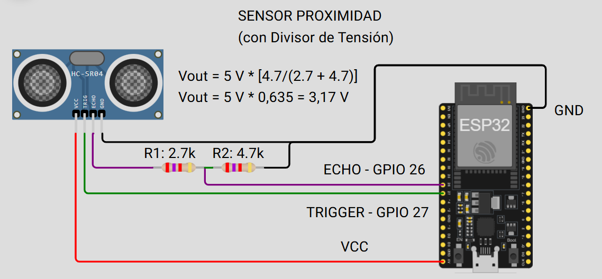

# INTRODUCCION

# 1. ELEMENTOS FISICOS
## 1.1 MICROCONTROLADOR ESP32 C3 Supermini

Conectar un módulo LoRa a un ESP32-C3 SuperMini es prácticamente igual en lógica, pero debido a que esta placa es mucho más pequeña y tiene menos pines expuestos, debes ser muy cuidadoso con la selección de los GPIOs.
El ESP32-C3 usa una arquitectura RISC-V y, aunque es muy capaz, algunos pines tienen funciones especiales de strapping (arranque), por lo que debemos evitarlos para el SPI si es posible.

## 1.2 MODULO LORA

## 2. CONEXION (ESP32-C3 SuperMini)
A diferencia del ESP32 original, el C3 tiene una distribución de pines más limitada. Esta es la configuración recomendada para dejar libres los pines de comunicaciones serie (UART):

|Pin del Módulo LoRa|Pin del SuperMini (GPIO)|Notas
|:---|:---|:---
|VCC|3.3V|
|GND|GND|
|SCK|GPIO 4|Pin SPI CLK
|MISO|GPIO 5|Pin SPI MISO
|MOSI|GPIO 6|Pin SPI MOSI
|NSS (CS)|GPIO 7|Pin SPI CS
|RST|GPIO 3|
|DIO0|GPIO 22. 

## El camino "ESPHome + Serial" (Recomendado)
Si quieres que tu sensor LoRa aparezca en Home Assistant, necesitas una "Puerta de enlace" (Gateway).

El Nodo (Tu ESP32-C3): Recibe datos de sensores, los envía por LoRa.

El Gateway (Otro ESP32 conectado por USB al servidor de Home Assistant o por WiFi): Este dispositivo recibe el paquete LoRa y, mediante código, lo convierte en datos que Home Assistant entiende.

¿Cómo se integra? El Gateway puede enviar los datos a Home Assistant mediante MQTT. Tu ESP32 "Puerta de enlace" publica los datos en un servidor MQTT (como Mosquitto, que se instala como Add-on en Home Assistant), y Home Assistant los lee automáticamente.

### Consideraciones Específicas para SuperMini
- Limitación de Pines: El SuperMini es extremadamente compacto. Si necesitas usar los pines para otras cosas, recuerda que los GPIO 8 y 9 se usan para el modo de carga/bootloader; evítalos para conectar el módulo LoRa para no tener problemas al subir el código.
- Consumo de Energía: El ESP32-C3 es más eficiente energéticamente que el ESP32 clásico. Si planeas usar este dispositivo con baterías (ej. una batería LiPo de 3.7V), recuerda que el módulo LoRa necesita 3.3V constantes. El regulador del SuperMini suele ser decente, pero asegúrate de que la batería esté bien cargada.
- Dimensiones: Dada la cercanía de los pines en el SuperMini, ten mucho cuidado con los cortos. Usa cables de tipo jumpers de buena calidad o soldadura directa con cable fino (tipo wrapping wire).

## EMISOR O RECEPTOR

Las conexiones físicas entre el ESP32 y el módulo LoRa son **idénticas** tanto para el emisor como para el receptor.

La razón es que los módulos LoRa (como el SX1276 o RFM95) son dispositivos **transceptores** (*transceivers*). Esto significa que cada módulo tiene la capacidad física de transmitir y recibir por sí mismo.

### ¿Por qué la conexión es la misma?

1. **Hardware idéntico:** Ambos módulos (el que actúa como emisor y el que actúa como receptor) utilizan el mismo protocolo de comunicación (**SPI**) para hablar con su respectivo ESP32. Por lo tanto, los pines **SCK, MISO, MOSI, NSS (CS), RST y DIO0** se conectan de la misma manera en ambos lados.
2. **La "magia" está en el código:** La distinción entre "emisor" y "receptor" no ocurre en los cables, sino en el **firmware** (el código que cargas en cada ESP32).
    * En el ESP32 **emisor**, tu código usará funciones como `LoRa.beginPacket()` y `LoRa.print()`.
    * En el ESP32 **receptor**, tu código usará funciones como `LoRa.parsePacket()` y `LoRa.read()`.

### Resumen de la lógica:

* **Conexiones:** Debes replicar el mismo esquema de cableado (SPI) en ambos ESP32.
* **Código:** Debes flashear un código configurado como "Transmisor" en uno y un código configurado como "Receptor" en el otro.

### Un detalle importante: La configuración

Para que ambos se "entiendan", deben tener configuraciones idénticas en su código:

* **Frecuencia:** Ambos deben estar en la misma frecuencia (por ejemplo, ambos en `915E6` o `433E6`).
* **Sync Word:** Es un byte de sincronización que actúa como una "clave" para que los módulos ignoren interferencias de otros dispositivos LoRa cercanos. Asegúrate de definir el mismo `LoRa.setSyncWord(0xXX)` en ambos códigos.

# CODIGOS
## 3.1 CODIGO DEL EMISOR

