

  <h1 style="font-weight:bold; font-size:40px; color: #03a9f4; margin-bottom: 5px;">
    MEDICIÓN DE AGUA
  </h1>
  <h1 style="font-weight:bold; font-size:30px; color: #03a9f4; margin-top: 5px;">
    BARRIO LAS VICTORIAS
  </h1>

- Estado: En elaboración
- Fecha: 18 de junio de 2026
- Autor: Pablo Ray

  

  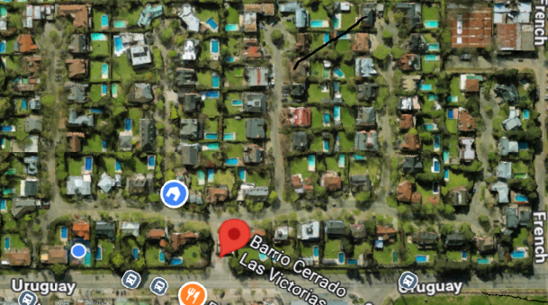

# 1. INTRODUCCION
La presente propuesta está basada en la necesidad de instalar medidores de agua para poder prorratear el consumo general del barrio a cada lote.

Una vez instalados, hay dos alternativas:
- **Lectura manual:** realizada por alguien asignado a esta tarea, que en forma periódica (una vez por mes) debe recorrer todos los medidores y tomar nota de los relojes.
- **Lectura automatica:** a traves de la instalación de dispositivos que lean en forma magnética el medidor y esa medida sea interpretada y mandada a un sisteam central con la medición.  

Esta propuesta abarca desde la instalación fisica de medidores, hasta un estadio final donde se podría utilizar el modelo de **lectura automatica** para automatizar el proceso de lectura y asignación de caudales. Esto no solo elimina la necesidad de lecturas manuales con los errores, sino que permitiria medir el consumo en linea y eventualmente detectar en el momento consumos excesivo o fugas de agua.

Este sistema central, luego podria ampliarse a otras funciones tanto de seguridad como de eficiencia. 

## 1.1 SITUACION ACTUAL
Actualmente el agua es provista por AYSA, quien tiene un medidor de agua en la entrada del barrio, al cual toma lecturas en forma bimestral y factura en forma mensual en base a esas lecturas. 

A continuación se expone alguna de las lecturas mas recientes de dicho medidor

|FECHA|LSP|m3/mes|MONTO MENSUAL|$/m3|TC|u$d/m3|AR$/lote|u$d/lote
|:---|:---:|:---:|:---:|:---:|:---:|:---:|:---:|:---:
|jul-26||5.908,50|19.134.329,68|3.238,44|1.435,00|2,26|214.992,47|149,82|
|jun-26|1579A|5.908,50|19.134.329,68|3.238,44|1.435,00|2,26|214.992,47|149,82|
|may-26|5510B|5.897,00|17.404.979,00|2.951,50|1.420,00|2,08|195.561,56|137,72|
|abr-26|0357A|5.559,00|17.404.979,00|3.130,96|1.410,00|2,22|195.561,56|138,70|
|mar-26|4668A|5.559,00|15.931.884,04|2.865,96|1.415,00|2,03|179.009,93|126,51|
jul-25|6555B|6.900,50|8.970.289,25|1.299,95|1.225,00|1,06|100.789,77|82,28
|jun-25|7587A|6.900,50|8.970.289,25|1.299,95|1.170,00|1,11|100.789,77|86,15
|may-25|1291B|7.374,50|4.426.840,27|600,29|1.200,00|0,50|49.739,78|41,45
|abr-25|3983A|7.374,50|4.426.840,27|600,29|1.315,00|0,46|49.739,78|37,82

En esta estadistida se puede ver el impacto de la suba del agua a lo largo del tiempo.  El barrio esta consumiendo menos pero el agua cuesta cada vez mas.

Adicionalmente se puede ver que el consumo por unidad de vivienda es alto.

Otro problema es que el consumo de agua se prorratea en función del porcenataje de expensas de cada casa, y no por el uso de cada unidad funcional, incluyendo las perssonas que estan viviendo en cada unidad. 

## 1.2 CONSUMOS REALES DE CADA UNIDAD
Creo importante que independientemente del costo del agua, que hoy es significativo, cada propietario debe hacerse responsable por su propio consumo. Como ocurre con la luz y el gas, o internet.

## 1.3 TRAMITE ANTE AYSA POR MEDIDORES
Se ha requerido a AYSA que evalue la instalación de medidores en cada unidad, pero aparetnemente por legislación, AYSA solo esta obligado a poner un medior por PROPIEDAD HORIZONTAL, que es la ley que rige para los barrios. 

# 2. MEDIDICION DE CONSUMOS POR UNIDAD

## 2.2 RESUMEN INSTALACION FISICA
A continuación se detalla un resumen general de lo que seria la instalación fisica de un medidor de agua

Un medidor fisico de buena calidad ronda en el orden de los u$d 50 dolares.  

Los accesrois al medidor (caja, tuercas, llaves, etc) cuestan aproximadamente unos u$d 50 dolares

Y luego esta el costo de la mando de obra de las instalación, que see estima en unos u$d 100 dolares por medidor. 

A continuacióin se pasa un estimado de instalación de medidores fisicos. 

|ITEM  | DESCRIPCION | COSTO UNITARIO | CANTIDAD|COSTO BARRIO
|:---|:---:|:---:|:---:|:---:
|EQUIPO| Medidor EverBlue Cyble| u$d 50|90| u$d 4.450
|ACCESORIOS| Caños, bridas, etc |u$d 70|90| u$d   630
|INSTALACIÓN|Mano Obra Instalación| u$s 150 |90| u$d 13.500
|**TOTAL**||**u$d 270**||**u$d 18.580**|

## 2.3 EQUIPOS MEDIDORES
Se han elegido un equipo de medicion ....( detalle) que se muestra en las siguientes fotos.

  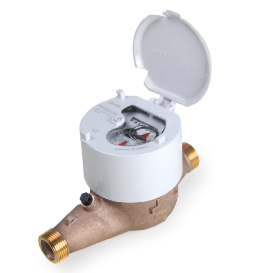

## 2.4 ACCESORIOS
A continuación se mencionan los accesorios necesarios y recomandados por el fabricante de los medidores:

|CANTIDAD|CODIGO|DESCRIPCION
|:---|:---:|:---:|
|1,00|091-182|ACCESORIO KIT de CONEXION - SOPORTE ANTIFR. PISO 190 mm
|2,00|091-1E|ACCESORIO KIT de CONEXION - NIPLE c/TL 1" 55mm+CONTRATUE
|1,00|	096-052B|	VALVULA ESF. NIQUELADA - 3/4" HH C/Moño (IMP) BSA
|1,00|096-132G|VALVULA RETENCION a CLAPETA - 3/4"
|2,00|096-236E|CONECTOR de Bronce - ROSCA ESPIGA de 3/4" BSA
|1,00| 094-984|CAJA UNIF. PVC para Medidor - Caja Unif. JM 250x550x220 c/P.

## 2.5 RELEVAMIENTO DE UNIDADES
En cuanto a la instalación habria que:
- **Planos:** buscar los planos originales de la red de agua del barrio
- **Relevamiento:** deberia hacerse un relevamiento fotográfico del lugar y estado donde estan las conexiones de agua para cada unidad. 

# 3. UPGRADE A UN SISTEMA INTELIGENTE

## 3.1 INTRODUCCIÓN
El avance en la potencia de los dispositivos, comunicaciones y plataformas de software, posibilitan hoy recopilar datos de variables significativas para saber su estado y operar en forma remota actuadores que permitan optimizar consumos, estados, y medir objetivamente las variables. 

Basado en la plataforma HOME ASSISTANT, es posible integrar en esta muchas variables significativas para los procesos, como asi tambIen en lo que hace a seguridad y control. 

Como ejemplo desde esta platafomra actualmentes e puede:
- Controlar el caudal de agua que pasa por una tubería.
- Verificar el nivel del tanque de agua
- Arrancar / Apagar una bomba en función del nivel de tanque de agua.
- Controlar la cantidad y tiempo de encendido de la bomba para verificar anomalias.
- Mandar mensajes de alerta a celulares para casos de desborde de niveles. 
- Controlar luces en función de diferentes parámetros
- Controlar camaras
- Verificar e identificar personas y objetos en determinadas areas donde esta mirando la camara
En función del avanze de esta tecnología creo interesante evaluar la instalación de dicho sistema en el barrio con el primer objetivo de monitorear los consumos de agua del barrio. 

Todo este sistema es parametrizable y se puede ver desde una pc o desde un telefono. 

## 3.2 EJEMPLO DE INSTALACION DE HA EN UNA UNIDAD
Se ha instalado HOME ASSISTANT en una casa, y se comenzaron a desplegar diferentes dispositivos con el objetivo de entender las variables de entorno (temperatura, humedad, luz de dia) y las variables internas de la casa (temperatura, humedad, medición de gas metano, encendido/apagado de motores / consumos electricos, caudal de agua de ingreso al tanque, nivel de agua en el tanque, camaras de seguirdad, etc)

A continuación se muestra algunas de las pantallas que estan asociadas a dicha instalación como referencia. 

  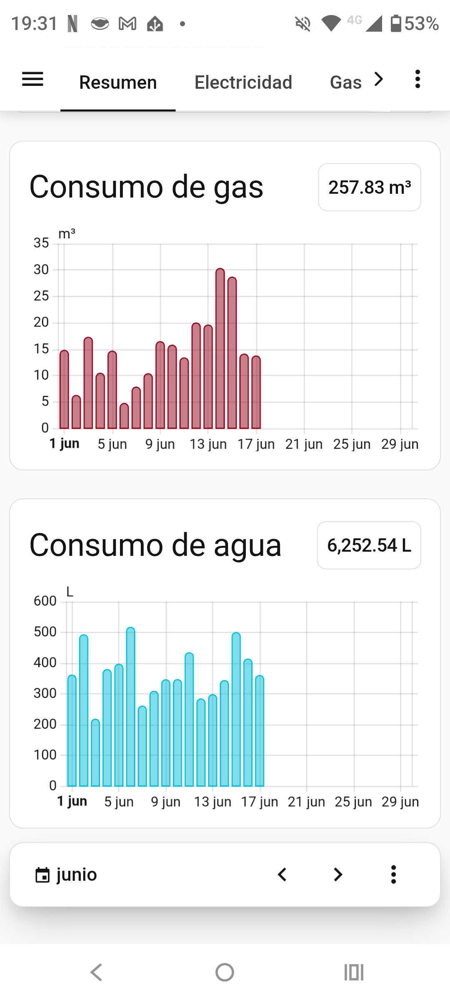

  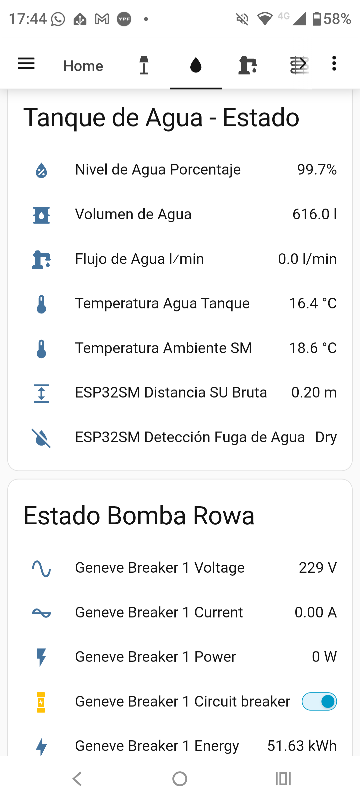

  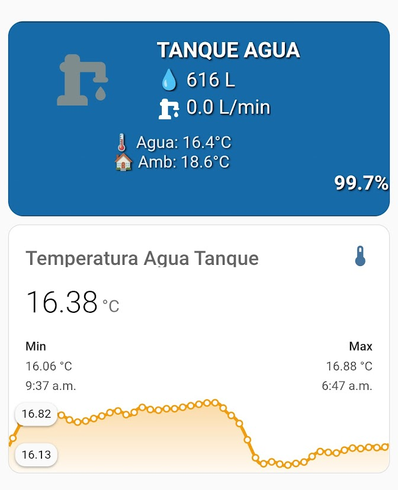

## 3.3 RECOLECCIÓN DE DATOS DE MEDIDORES DE AGUA 
La siguiente propuesta se basa en dar un paso mas en la instalación de los medidores y poner en marcha un sistema de lectura y control remota, de tal manera la recolección de datos de los medidores se haga en un sistema central. 

Este sistema permitira saber exactamente la lectura de los medidores en un determinado momento y dejar grabada por ejemplo el consumo diario de cada lote. POr lo tanto luego en función de las lecturas del medidor de AYSA, permitiria calcular el consumo invidual en un determinado período para cada una de las unidades. 

Esto se lograria colocando un dispositivo que va anexado al medidor que convierte a pulsos las lecturas del medidor. Dichos pulsos son leidos por un placa microcontroladora ubicada cerca de la medición y transmite en forma de radio (LORA) a un lugar central (GARITA DE GUARDIA) donde se coloca una computadora que recolecta los datos y los compila. 

|ITEM  | DESCRIPCION | COSTO UNITARIO | CANTIDAD|COSTO BARRIO
|:---|:---:|:---:|:---:|:---:
|SENSOR| Medidor Cyble| u$d 150|90| u$d 13.500
|PLACA CONTROLADORA CON COMUNICACION|ESP32 LORA |u$d 120|90| u$d 10.800
|GATEWAY LORA| Gateway LORA para recepción señales| |1| u$d 1.000
|LAPTOP CENTRAL| LAPTOP para HA |u$d 30 |1|u$d 1.700
|VALVULA SOLENOIDE| Valvula Solenoide 3/4" - 12 V (normal abierta)| u$d 24|90| u$d 2.160
|**TOTAL**||**u$d 282**||**u$d 29.160**

## 3.4 LA PLATAFORMA "HOME ASSISTANT"

Es la plataforma de automatización del hogar (domótica) de código abierto más potente y popular del mundo. Su propósito principal es **unificar, controlar y automatizar** dispositivos inteligentes de diferentes marcas y protocolos en una única interfaz centralizada.

  

### 3.4.1 Pilares Fundamentales

1. **Privacidad y Control Local:** A diferencia de las plataformas comerciales (como Alexa o Google Home), Home Assistant procesa los datos **dentro de tu propia red**. No depende de la nube; si tu internet se cae, tu casa sigue funcionando.
2. **Interoperabilidad Total:** Es un "traductor universal". Permite que dispositivos que normalmente no se hablan entre sí (por ejemplo, una luz Philips Hue, un medidor de agua LoRaWAN y un aire acondicionado antiguo) trabajen juntos en una misma lógica.
3. **Código Abierto (Open Source):** Cuenta con una comunidad global de miles de desarrolladores que añaden soporte para nuevos dispositivos casi a diario. Es una plataforma gratuita, flexible y sin bloqueos de fabricante.

### 3.4.2 Home ASsistant como Servidor
Home Assistant actúa como el "cerebro" o servidor central de la casa:

* **Entradas:** Recibe datos de sensores (como tus medidores de agua vía LoRaWAN, sensores de movimiento, termostatos).
* **Procesamiento:** Aplica "Automatizaciones" (reglas de tipo: *Si sucede A, entonces haz B*).
* **Salidas:** Ejecuta acciones en dispositivos (encender luces, enviar alertas al celular, registrar consumos en una base de datos).

### 3.4.3 ¿Por qué es interesante esta plataforma?
Esta plataforma es interesante porque provee:

* **Independencia:** No dependes de los servidores de una gran empresa (evitas la obsolescencia programada).
* **Personalización:** Puedes crear dashboards (paneles de control) a medida, tanto para computadoras como para celulares.
* **Ecosistema Infinito:** Gracias a sus integraciones, es la mejor herramienta para gestionar proyectos IoT complejos, como tu red de 90 medidores de agua, ya que permite graficar consumos en tiempo real mediante herramientas como *InfluxDB* y *Grafana*.

## 3.5 EQUIPOS ADICIONALES

### 3.5.2 Dispositivo Lectura de Medidor
El primer dispositivo es uno que va anexado al medidor de agua y que convierte a pulsos las lecturas del medidor. 
 

  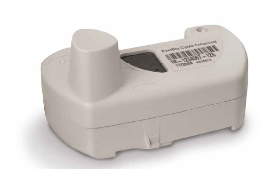

### 3.5.3 Placa Microcontroladora

ESte seria el segundo dispositivo que tendria que estar cerca de la caja de medición de agua, y ademas deberia abastecerse con corriente electrica.

Eventualmente se puede energizar mediante baterias y un sistema de paneles solares. 

Los pulsos emitidos por el lecdtor de pulsos son leidos por esta placa microcontroladora y la misma transmite los datos a traves de radio (formato LORA) a un lugar central (GARITA DE GUARDIA) donde se coloca una computadora que recolecta los datos y los compila.

A continuación se muestra un equipo microcontrolador con capacidad de transmisión de datos

  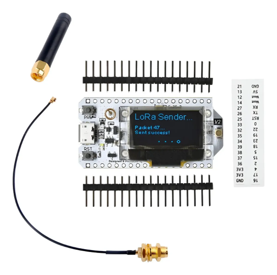

### 3.5.3 Gateway Lora
Este equipo esta ubicado en forma central y recibe la señal de los otros equipos.

  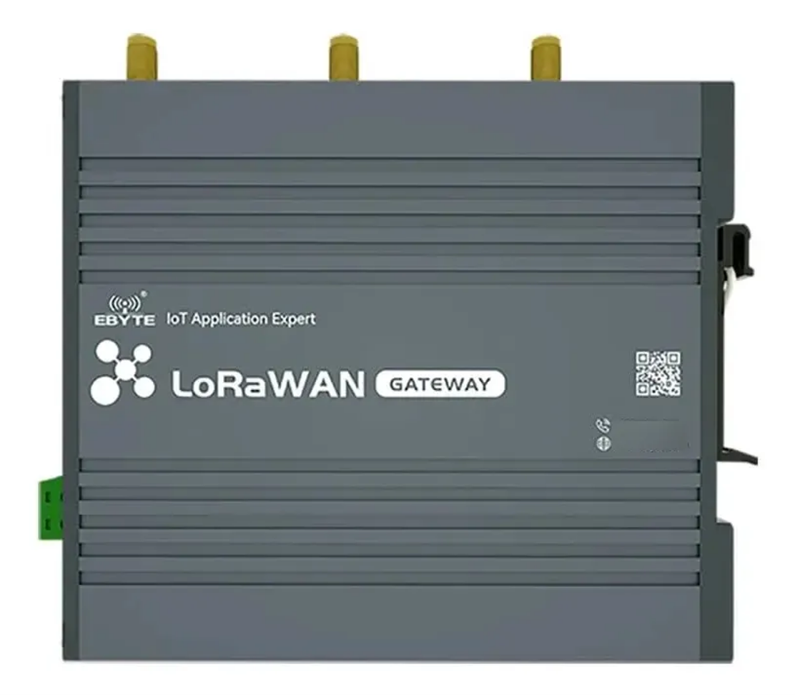

Este equipo debe tener una buena antena y un cable que conecte a la antena que debe estar a la altura. 

  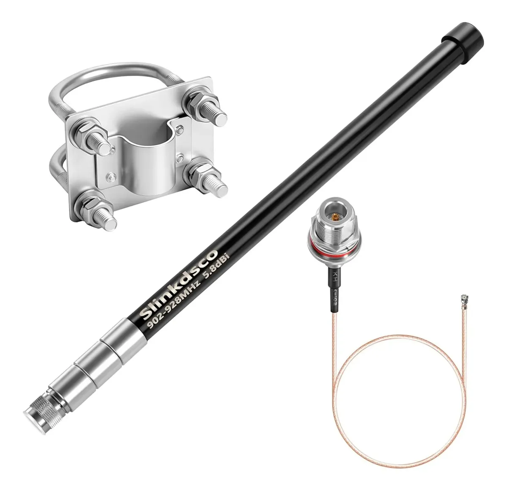

  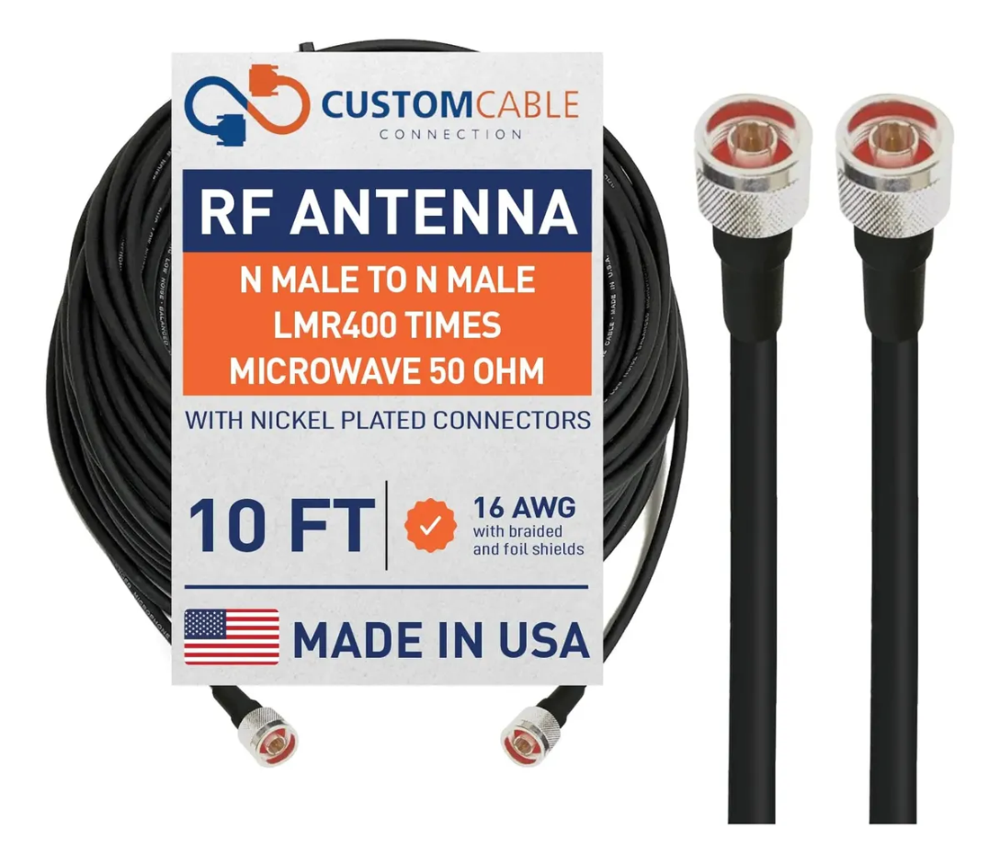

### 3.5.4 Laptop Computadora Central
En el lugar central se instala unA LAPTOP y un dispositivo para leer todos las señales de las radios LORA de los lotes. 

### 3.5.5 Valvula Solenoide
Ese dispositivo permitiria cortar el suministro eventualmene en un caso de consumo excesivo o fuga. 

Esta normalmente abierto y cuando se le da energia (12V) mediante el microcontrolador, la valvula se cierre, evitando el paso del agua. 

  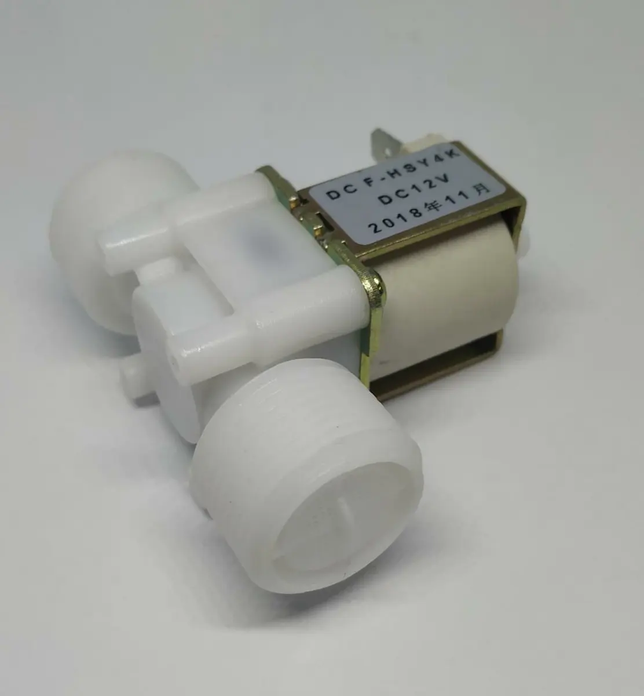

# 4. ANEXOS
## 4.1 RED DE INTERNET EN EL BARRIO
Es interesante pensar en darle perspectiva al barrio en uno de los elementos que esa cada vez mas prioritario en la vida cotidiana, que son las comunicaciones. 

Actualmente el barrio tiene una red de internet que fue provista por PERSONAL, y que obliga a que las unidades contraten su servicio de cable / internet a dicho proveedor. 

Algunas unidades, se han instalado sistemas de internet independiente de PERSONAL. 

Valdria la pena reevaluar el estado de ese contrato y la prestación, dado que el sistema inteligente se podria montar sobre una red de fibra optica. 

En la zona de Uruguay 3241, Victoria (San Fernando), existen diversos proveedores de Internet que despliegan servicios de fibra óptica (FTTH). Aunque Barrio Cerrado Las Victorias ya cuenta con infraestructura preexistente, te recomiendo consultar específicamente la disponibilidad técnica para tu lote con los siguientes proveedores regionales que operan en el área:
- **Netlatin:** Ofrecen planes de fibra óptica simétrica hasta 1 Gbps con soporte 24/7. Tienen presencia en la zona de San Fernando y cuentan con experiencia en despliegues para hogares.  
- **Wiredcom:** Proveedor con cobertura en el corredor Tigre/San Fernando. Se especializan en fibra óptica directa al hogar y ofrecen soluciones personalizadas para barrios cerrados.  
- **Victoria Te Ve:** Al ser un proveedor local, tienen una capilaridad específica en el área de Victoria, ofreciendo conectividad por fibra óptica y paquetes combinados. 
- **Reditel:** Operan en la zona con servicios de fibra óptica (FTTH) que incluyen Wi-Fi 6, orientados a brindar baja latencia, lo cual es ideal para tus proyectos de Home Assistant.  

## 4.2 NORMATIVA AYSA - Factores Kf, Kv y Consumo Libre
La normativa de AySA para el régimen medido establece diferencias clave entre los tipos de usuarios, pero el concepto de "consumo libre" (o base libre) es un estándar que se aplica principalmente a nivel de unidad residencial.

### 4.2.1 Consumo Libre: Casa vs. Propiedad Horizontal

* **Viviendas Particulares (Unifamiliares):** En las casas individuales, se aplica una base de **10 $m^3$ mensuales** (calculados bimestralmente, es decir, 20 $m^3$ por bimestre) que están incluidos en el cargo fijo. Cualquier consumo que exceda esa base es lo que se factura como cargo variable.
* **Propiedad Horizontal (Edificios/Consorcios):** En los edificios con una única entrada de agua (medidor general), el tratamiento cambia. AySA suele facturar al consorcio la diferencia entre el consumo total registrado y la sumatoria de las unidades funcionales. Aquí, la base libre no se aplica simplemente "por edificio", sino que se computa considerando la cantidad de unidades funcionales habilitadas.
* Si el edificio tiene medidores individuales, cada unidad recibe su propia factura con su respectivo consumo libre de 10 $m^3$.
* Si el edificio cuenta con un **medidor único**, el cargo fijo suele contemplar el número de unidades, y el "consumo libre" total del edificio es la suma de las bases de cada unidad.

### 4.2.2 El caso de los Barrios con Medidor General

El valor de **15 $m^3$ por día** que mencionas para tu barrio de 89 lotes sugiere que están bajo una modalidad de **medición global**. Esta modalidad es un punto de conflicto recurrente: cuando AySA mide el total del barrio en un solo punto, la empresa tiende a facturar el excedente sobre una base global negociada o establecida por contrato, en lugar de considerar los consumos individuales de cada lote.

### 4.2.3 Puntos a tener en cuenta:

1. **Jurisprudencia:** Como se ha visto en casos judiciales recientes (ej. barrios privados en Pilar), la justicia ha ordenado en varias ocasiones que AySA debe facturar de manera **individual** a cada vivienda, incluso en complejos cerrados. Esto permite que cada vecino gestione su propio consumo libre y evite "pagar el exceso" de otros vecinos que consumen más.
2. **ERAS (Ente Regulador de Agua y Saneamiento):** Es el organismo encargado de auditar estos esquemas. Si consideran que el deducible asignado no es proporcional al número de lotes o viviendas reales, el camino formal para cuestionar el criterio de facturación es a través de un reclamo ante el ERAS, que regula los cuadros tarifarios y la aplicación de los coeficientes $K$.
3. **Diferencia Comercial vs. Residencial:** Es fundamental que el barrio esté correctamente categorizado como "Residencial". Los inmuebles comerciales, a diferencia de los familiares, no tienen base libre y el valor del metro cúbico es más elevado, lo cual suele ser un error común en la categorización de los servicios en consorcios o barrios.

Para el caso específico del barrio, siendo un único medidor, los 15 $m^3$ diarios (450 $m^3$ mensuales) que parecen estar calculados como una estimación global para los 89 lotes, lo cual, dividido por lote, apenas supera los 5 $m^3$ mensuales por familia, una cifra significativamente menor a los 10 $m^3$ que le corresponderían a una vivienda individual bajo el régimen estándar.

10 $m^3$ por mes por unidad, siendo 90 lotes daria 900 $m^3$ por mes y apenas nos estan dando 15 x 30 = 450 $m^3$ por mes, es decir casi la mitad. En los 5.000 $m^3$ que consumimos por mes es casxi un 10 % de ahorro. 
